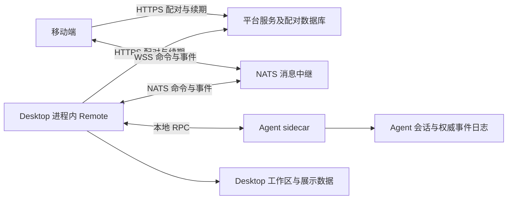

# 远程连接：产品设计、技术方案与开发计划

本文件统一维护 Desktop—平台服务/NATS 网关—移动端的远程连接资料，包括产品背景、现有接线、模块边界、配对与权限、断线恢复、状态同步、技术方案及开发验收。[产品文档](PRODUCT.md)保留功能入口，本文件是该领域设计与契约的唯一维护位置。

审查日期：2026-09-11。源码基线为 FutureOS `53bfac18` 与本地 future-server `bbd6c23`；服务端基线不代表线上实际部署。文中分别标记“现状”“目标”和“待验证”，不得将方案写成已实现的能力。本文不覆盖模型提供商 HTTP、IM 通道等其他网络子系统。

**实施范围决策：本次不修改 future-server，保持既有业务与配对流程。** 本轮重构只修改 FutureOS 的 Desktop 与移动端，沿用现有平台 API、配对数据库、JWT 权限和 NATS 部署。配对创建或领取结果不确定时，接受重新生成二维码并扫码；已完成配对后的日常断网、续期和状态同步仍按本文件自动恢复。服务端改造因测试与联调复杂度暂缓，相关问题及后续方向保留在第 9 节待办，不视为永久放弃或已经解决。

**兼容约束：正常路径不变，修复异常路径。** 保留“Desktop 生成二维码/配对码 → 手机扫码或粘贴 → 现有身份握手 → 查看和控制会话”的流程，不新增用户确认步骤，不要求正常使用中的已配对设备重新配对。不修改账号归属、单手机配对规则、授权范围、审批与工具执行语义、会话数据归属及现有设置的默认值。连接监督、候选交接、凭证一致提交和同步版本属于内部实现优化；状态展示应更准确，超时、取消与迟到结果应有确定处理，不用保持旧行为作为保留缺陷的理由。

## 1. 产品背景与交互原则

手机遥控让已配对的手机继续同一台电脑上的会话；工具仍在电脑本机执行。配对码和二维码代表“手机现在可以安全连接到这台电脑”，而不是单纯的注册凭证，因此必须在桌面端实际连接就绪后才显示。

**产品背景与安全边界：远程必须可见、可控。** 手机遥控 AI 可以间接触发本机文件访问、工具调用和命令执行，客户需要一个能直观看到、也能主动关闭的远程入口。Desktop 是这个入口：用户关闭 Desktop，就应当能够确认本机不再通过手机遥控接受新的远程操作。后台 Agent 没有同等明显的窗口，不能因为它仍在运行就让远程能力继续驻留。这是产品信任边界，不是为了连接稳定性可以放宽的实现细节。

- **远程能力归属 Desktop 进程。** 配对、网关连接、远程命令入口及其恢复任务由 Desktop 管理；不迁入常驻 Agent，也不通过后台守护程序、托盘保活或移动端唤醒绕过 Desktop 生命周期。Agent 仍可服务本地客户端，但其存活不代表手机遥控入口仍然开放。
- **关闭 Desktop = 远程连接断开。** 用户关闭主窗口或退出应用时，不得静默隐藏窗口并继续接受远程操作。最小化或切换到其他应用不等于关闭。远程开启、连接中、已断开应在 Desktop 有明确状态，用户可以主动断开；打开 Desktop 本身也不等于授权开启远程。
- **自动恢复服从用户意图。** 只在 Desktop 仍运行且远程访问仍被允许时恢复网络、凭证和同步。主动断开后，旧请求、重试定时器及迟到回调不能重新启用远程。再次打开 Desktop 时，只能依据用户明确保存的自动连接设置恢复，并可见地展示状态；已配对或手机在线不能单独触发恢复。
- **断开以本机停止接收为准。** 不依赖手机收到离线通知、云端确认或 JWT 到期才关闭入口；手机端的离线通知和心跳过期用于更新显示。断开保留配对与撤销配对是两个动作，保留凭证不表示仍可远程控制。
- **sidecar 模式随 Desktop 一起退出。** Desktop 实际退出时，关闭远程入口并终止自己启动的 Agent sidecar，进行中的 Agent 对话随之终止；这是认可的产品行为，不为保持远程任务连续而留下后台 Agent。已有运行任务继续复用统一的退出确认与中断流程。仅点击 Remote「断开」不等于退出 Desktop，不应顺带杀掉本地对话。开发脚本启动或外部管理的 Agent 仍遵循进程所有权规则，但无论 Agent 是否存活，Desktop 退出后手机遥控入口必须消失。
- **架构优化在这一边界内进行。** 在 Desktop 后端分离配对管理、连接监督、命令路由和状态同步，统一取消、代次隔离与数据权威；不以延长 Desktop 关闭后的远程可用性作为优化目标。前端热更新可保持连接，Desktop 进程重建则允许断开，重启后按连接策略恢复。

以上是产品约束及后续重构的验收依据，不表示当前所有退出、竞态及任务终止路径均已验证符合。

- 用户点击「配对并启动」后，界面立即显示“正在建立安全连接，连接就绪后将显示二维码。”；该提示与按钮等高，期间不显示低对比度的禁用按钮，也不让下方内容跳动。
- 桌面端完成网关认证、关键订阅和首次在线确认后才展示二维码，表示入口已就绪；手机领取后还需完成双方身份握手，才能确认已配对并允许操控。不得把“等待扫码”说成“手机已连接”，也不得把手机握手作为展示二维码的前置条件。桌面端无法连接时不展示可扫描但不可用的二维码。
- 左侧 Remote 图标使用蓝点表示已连接，黄点表示正在建立连接、刷新凭证或自动恢复，红点表示需要用户处理的断开。黄点是状态提醒，不附加技术原因或重复文字提示。
- 自动恢复期间不要求用户操作；Desktop 仍运行、远程访问仍被允许、网络恢复且配对仍有效时应自动回到已连接。
- 只有自动恢复停止、服务拒绝连接或配对撤销等终态才展示提示。提示使用通俗的“问题类型 + 建议操作 + 支持码”形式，例如“网络异常，请检查网络后稍后再试（NW001）”“配对已失效，请重新配对（PA001）”或“服务暂时不可用，请联系客服（AU001）”。不向用户暴露 NATS、JWT、连接代、重试次数等内部术语。

手机端（Android / iOS）配对后的体验：

- **配对**：扫描桌面二维码，或手动粘贴配对码；二维码 5 分钟有效且只能使用一次，撤销配对后需重新扫码。
- **会话**：查看桌面在线状态与会话列表，可新建或继续桌面对话，支持重命名。
- **对话**：流式查看回复、思考过程与工具执行；处理审批、停止运行，切换模型与思考等级。
- **历史**：分页加载、按 (runId, idx) 去重；断线重连后经增量事件回补实时内容。
- **附件**：从相册选择或拍摄图片、添加文件附件；下载会话附件并预览图片 / Markdown / 文本 / JSON，其余类型交给系统应用打开或保存。
- **凭证**：seed、JWT 与刷新 token 分项存入系统安全存储（Android Keystore / iOS），明文不进入本地存储、日志或二维码。

## 2. 现有接线、协议与信任边界

### 2.1 进程与数据归属

这里的“网关”包含两个不同角色：平台服务负责配对与凭证签发；NATS 负责运行时转发。命令、事件、文件分块不经过平台 HTTP 服务。Remote 路由当前组合 Desktop store 和 Agent RPC，Agent 日志仍是会话与执行事实的权威。

当前 Desktop 的退出事件调用 Remote 停止，再清理并终止自己拥有的 Agent；运行中的对话另有退出确认与中断流程。这与本文件的 sidecar 产品约定一致。代码依据：[退出入口](../src-tauri/src/lib.rs)、[Agent 所有权与退出](../src-tauri/src/agent_supervisor.rs)。这些入口的存在不等于强杀、崩溃或工具子进程全部终止的实机验证。

### 2.2 配对和凭证现状

- Desktop 使用账号认证，生成本地 NKey，向平台申请五分钟单次邀请；二维码同时承载手机核对 Desktop 身份所需的信息，不包含设备私钥。
- 手机生成另一套本地 NKey，领取邀请后获得 pairId、限定权限的 JWT 和刷新令牌；随后通过签名挑战确认 Desktop 身份并完成双向握手。
- 平台按配对和角色签发短期 NATS JWT；刷新令牌在服务端只保存哈希。Desktop 使用账号凭证续期，手机使用绑定设备的刷新凭证续期。
- 当前每个桌面在同一账号下只允许一个 pending/active 配对；重配会撤销旧绑定。这不是天然支持多手机的协议，不应只扩展界面就宣称支持多设备。
- 当前数据库在手机领取时即标记 active，而 Desktop 在握手确认时才持久保存配对；两者阶段不同，不能用同一个“已连接”描述。

| 平台接口 | 职责 |
| --- | --- |
| `POST /client/v1/remote/pair/code` | 认证 Desktop，创建邀请与桥接凭证 |
| `POST /client/v1/remote/pair/claim` | 消耗邀请并绑定手机身份 |
| `POST /client/v1/remote/auth/token` | 分别为 Desktop、手机签发新 JWT |
| `POST /client/v1/remote/pair/revoke` | 撤销绑定 |
| `GET /client/v1/remote/devices` | 列举账号配对 |
| `DELETE /client/v1/remote/devices/:pair_id` | 按账号权限撤销指定配对 |

### 2.3 消息、传输与权限

下表中的所有消息主题都以 `p.{pairId}.` 为前缀；平台签发的角色权限还约束回复主题中的设备身份。

| 主题后缀 | 方向与用途 |
| --- | --- |
| `cmd.{sessionId}` | 手机向 Desktop 发送命令；Desktop 使用配对级队列订阅 |
| `rep.{deviceId}.…` | 限定设备的请求回复 |
| `evt.{sessionId}` | Desktop 发布会话事件 |
| `presence` | Desktop 发布在线状态与桥接实例身份 |
| `state.sessions` / `state.workspaces` | Desktop 发布目录快照 |
| `xfer.up.>` | 手机上传分块以及发起下载拉取 |
| `xfer.down.>` | Desktop 下发文件分块 |

NATS Core 是至多一次投递。已有实时事件必须由权威日志回放补洞，目录通知由快照校准；增加重连次数不能替代这两项。[NATS 官方语义](https://github.com/nats-io/nats.docs/blob/master/nats-concepts/what-is-nats/README.md)

当前配对授权覆盖该 Desktop 的会话，不能误称为逐会话授权。签名握手证明身份，不是端到端内容加密；NATS 中继仍处于内容信任边界内。手机代码要求 WSS；Desktop 当前不在客户端强制 TLS，真实链路是否加密需核对服务端配置，不能仅凭 `nats://` 字符串判断实际协商结果。公网部署的目标要求是两端均验证加密传输与服务端身份，不能降级为明文；是否需要中继不可见的端到端加密须作为额外产品能力设计，不假定现状已经具备。

当前云端撤销先使刷新凭证失效，没有主动踢出 NATS 连接；旧 JWT 存在有效期窗口（默认签发配置为十五分钟，线上值待核对）。本轮保留这一服务端行为，不承诺从云端撤销后所有现存连接立即失效。Desktop 本地主动关闭入口不允许等待该窗口；手机本地解绑也应立即停止自身连接，但不能据此宣称 Desktop 已收到撤销。Desktop 收到明确的撤销结果后关闭对应入口。

### 2.4 本次不改服务端时的边界

- 服务端创建邀请的多笔写入缺少统一事务、单次领取响应丢失后无法取回结果，这些审查发现作为本轮已知限制及第 9 节后续待办。本轮通过清晰的失败状态、取消旧尝试和重新扫码处理，不将其标记为已经修复，也不承诺重配失败后旧绑定仍然可用。
- 命令操作 ID、访问代次、目录版本和 Agent 健康状态由 Desktop 与移动端在已有 NATS 主题及权限范围内交换，平台只承担现有认证和中继职责；不新增服务端存储或修改主题权限。
- 新增客户端消息字段采用可选扩展，并由 Desktop 与移动端通过现有消息通道协商能力。旧客户端缺少能力时使用明确的兼容路径；无法保证安全重试的有副作用命令不自动重放，不依赖服务端新增版本接口。
- 加密传输只核对现有部署并在客户端执行校验；不把改造 NATS 配置、即时云端撤销或端到端内容加密列为本轮开发依赖。若现有部署不满足安全传输要求，明确报告连接不可用，不静默降级或自行修改服务端。

## 3. 审查结论与异常场景

### 3.1 已发现的问题

| 问题 | 证据及影响 | 对应方案 |
| --- | --- | --- |
| 候选连接启动就使旧订阅失效 | 手机 `open()` 提前递增共享 generation；旧事件迭代器随即退出。已用源码加模拟依赖复现网络切换、凭证未返回时漏交付旧连接结束事件；不代表权威日志永久丢失 | 第 5 节：独立访问代次、活动连接和候选身份，完成就绪后再交接 |
| 握手改变整个业务入口 | Desktop 握手先把共享 active 设为 false，并清除旧挑战；手机握手 Promise 也未按连接隔离。源码可见，真实并发时序未实测 | 第 5 节：候选认证不撤销现有会话授权，挑战和 Promise 按连接归属 |
| 配对跨步骤不可恢复 | 云端已消费 nonce、手机未收到返回时，没有恢复同次领取结果的协议；创建邀请的多笔写入也未放入同一事务 | 接受服务端限制；第 6 节：失败后重新扫码、端侧凭证一致提交，不改云端 |
| HTTP 没有应用级取消和期限 | 手机 claim/refresh/revoke 使用裸 fetch；待撤销请求位于启动加载前，撤销还可能阻塞本地解绑收尾 | 第 5、6 节：有界请求、先本地停止、独立补偿任务 |
| 停止可能被迟到启动覆盖 | Desktop 在联网后检查 START_REQUESTED，等待 readiness 后写入 STATE 前未再次验证启动身份。代码交错风险，尚未运行复现 | 第 5 节：安装前原子验证访问代次，所有启动共用一条安装路径 |
| 目录新旧没有共同依据 | 拉取与推送直接覆盖列表；缺少统一 revision 和完整的解绑/换连接后回写隔离 | 第 6 节：版本快照、配对代次与单一数据提交点 |
| 连接健康没有覆盖业务健康 | 心跳在线、连接 ready 不证明 Agent 可用或当前时间线已同步 | 第 6 节：传输、对端、Agent 与数据同步分开建模 |
| 恢复入口重复且内容不一致 | 初次连接、onReconnected、前台及请求失败路径各自触发刷新；例如 onReconnected 不刷新 settings | 第 6 节：统一恢复协调与数据域恢复清单 |

源码入口：[手机连接](../../mobile/src/remote/client.ts)、[手机生命周期](../../mobile/src/remote/useRemoteConnection.ts)、[手机配对 HTTP](../../mobile/src/remote/pairing.ts)、[目录状态](../../mobile/src/remote/useSessionCatalog.ts)、[Desktop 监督](../src-tauri/src/remote/mod.rs)、[Desktop 命令及握手](../src-tauri/src/remote/commands.rs)。服务端跨仓库入口为 `future-server/platform/service/src/routes/remote.rs`。

**风险判断与本次优先级：** 现有证据不要求推翻扫码流程或改变业务授权。应优先修复主动停止后迟到结果可能重新安装连接的竞态，因为它直接关系到用户能否可靠关闭入口；该风险来自源码交错分析，尚未完成运行复现，不能表述为已证实可被利用的安全漏洞。旧连接提前失效已模拟复现，握手互相覆盖、请求无期限及旧状态回写需要一并按客户端契约修复，主要影响连接连续性和状态准确性。服务端事务与领取响应丢失主要是失败时的一致性和体验问题，本次接受重新扫码并暂缓改造。云端撤销窗口涉及授权失效时效，应单独记录和验证，不与 Desktop 本地关闭入口的即时性混为一谈。

### 3.2 当前恢复能力矩阵

| 场景 | 现状与边界 |
| --- | --- |
| Desktop 短暂断开 NATS | 有 SDK 重连、桥接监督与凭证刷新；进入终态后不再自动恢复 |
| 手机断网、网络类型切换 | 有网络监听、重连与回放，但存在上述交接空窗；同类网络路径改变未必触发即时恢复 |
| 手机后台、前台切换 | 主动暂停后台连接并在前台重建/校验；原生选择器另有宽限，实机时序待验 |
| Desktop 睡眠、唤醒 | macOS/Windows/Linux 已接入电源事件；恢复依赖启动、凭证和同步链路 |
| NATS 重启、长时间不可达 | 有重试；授权配置故障及超预算关键任务故障会停止自动恢复 |
| 平台 HTTP 故障、NATS 仍正常 | 已有链路在凭证有效时可能继续服务；启动/续期受影响，手机请求缺少有界取消 |
| Desktop 正常退出、进程重建 | 远程断开；拥有的 sidecar 退出，对话终止。重新打开才可按用户连接策略恢复入口，不自动续跑旧任务 |
| Agent 不可用、Desktop 心跳正常 | 可能显示连接正常但业务失败；需要单独发布 Agent 可用性 |
| 领取成功但响应丢失 | 不能保证自行恢复；现状可能必须重新生成邀请 |
| 用户主动断开/解绑 | 必须停止而非自恢复；当前取消、迟到结果及撤销补偿仍需按目标契约完善 |

### 3.3 已做验证与未覆盖范围

2026-09-11 在上述 FutureOS 基线上运行四组现有测试：`connectionState`、`useRemoteConnection`、`pairing`、`syncEngine`，共 133 项通过。另通过在内存中加载实际客户端和状态机、模拟未返回的凭证请求及旧连接事件，确认交接空窗；未新增仓库测试脚本。这些结果只证明被覆盖的行为，不能抵消第 3.1 节发现的问题。

未运行：真实 Android/iOS 生命周期故障测试、真实 Desktop/Agent 退出故障注入、真实 NATS/平台中断与 JWT 过期联调、生产部署安全配置验证。后续每次实现必须记录对应提交及验证范围，不复用本次通过数作为新版本保证。

## 4. 模块边界与目标架构

本节基于 2026-09-11 的源码审查；下列旧耦合记录保留调查背景，本轮完成状态见第 8.1 节。重构保持 Remote 在 Desktop 进程中，不迁移 Agent 的会话日志权威，不新增后台服务，也不为了未来可能迁移而先拆成多个独立进程。

**重构前：已有功能模块，尚不是可直接替换宿主的独立组件。** `src-tauri/src/remote/` 已分出连接入口、配对、命令和文件传输；`commands/remote.rs` 主要转发 start/stop/status/unpair。原先存在以下耦合：

- `remote/commands.rs` 直接调用 Desktop store、Agent bridge、Tauri commands 层及 UI 通知，混合协议路由与业务执行。
- `remote/pairing.rs` 直接读取 Desktop 登录、环境、设备标识和配置文件路径。
- `remote/transfer.rs` 直接使用 Desktop 文件策略、线程附件目录和缩略图功能。
- Agent 事件观察器反向调用 `remote::publish_event/publish_snapshot`；运行监督、凭证轮换和部分传输状态分布于全局变量及多个任务。

**本轮实现：Remote 内聚协议和生命周期，Desktop 宿主适配器承接宿主依赖。** 依赖反转已在现有 crate 内完成，协议路由通过替代宿主验证，不需要真实登录或数据库。Desktop 集成与运行时仍在 Tauri crate 内；本轮不新增独立 crate，也不承诺只拷贝一个目录即可独立编译。可剥离不等于允许脱离 Desktop 生命周期运行。

| 组成 | 唯一职责 | 不应承担 |
| --- | --- | --- |
| Desktop 集成层 | 创建和销毁 Remote 实例、退出及电源事件适配、绑定用户意图、渲染状态 | 自建连接重试、复制协议状态机 |
| Remote 监督器 | 接收生命周期事件，拥有连接尝试、凭证轮换、定时器、取消和任务回收 | 直接读写线程/运行表、执行业务命令 |
| 配对管理 | 邀请、信任关系、凭证提交、撤销补偿；向监督器提供有效凭证 | 控制 socket 或为单次重连重新配对 |
| 协议与传输 | NATS 认证、握手、订阅、消息编解码、文件分块 | 自行决定启用远程、直接调用 UI commands |
| Desktop 业务适配层 | 按类型处理会话/工作区/审批/执行和文件访问，保留既有业务校验 | 暴露 SQL 表或 `AppHandle` 给 Remote 核心 |
| 移动端同步层 | 消费权威快照与回放，提交目录/时间线状态 | 直接创建连接或轮换凭证 |

宿主依赖按实际职责收敛为四类接口：业务命令及查询、权威状态及事件源、配对凭证及平台访问、受控文件访问。接口传递明确 DTO、结构化错误和取消上下文；不传通用 SQL 访问器或整份 Desktop 全局状态。UI 订阅 Remote 状态；Agent bridge 输出统一业务事件，由 Desktop 集成层接入 Remote，不再由业务层反向引用 Remote 模块。文件句柄/能力由宿主校验，不能为方便抽象而绕过现有路径和权限限制。

## 5. 生命周期与连接交接

本节描述本轮客户端契约，具体实现与兼容边界见第 8 节。

**一个监督器拥有生命周期，异步任务通过访问代次校验提交结果。** Desktop 和移动端分别拥有自己的实例，遵循同一份事件/错误/恢复契约，不强行共享 Rust 与 TypeScript 的执行实现。启动、网络变化、前后台、电源事件、凭证到期、订阅失效、主动停止都进入同一监督器。后台结果携带身份和代次；状态查询只读，不触发网络或重试。监督器等待网络操作时仍须能立即处理停止与取消。

必须分别表达以下事实，避免同一个 `generation` 或 `active` 承担多种含义：

- **用户访问意图与访问代次**：主动停止、解绑和 Desktop 退出时立即失效。以前排队但未被业务接受的命令不能在重新开启后自动执行。
- **配对信任关系**：持久化的设备身份与授权；普通断网、凭证续期不撤销它。
- **连接代次**：每个 socket 及其握手、订阅、请求属于一个具体连接；替换候选连接不提前作废仍在服务的连接。
- **业务状态版本**：会话/目录快照和事件游标决定新旧，与 socket 代次独立。

同一实例最多有一个服务中的连接和一个替换候选。统一启动、主动恢复和凭证轮换的构建/验证/安装路径，删除各自搭建一套任务再替换全局状态的做法。候选完成身份验证、关键订阅及 flush 后才能安装；安装前再次核对访问代次、配对身份和候选身份。失败只销毁候选，仍健康的旧连接继续服务；旧链路已故障时对外显示连接中，内部保留恢复阶段，依赖日志回放恢复数据。主动停止则同时作废两者，不执行“保留旧连接”策略。

- 旧连接的订阅在实际交接前继续消费，不能因为候选开始请求凭证而退出。候选握手 Promise 和挑战归候选所有；不能复用另一个连接的握手结果。
- 新握手不能把整个配对的业务授权设为 false；候选认证与已认证连接相互隔离。候选不能在就绪前分走并丢弃正常命令；订阅交接中的消息要有界暂存并交给同一命令路由，溢出则使候选失败。不能让两个独立命令执行器同时接管业务。
- 短暂重叠期间，事件按权威游标去重；命令按稳定操作 ID 去重。业务回执和配对信任不随凭证轮换清空。传输缓存归实例/配对所有，连接切换不得调用全局清理误删新连接的传输。
- SDK 的重连过程纳入监督器管理；SDK 正在恢复当前连接时，不再由多个上层定时器并发创建替代连接。只有监督器能决定升级为整代替换。
- 所有控制面 HTTP、握手、readiness、连接探测都有截止时间和取消。初始预算采用 HTTP 20 秒、握手/就绪阶段 10 秒、前台探测 4 秒；取消须释放底层请求，不能只让上层 Promise 提前返回。停止入口不等待这些网络预算耗尽。
- 停止先关闭本机命令接收闸门并使访问代次失效，再取消候选、重试、刷新和订阅，回收协议任务。离线通知是有界的尽力发送，失败不阻止停止。已被业务接受的任务交给统一业务退出策略；Desktop 退出最终终止其拥有的 Agent sidecar。

凭证是否“新签发且仍有效”必须根据该次尝试的凭证版本、到期时间和错误判断，不能把一次刷新留下的布尔值永久解释为“后续所有鉴权失败都是配置故障”。

## 6. 配对、命令与状态同步方案

**配对允许失败后重新扫码，正常连接恢复不应要求重新配对。** 沿用现有一次性邀请、领取接口和设备密钥，客户端分别表达领取中、等待身份确认、已配对及配对失败：

1. Desktop 创建邀请、手机领取邀请均设置期限，并用本地尝试身份隔离取消和迟到响应。创建/领取具有副作用，结果不确定时不套用普通网络请求的无限重试，也不自动循环生成新邀请。
2. 领取响应丢失、配对码已消费或凭证未完整保存时，本次尝试结束并提示“配对未完成，请在电脑上重新生成二维码后扫码”。停止本次候选连接，隔离并清理不完整凭证；不新增领取操作 ID 的云端幂等协议，也不假定重发同一二维码可以恢复结果。
3. 已完整保存的凭证可通过现有认证接口和 Desktop 握手重试恢复。云端“已领取”不等于双方身份确认完成；握手确认丢失时先用现有凭证重新验证，若已撤销、凭证不完整或现有协议无法完成确认，则回到重新扫码。普通断网或续期网络失败不清空已确认配对。
4. 手机凭证使用可识别的提交版本或提交标记，写入失败/进程中断后不能把新旧多项字段拼成一套有效凭证。Desktop 与手机只有持久提交成功后才报告对应阶段成功；客户端提交保护不等于云端与本地形成跨端事务。
5. 解绑先本地禁用，再通过现有撤销接口完成云端清理。可重试的补偿按 pairId 持久记录，所需授权材料保存在安全存储中并与可用于连接的凭证隔离，完成后清除。网络失败有界退避，明确的鉴权失败停止重试；不能覆盖另一笔待撤销操作或阻塞当前配对启动。仅本地完成时不宣称云端已撤销；断开保留配对。

**传输重试不得决定业务是否重复执行。** 保留已有持久 prompt 回执；为操作明确重试类别：只读查询可重试；prompt/continue_run 使用现有持久回执；upload_complete 沿用同一传输句柄的重复完成语义。其他写操作不自动重放，不新增一套泛化操作日志。内存单飞拒绝同 ID 不同请求；跨重启的发送结果通过已有持久回执查询。未被接受的旧访问代次命令不能跨主动断开后重放。已接受操作可以查询原结果，但 Desktop/Agent 重启不自动重新执行已中断对话。只读请求可以重试；无需为了抽象而给所有接口增加持久操作记录。

**连接状态与同步状态分开。** 内部至少区分配对有效性、中继可达性、对端认证/存活、Agent 可用性、当前数据同步进度。Desktop 在等待扫码时只能报告入口就绪；手机握手完成也不能直接宣告当前对话历史已同步。对用户只展示下述三种连接状态；数据同步进度留在业务内部，不增加连接 Badge 状态。

- Agent 会话和事件日志继续作为执行事实的权威；Desktop 拥有的工作区、线程展示属性和设置由对应业务服务负责。Remote 不新增第二套业务真相或把这些字段再复制到网关。
- 同一目录的拉取响应与推送携带同一版本体系，例如 `(状态源 epoch, revision)`；版本变更只由状态源产生。版本必须对应构建快照的数据视图，而非响应发送时间。旧响应不能覆盖新状态；切换配对或解绑后，旧请求不能回填列表。
- 时间线继续使用现有权威事件标识与游标，先订阅并有界缓冲，再读取带水位的快照，回放缺口并去重。目录、设置、能力也有恢复清单，不只恢复 socket 或正在打开的一条时间线。
- 一个恢复协调入口触发各同步器，合并重复请求；前台、网络变化和连接成功不再分别启动不一致的刷新链。每个数据域单独报告同步中/已同步/失败，不用一个全局加载屏阻塞已可用数据。
- 心跳主要承担存活判断；目录读取与发布不应阻塞心跳。保留变化通知和低频基线校准，通知允许丢失，快照/日志决定最终状态。NATS 不承担业务日志权威，不能把 publish/flush 成功等同于手机已应用数据。

## 7. 恢复契约与支持码

以下是跨端目标契约，必须受 Desktop 生命周期和用户意图限制。第 3 节的历史交接与停止问题已按第 8 节落实修复，实际设备故障仍以联调结果验收，不以文档代替验证。公共连接阶段保留 `stopped`、`connecting`、`ready`、`reconnecting`、`refreshing`、`failed`、`revoked`；配对阶段和业务同步状态另行表达。只有通过相应连接就绪门槛才能进入 `ready`。

| 情况 | 策略 |
| --- | --- |
| 已配对连接的网络、DNS、超时、凭证接口网络失败 | 在允许远程的前提下持续重试，带抖动的 1、2、4、8、16 秒退避，最长 30 秒 |
| 创建邀请或领取配对结果不确定 | 结束本次尝试并允许用户重新生成二维码、扫码，不自动重复消费邀请 |
| 凭证到期 | 同时只允许一笔刷新；网络失败遵循退避策略 |
| 新签发且仍有效的凭证被 NATS 拒绝 | 终态 `service_authorization`，不自动循环签发和连接 |
| 配对撤销 | 终态 `revoked`，停止所有连接/重试并清理配对所属状态 |
| 就绪后协议错误或关键订阅/任务失效 | 十分钟内最多三次整代恢复，再次失败进入 `generation_unhealthy`；持续健康 60 秒或用户主动重连重置预算 |
| 就绪前构建失败 | 归属于本次连接尝试；清理候选订阅不得重复消耗关键任务恢复预算 |
| 用户主动断开或 Desktop 退出 | 优先本地停止，取消全部恢复工作；不因网络恢复、凭证保存或迟到结果自行重启 |

对外同一时刻最多报告一个就绪连接，候选不作为第二个可操作入口。`failed`、`revoked` 和主动停止状态不能创建连接、刷新凭证或启动连接重试定时器；解绑后的云端撤销补偿独立运行，不能重新启用远程。用户明确重新开启创建新的访问代次，已撤销的配对须重新配对。自动恢复不得清空业务去重记录、已确认配对、同步游标、待查询操作 ID 或故障统计。每类故障按故障周期汇总，滚动 24 小时内最多输出 16 条，避免断网刷屏与磁盘增长。

支持码统一用于日志与用户可理解的错误提示；`LC999` 仅表示未知本地故障，已知 `local` 类使用 `LC001`。

| 类别 | 支持码 |
| --- | --- |
| 网络或凭证请求网络异常（`network`、`credential_network`） | `NW001` |
| 请求超时 | `NW002` |
| 远端服务异常（`remote_server`） | `SV001` |
| 请求受到限流 | `SV002` |
| 服务授权失败（`service_authorization`） | `AU001` |
| 凭证过期或连接认证异常（`credential_expired`、`credential_connect`） | `AU002` |
| 配对或凭证已撤销（`revoked`、`credential_revoked`） | `PA001` |
| 配对码无效或已过期 | `PA002` |
| 配对码属于其他环境 | `PA003` |
| 配对接口使用不安全的传输 | `PA004` |
| Desktop 身份验证失败 | `PA005` |
| 未知配对故障 | `PA999` |
| 协议错误（`protocol`） | `PT001` |
| 连接恢复预算耗尽（`generation_unhealthy`） | `RT001` |
| 消费速度不足（`slow_consumer`） | `RT002` |
| 命令订阅失效（`command_subscription`） | `RT003` |
| 文件传输订阅失效（`transfer_subscription`） | `RT004` |
| 事件发布失败（`event_publish`） | `RT005` |
| 心跳或状态发布失败（`heartbeat_publish`、`state_publish`） | `RT006` |
| 系统休眠（`system_sleep`） | `PW001` |
| 请求内容不存在 | `DT001` |
| 本地 Web 服务绑定失败（`web_bind`） | `LC002` |
| Desktop 的 Agent 离线 | `LC003` |
| 凭证持久化失败 | `LC004` |
| 已知本地故障（`local`） | `LC001` |
| 未知本地故障 | `LC999` |

### 7.1 客户文案与颜色

连接页、侧栏和手机 Badge 使用同一含义，不能把底层阶段直接展示给客户：

| 客户状态 | 颜色 | 含义与恢复方式 |
| --- | --- | --- |
| 已连接 | 蓝色 info | 当前连接可用。Desktop 表示远程入口可用，手机还必须确认桌面在线及本机服务可用；不表示所有历史数据已同步 |
| 连接中 | 黄色 warning | 暂不可用，正在尝试建立连接；合并首次连接、等待桌面、重连、续期和本机服务恢复。不要求客户理解这些区别 |
| 已断开 | 红色 danger | 已主动停止、明确收到桌面断开通知、配对失效或自动恢复已终止。提供连接/重新连接/重新配对操作 |

展示模型固定分为三层，组件不得自行从底层阶段拼接文案：

1. `level` 是最直观的蓝、黄、红可用性，只允许 `connected`、`connecting`、`disconnected`。
2. `customerState` 是客户能理解的大类，例如正在连接、等待桌面端、桌面端准备中、配对失效、网络异常、服务不可用。大类按恢复操作合并，不对应单个协议异常。
3. `supportCode` 是稳定的技术分类，例如 `LC003`、`PA001`、`NW002`。界面不展示原始异常；支持人员通过错误码结合控制台的阶段、重试和原始错误继续定位。

展示结果同时给出 `action`，限定为等待、检查网络、打开或重启 Desktop、重新连接、重新配对、稍后重试或联系客服。颜色、客户状态、操作和支持码必须由同一个纯转换层一次生成；Desktop 连接页与侧栏、手机 Badge、空状态和输入区只消费该结果。底层仍保留 `connecting`、`reconnecting`、`refreshing` 等阶段，用于执行恢复策略和日志，但不能直接决定客户文案。

尚未配对的 Desktop 侧栏不显示状态点，配对入口保持原流程。手机仅缺少新心跳、未确认主动断开时显示黄色等待；不能把“网关仍连接”当作桌面可用，也不能把未知原因武断解释为 Desktop 已退出。确认桌面主动关闭后显示红色，恢复提示要求打开桌面端并开启手机遥控，不暗中重新开启桌面远程权限。

Badge 只放短状态，必要时附支持码（如本机服务不可用 LC003），不要另造“Agent 离线”等客户状态。提示最多说明一个恢复动作：检查两端网络、唤醒电脑并打开 FutureOS；持续无法恢复再重启桌面端；配对失效则重新扫码。详细错误和阶段保留在控制台日志，支持码沿用上表；避免反复刷屏。手机小屏圆点的无障碍标签仍保留完整状态和支持码。局部功能失败不把仍然可用的主连接标红。

## 8. 开发计划与验收

按以下顺序交付，本轮开发任务限于 FutureOS 的 Desktop 与移动端，使用现有 future-server 和 NATS 部署即可验收。每一步保留当前 Desktop 承载方式和既有业务、配对流程；客户端协议字段与版本快照按第 2.4 节兼容策略逐步启用，不让新旧两套生命周期同时拥有控制权。服务端工作单独列入第 9 节待办，不作为本轮发布依赖。

1. **模块边界**：抽出 Desktop 宿主适配器，定义输入事件、状态输出、业务/文件/凭证接口和错误类型；先消除 Remote 与宿主的双向直接调用，不迁移数据归属。
2. **生命周期**：让唯一监督器接管现有启动、轮换、重连与停止，移除被替代的全局重试路径；同时修复手机旧连接提前失效、握手互相覆盖和停止期间安装旧结果的问题。
3. **端侧配对与业务提交**：实现配对请求期限与取消、失败后重新扫码、凭证一致提交和现有撤销接口补偿；定义 Desktop 与移动端的操作 ID、访问代次及安全重试规则，不修改平台接口。
4. **状态收敛**：统一恢复协调、目录 revision、时间线水位及 Agent 可用性，完善真实跨端故障验证。只有满足接口隔离与宿主替换测试后，才讨论是否单独提取 crate。

验收以可观察的不变量为准，至少覆盖：

- 正常扫码/粘贴配对、重配、解绑、新建和继续会话、审批、停止及附件操作保持原有业务语义；既有设置默认值和授权范围不变，升级不强制已配对设备重新扫码。
- 正常关闭和确认强退后 Remote 不再接受命令，自己启动的 Agent sidecar 退出且对话终止；取消退出则保持原状态。
- 主动停止与连接成功、HTTP 返回、凭证落盘、系统唤醒同时发生，最终不得恢复远程；旧访问代次未接受的命令不得在再次开启后执行。
- 网络切换、长期断网、网关重启、两端 JWT 续期、手机回前台和 Desktop 睡眠唤醒；候选失败不破坏仍健康的旧连接，失败链路恢复后数据能收敛。
- 领取成功但响应丢失或凭证写入中进程退出，不出现假成功、混合凭证或无限领取重试；用户可重新生成二维码完成配对。握手确认丢失时，完整凭证按现有协议重试，无法确认时允许重新扫码。
- 解绑服务器不可达时本地及时断开，云端清理结果如实展示；补偿不阻塞新配对、不恢复旧连接，也不承诺云端立即踢出其他现存连接。
- 在服务端代码、数据库结构、API、JWT 权限和 NATS 配置均不变的环境完成新旧客户端兼容验证；缺少新能力时不自动重放结果不确定的有副作用操作。
- 晚到目录快照、丢失终结事件、Agent 离线但心跳存在、重复操作及 Desktop 重启；不得错误报告业务可用、倒退覆盖状态或重复执行。
- 用替代宿主和模拟传输验证 Remote 核心，不加载 Tauri、不读取真实账号、也不启动第二个同用户 Agent；真实设备故障注入与源码/模拟测试结果分别报告。

### 8.1 客户端开发进度（2026-09-11）

本轮客户端开发已完成，进入模拟器与真实设备集中验收；future-server 仍不改。下表“待验收”是运行验证，不是尚未实现的开发阶段。

| 领域 | 已实现 | 集中验收重点 |
| --- | --- | --- |
| 宿主边界 | `remote/services.rs` 定义业务、状态、配对、文件四类接口，`protocol.rs` 承载 DTO；`remote_host/` 实现 Desktop 业务/目录/文件/平台适配；`agent_events.rs` 输出事件，由集成层接入 Remote；协议命令可以注入替代宿主 | 原有会话、审批、工作区、附件业务语义及权限保持一致 |
| Desktop 生命周期 | 单个 `Supervisor` 拥有用户意图、访问代次、活动运行时、重试预算和后台任务组；停止/休眠统一取消；初始连接与续期共用候选构建和就绪安装 | 停止与就绪交错、睡眠唤醒、短断网、网关重启、两端续期 |
| 手机连接 | 单个连接尝试；旧连接服务到候选就绪；候选缓冲有数量/字节上限；握手按 socket 隔离；停止取消 HTTP 与连接 | 前后台、系统选择器、网络切换、失败候选不破坏旧连接 |
| 状态展示 | Desktop 与手机均由纯转换层一次生成 `level`、`customerState`、`action`、`supportCode`；侧栏、连接页、Badge、空状态和输入区复用结果 | 蓝黄红一致；同一故障的大类、恢复操作和支持码跨入口一致；原始错误只进控制台 |
| 配对与解绑 | HTTP 有截止时间；凭证双槽提交兼容旧版本；迟到结果隔离；两端先本地停止、持久排队后调用原接口补偿；Desktop 运行期间及手机前台周期/网络恢复继续处理补偿，明确鉴权失败不连续重试 | 离线解绑、进程中断、重配、跨环境补偿不误发 |
| 命令及待发送队列 | 握手挑战互不撤销，有过期/数量上限；命令保留单飞与持久 prompt 回执；新手机命令及持久待发送记录携带访问身份，旧身份未接受操作不跨停止/重启自动执行 | 丢失回执、Desktop 重开、旧待发送记录升级；已接受只查回执，未接受保留草稿由用户重发 |
| 目录同步 | 同一来源构建握手/查询/推送快照，串行分配 `(epoch, revision)`；所有可见字段参与版本判断；手机以握手来源验证并统一提交；读取失败不发布空目录 | 旧推送/迟到查询不倒退，重配不回填，字段更新与真实空目录可达 |
| 时间线及恢复 | 固定回放水位与事件游标分页；兼容旧版 offset 回放；移动端统一恢复入口，实时等待队列超限转持久回放；目录各域提供 idle/syncing/ready/failed，时间线沿用现有同步阶段 | 流式中断、漏掉结束事件、分页期间新事件、长断网和大量事件 |
| Agent 可用性 | 独立、有界、只读 RPC 检测既有 Agent；心跳/状态发布可用性，手机与 Desktop 合并为黄色连接中并给出连接操作及 LC003；Agent 恢复触发重新同步 | Desktop 在线但 Agent 不可达，不误报业务正常；恢复后无需重配 |

Desktop 新增的 `~/.future/remote_pending_revokes.json` 只记录配对 ID 与原平台地址，不保存账号令牌或连接私钥；手机补偿凭证继续放在系统安全存储。两端均不新增平台接口、数据库结构或 JWT 权限。云端撤销是独立补偿任务，不能重新开启本机远程访问；Desktop 退出时随进程一起结束。

### 实现细节与兼容边界

- 目录版本表示 Desktop 状态源串行采集的一次快照，版本不在发送/接收时产生。会话、工作区分别编号；不宣称多个数据域构成跨数据库事务。新来源只能由身份确认建立，普通推送不能切换 epoch。旧 Desktop 缺少版本字段时继续使用请求顺序及客户端代次保护。
- 新回放响应包含 `watermark` 和 `nextSinceIdx`，后续请求带 `replayUntilIdx`，仅收集首轮水位以内的不可变事件。若保留窗口变为更新的投影，返回错误，让同步器从持久状态重建；不提交混合的半份结果。旧 Desktop 不返回这些字段时，手机保留既有 offset 分页。
- 普通断网/续期保持访问身份；主动停止、Desktop 重开或休眠唤醒会更新身份。待发送记录缺少身份或身份不匹配时，自动恢复只能查询已接受回执；没有回执则清除自动投递意图，保留会话草稿。用户主动再次发送属于新的授权动作。
- Agent 检测每轮最长 3 秒，间隔 3 秒，成功结果超过 10 秒不再视为可用；使用单调时钟。只连接既有 Agent，不启动第二个 Agent，也不创建常驻服务。
- Desktop 分块协议仅处理 NATS 消息；文件路径许可、会话附件归属、上传暂存、缩略图及受控读取均在宿主适配层保留。架构分离不改变文件访问授权。

本轮本地验证（2026-09-11）：Tauri 后端完整 1140 项测试通过，之后新增的监督器取消测试单独通过 1 项；Desktop 前端 92 组、846 项通过；Mobile 完整 48 组、678 项通过。Desktop/Mobile TypeScript、改动范围 ESLint、Mobile Prettier、Tauri `cargo fmt --check`、`cargo clippy --all-targets -- -D warnings` 与 `git diff --check` 全部通过。模拟器/实机生命周期、真实网关故障和 Desktop sidecar 退出仍需集中验收；自动化测试不替代这些结果。

### 8.2 手机统一恢复协调

- 传输层只报告连接恢复，不编排业务数据；`useRemoteConnection` 拥有唯一恢复清单，`RemoteContext` 不再维护第二套恢复函数。
- 独立 `RecoveryCoordinator` 按客户端实例串行执行恢复：同一轮同步通知合并；正在拉取时又发生重连，安排一次后续恢复，避免将旧链路上的拉取误当作新链路恢复完成。
- 前台/网络恢复记录协调器版本，再调用传输恢复。传输已经报告重连时等待该轮恢复；健康连接只完成探测时，由生命周期入口补充一次状态恢复。即使重连回调中的刷新已经完成，也不会重复拉取。
- 每轮开始检查访问代次、当前客户端和 ready 状态；解绑或替换客户端后，旧任务不能开始后续一轮，新客户端也不必等待旧请求结束。已发出的目录请求仍由各数据域的客户端/代次/请求顺序校验阻止迟到回写。
- 时间线通过 `SyncEngine.restartAll` 立即废弃等待旧传输的任务并从持久状态恢复，不等待目录请求完成；目录与设置并行拉取，单项失败不阻塞其他项。此处并不承诺多个数据域具有同一事务快照，目录版本与时间线水位按第 8.1 节的独立来源契约实现。
- 新增回归验证通知合并、进行中重连补跑、旧客户端退出、新客户端不被阻塞、失败后可再次恢复，以及前台重建完成后不重复刷新。真实设备故障注入尚未执行。

### 8.3 集中测试顺序

使用当前分支重新构建 Desktop 和手机端，保持现有 future-server。旧客户端兼容路径可以另测，但不能用旧构建代替本轮新协议验收。

| 操作 | 预期结果 |
| --- | --- |
| 扫码/粘贴配对，发送、继续、审批、停止、上传下载 | 原业务流程及权限一致，无重复消息或重复执行 |
| 手机前后台切换，开关网络，切换网络类型 | 恢复连接后目录、设置和时间线收敛，缓存不闪空；原生选择器不误触发长期后台 |
| Desktop 断网、恢复，睡眠、唤醒，双方续期交错 | 保持配对；候选失败不破坏仍可用的旧连接；重复失败有明确恢复状态 |
| Desktop 正常退出、确认强退、重新打开 | 退出后不接受远程命令；拥有的 sidecar 退出；重开不自动执行旧未接受操作，已有回执可恢复显示 |
| Desktop 在线但 Agent 暂不可用，随后恢复 | 分别显示链路在线与 Agent 不可用；Agent 恢复后重新同步，无需重新扫码 |
| 离线解绑、立即重新配对、随后恢复网络 | 本地及时断开；旧结果不回填新配对；云端补偿不阻塞新连接，也不重新启用旧连接 |
| 正在流式输出时断网，恢复时翻页或重命名 | 无目录倒退；回放不重复或遗漏已持久事件；长时间积压后仍可收敛 |

模拟器集中回归完成后，再用真实设备补验无线网络切换与系统生命周期。测试期间不启动第二个同用户 Agent。

## 9. 服务端后续待办（本次暂缓）

暂缓原因：future-server 涉及数据库、鉴权、NATS 与跨端联调，测试复杂度较高；本次先完成客户端架构与可靠性改进。以下事项保留问题证据、方案方向和验收要求，待后续单独安排，不在本轮修改或部署服务端。

| 待办 | 问题与后续方向 | 后续验收重点 |
| --- | --- | --- |
| 配对创建事务 | 将撤销旧配对、创建邀请及 nonce 等关联写入纳入事务，明确并发重配的提交顺序，避免中途失败留下半成品 | 每个写入点故障注入、并发创建邀请、回滚后旧绑定状态；仍保持现有单手机规则 |
| 领取结果丢失后的恢复 | 在确有体验收益时，为同设备同次领取设计幂等恢复；以绑定密钥的持有证明恢复或换发凭证，不能仅凭已消费的二维码再次领取 | 响应丢失、重复请求、其他设备重放、邀请过期及刷新令牌安全；本次继续接受重新扫码 |
| 云端撤销生效时效 | 核对线上 JWT 有效期和现存连接撤销行为；若需要立即失效，再设计 NATS 撤销或等效机制，定义明确的生效时限 | 已建立连接、旧 JWT 重连、续期、离线 Desktop 和多实例传播；与本地停止分别验收 |
| 服务端协议演进兼容 | 前述恢复接口确需扩展时，再决定接口版本或能力表达；不为了客户端内部重构先增加服务端协商体系 | 新旧 Desktop/手机混用、灰度升级、回滚及旧接口行为保持 |

恢复这些待办时，应先重新核对 future-server 源码与部署基线，再确定具体实现及测试环境。本表是后续工作记录，不表示已授权本轮执行，也不表示上述能力已经实现。
