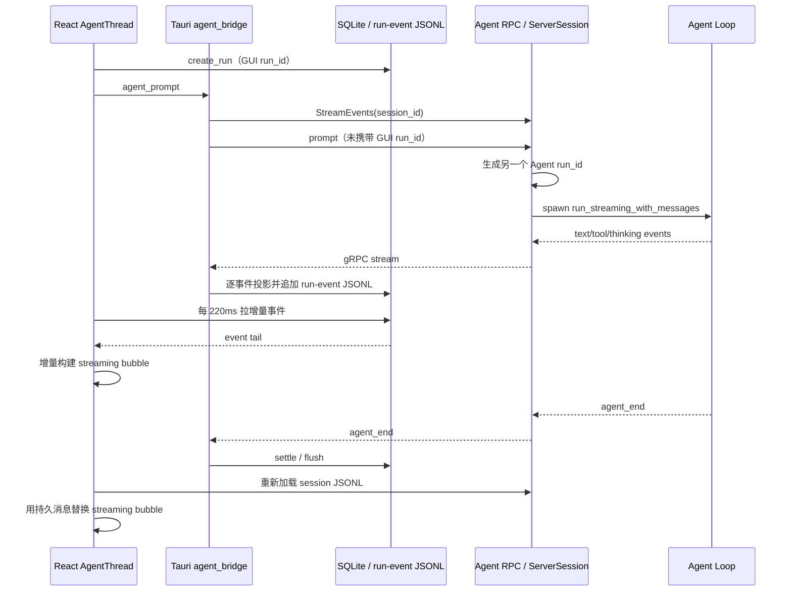
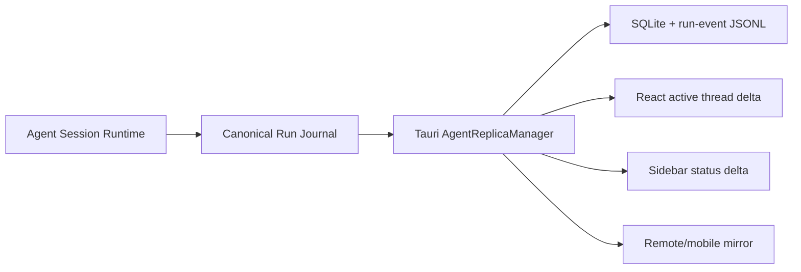
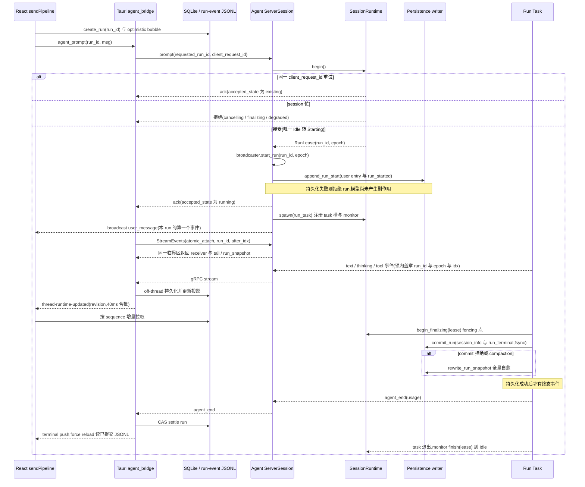
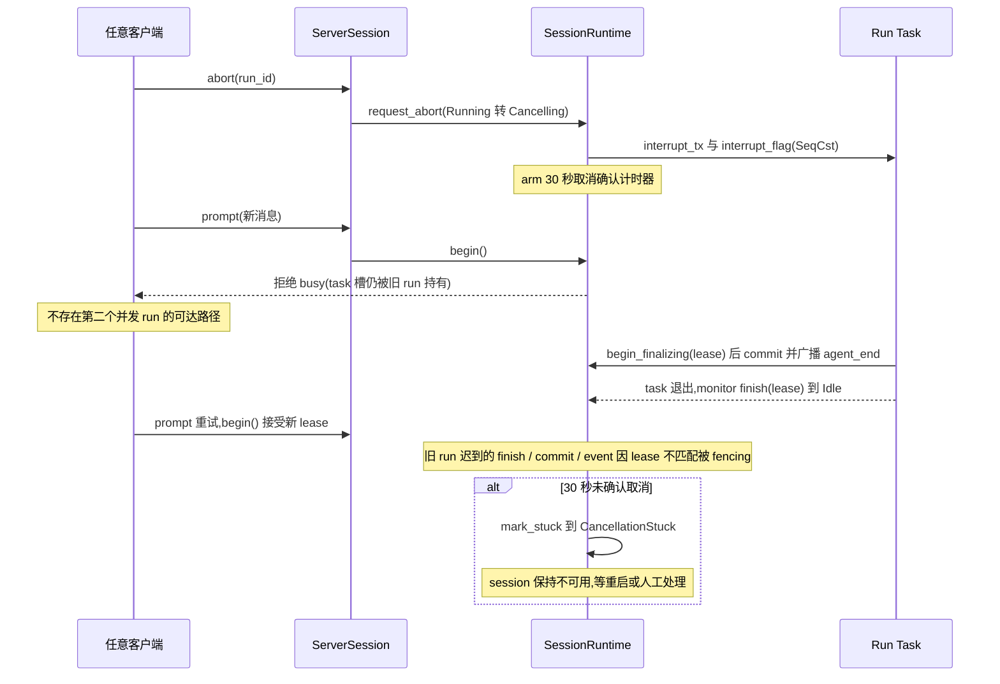
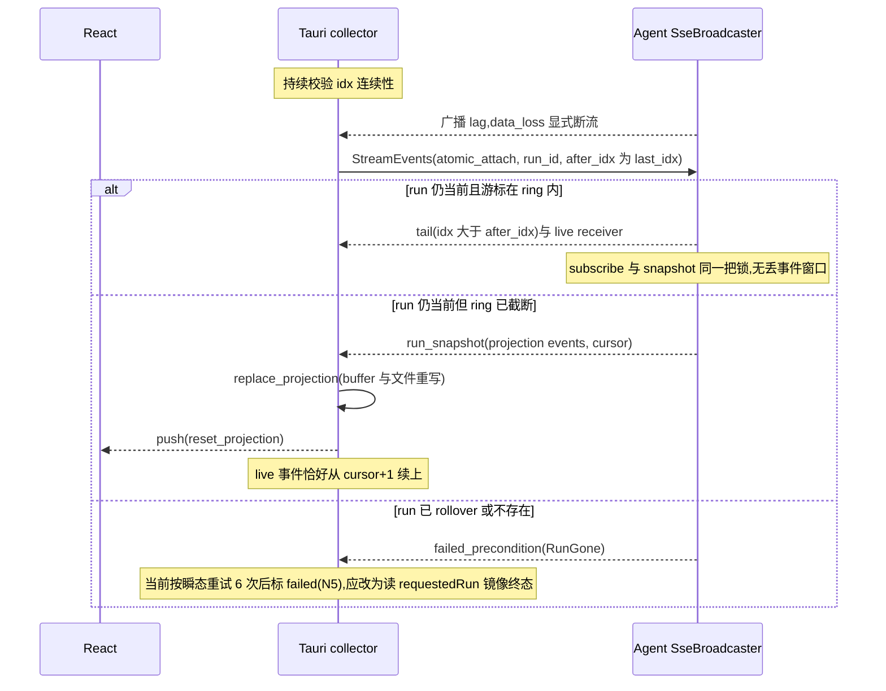
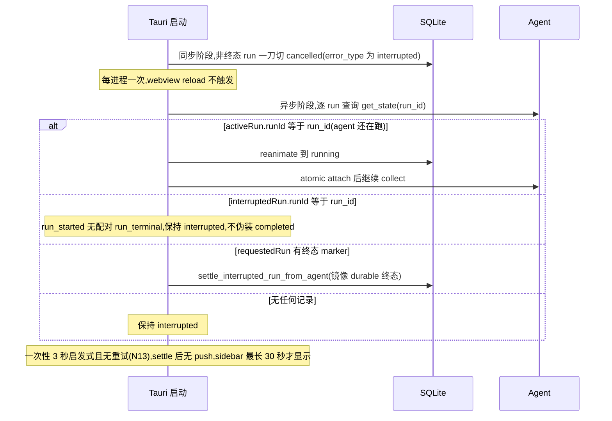

# Agent / GUI 多会话并发与流式切换架构评审

> 评审日期：2026-07-29
>
> 评审范围：`agent/`、`gui/src-tauri/`、`gui/src/features/agent/`、相关本地存储与 RPC 链路
>
> 约束：保留 Agent / GUI 的分层，保留现有数据库与文件存储方式；允许重构内部目录、类型、协议和职责。

## 1. 结论

当前版本已经具备多会话并发的基础，并且近期代码里有不少有针对性的修复：

- `AppState.sessions` 按 `session_id` 管理会话，不再使用隐式“当前会话”。
- 每个 `ServerSession` 有独立的 `Loop`、消息、interrupt、steering/follow-up 队列和 `SseBroadcaster`。
- 流事件有 Agent 侧 `run_id + idx`，并提供 `get_events_since`。
- GUI 的活动 run 投影已经从全量反复解析优化为增量 tail 投影。
- SQLite 已启用 WAL 和小型连接池；run-event JSONL 已有单独 writer thread 和活动 run 内存缓冲。
- React 中已经广泛使用 generation guard，避免线程切换后旧请求覆盖新线程。

这些改动解决了许多局部问题，但目前的核心仍然是：

> Agent 负责执行模型循环，GUI 后端负责另一半 run 生命周期。一次 run 的身份、订阅、事件持久化、完成判定、断线恢复和展示投影分散在 Agent、Tauri 和 React 三层。

这使系统可以“同时跑”，但还不能从架构上保证“多个会话互不干扰，任意切换后无缝续接”。当前最值得优先处理的并不是更换 JSONL，而是把 **run 的唯一所有权、状态机和可恢复事件游标收回 Agent**，让 GUI 真正成为快照与增量事件的展示层。

我建议的目标架构是：

1. Agent 内每个 session 有一个短锁保护的 `SessionRuntime`；不同 session runtime 并行。本轮不引入 actor/mailbox。
2. 每个 session 同一时间最多一个 active run，由明确状态机管理，不再用单个 `is_streaming: bool` 代替生命周期。
3. Agent 生成或接受唯一的 canonical `run_id`，所有层都使用同一个 id。
4. Agent 提供原子的 `snapshot + cursor + subscribe` 语义；GUI 不再用轮询拼出流。
5. JSONL 继续保留，但正常运行只 append；全量 rewrite 仅用于 compaction/repair 等少量场景，并移出 Tokio 热路径。
6. Tauri 继续使用当前 SQLite + run-event JSONL，但角色变成 Agent 事件的本地 replica/projection，而不是 run 调度器。
7. React 只维护按 thread 隔离的 view model；切换时先显示已知快照，再从 cursor 接增量，避免“重新加载—合并—去重—再轮询”的链式竞态。

## 2. 当前链路



这里有两个关键事实：

- Agent run id 与 GUI SQLite run id 不是同一个 id，只是由 Tauri collector 临时绑定。
- GUI 展示的实时流并非直接消费 Agent 流，而是 Agent → Tauri collector → 本地事件存储 → React 220ms 轮询。

这两点是当前复杂度的主要来源。

## 3. 重点问题

### P0：abort 会过早把 session 标记为空闲，允许同一 session 出现两个并发 run

相关代码：

- `agent/src/rpc/session.rs:252-271`
- `agent/src/rpc/commands.rs:85-118`
- `agent/src/rpc/session_prompt.rs:282-330`

`ServerSession::abort()` 在发出 interrupt 后立即执行：

```rust
self.is_streaming.store(false, Ordering::Relaxed);
```

但后台 run 此时通常还没有退出。新的 `prompt` 只检查 `is_streaming`，因此可以马上进入。

更危险的是，实际运行时取的是：

```rust
let loop = agent_loop.read().await;
loop.run_streaming_with_messages(...).await
```

Tokio `RwLock` 允许多个 reader，所以旧 run 尚未退出时，新 run 也可以取得 read lock 并同时使用同一个 `Loop`。这会导致：

- 两个 run 共享同一个 session 消息历史。
- 新 prompt 清除旧 run 正在处理的 interrupt flag。
- 两个任务竞争覆盖 `messages_arc`。
- 两个任务都可能重建并保存同一个 session JSONL。
- broadcaster 的 current run 被新 run 重置，旧 run 后续事件会被盖上新 run id。

这不只是状态显示错误，而是一条完整的数据破坏链：

1. `abort` 立即把 `is_streaming` 清为 false。
2. 新 prompt 复用同一个 `Arc<AtomicBool>` 并执行 `clear_interrupt`，可能撤销旧 run 的取消信号。
3. 新 prompt 把自己的 user message 加入共享历史；旧 run 随后用自己的 `final_messages` 覆盖 `messages_arc`，新消息可能从内存消失。
4. 旧 run finalize 时又会全量保存 JSONL，可能覆盖新 run 已追加的内容。
5. 新 prompt 会覆盖 session 的 `interrupt_tx`；之后再 abort，可能只取消新 run，旧 run 更难停止。
6. `start_run` 重置 broadcaster 后，旧 run 的后续事件和 `agent_end` 会被标成新 run，导致 GUI 提前结束新 run。

另外，新 prompt 在旧 run 仍持有 `agent_loop` read guard 时，system prompt、approval hooks、token counter 等 `try_write` 初始化会静默失败，造成配置串 run。

该 read guard 跨越整个模型/tool run 的 `.await`，可能持续数分钟。这里需要精确区分：`set_model` 已会显式返回 busy 错误；但 `set_thinking_level`、queue mode 更新以及 prompt 内部的若干 `try_write` 仍可能只更新一半状态或静默跳过 Loop 更新。用户看到“设置成功”但本次/下次执行仍使用旧配置，同样属于正确性问题。

这是一处真实的数据隔离与持久化风险，应该在任何流畅度优化之前修复。

建议：

- 阶段 0 不必等待完整 runtime 重构：先用一个短锁保护的小型显式状态和 run epoch/handle，原子完成 `Idle -> Starting -> Running -> Cancelling -> Finalizing -> Idle`；锁不跨模型/tool `.await`。
- `abort` 只做 `Running -> Cancelling`，不能直接进入 Idle。
- 只有 run task 的 completion 消息可以执行 `Cancelling -> Idle`。
- completion 必须携带 run id/epoch；旧 run 不能清除新 run 的状态、提交新 run 的消息或发送新 run 的 terminal event。
- 新 prompt 在 `Cancelling` / `Finalizing` 状态下应明确排队或拒绝，不能启动第二个 run。
- 用 `SessionRuntime` 的集中方法串行处理 `Start/Abort/Steer/FollowUp/RunFinished`，从结构上消除 check-then-act。

### P0：恢复流程采用“先 backfill、后 subscribe”，两者之间存在丢事件窗口

相关代码：

- `gui/src-tauri/src/agent_bridge/mod.rs:651-716`
- `gui/src-tauri/src/agent_bridge/mod.rs:823-858`

`collect_reanimated_run` 和 `collect_remote_stream` 都先调用 `get_events_since`，写完 backfill 后才调用 `stream_events`。如果 Agent 在这两步之间产生事件，这批事件既不在旧 backfill 中，也早于新订阅，因而永久缺失。

当前代码还把 Agent 的 `run_id/idx` 丢掉，重新生成 GUI 本地 `sequence`，所以之后无法可靠检测这个缺口。

建议：

- 最小修复：先 subscribe，记录订阅后第一个 event 的 `(run_id, idx)`，再取 snapshot/backfill，并按 Agent idx 去重合并。
- 更稳妥的协议是在 `SseBroadcaster` 内提供原子 `attach(after_run_id, after_idx)`：在保护 current run/ring 的同一把锁内先创建 receiver，再生成 snapshot；广播也经过该锁，从而消除 API 调用之间的窗口。
- 去重键必须是 `(run_id, idx)`，不能只按 idx；run 切换后 idx 会重新开始。
- 最终方案：增加 `AttachRun` RPC，一次返回：

```text
RunSnapshot {
  session_id,
  run_id,
  state,
  last_idx,
  events_or_projection,
  truncated
}
```

随后 stream 保证只发送 `idx > last_idx`。这应当是 Agent 提供的协议语义，而不是每个 GUI collector 自己拼。

### P0：Agent canonical run id 与 GUI run id 分裂

相关代码：

- GUI 在 `gui/src-tauri/src/store/runs.rs:78-99` 创建 SQLite run id。
- `gui/src-tauri/src/agent_bridge/client.rs:298-317` 的 prompt command 没有携带它。
- Agent 在 `agent/src/rpc/session_prompt.rs:81-87` 重新生成 run id。

当前系统依赖“一个 GUI collector 恰好绑定一个 Agent session 当前 run”的隐式关系。跨 GUI 重启、远端 attach、TUI/CLI 驱动和紧邻的两个 run 都需要通过 session 状态猜测映射。

现有 reanimate 路径甚至把 SQLite run id 传给 `get_events_since`。由于它与 Agent run id 必然不同，目前能返回数据只是依赖 Agent 的 mismatch fallback——run id 不匹配时返回“当前 run”的事件。如果同一 session 已经推进到下一次 run，旧 GUI run 可能因此回填到新 run 的事件。这说明身份分裂已影响正确性，不只是未来扩展问题。

建议：

- GUI 本地发起：把 SQLite 已创建的 `run_id` 作为可选 `requested_run_id` 传给 Agent，由 Agent 原子校验、采用并返回 canonical run id；最终权威仍在 Agent。
- TUI/CLI 发起：由 Agent 生成 run id，并在 prompt ack / `agent_start` 返回。
- 另设 `client_request_id` 作为重试幂等键，不要把它和 run identity 混用。
- 任何事件、审批、abort、events_since、状态查询都使用 canonical run id。
- session 只是路由键，run id 才是一次执行的身份。

这不改变 SQLite schema 或 JSONL 存储方式，只统一协议身份。

“永远由 Agent 现场生成 run id”本身也合理，但当前 GUI 会在 prompt 前创建 SQLite run 并抓取 review before-snapshot；若改成这种模式，需要增加 `ReserveRun`/prestart handshake，不能等模型任务已经启动后才回填 id。相比额外的预留 RPC，上面的 requested-id + Agent validate/ack 更容易保持现有顺序语义。

### P1：`user_message` 在 `start_run` 之前广播，会被标到旧 run 并马上从 backfill buffer 清除

相关代码：`agent/src/rpc/session_prompt.rs:61-87`。

当前顺序是：

1. broadcast `user_message`
2. append JSONL
3. `is_streaming = true`
4. `broadcaster.start_run(new_id)`，清空事件 buffer

在线订阅者可能看到该消息，但稍后 attach 的客户端无法从 `events_since` 找回它；并且它携带的是空 run id 或上一个 run id。

建议顺序：

1. 原子创建 run / 切换为 Starting。
2. `start_run(canonical_run_id)`。
3. 持久化 user entry。
4. 广播属于该 run 的 `user_message`。
5. 进入 Running。

### P1：gRPC 发现 receiver lag 后静默跳过，正常 collector 不会补洞

相关代码：

- `agent/src/grpc/mod.rs:247-278`
- `agent/src/rpc/protocol.rs:153-228`
- `gui/src-tauri/src/agent_bridge/stream.rs:39-137`

Agent 的 broadcast channel 只有 256 条。发生 lag 时服务端只日志告警并继续，客户端没有收到 gap marker；`collect_agent_response` 也不检查 Agent `idx` 连续性。因此：

- 最终文本可能少 chunk。
- tool/thinking/approval 事件可能缺失。
- GUI 仍可能收到 `agent_end` 并把不完整流当作完整。

Agent 内的 2000-event buffer 可以补洞，但正常 collector 不会调用它。

仓库根 `CLAUDE.md` 仍把 broadcast capacity 写成 4096，而实际 `SseBroadcaster` 是 256；实现协议修复时应同步维护文档，避免后续容量判断建立在错误基线上。

建议：

- 每个 collector 保存 `last_idx`，发现跳号立即 `get_events_since(run_id, last_idx)`。
- lag 不能只是服务端日志，应显式发 `stream_gap { expected, next }`，或直接终止 stream 迫使客户端走 resume。
- 所有 collector 都必须读取 `events_since` 已有的 `truncated` 字段；当前恢复 collector 忽略它，会把截断后的残缺 ring 当成完整 backfill。
- `truncated` 表示 buffer 已经覆盖不了缺口时，GUI 应回退到 Agent 的 `RunProjectionSnapshot`，而不是展示一个看似完整的残缺回复。

### P1：Agent 的阻塞文件 I/O 位于 Tokio run / RPC 热路径

相关代码：

- tool result callback 同步 append：`agent/src/rpc/session_prompt.rs:147-161`
- `append_entries` 打开、加文件锁、写入并 flush：`agent/src/session/mod.rs:318-349`
- run 完成时多次 load，再全量 save：`agent/src/rpc/session_prompt.rs:364-607`
- `save` 全量重写、`sync_all`，失败时 `std::thread::sleep`：`agent/src/session/mod.rs:352-414`
- gRPC async handler 直接调用同步 command dispatcher：`agent/src/grpc/mod.rs:60-199`

单个 session 的 JSONL 文件锁不会直接锁住别的 session，但这些同步操作会占用 Tokio worker。多个长会话同时完成或同时跑工具时，会造成整个 Agent runtime 的尾延迟抖动。

同时，正常 run 完成会：

- 重新加载旧 session 以保留 metadata。
- 再次加载 parent id。
- 把全部消息重新转 entry。
- 全量重写 JSONL 并 fsync。

成本随会话总历史增长，而不是只随本次增量增长。

还有两个需要精确区分的现状：

- sidebar 使用批量 `list_streaming_sessions`，并不是每 1–2 秒对每个可见会话逐一调用 `get_state`。
- 但当前打开且没有本地 active run 的 thread 会每 2 秒调用 `get_thread_agent_state` 尝试 remote attach；Agent 的 `get_state_internal` 会为该 session 读取 JSONL 来解析 parent id，因此“轮询触发重复扫描”确实存在，只是作用域是当前打开的 idle thread，不是整个 sidebar。

此外，外层 `save` retry 的同步 sleep 是 0.4 + 0.8 + 1.6 + 3.2 + 6.4 = 12.4 秒。每次 `save` 内层 rename retry 按当前实际位移又会等待 0.1 + 0.2 + 0.4 + 0.8 + 1.6 = 3.1 秒（代码注释写成 50–800ms，已经与实现不一致）。如果每次 rename 都失败，两层嵌套的理论等待可接近 31 秒，尚未计算序列化、fsync 和锁等待。即使它只在失败路径出现，也不应该占住 Tokio worker。

建议保留 JSONL，但改变写法：

- 每个 session 一个顺序 persistence worker。
- 正常 user/assistant/tool/metadata 只 append。
- 小批量 coalesce，明确 durability boundary；例如 user accepted、tool completed、run finalized。
- compaction、repair、fork 等需要替换历史时才执行 atomic rewrite。
- 所有文件 I/O 在专用 blocking pool / writer thread 中进行。
- Agent 内存中的 hydrated session 是活动会话读路径；不要为了读 parent/name/state 每次重新扫描 JSONL。

这比引入复杂二级缓存更简单，也更贴合 append-only journal。

### P1：GUI 的流展示通过 220ms 轮询本地 run-event，而不是订阅增量

相关代码：

- 本地发送：`gui/src/features/agent/sendPipeline.ts:137-144`
- 重新 attach：`gui/src/features/agent/useRunReattach.ts:68-93`
- 活动 run 状态：`gui/src/features/agent/useThreadMessages.ts:340-405`
- sidebar 状态：`gui/src/components/layout/hooks/useThreadStore.ts:193-219`

增量 tail 已避免 O(n²)，这是正确优化；但每个可见 run 每 220ms 仍产生：

- Web timer 唤醒。
- Tauri IPC。
- Rust buffer lock / JSON 序列化。
- JS 事件解析与 React state update。

而且天然增加最多约 220ms 的可见延迟。与此同时还有 1s、1.5s、2s 的其他轮询，切换时要等待多个状态源收敛。其中 1 秒确实存在于 sidebar 的批量 `list_streaming_sessions`，1.5 秒用于 stored-run status 等路径；它们不是逐 thread 的 `get_state` fan-out。

建议：

- Tauri collector 每收到事件就更新本地 projection，并以约 30–50ms 窗口合并 UI delta。
- 通过单一 `thread-runtime-updated` 事件通知前端，payload 至少包含 `threadId/runId/revision/status/delta`。
- React 只对当前 thread 订阅内容 delta；sidebar 只收轻量 status delta。
- 轮询保留为低频自愈机制，而不是主路径。

这样既不会逐 token 触发 React，也能比 220ms 轮询更丝滑。

### P1：GUI 同时存在多类 collector，职责重叠

当前至少有：

- 本地 prompt 的 `collect_agent_response`。
- crash recovery 的 `collect_reanimated_run`。
- 外部客户端 run 的 `collect_remote_stream`。
- 当前选中 session 的 `start_observing_session`。
- remote/mobile 的事件 mirror。

它们对 backfill、sequence、完成状态、错误和持久化的处理并不完全一致。`start_observing_session` 又只有一个全局 cancel handle，适合“当前页面观察者”，但不适合充当多会话运行时。

具体差异还包括：本地 collector 在等待 approval 时会暂停 600 秒超时，而 reanimated/remote collector 始终受该超时限制；只有本地 collector 建立 remote mirror tap。相同 run 因入口不同而获得不同语义，是需要合并而不是继续打补丁的信号。

建议在 Tauri 内合并成一个 `AgentReplicaManager`：

- keyed by canonical run id。
- 一个 run 最多一个 upstream collector。
- 本地 SQLite/run-event JSONL 投影一次。
- UI、sidebar、remote 都订阅该 replica 的派生事件。
- 当前选中 thread 只是改变下游订阅优先级，不创建另一套上游连接。

remote prompt 入口也存在独立的 check-then-act：两个客户端都可能先通过 `is_streaming` 预检查再同时提交。GUI-local guard 无法解决跨客户端竞争，最终必须由 Agent 的原子 `StartRun` 接受/拒绝。

### P1：React 依靠单一 active-thread state + 多个 generation ref 修补切换竞态

`useThreadMessages`、`useRunReattach`、`useSendMessage` 中的 guards 大多是合理且必要的，但数量本身反映了状态归属不清：

- `activeThreadIdRef`
- `messagesGenRef`
- `recentRunGenRef`
- `sendGenerationRef`
- `sendingRef`
- `attachedRef`
- streaming bubble 与 JSONL assistant entry 的启发式去重

其中 `applyRunMetadata` 还需要按时间窗口把 SQLite run 重新对齐到 JSONL assistant turn。这是 run id 未进入 Agent message/entry 的后果。

建议：

- Agent session entry 的 assistant/run terminal entry记录 canonical run id。
- Tauri 为每个 thread 维护 `{revision, persistedMessages, activeRunProjection}`。
- React 切换 thread 时直接替换为这个单一 view snapshot。
- 所有异步 delta 都携带 `threadId + revision`；revision 不匹配直接忽略。
- 删除基于文本前缀、时间窗口和“最后一条 assistant”的多数启发式合并。

这里的 keyed view state 是业务状态，不是额外的性能缓存；可以继续保持很小的 LRU 或只保留当前/最近几个 thread。

### P2：`is_streaming: bool` 无法表达真实 run 生命周期

当前至少需要表达：

```text
Idle
Starting
Running
WaitingApproval
Cancelling
Finalizing
Completed / Failed / Cancelled
```

单个 bool 导致：

- abort 是否真的完成无法判断。
- agent_end、JSONL finalize、GUI run settle 的先后关系模糊。
- remote attach 用“最近 10 秒 completed”这种时间启发式规避重复 attach。
- startup reconcile 只能猜 agent 是否已经完成。

当前 `agent_end` 还会先广播、后清 `is_streaming`。GUI 已看到 terminal event 时，Agent 仍可能短暂返回 busy；显式 `Finalizing` 状态和由同一状态机提交 terminal transition 可以消除这个顺序缝隙。

引入状态机后，`get_state` 应返回 active run：

```json
{
  "sessionId": "...",
  "activeRun": {
    "runId": "...",
    "state": "running",
    "lastEventIdx": 318,
    "startedAt": 1785312345678
  }
}
```

### P2：全局 EventBus 与 run stream 重复，且普通事件缺少 session/run envelope

`agent_start` 含 `session_id`，但多数 `AgentEvent` 构造器没有 session/run id。虽然 GUI 主流依赖 per-session broadcaster，未来任何使用全局 `EventBus` 的 callback 都容易重新引入跨会话混淆。

建议所有领域事件统一为 run journal 中的 canonical envelope：

```rust
DomainEvent {
    session_id,
    run_id: Option<RunId>,
    idx: Option<u64>,
    occurred_at,
    payload,
}
```

gRPC stream、日志和其他 adapter 都从 run journal 派生；现有无生产消费者的 EventBus 随迁移删除，不再维护“内部 event”和“SSE event”两套近似语义。

### P2：同一 workspace 内两个会话的文件修改无法做到语义上的“互不干扰”

会话内存、事件和持久化可以完全隔离，但如果两个 session 指向同一 `cwd`，它们的 shell/write/edit 会真实修改同一批文件。当前 shadow review 会标记 overlap，但不会阻止互相影响。

不建议为了多会话流畅度全局串行化同 workspace 的工具，那会牺牲主要并发价值。更合理的是：

- 明确“会话数据隔离”和“共享 workspace 文件语义冲突”是两件事。
- 保留并发执行。
- 对重叠写入继续做 changeset overlap 标记。
- 将来如需要，可对相同 canonical path 的 destructive/write 工具做轻量冲突提示，而不是 workspace 大锁。

## 4. 建议的目标架构

### 4.1 Agent：Session Runtime + Run Task

建议目录：

```text
agent/src/
  runtime/
    mod.rs
    registry.rs          # SessionId -> SessionHandle
    session_runtime.rs   # 短锁保护的串行控制面
    run_task.rs          # 单次 run 的模型/工具循环
    run_state.rs         # 明确状态机
    event_journal.rs     # run_id + idx + snapshot/resume
    persistence.rs       # 每 session 顺序写入
  rpc/
    service.rs           # 只做协议转换和路由
    protocol.rs
  session/
    entry.rs
    jsonl_store.rs
```

本轮明确选择封装式短锁，而不是 actor：

```rust
struct SessionRuntime {
    control: Mutex<SessionControlState>,
    journal: RunJournal,
    persistence: SessionWriter,
}

struct SessionControlState {
    phase: RunPhase,
    epoch: u64,
    active_run: Option<ActiveRun>,
    message_head: MessageHead,
}

struct ActiveRun {
    run_id: RunId,
    cancellation: RunCancellation,
    task: JoinHandle<()>,
}
```

关键原则：

- `SessionRuntime` 的字段保持 private；RPC、run task 和 writer 不能直接取得或修改 control state。
- `start/abort/finish/approve/update_config` 等状态转换集中在 `session_runtime.rs`。
- control lock 只保护内存状态转换，不跨 LLM、tool、磁盘、网络或 channel send 的 `.await`。
- 长时间 LLM/tool 工作在独立 run task。
- run task 使用启动时冻结的 `RunConfigSnapshot`，不会与 set_model 共享可变 Loop。
- Abort 通过 active run 的 cancellation handle 走快速路径，不等待普通事件或 persistence 队列。
- 同 session 的第二个 StartRun 只能排队或拒绝；不同 session 完全并行。
- 只有 `SessionRuntime` 方法能修改 active run 状态和 session message head。
- run task 的每次 event、内存提交和 persistence commit 都携带 epoch/run id；runtime 丢弃不属于当前 run 的迟到结果。

本轮不要预先构建 mailbox abstraction。只有未来同时满足以下情况时，才单独评审是否把 `SessionRuntime` 内部替换为轻量 Tokio actor，并保持外部 API 不变：

- 同一 session 支持多个排队 run。
- approval、steer、follow-up、persistence ack 之间出现必须统一排序的复杂规则。
- 状态转换无法继续收敛在少数 `SessionRuntime` 方法内。
- 已经明确 mailbox 容量、Abort 优先级、shutdown drain 和 actor crash recovery。

取消还需要一条明确的安全边界：

- `AbortRun` 对模型请求、tool future 和子进程做结构化取消，并设置有界等待时间。
- 超时后不能仅仅“detach 旧 task 并允许新 run”，因为失控的 shell/tool 仍可能继续修改 workspace；run-id fencing 只能保护事件和 session 持久化，不能撤销外部副作用。
- 无法终止的 tool 应使 session 进入显式 `CancellationStuck/NeedsRestart` 状态，提示重启 Agent 或人工处理；在确认旧执行实体退出前，不接受同 session 新 run。

### 4.2 Agent：单一事件日志和投影快照

每个 active run 保留：

```rust
RunJournal {
    run_id: RunId,
    next_idx: u64,
    ring: VecDeque<RunEvent>,
    projection: RunProjection,
}
```

`RunProjection` 至少包含：

- 已累计 assistant text。
- thinking segments。
- tools/approval 状态。
- usage。
- terminal state/error。

ring 只用于短期 resume；projection 用于 ring 已截断时的完整恢复。因此不需要无限缓存 token 事件，也不必把 `MAX_RUN_EVENTS` 调得很大。

推荐 RPC：

```text
StartRun -> { run_id, accepted_state }
GetSessionSnapshot(session_id)
AttachRun(run_id, after_idx) -> snapshot + stream
AbortRun(run_id)
SteerRun(run_id, message)
```

`AttachRun` 的 snapshot 与 receiver 注册必须在 journal/broadcaster 的同一临界区内完成。客户端用 `(run_id, idx)` 合并 snapshot 与增量，任何 truncation 或 revision gap 都回退到 projection snapshot。

RunJournal 是有界内存恢复窗口，不是新的永久存储。Agent 进程重启后的语义必须明确：

- session 继续从现有 JSONL lazy hydrate，启动时不能扫描并载入全部历史 session。
- 新格式为 run 追加 `run_started`/terminal marker 或等价 metadata；发现 started 但没有 terminal 的 run 时，将其恢复为 `InterruptedByRestart`，不能伪装成 completed。
- 历史 JSONL 没有 run marker 时仍按旧格式读取，但不能凭时间或最后一条 assistant 猜出 canonical active run。
- `AttachRun` 找不到指定 run 时返回明确的 `RunNotFound/RunGone`，并允许客户端另取 session snapshot；禁止像当前 `get_events_since` 一样 fallback 到“当前 run”。
- 已 finalize 的完整对话以 JSONL 为准；内存 projection/ring 丢失只影响 token 级 replay，不影响历史消息恢复。

### 4.2.1 新组件的失败和背压语义

新增 runtime/worker/replica 时必须同时定义失败行为，避免把现有竞态换成隐式丢消息：

- control state 使用短锁，不存在 control mailbox 满的问题；锁竞争只允许短暂等待，不能在锁内执行 channel send 或 I/O。事件和 persistence channel 必须有界并显式返回/记录 `Busy/Overloaded`。
- token delta 可以合并，但 `run_started`、approval、tool terminal、persistence error 和 run terminal 不能丢。
- user entry 无法持久化时不启动 run。运行中 persistence 失败时可以继续把当前答案流给用户，但 run 进入明确的 `PersistenceDegraded`，UI 告警且 session 在恢复落盘前不接受下一 run，避免内存和 JSONL 继续分叉。
- persistence 已 flush、runtime 尚未应用 ack 时，重启恢复必须通过 journal marker 得到幂等结果；ack 和 commit 都按 run id/epoch 去重。
- AgentReplicaManager 断线后保留最后已确认 projection，但标记 `stale/reconnecting`；不得把断线当 terminal。重连后从最后 cursor attach，失败再取 snapshot。

### 4.3 Tauri：AgentReplicaManager

Tauri 仍负责：

- SQLite thread/run/approval/review metadata。
- per-run JSONL 的 Runs inspector 历史。
- Agent event 到 GUI store schema 的投影。
- 向 React 和 remote 发本地事件。

但不再负责：

- 判断 Agent run 是否真的结束。
- 为同一 Agent run 创建多套 collector。
- 用 session 当前状态猜 run 对应关系。
- 通过 10 秒窗口防重复 attach。

建议的数据流：



Tauri 重启时，ReplicaManager 必须扫描 SQLite 中 non-terminal runs，与 Agent 的 active-run snapshots 做一次双向 reconcile：

- Agent 仍在运行：按 canonical run id 重新 attach。
- Agent 已完成：取 terminal/session snapshot 后 settle 本地 run。
- Agent 不认识该 run：标记 interrupted/orphaned，并保留已落盘的本地 inspector events。
- 同一个 canonical run 的恢复过程仍只能创建一个 upstream collector。

### 4.4 React：快照 + revisioned delta

切换 thread 的理想流程：

1. 立刻显示 Tauri 已有的 thread view snapshot，不清空页面。
2. 请求最新 `ThreadViewSnapshot`，返回 `revision` 和 active run cursor。
3. 订阅该 thread 的后续 delta。
4. 只接受 `revision` 连续的 delta；发现 gap 就重新取 snapshot。
5. 离开 thread 时只取消内容订阅，不影响 Agent run 或 Tauri collector。

Streaming 文本建议先以约 30–50ms 合批增量发送，React 每批只更新最后一个 growing segment。历史消息保持 memoized，不随每批流重渲染。该窗口应是内部可测参数而不是用户配置项；若实测当前可见 thread 仍有卡顿，可采用简单的两级策略（前台按 animation frame/最多 32ms，后台 50–100ms），不引入自适应缓存系统。

### 4.5 Agent 协议必须同步所有客户端

Agent RPC 不是 GUI 私有接口。以下消费者都受 canonical run id、active run state、attach/resume、abort/steer/follow-up 语义变化影响：

| 消费端 | 当前协议入口 | 必须同步的改动 |
| --- | --- | --- |
| GUI/Tauri | Rust generated proto + `agent_bridge` | requested/canonical run id、原子 attach、gap/truncation、按 run 控制 |
| TUI | 内嵌 `future.proto` + 手写 TypeScript types | prompt ack 保存 run id、activeRun、run-scoped abort/steer/follow-up、断线恢复 |
| CLI | 独立内嵌 proto + 手写 TypeScript types | one-shot stream 与 prompt ack 对齐、run id 输出、gap/terminal 校验 |
| Channels | Rust generated proto | 新字段生成、run 过滤与 terminal 处理 |
| Remote/mobile | Tauri remote command envelope | 透传 canonical run id、cursor、truncated 和新状态 |

协议实现原则：

- `proto/future.proto` 是唯一源；protobuf 只追加新 field number，旧编号不得复用。
- `make generate-proto` 必须一次更新 Agent、GUI、Channels、TUI 和 CLI。目前它会生成前三者并更新 TUI，但 CLI 的 `EMBEDDED_PROTO` 是独立手写副本，应纳入同一生成脚本或改为共享生成产物，删除长期双写。
- TypeScript 的 `RpcCommand/RpcSessionState/AgentEvent` 手写类型也必须由同一变更同步更新；最好增加 schema drift CI 检查。
- 新 Agent 在过渡期接受旧客户端未传 run id 的请求；新客户端读取 feature/capability 或协议版本，只在服务端支持时使用 `AttachRun`。
- prompt ack/`agent_start` 得到 canonical run id 后，客户端保存它；后续 abort、steer、follow-up、approval、resume 都带该 id。旧式只带 session id 的控制请求只在 active run 唯一且无歧义时兼容。
- 一个协议变更不能以“Agent 编译通过”为完成标准；上述各端都完成类型检查和契约测试才算完成。

## 5. JSONL 与性能

### 5.1 不建议现在替换 JSONL

JSONL 本身不是当前首要瓶颈。它有这些适合 Agent session 的特点：

- append 简单。
- 人工可读、可恢复。
- 单 session 文件天然隔离。
- fork/导出方便。

当前问题主要是使用方式：

- 热路径同步 I/O。
- 正常结束也全量重写。
- 多次重复 load。
- GUI 为实时展示再复制一份 token 事件并轮询。

先修使用方式，收益会明显大于切换存储引擎。

### 5.2 推荐写入策略

保持现有存储格式，定义三种操作：

1. `append(entries)`：正常 user/assistant/tool/metadata。
2. `commit_run(run_id)`：flush 当前 batch，确认本 run 可恢复。
3. `rewrite(snapshot)`：仅 compaction、repair、fork truncate。

可以按 session writer 串行化，不需要复杂缓存：

- writer 常驻打开当前活跃 session 文件。
- 20–50ms 内的连续小 entry 可合批。
- tool result 和 terminal entry 可以要求立即 flush。
- 是否每次 `fsync` 由 durability 级别决定；至少 run commit 需要明确保证。

### 5.3 GUI run-event JSONL

现有单 writer thread + 活动 buffer 的方向正确，建议保留。需要调整的是：

- 持久化 Agent 原始 `idx`，不要只保留 GUI 重编号 sequence。
- 允许一次 append event batch。
- Tauri projection 与磁盘写入解耦；UI delta 不需要等待每条事件落盘。
- writer 错误要进入可观测状态，不能永久 best-effort 静默。

### 5.4 建议直接移除或收敛的低收益设计

这次重构不应该只增加 runtime、snapshot 等新结构。下面这些设计本身已经失去真实职责，继续保留只会让新旧架构叠加。

#### A. 删除假的 GUI message store API

相关代码：

- `gui/src-tauri/src/store/messages.rs`
- `gui/src-tauri/src/commands/messages.rs`
- `gui/src/integrations/storage/threads.ts:126-137`
- `gui/src/features/agent/sendPipeline.ts`
- `gui/src-tauri/src/agent_bridge/headless.rs`

`messages` 表已经删除，但 `append_message` 仍返回一个没有落盘的 dummy `MessageRecord`，`list_messages` 永远返回空数组。这个 API 的名字表达“已经持久化”，实际却只生成临时 id，属于高误导、低收益兼容壳。

它还产生实际问题：GUI 把 dummy user message id 写进 `runs.trigger_message_id`，重新从 Agent JSONL 加载后，真实 session entry id 与这个 dummy id 不同，Retry 路径无法稳定找到原始 user message。

建议：

- 新代码立即停止调用 `append_message/list_messages`。
- optimistic bubble 使用明确命名的 `client_message_id`，不伪装成 stored record。
- run 与触发消息的关系由 canonical `run_id` 写进 Agent user entry；GUI reload 后直接按 run id 关联。
- `runs.trigger_message_id` 暂时保留 nullable 列以兼容旧数据库，但新 run 不再依赖它；后续大版本数据库整理时再删除列。
- Tauri command 可保留一个短兼容期并记录 deprecated warning，确认 remote/旧 GUI 不再调用后删除。
- remote 在 Agent 不可用时应明确返回“history unavailable”，不要回退到一个必然为空的假 store。

#### B. 合并 Agent 的 `EventBus` 与 per-session `SseBroadcaster`

相关代码：

- `agent/src/events/mod.rs`
- `agent/src/agent/run_loop.rs`
- `agent/src/rpc/protocol.rs`

当前 run loop 对许多生命周期事件同时执行：

1. `event_bus.emit(AgentEvent)`
2. `on_event(StreamEvent)`
3. session prompt 再把 `StreamEvent` 转为 `SseEvent`

但当前主程序没有实际注册 EventBus 订阅者，GUI 也只消费 `SseBroadcaster`；注释甚至明确说明部分 rich usage 只到 EventBus、没有桥接到 SSE。两套近似事件模型带来了字段不一致、重复 emit 和遗漏。

建议不要给 EventBus 再补 session/run 字段后继续维护两套，而是：

- 用一个 canonical `RunEvent` 类型和一个 `RunEventSink`。
- session run journal 是唯一 sink/排序点。
- gRPC、日志、TUI/channel adapter 都订阅这个 journal。
- 删除无生产消费者的 callback/subscriber EventBus；如果 CLI/TUI 需要进程级事件，做一个 journal adapter，而不是保留第二套领域事件。

#### C. 删除三套 GUI collector，保留一个 `AgentReplicaManager`

应被替代的实现：

- `collect_agent_response`
- `collect_reanimated_run`
- `collect_remote_stream`
- `start_observing_session`

这些函数不是四种业务，本质都是“attach Agent run → 补历史 → 消费增量 → 本地投影 → settle”。差异只来自启动入口和当前 GUI 是否选中。

在 `AgentReplicaManager` 可用后应直接删除前三套独立循环和单选 session observer，而不是把 manager 作为第五套 collector 加进去。

#### D. 删除 React 主路径上的多频率轮询

在 push + revision snapshot 稳定后，删除：

- streaming bubble 的 220ms poll。
- active run 的 1.5s poll。
- open thread remote attach 的 2s poll。
- sidebar streaming 的 1s poll。
- approvals/context 因同一 run 事件而触发的重复 poll。

只保留一个低频（例如 15–30 秒、窗口重新获得焦点时立即执行）的 reconciliation poll，用来处理丢失的本地通知或 Agent 重启。这样比同时维护 220ms/1s/1.5s/2s 多套时钟更容易推理。

#### E. 删除基于时间、文本和消息位置的 run 对齐

在 canonical run id 写入 Agent entries 后，应删除：

- `applyRunMetadata` 的 newest-first 位置配对。
- 30 秒 run 时间窗口匹配。
- streaming bubble 的文本前缀包含判断。
- “最后一个 user 后面的 assistant 是本 run snapshot”等启发式。
- “最近 10 秒 completed，可能是 attach race”的保护窗口。

这些逻辑是身份缺失后的补偿，不应迁移进新架构。

#### F. 删除 GUI-local `ACTIVE_AGENT_PROMPTS`

`ACTIVE_AGENT_PROMPTS` 只能约束当前 Tauri 进程，无法约束 TUI、CLI、mobile 或另一个 GUI client，且与 Agent `is_streaming` 重复。SessionRuntime 成为权威后：

- Agent 原子接受或拒绝 `StartRun`。
- GUI 只根据返回状态更新界面。
- 删除 GUI-local HashSet guard。

#### G. 删除 `parallel_tools` 的假并行配置

`agent/src/agent/mod.rs:191-217` 中 parallel 分支最终仍调用 sequential 实现。暴露一个不会生效的配置会增加测试矩阵和用户误解。

建议二选一：

- 当前直接删除 `parallel_tools/tools_execution_mode = parallel` 的对外承诺，统一串行工具执行。
- 将来真正实现并发、定义同 workspace 写冲突规则后，再以新能力重新加入。

不建议为了保留字段而长期维护一个名义并行、实际串行的分支。

#### H. 清理无消费字段和兼容遗留

可以结合协议版本整理逐步移除：

- 当前只序列化但业务未使用的 `streaming_behavior`。
- messages 表已删除后仍在 thread cleanup 中保留的旧循环依赖注释和无效清理步骤。
- 只为旧默认 session fallback 服务、但现在已要求显式 session id 的兼容分支。
- `try_write().unwrap()` 形式的配置方法；runtime 化后改为统一 `SessionRuntime` API，不保留两套修改入口。

这里需要遵循“先停止新写入、再兼容读取、最后删除接口”的顺序，避免把代码简化变成磁盘格式 breaking change。

## 6. 分阶段实施

### 阶段 0a：数据安全热修复

这是最小阻断集，应独立落地，不等待协议和 GUI 改造：

1. 不等待完整 runtime：先用短锁状态机 + run epoch/handle 替换裸 `is_streaming` check-then-act。
2. abort 只进入 `Cancelling`，等待匹配 run task 确认退出；旧 run 的迟到 event/commit 一律 fencing。
3. 对 LLM、tool future 和子进程做有界取消；取消卡死时进入显式故障态，不静默启动第二个 run。
4. 增加 active-run gauge、run-id/epoch 结构化日志和 stale-epoch-drop 计数。

完成标准：同一 session 无论多快执行 abort → resend，都不可能同时存在两个 run task。

### 阶段 0b：事件与协议正确性

1. prompt 必须携带或返回 canonical run id，并区分 `client_request_id`。
2. `start_run` 移到 user_message 之前。
3. attach 在 broadcaster/journal 内原子完成 subscribe + snapshot，并按 `(run_id, idx)` 去重。
4. collector 检测 idx gap、读取 `truncated` 并主动补洞或恢复 projection snapshot。
5. 删除 run-id mismatch 时 fallback 到当前 run 的行为，改为明确 `RunNotFound/RunGone`。
6. 增加 lag/gap/truncation 计数和断线恢复日志。
7. 在 canonical proto 中只做 additive 变更，并同步生成 Agent、GUI、Channels、TUI、CLI 产物；所有客户端至少能读取 prompt ack/run id 和新状态。

完成标准：正常流、reattach、run rollover 和连接中断恢复均不丢事件、不重复、不串 run。

### 阶段 1：把 run 所有权完整收回 Agent

1. 提取带 private control state 的短锁 `SessionRuntime`；本轮不引入 mailbox。
2. 将 `ServerSession::prompt` 中的 spawn、interrupt、状态和 finalize 移入 `SessionRuntime` 方法。
3. Loop 改成 run-local config snapshot，不再依赖整个 run 持有 `agent_loop.read()`。
4. Agent 提供 active run snapshot。
5. 补充 canonical event envelope。
6. TUI/CLI/Channels/remote-mobile 的控制命令统一携带 canonical run id，并增加旧/新 Agent 组合的兼容判断。

完成标准：关闭所有 GUI 后，Agent 仍能独立、完整地管理 run；重新连接只需 snapshot + cursor。

### 阶段 2：Tauri collector 收敛

1. 引入 `AgentReplicaManager`。
2. 合并 local/reanimated/remote collector。
3. 统一持久化和 terminal projection。
4. 当前 session observer 只保留下游 UI 订阅语义，不再另开 upstream stream。
5. manager 稳定后删除旧的四套 collector/observer 循环，不保留双轨。

完成标准：每个 active run 在 Tauri 最多一个 upstream collector。

### 阶段 3：GUI 改为 push + snapshot

1. 用 runtime update 事件替代 220ms preview poll。
2. 用 status delta 替代 sidebar 1s/1.5s 主轮询。
3. thread switch 使用 revisioned snapshot。
4. 删除多数 generation ref 和启发式 run/message 对齐代码。
5. 删除 dummy message store API；optimistic message 明确使用 client-local id。

完成标准：切换到任何运行中的会话，一次本地快照后立即继续增长，不出现空白、重复 bubble、回退或 200ms 级停顿。

### 阶段 4：JSONL 热路径整理

1. session writer。
2. append-only 正常路径。
3. compaction/repair 才 rewrite。
4. gRPC 同步磁盘操作移入 blocking executor。
5. 增加 I/O 和 event lag 指标。

### 协议与磁盘兼容的落地顺序

上述阶段可以在同一开发里程碑完成，但不能假设“尚未正式发布”就直接删除旧协议。用户已有 JSONL 和 SQLite 文件，兼容性是硬约束：

1. 先新增可选协议字段与新 RPC；Agent 同时接受旧 prompt 和新 prompt。
2. 同一个里程碑内同步修改 GUI、TUI、CLI、Channels 和 remote/mobile，再切换到 canonical run id、attach snapshot 和新状态。
3. 观察旧路径没有调用后，再删除旧 collector/observer 与 deprecated command。
4. JSONL reader 始终兼容缺少 `run_id` 的历史 entry；新的 run lifecycle marker/字段采用 additive 方式，conversation mapper 明确过滤 marker，不要求重写旧文件。
5. SQLite schema 的任何新增字段、索引、约束或数据形状变化都必须有版本化 migration 程序，不能只修改 fresh-install `SCHEMA`，也不能继续把发布后变更塞进历史 `ADDED_COLUMNS` 启动兼容逻辑。

当前仓库已经在 `gui/CLAUDE.md` 写明这条规则，最新 release boundary 是 `v1.0.5`；但本次检查没有发现正式的版本迁移 runner。实施前应补齐：

```text
gui/src-tauri/src/store/
  migrations/
    mod.rs                 # ordered registry + current version
    v1_0_6.rs              # 本里程碑唯一迁移（若确有 schema 改动）
```

可以用 `PRAGMA user_version` 或专门的 `schema_migrations` 表记录版本，但必须满足：

- startup 在开放普通读写连接前串行执行 migration。
- 每个版本有固定编号，已发布 migration 不可修改。
- SQLite 允许时整步事务化；失败不得把数据库留在半迁移状态。
- 同一目标版本的相关 schema 变化尽量合并为一个 migration。
- migration 同时更新 fresh-install `SCHEMA` 和 `gui/DEV_MD/ER.md`。
- 测试至少覆盖 `v1.0.5` 真实结构 fixture → 新版本、fresh DB → 新版本、重复启动、迁移中途失败恢复。
- destructive migration 需要迁移前备份或等价恢复方案；新增列优先 nullable 或带稳定 default。

按当前推荐的 requested run id 方案，SQLite 已有的 `runs.id` 可以直接作为 canonical run id，原则上不需要为了绑定关系新增一列。如果最终改成“始终由 Agent 生成 id”，则必须新增 Agent↔GUI run binding 字段，并按上述程序迁移，不能临时 `ALTER TABLE`。

因此，这份方案不会要求用户手工转换或丢弃现有 JSONL/数据库文件；程序负责自动升级，代码接口的简化采用“先兼容读、停止旧写、最后删入口”，而不是一次 breaking cutover。

## 7. 测试建议

当前测试覆盖了许多单点行为，但缺少真正的多 session / abort-resend / attach gap 集成测试。建议至少增加：

### Agent 并发模型

- 10 个 session 同时 stream，事件的 session/run id 不交叉。
- session A 设置模型、abort、steer 不影响 session B。
- 同一 session 第二次 prompt 被严格拒绝或排队。
- abort 后立即 resend，断言任意时刻 active run task 数量不超过 1。
- 将 abort → resend 循环至少 100 次，逐轮断言 `active_run_tasks <= 1`、内存消息与重载后的 JSONL 一致、每个 canonical run 恰好一个 terminal/`agent_end`。
- 100 次循环后，run task、channel sender/receiver、replica 和 cancellation handle 的存活计数回到基线；RSS 只作为趋势观测，因为 allocator 保留内存不能直接等价为泄漏。
- Cancelling 期间 tool 正在退出，新 prompt 不得启动。
- 模拟 tool 忽略取消：session 必须进入显式故障态，且新 run 不得启动。

### Resume 协议

- snapshot 与 subscribe 之间持续注入事件，最终 idx 连续且无重复。
- run A attach 期间切换到 run B，按 `(run_id, idx)` 验证不会把 B 的事件补进 A。
- 人为制造 broadcast lag，collector 能用 `events_since` 补齐。
- ring 截断后用 projection snapshot 恢复完整文本和 tool 状态。
- Agent 重启、GUI 重启、Tauri collector 重启三种情况分别测试。
- gRPC stream 中途断开后自动重连，最终 projection 与未断线基线一致。
- Agent 在 `run_started` 后、terminal marker 前崩溃，重启后该 run 明确恢复为 interrupted，`AttachRun` 不得回退到另一个 current run。

### GUI 切换

- A/B/C 三个 thread 同时运行，每 50ms 随机切换 30 秒。
- 切换后旧 thread 的异步结果不能写入当前 thread。
- 每个 thread 最终文本与 Agent canonical projection 完全一致。
- 不出现重复 user/assistant bubble。
- approval 在后台 thread 出现时，sidebar 状态和切回后的 card 一致。

### 多客户端协议

- GUI、TUI、CLI、Channels 分别对同一 Agent 发起 prompt，均取得并持续使用同一个 canonical run id。
- 新客户端连接旧 Agent 时能 capability-detect 并降级；旧客户端连接新 Agent 时，省略新增字段仍能完成基本 prompt/stream/abort。
- TUI/CLI 在 prompt ack 与首个 stream event 交错到达的两种顺序下都不丢事件、不串 run。
- `make generate-proto` 后检查 Agent、GUI、Channels、TUI、CLI 没有 embedded proto/schema drift。
- remote/mobile 的 prompt、abort、approval 和 resume 不丢失 run id/cursor。
- 对固定的模拟模型/tool 输入保存“归一化事件 golden”（移除时间戳、随机 id 等动态字段），校验生命周期顺序、idx 连续和 terminal 唯一；不要对真实模型文本做脆弱的逐字 golden。

### 存储

- 多 session 同时 tool-result append。
- 大历史 session 完成 run 时不会阻塞另一个 session 的 token stream。
- crash 截断最后一行、writer flush 失败、磁盘满的恢复行为。
- compaction rewrite 与 reader/append 的顺序一致性。
- 使用 `v1.0.5` 数据库 fixture 执行 migration 后，原有 thread/run/approval/review 数据完整且可读。
- fresh install 与升级后的 schema 等价；migration 重跑幂等，注入中途失败后能够安全恢复。
- 历史 JSONL（没有 run id）和新 JSONL 可以同时读取、继续 append、fork 和 compact。

建议增加一个确定性 fault-injection harness，可以在以下位置暂停：

- run accepted 后、task 启动前。
- event stamp 后、broadcast 前。
- backfill 后、subscribe 前。
- abort 标记后、tool 退出前。
- terminal event 后、persistence commit 前。
- persistence flush 成功后、`SessionRuntime` 应用 `PersistenceAck` 前。

## 8. 性能验收指标

不要只看平均 CPU，建议关注尾延迟和正确性：

- 8 个并发会话时，前台 token 到 UI 的 p95 < 80ms。
- thread switch 到恢复可见流的 p95 < 100ms（已有本地 snapshot 时 < 50ms）。
- event idx gap = 0；发生 ring truncation 必须显式可见并自动 snapshot 恢复。
- 同一 session active run 数永远 <= 1。
- 8 个 run 同时 finalize 时，其他 stream 的 event-loop stall p99 < 20ms。
- 活动 run 数量增加时，React/Tauri 的轮询次数不线性增长。
- 长会话 run finalize 不再是 O(全部历史) 的常规路径。
- active-run gauge 最终归零；gap、lag、truncation、stale-epoch-drop 都有可查询计数和对应 run id 日志。
- Agent 冷启动不解析全部历史 JSONL；session 首次访问时 lazy hydrate，启动耗时主要随配置而不是历史 session 数增长。
- RunJournal/ring、replica projection 和 terminal session runtime 都有明确释放边界；先记录当前版本的 RSS/heap 基线，再为 8 个并发、每个 100 轮历史的场景设回归上限，不在没有测量前拍一个任意 MB 数。

## 9. 建议保留的现有实现

以下部分方向正确，不建议推倒重来：

- `AppState.sessions` 的显式 session 路由。
- per-session 独立 Loop/broadcaster 的隔离原则。
- SQLite WAL 与连接池。
- run-event JSONL 的单 writer thread。
- React 的 live tail 增量 projector。
- MessageBlock 对 growing tail 的局部渲染优化。
- shadow review 的 workspace overlap 标记。
- JSONL 最后一行损坏容错与 atomic rewrite。

重构重点应是删除职责重叠和启发式对齐，而不是替换这些已经有效的基础设施。

## 10. 推荐决策

如果只选择一条主线，我建议按以下顺序推进：

> 先以阶段 0a 热修 abort/run 状态机和 fencing；再以阶段 0b 统一 canonical run id 与无缝 resume；随后完成 Agent 的 snapshot+cursor、合并 Tauri collector，最后把 React 220ms 轮询替换为合批 push。JSONL 只做 append-only 和异步化，不更换存储技术。

这样既能较快封住实际数据竞态，又能逐步到达“多个会话同时运行、任意切换、无缝接流”的目标，并且不会为了小幅性能收益引入一套难维护的缓存系统。

---

## 11. PR #65 / #66 实施评审（2026-07-30 追加）

> 评审对象：PR #65 `refactor(agent): close multi-conversation run lifecycle`（+4546/−1366）与 PR #66 `refactor(agent): close durable run lifecycle and GUI push paths`（+2970/−1428），均已合入 main（`ac451f79`、`34cf9359`）。
>
> 评审方式：对照本文档第 3 节问题清单与第 4 节目标架构逐条核对实现；高严重度发现均经第二人独立代码复核确认。

### 11.1 总体结论

实施质量整体很高。第 3 节的三个 P0（abort 双 run、backfill/subscribe 丢事件窗口、run id 分裂）全部闭环，P1 主线（事件顺序、lag 显式化、热路径阻塞 I/O、220ms 轮询、EventBus 双事件模型、假 message store、假并行配置）均已落地，代码注释普遍写清了"为什么"（锁序、拒绝语义、兼容边界），测试针对性明显强于此轮之前（abort-resend 100 轮压力、stale-epoch fencing、commit 拒绝、writer idle 退休边界竞争、attach 无窗口、并发广播 idx 连续性）。

同时发现一批新问题，其中 3 个达到必须尽快修复的级别：

1. **跨层契约破坏（最严重）**：PR #66 给 mid-run assistant entry 也盖上 `run_id`，但前端三处去重逻辑仍假设"persisted message 带 runId ⇒ 该 run 已 settle"。结果是**运行中会话发生任意一次后台 reload 后，直播气泡被永久抑制**——这正是本次重构的核心验收场景（"切换到任何运行中的会话，立即继续增长"）。
2. **reconcile 新链路绕过自建的 CAS 纪律**：`settle_interrupted_run`/`reanimate_run` 是无守卫 UPDATE，已构造出"用户取消被覆盖成 completed"的可达序列；reanimated run 的 collector 失败时 run 永久滞留 `running`。
3. **append-only commit 的 session_info 是 run 起始快照**：mid-run 的改名/换模型/thinking/cwd 更新先 append 了新快照，commit 又把旧值快照 append 在最后，"last session_info 权威"读取规则会把 mid-run 元数据更新从磁盘上回退。rewrite 路径有 `merge_latest_session_info` 防护，fast path 漏了。

### 11.2 原计划落实情况

| 文档条目 | 状态 | 证据与备注 |
| --- | --- | --- |
| P0 abort 过早释放 session → 双 run | ✅ 闭环 | `runtime/run_state.rs` 状态机 + `session_runtime.rs` task 槽与 monitor；abort 只进 Cancelling；只有匹配 lease 的 task 退出能释放；100 轮 abort-resend 压力测试 |
| P0 backfill→subscribe 丢事件窗口 | ✅ 闭环 | `SseBroadcaster::attach` 在同一把 run 锁内注册 receiver + 截快照；有对拍测试 |
| P0 Agent/GUI run id 分裂 | ✅ 闭环 | `requested_run_id` + `client_request_id`；GUI ack 校验 canonical == requested；mismatch fallback 已删，改为显式 `failed_precondition` |
| P1 user_message 先于 start_run | ✅ 闭环 | 顺序改为 begin → start_run → 持久化（失败拒 run）→ 广播 user_message |
| P1 lag 静默跳过 | ✅ 闭环 | gRPC lag 显式 `data_loss` 断流逼客户端 cursor resume；ring 截断返回 projection snapshot；`truncation_count` 指标 |
| P1 Tokio 热路径阻塞 I/O | ✅ 基本闭环 | gRPC 分发整体 `spawn_blocking`；每会话 writer 线程（懒启动、30s 空闲退休、有界 256 队列）；run 末 commit 在 blocking pool。残留：`get_state` 仍每次全量 load JSONL（见 N12） |
| P1 220ms 轮询 | ✅ 闭环 | 进程级单调 revision + 40ms 合批 push；React 四套轮询（220ms/1s/1.5s/2s）确已删除，保留 30s reconciliation |
| P1 多套 collector | ◐ 大部分 | `AGENT_REPLICAS` 保证一个 canonical run 最多一个 replica collector；但 `start_observing_session` 仍是第二条上游流（不过滤订阅全量事件），计划内后续删除 |
| P1 React generation refs | ◐ 部分 | ref 数量未减，但逐路径推演无旧 thread 写入新 thread 的可达路径；新增 revision 拒绝乱序 delta |
| P2 is_streaming bool | ✅ 闭环 | `RunPhase` 六态（含 CancellationStuck / PersistenceDegraded 显式故障态）；`is_streaming` 仅作旧客户端兼容投影 |
| P2 EventBus 双事件模型 | ✅ 闭环 | `events/mod.rs` 删除；`canonical_stream_event` 是唯一规范化点 |
| 5.4 A 假 message store | ✅ 闭环 | `store/messages.rs`、`commands/messages.rs` 删除；`trigger_message_id` 保留 nullable 列、新 run 写 null（符合文档处方） |
| 5.4 D 多频轮询 | ✅ 基本闭环 | 残留一个 10s `prefetchAgentState`（存在理由已过时，见 N15） |
| 5.4 E 启发式对齐 | ◐ 部分 | 30s 时间窗/位置配对明确降级为 legacy JSONL 兼容读取（合理）；但**文本前缀抑制仍是活代码且误杀**（见 N9） |
| 5.4 F ACTIVE_AGENT_PROMPTS | ✅ 闭环 | 已删除，全仓库无引用 |
| 5.4 G 假并行配置 | ✅ 闭环 | 统一串行执行，配置仅作历史兼容读取，注释明确 |
| 4.5 五端协议同步 | ◐ 仅 GUI 完整 | GUI 全量采纳；TUI/CLI 只做了类型与 ack 的最低同步；Channels 出现行为回归（N7）；remote 透传 runId/idx 正确 |
| 阶段 0b 幂等 | ✅ 闭环（进程内） | active + 64 条 recent 窗口，重试返回 `accepted_state:"existing"`；重启后不持久（代码注释已声明后续移入 journal） |
| 阶段 4 append-only JSONL | ✅ 闭环 | `run_started`/`run_terminal` 标记、commit_run（fsync 边界、拒绝语义）、rewrite 自愈、last session_info 权威、重启恢复 `interrupted_by_restart` |
| 重启恢复/对账 | ✅ 方向正确 | `append_run_start` 原子关闭中断 run；Tauri 启动一刀切 cancel + 按 run id 三态对账，无时间启发式。实现缺陷见 N4/N5/N6 |

### 11.3 新发现问题（按严重度）

#### P0 级：核心场景回归 / 数据正确性

**N1. mid-run assistant entry 携带 run_id，击穿前端"runId ⇒ settled"不变量，直播气泡被永久抑制**

- 来源链：`agent/src/rpc/session_prompt.rs:231-240`（`save_closure` 给**每个** assistant 消息盖 run_id）+ `agent/src/agent/run_loop.rs:683`（`save_callback` 每次 LLM 调用完成即触发，mid-run 部分快照也带 run_id）→ `get_session_entries` 透出 `meta.run_id` → `gui/src/features/agent/entryProjection.ts:215-216` 从任意 assistant entry 盖章（`entryProjection.ts:63-64` 注释声称"仅由 Agent finalize 的 entry 设置"，与事实相反）。
- 三个下游守卫全部被击穿：
  1. `threadRunProjection.ts:117`：`streamingBubbleBase` 首守卫 `current.some(m => m.runId === runId && m.id !== bubbleId)` → mid-run 快照命中 → 永远 `return null`，气泡不再插入；
  2. `useThreadMessages.ts:263-266`：缓存合并的 `settledRunIds` 实际包含在飞 run，`keepBubbles` 把存活的 `stream_<runId>` 气泡过滤掉；
  3. `useThreadMessages.ts:52`：`dropInFlightSnapshot` 只匹配 `!message.runId`，不再命中新格式快照 → 冻结半截回复保留。
  另外 `threadRunProjection.ts:345-354` 的 canonical 绑定不检查 run 是否 settled，`applyRunToMessage` 把在飞 partial 标成 `status:"complete"`。
- 触发条件：run 完成过 ≥1 次 LLM 调用（所有带工具的 run）后发生任意 mid-run reload——切走切回、remote-activity 的 `reloadMessagesQuiet`、attach reload、冷启动首次打开运行中的 thread。用户看到 `status:"complete"` 的冻结半截回复：**无流式指示、Composer 停止按钮消失（`AgentThread.tsx:126-128` 的 `isSending` 依赖 streaming 气泡）、失去 abort 入口**，直到 run settle 才自愈。
- 测试盲区：`threadRunProjection.test.ts:276` 构造的 mid-run partial 不带 runId（旧格式假设）；`:548` 只覆盖"别的 run 的 id"。
- 建议（已复核可行）：`applyRunMetadata` canonical 分支里，`runsById.get(message.runId)` 得到非 settled run（或查不到）时，把该 message 视为 mid-run 快照——剥掉 runId（或加 `inFlight` 标记）并让上述三处守卫跳过它；settled/failed/cancelled 仍精确绑定。补"本 run runId + run 仍 active"的回归测试。

**N2. `settle_interrupted_run` / `reanimate_run` 是无守卫 UPDATE，用户取消可被覆盖成 completed**

- 位置：`gui/src-tauri/src/store/cleanup.rs:44-58`、`:61-74`。只有 `WHERE id = ?`，无终态守卫、不设 `ended_at`、不 `mark_catalog_dirty()`。
- 可达序列：GUI 重启 → run 被 reanimate 回 `running` → 用户点停止 → CAS 置 `cancelled`（`error_type=abort_requested`）→ agent run loop 正常返回，`agent_end` 无 reason → collector 判 `complete=true` → `ReplicaSettlement::Interrupted` 分支调 `settle_interrupted_run(run_id, "completed")`（`agent_bridge/mod.rs:735`）→ **cancelled 被覆盖为 completed**，截断的部分回答显示为正常完成。同一函数内 Active 分支用 CAS（`update_run_status_if_active`）、Interrupted 分支不用，防护不对称。
- 建议：两个函数改条件 UPDATE（`settle_interrupted_run` 加非终态守卫或直接用 `update_run_status_if_active`；`reanimate_run` 加 `AND error_type='interrupted' AND status='cancelled'` 并检查 affected rows，0 行时中止 reanimate 流程）。

**N3. append-only commit 用 run 起始快照写 session_info，mid-run 元数据更新被磁盘回退**

- 位置：`agent/src/rpc/session_prompt.rs:557-581`（`info_entry` 由 prompt 开始时捕获的 `session_model/session_thinking/session_name/auto_compaction/session_cwd` 构建）→ `:625` `commit_run(vec![info_entry, terminal])`。
- 序列：run 起始（model=A）→ mid-run `set_model(B)` / 改名 / thinking / cwd（均无 busy 门，`update_info` append 完整新快照 B）→ run 末 commit 追加 `session_info{A}` + terminal → "last session_info 权威"读取 → **磁盘上 model 回退为 A**，内存仍是 B。agent 重启后 hydrate 出旧值；下一次成功 run 的 commit 才会自愈。rewrite 路径有 `merge_latest_session_info` 合并最新磁盘值，append-only fast path 漏掉了同样的合并。
- 建议：在 writer 的 `CommitRun` 分支对 entries 中的 session_info 做与 `RewriteRun` 相同的 `merge_latest_session_info`（model/thinking_level/session_name/cwd/auto_compaction 五键），保持两条路径语义一致；补"mid-run 改名后 commit 不回退"的测试。

#### P1 级：正确性 / 协议缺口

**N4. reanimated run 的 collector 失败时永久滞留 `running`**

- 位置：`gui/src-tauri/src/agent_bridge/mod.rs:664-683`。`reanimate_run()` 先把 run 置回 running，随后 `AGENT_REPLICAS.acquire` 失败或 `collect_stored_replica` 返回 Err 都只 `eprintln`，不写任何状态。
- 后果：该 run 永远 running → composer 永久禁用、退出守卫每次都拦截、`attach_remote_stream` 的 `is_active` 永远返回这个僵尸 run id。直到下次进程重启的对账才自愈。对照 `attach_remote_stream` 失败路径（`mod.rs:829-836`）会 CAS failed——两条入口语义不对称，正是本文档 5.4 C 指出的问题模式。
- 建议：失败路径与 remote 对齐（CAS failed），更好是结合 N5 走 RunGone 对账。

**N5. attach 的 `failed_precondition`（RunGone）被当作可重试瞬态错误**

- 位置：`gui/src-tauri/src/agent_bridge/stream.rs:128-142`。不区分 tonic code，一律重试 6 次（约 6.2s）后报 `stream could not be resumed`。文档 4.2 要求"RunNotFound/RunGone 时允许客户端另取 session snapshot"——agent 侧已履约（显式错误、不再 fallback），GUI 侧没有对应恢复分支：已正常 rollover 的 run 会被标 failed 而不是从 `get_state.requestedRun` 镜像真实终态。这是 N4 的直接诱因。
- 建议：attach 错误保留 tonic code；`FailedPrecondition`/`NotFound` 判定 RunGone，跳出重试，走"读 requestedRun → CAS settle；无 marker → failed/interrupted"。

**N6. Finalizing / Cancelling / 故障态期间 steer、follow_up 被接受但静默丢失**

- 位置：`agent/src/runtime/run_state.rs:202-244`（只校验 active + run_id，不校验 phase）+ `agent/src/agent/mod.rs:135-144`（`independent_copy` 经 `Loop::new` 创建**全新队列**）+ `session_prompt.rs:68-69`（每次 prompt 重挂 `steering_tx/follow_up_tx`）。
- 机制：run task 最后一次 `drain()` 之后（Finalizing 的持久化 + 广播窗口，可达数百毫秒到数秒）到达的 follow_up/steer，`try_send` 成功、客户端收到 Ok，但消息进了已死快照的队列，永不落空；下一个 run 换用新队列，消息无声丢失。Cancelling / CancellationStuck / PersistenceDegraded 期间同理。
- 建议：`RunControl::steer/follow_up` 仅在 Starting/Running 接受；其余相位返回显式错误（如 "run is finalizing; retry after completion"），让客户端自行排队或转为新 prompt。

**N7. Channels 的 abort→prompt 模式与新状态机冲突（面向 IM 用户的新失败）**

- 位置：`channels/src/feishu/prompt_loop.rs:40,63`、`channels/src/dingtalk/bridge.rs:330,339`。bridge 先 `abort()` 再立即 `prompt()`；新服务端在 Cancelling→Finalizing→finish 走完之前一律拒绝第二个 run（这是 P0 修复的正确行为），bridge 用 `?` 把错误传播成错误卡片。取消窗口通常几十毫秒，但 run 卡在长 shell 工具时可达分钟级。
- 性质：把旧的静默竞态变成显式错误，方向正确但 UX 回归；属于 4.5"控制语义变化同步所有客户端"的遗漏部分。
- 建议：bridge 在 abort 后轮询 `get_state` 等 `activeRun` 清空（超时+退避）再 prompt；或 Agent 提供 abort-and-queue 语义；至少把该特定错误映射为静默重试。配套：`agent_end` data 应携带终态（cancelled/completed/error），channels `parse_event` 应按 prompt ack 的 canonical run id 过滤事件（当前完全不读 run_id，同 session 交叉操作时旧 run 的 agent_end 会把新 run 的卡片提前 finalize）。

**N8. TUI / CLI 未接入恢复协议，4.5 承诺只完成 1/3**

- TUI（`tui/src/rpc/grpc-client.ts:640-642`、`tui/src/app.ts:434`）：重连只发 `{sessionId}`，无 atomic attach/afterIdx；`handleAgentEvent` 忽略 runId/idx/epoch/projectionSnapshot；断线窗口事件永久丢失；`activeRun`/`interruptedRun` 类型已定义但无消费者。
- CLI（`cli/src/rpc/grpc-client.ts:979-990`）：先 `streamEvents` 后 `prompt`，两个独立 RPC 存在订阅竞态（快速响应时 agent_start/首批 chunk 可先于订阅注册丢失）；prompt ack 的 run_id 被丢弃，JSON 输出无 run id；不校验 terminal（无 agent_end 的 stream end 静默接受部分结果）。
- 建议：先 prompt 拿 canonical run id，再 `atomicAttach(runId, afterIdx=-1)` 补全前缀；TUI 重连用 `activeRunId + last_idx` 原子 attach；CLI 结束后用 `get_state(runId)` 校验 `requestedRun` 终态并输出 runId。

**N9. 5.4 E 未删净：文本前缀抑制误杀重复提问**

- 位置：`gui/src/features/agent/threadRunProjection.ts:147-153`：`persisted.includes(content.slice(0, 80))` 时抑制气泡。canonical run id 时代该启发式已由 `:117` 的 runId 守卫取代，但仍在活代码路径：用户重复提问（"继续"、"yes"）且模型回答开头相同（确定性输出常见）时，前轮回复包含本轮前 80 字符 → 气泡整轮被抑制直到 settle。
- 建议：按 5.4 E 删除前缀分支（`sameTurn` 位置判断可一并收敛为 runId 判断）；如顾虑 legacy 数据，至少加"persisted 无 runId 才允许前缀抑制"。

**N10. `agent_events_fallback` 忽略 `truncated`/`projection`**

- 位置：`gui/src-tauri/src/commands/runs.rs:103-156`。ring 截断时 agent 返回 `events:[] + truncated:true + projection`，该 fallback 只读 events，把"已知残缺"当成"完整的空"返回。正是本文档 P1 点名的 collector 义务未落到这条路径。
- 建议：解析 `truncated`/`projection` 并映射 projection events；或至少在 truncated 时返回显式错误。

#### P2 级：健壮性 / 可观测性 / 流程

- **N11. 契约检查与 CI 门控覆盖缺口**（`scripts/check_run_event_contract.mjs`、`.github/workflows/ci.yml`）：脚本只校验 proto 注释、prompt_helpers 别名、TUI/CLI 两处浅字符串，GUI Tauri（atomic attach/快照折叠）、Channels（run 过滤/ack）、remote envelope、`agent/src/grpc`、`agent/src/runtime` 均无断言；`proto-drift` job 的 `if` 只挂 `rust_workspace` filter，只手改 TUI/CLI/GUI-Tauri 生成产物的 PR 不触发该门。断言本身是脆弱全文 grep（注释命中也算过）。
- **N12. `get_state` 仍每次全量 load JSONL**（`agent/src/rpc/mod.rs:247`）：为 `parentSessionId` + `interruptedRun` + `requestedRun` 三个字段解析整个文件。廉价标记扫描 `unterminated_run_id` 已实现但未被这里使用；`parent_session_id` 内存中就有。现已在 blocking pool 上不卡 Tokio，但长历史会话的每次 get_state 都是 O（历史） CPU。建议：active_run 为空时用 cheap scan，requested_run 查询才 load，parent id 走内存。
- **N13. 启动对账一次性 + 3 秒启发式 + 无重试**（`gui/src-tauri/src/lib.rs:516-528`）：agent 未就绪时对账静默失败，一批实际正常/在跑的 run 被标 interrupted 且不再重试。建议指数退避重试或等 supervisor 确认 agent 可达后触发；对账 settle 后补 `thread_runtime_updated` push（目前 sidebar 最长 30s 后才显示）。
- **N14. 断线无 stale/reconnecting 语义；`stream_disconnected` 写进 agent 的 idx 空间**（`stream.rs:271-279`）：重连退避期间 UI 持续显示 running，违反 4.2.1"标记 stale/reconnecting"；合成事件以 `last_idx+1` 持久化，占用 agent 拥有的 idx 序列——未来任何路径对该 run 重新 collect 时会按 `idx <= last_idx` 静默跳过一条真实事件（当前 failed run 不会再 collect，属潜在地雷）。建议断线状态走 run metadata/status push，不进事件日志。
- **N15. React 侧四个小问题**：① reconciliation 把 revision 水位重置为 `undefined`（`useThreadStore.ts:156`），陈旧 push 可短暂回退 sidebar；② 前台 thread 没有低频自愈——漏一个 terminal push 就永久冻结（5.4 D 允许的低频对账没覆盖最要害的前台视图）；③ push 处理器每次都 bump `runStatusGenRef`，密集 push 期间 30s reconciliation 被饿死；④ compatibility sampler 查询失败映射为空集合（`lib.rs:361`），sidebar 状态点闪烁——失败时应保持 previous 不 emit。另有残留 10s `prefetchAgentState` 轮询，存在理由已被 stale-while-revalidate 取代。
- **N16. Finalizing 无有界等待**：30s 取消确认计时器只看 Cancelling；持久化 commit 挂起（如 NFS hang）会让 session 永久楔在 Finalizing，无任何故障态或日志。建议给 Finalizing 也加有界等待，超时进显式故障态。
- **N17.（已撤回）无 capability/版本协商**：初评认为新客户端连旧 Agent 会硬失败、需要版本协商；经确认 TUI / GUI / CLI / Agent 同包发布，不存在版本错配场景，此项非问题。远期若部署形态变化（客户端与 Agent 分进程独立升级）再议。
- **N18. remote mirror 背压下会丢 terminal/approval 事件**（`remote/mod.rs:450-452`）：`try_send` 满即丢（仅 eprintln），违反 4.2.1"run terminal、approval 不能丢"；projection snapshot 也不经 mirror 转发，remote 端的 (runId,idx) 游标会留洞，需确认 web 端有 gap 自愈。

#### P3 级：琐碎 / 清理

- `stream_gap` 是死事件类型：生产端已不存在（lag 改 `data_loss`），`grpc/mod.rs:311` 的放行与 `stream.rs:221` 的处理是死代码；proto 词表注释（自称 "all clients key off these"）漏列 `run_snapshot`/`ping`。
- `grpc/mod.rs:328-333` 注释 "Never terminate the stream on lag" 与下方恰恰终止流的代码矛盾（旧设计残留）；过滤订阅会丢非原子订阅的初始 `ping`（当前无客户端用 event_types，未触发）。
- `requested_run_id` 与近期已完成 run id 冲突无防御（`run_state.rs:113-121`）：不同 client_request_id 复用同一 requested id 会在 journal 产生两条同 id run，污染 `find_run_terminal`。GUI 用 UUID 概率极低，建议 begin 时拒绝与 recent 窗口内 lease.run_id 相同的 requested id。
- `client_request_id` 在 GUI 侧每次 IPC 调用新生成（`client.rs:321-328`），逻辑上同一次 prompt 的传输重试无法命中 Agent 的幂等分支，而是被 busy 拒绝产生 spurious failed run 行；request id 应与逻辑 prompt 绑定而非单次 IPC。
- `runtime-updates` 通道无界且 send 失败静默（`lib.rs:291-339`）：emitter 线程 panic 后推送永久丢失且无日志；作为 invalidation 信号适合 `sync_channel(N)+try_send`。
- `clear_run_event_buffer` 在 async 上下文做最长 2s 阻塞等待（`mod.rs:309,755`），应同其他磁盘操作一样下沉 blocking 线程。
- `replace_projection` 先清 buffer/删文件再重写，毫秒级窗口内前端读到空日志闪空（`stream.rs:54-74`）；建议双 buffer 交换。
- abort 响应回显请求的 run_id 而非实际中止的 run id（`commands.rs:181`）；channels 的 `active_runs` map 在 terminal 后不清除；TUI followUp 会带过期 run id 报错而非降级为新 prompt；`tui` build 脚本跨模块改写 `cli/` 源码（单一生成链正确，但副作用跨边界）。
- 杂项注释过时：`RunRecord.error_type` 值域注释、`agent_bridge/mod.rs:782-784` "frontend polls get_state"、`agentStateCache.ts:44/231-244` 的 1.5s poll 与死转发分支。

### 11.4 重构后的架构梳理（现状）

#### 职责分层

```text
┌──────────────────────────── future-agent ────────────────────────────┐
│ ServerSession (rpc/session.rs)                                       │
│   每会话一个 SessionRuntime (runtime/)                               │
│     ├─ RunControl: 状态机 Starting→Running→Cancelling→Finalizing→Idle│
│     │    + CancellationStuck / PersistenceDegraded 显式故障态        │
│     │    + epoch fencing + client_request_id 幂等窗口(64)            │
│     └─ task 槽 + monitor: 唯一 run task 所有权;退出才能释放会话       │
│   SseBroadcaster (rpc/protocol.rs)                                   │
│     唯一盖章点 run_id+epoch+idx;256 广播环;2000 事件重放环;          │
│     语义投影(合并 delta);原子 attach;truncation 计数                 │
│   SessionPersistence (session/persistence.rs)                        │
│     每会话懒启动 writer 线程(30s 空闲退休);有界 256 队列;            │
│     Append / UpdateInfo / CommitRun(fsync) / RewriteRun / Barrier    │
│   session JSONL (session/mod.rs)                                     │
│     run_started/run_terminal 标记;last session_info 权威;            │
│     正常路径 append-only;rewrite 仅 compaction/heal                  │
│   gRPC (grpc/mod.rs)                                                 │
│     spawn_blocking 分发;atomic_attach 返回 run_snapshot+tail;        │
│     lag → data_loss 显式断流                                         │
└────────────────────────────────┬─────────────────────────────────────┘
                                 │ gRPC (prompt ack / atomic attach / stream)
┌────────────────────────────────┴─────────────────────────────────────┐
│ GUI Tauri 后端 (gui/src-tauri)                                       │
│   AGENT_REPLICAS (agent_bridge/replica.rs)                           │
│     canonical run id → 单 collector lease(Drop 自动释放)             │
│   collector (agent_bridge/stream.rs)                                 │
│     初始 cursor → atomic attach → idx 连续性校验 → gap 断流重挂 →    │
│     truncated 时 projection 全量替换(reset_projection push)          │
│   进程级单调 revision (lib.rs)                                       │
│     RUNTIME_EMIT_LOCK 内分配+入队;40ms 合批;按 run 保留最高 revision │
│   启动对账: 同步一刀切 cancel → 异步按 run id 三态对账               │
│     (activeRun / interruptedRun / requestedRun)                      │
│   compatibility sampler: 1s 变更检测,仅服务旧 TUI/CLI 发起的 run     │
│   SQLite(threads/runs/approvals)+ per-run 事件 JSONL(单 writer)      │
└────────────────────────────────┬─────────────────────────────────────┘
                                 │ thread-runtime-updated{revision} push
┌────────────────────────────────┴─────────────────────────────────────┐
│ React (gui/src)                                                      │
│   push 仅作失效信号;数据以 SQLite sequence 为游标增量拉取             │
│   sidebar: 初始快照 + push + 30s reconciliation                      │
│   前台 thread: push 驱动 streaming bubble;settle 后 force reload     │
│   generation refs + revision 双重防串 thread                         │
└──────────────────────────────────────────────────────────────────────┘
```

关键不变量（当前实现已确立）：

1. 同一 session 任意时刻最多一个 run task；第二个 StartRun 只能被拒绝（忙）或幂等命中（同一 client_request_id）。
2. `run_id` 由客户端请求、Agent 采纳并权威返回；所有事件、abort/steer/follow_up、attach、对账都使用同一个 canonical id。
3. 事件的 `run_id+epoch+idx` 只有一个盖章点（broadcaster 锁内），广播顺序即 idx 顺序。
4. user message 持久化失败则不启动 run；`agent_end` 只在 run 的持久化 commit 成功之后广播。
5. attach 的 subscribe 与 snapshot 在同一临界区；ring 覆盖不了缺口时回退语义投影快照，禁止展示残缺流。
6. 旧 epoch 的迟到 finish/commit/event 一律 fencing（`stale_epoch_drops` 计数）。
7. JSONL 正常路径 append-only；`run_started` 无配对 `run_terminal` = 崩溃中断，恢复为 `interrupted_by_restart`，永不伪装 completed。

### 11.5 重构后的核心时序

#### 图 1：本地 prompt 全链路（当前实现）



#### 图 2:abort → resend（状态机 fencing)



#### 图 3:断线与恢复（atomic attach)



#### 图 4:GUI 重启对账



### 11.6 建议的修复顺序

1. **N1**（前端 runId⇒settled 不变量）：`applyRunMetadata` canonical 分支跳过非 settled run + 回归测试。这是核心验收场景的回归，优先于一切。
2. **N2 + N4 + N5**（reconcile 三件套）：两个 UPDATE 改 CAS；attach 错误按 tonic code 区分 RunGone 走对账；reanimated 失败路径对齐 remote。三者在同一条新链路上，一并修。
3. **N3**（commit 元数据合并）：writer 的 CommitRun 分支复用 `merge_latest_session_info`，一个函数的事。
4. **N6 + N7**（控制语义收尾）：`RunControl::steer/follow_up` 加相位门；channels abort 后等 idle；`agent_end` 携带终态，channels 按 run_id 过滤。
5. **N9**（删文本前缀抑制）+ **N15①②**（revision 水位保留、前台低频自愈）。
6. **N8 + N11**（协议五端补齐 + 契约检查/CI 门控扩到 GUI/Channels/remote）。
7. P2/P3 其余项随下一轮协议/清理里程碑处理。
