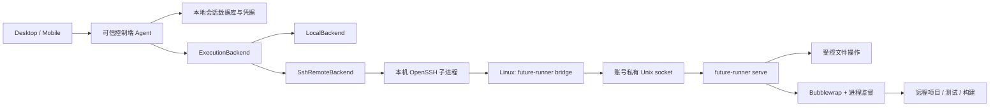
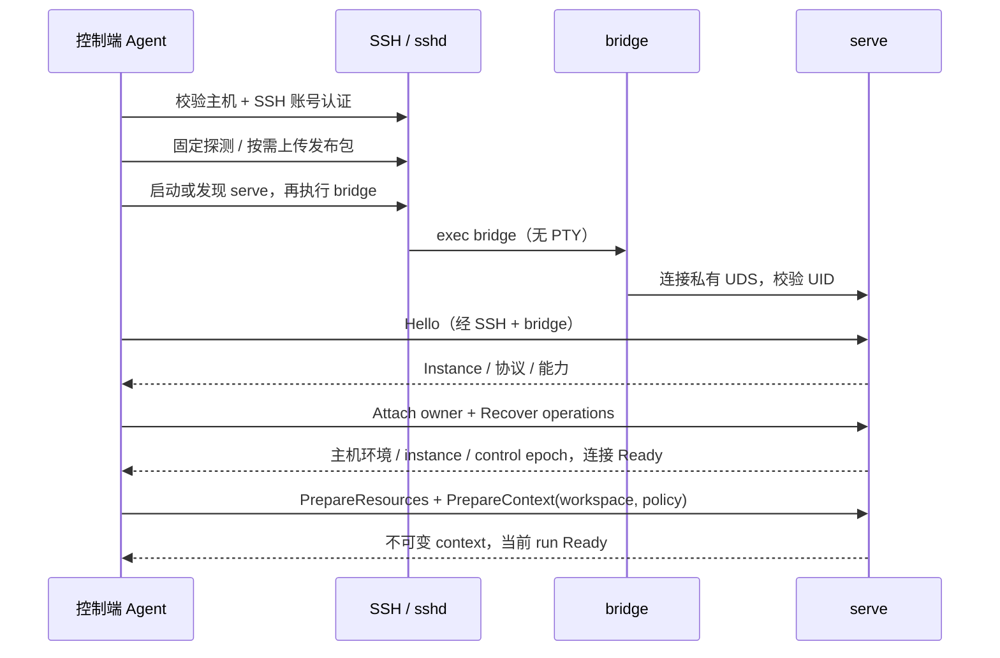

# 远程 Linux 执行能力开发方案

日期：2026-09-20

状态：开发设计草案；本文描述目标实现，不代表现有功能已经实现或经过验证。

一期范围：Windows / macOS 控制端连接普通 Linux 服务器；Linux 控制端沿用相同接口。

下一期：超算、Slurm / PBS、计算节点调度与作业恢复，以及远端开发服务的端口转发，不进入一期实现和验收。端口转发规划见第 17 节。

## 1. 已确认的目标与边界

采用 **可信控制端 Agent + SSH 加密传输 + 远程轻量执行器**。

1. 模型调用、会话数据库、长期凭据、审批和任务编排留在可信控制端。控制端通常为开发者电脑，也可以是用户控制的常在线机器。
2. 远端安装独立 Rust 二进制 `future-runner`，不安装完整 Agent，不引入模型 SDK、SQLite、Node/npm 或 Python 作为执行器依赖。
3. SSH 服务、Linux 内核、基本 shell/系统工具属于服务器基础环境；Bubblewrap 是一期唯一计划要求的额外软件依赖。Python、R、Git、编译器、CUDA 等属于项目或 Skill 的依赖，不计为 FutureOS 执行器依赖，也不由连接流程自动安装。
4. 项目代码、输入、脚本、构建产物和结果在远端存储、执行是预期行为。远端不保存 FutureOS 会话数据库、模型 API Key、用户 SSH 私钥或长期业务凭据。
5. 远端允许保存已验证的执行器文件、Skill 内容缓存、传输中的输入文件、非敏感资源清单和最小运行期锁记录；不把会话记录改名成 JSON 文件落盘。操作去重记录、审批、任务结果、待确认输出默认仅在内存；锁记录不是可恢复的任务日志。一期不新增远端 Shadow/Review 文件历史缓存，远程“上次运行”延期，见第 20 节。Terminal 原始输入/输出不进入 Agent 日志或数据库。
6. SSH 服务器原有的主机密钥和 authorized_keys 属于服务器基础设施。SSH 加密会话的临时密钥存在于相关进程内存，不属于向远端部署用户长期密钥。
7. 沙盒依赖内核与管理员策略；不能承诺在禁止所需内核能力的服务器上无条件提供同等沙盒。必须报告能力并阻止不满足策略的操作。
8. 不承诺任意 shell 命令跨执行器崩溃的 exactly-once；不承诺远端重启后恢复纯内存输出。结果未知时禁止自动重跑有副作用的操作。
9. 控制端离线时，已启动的任务可按事先设置继续；后续模型推理及新工具调用暂停。需要关闭笔记本后继续完整 Agent 循环时，应使用常在线可信控制端。
10. 多用户安全边界是独立 Linux UID。同一账号的其他进程及 root 不在强隔离承诺内；应用内的 workspace 隔离不能替代操作系统账号隔离。
11. 设置中集中管理远程执行主机；创建 workspace 或独立普通对话时选择目标，默认 Local。workspace 创建后目标绑定不可修改，后续会话继承。连接配置更新按稳定 target ID 在下次连接时读取，详见第 15 节。
12. 首次添加主机固定服务器主机公钥身份。编辑 IP/端口等连接信息时，必须在 SSH 握手中验证原主机公钥；不匹配则禁止保存，保留旧配置。一期不允许在原记录上接受新主机公钥，真正换机或轮换该公钥需新增主机记录。
13. 一期采用单占用者模型：同一 Linux 账号、同一个有效远端 `FUTURE_HOME` 共用一把锁，同一时间只运行本地完整 Agent 或一个远程 runner；后者只接受当前占用控制端的执行连接。不同 `FUTURE_HOME` 是独立实例，不做跨根协调。
14. 每次远程主机注册生成唯一且稳定的 `target_id`，同时用作 runner 安装目录 ID，在 `<FUTURE_HOME>/runner/<target_id>/` 下独立保存二进制、Skill 缓存、普通对话目录和临时资源。多个 runner 目录可长期共存，但同一个 home 下不能同时运行。现有 Local 目录和用户项目无需迁移。
15. Agent 与 runner 仅在完整数字版本 `X.Y.Z` 相同时兼容，忽略 `-` 后缀及 `+` 构建元数据。开发版不同构建之间的兼容性由开发过程自行协调和测试，一期不增加额外构建号准入门槛。
16. 一期接入 Desktop Files、Git Review 和远程 Terminal；远程“上次运行”Review 延期，Local 现有功能和历史数据保留。普通对话仍只有 Files/Terminal，不扩展为项目 Review。专项设计见第 19—22 节。Git 是 Git Review 的可选功能前提；没有 Git 不阻止 runner、Files、Terminal 或无需 Git 的 Agent 工具使用。

## 2. 组件与职责



| 组件 | 职责 | 不负责的内容 |
| --- | --- | --- |
| 控制端 Agent | 模型、会话、工具调度、审批、Skill 解析、请求日志 | 不用本机 OS 推断远端环境 |
| SshRemoteBackend | 连接管理、能力协商、资源同步、状态恢复 | 不把普通工具调用变成拼接的 SSH 命令 |
| 本机 OpenSSH | 主机校验、账号认证、加密传输、跳板机 | 不决定工具权限 |
| `future-runner bridge` | 同 UID socket 连接与 stdio 字节转发 | 不拥有任务生命周期，不执行模型工具 |
| `future-runner serve` | 会话绑定、去重、资源授权、文件服务、进程监督 | 不调用模型，不保存会话数据库 |
| 沙盒内进程 | 项目命令、Skill 脚本 | 不得访问控制 socket、审批数据、其他 workspace |

`bridge`、`serve`、安装探测及 Linux 沙盒 helper 是同一个二进制的子命令，避免额外 `socat`、`nc`、`tmux`、`screen` 依赖。serve 的生命周期与某次 SSH 连接解耦。

## 3. SSH：控制端如何连接执行器

### 3.1 选择 stdio 桥接作为跨平台基线

控制端直接创建 OpenSSH 子进程，以二进制管道读写 stdin/stdout：

```text
控制端 Agent
  ↔ 本机 ssh 进程的 stdin/stdout
  ↔ SSH 加密 session channel（不分配 PTY）
  ↔ 远端 future-runner bridge 的 stdin/stdout
  ↔ 私有 Unix socket
  ↔ 独立运行的 future-runner serve
```

Windows 不需要本机 Unix socket，也不依赖本机 shell 转发；macOS 使用同一条路径。协议不要求 SSH TCP 转发权限，不新增公网 TCP 服务，不要求 Windows 支持 ControlMaster。macOS/Linux 的连接复用只能作为可选优化。

使用 ProxyJump 时，跳板机本身仍需允许通往目标的转发；“不要求端口转发”仅指 runner 端点无需 SSH 端口转发。服务器若仅开放 SFTP 或强制不兼容的 restricted command，不能运行本执行器，应在连接阶段明确拒绝。

工具参数通过结构化协议发送。SSH remote command 只包含固定的 bridge/bootstrap 入口和严格校验过的安装标识，不包含模型生成的命令、项目路径、Skill 文本或凭据。

OpenSSH 的远程命令最终会被拼接成命令行；即使本机使用 argv，也不等于远端保留 argv 边界。必须同时处理本机进程参数编码与远端 POSIX shell 引用。[参考：ssh(1)](https://man.openbsd.org/ssh)

### 3.2 首次准备顺序

1. **选择目标。** 用户配置 SSH alias 或 host/port/user、跳板机和认证方式。目标配置由 UI/控制端持有，模型不能任意更换目标或注入 SSH 选项。
2. **检查本机 SSH。** Windows 探测可用 `ssh.exe`，macOS/Linux 探测受信任绝对路径；记录实现和版本。找不到客户端时给出安装提示，不退化成明文协议。Windows OpenSSH 是控制端前提，不是 Linux 远端执行器依赖。[参考：Microsoft OpenSSH](https://learn.microsoft.com/en-us/windows-server/administration/openssh/openssh-overview)
3. **主机身份与账号认证。** 已知主机严格验证；首次主机通过用户确认或组织 SSH CA 建立信任。密码、passphrase、MFA 在本机认证 UI/askpass 流程处理，不经模型工具，不写命令行或日志。后台重连遇到交互认证时进入 `Blocked(Authentication)` 并返回 `AUTH_REQUIRED`，不能无限尝试。
4. **探测服务器。** 使用固定、有限输出的 bootstrap 命令探测 Linux/架构、UID、HOME、可写且可执行的安装位置、基本 shell 和配额。禁止从项目目录查找 bootstrap 工具。非 Linux 一期拒绝连接为执行目标。
5. **上传执行器。** 控制端先验证官方发布包签名/摘要，选择预编译文件。基线经 SSH stdin 写入该 runner 的私有 staging，完整验证后设为可执行；通过同一二进制的安装子命令取得共享锁后原子发布到 bin，已有占用则保留待安装状态。首次安装也不得要求另装锁工具。使用服务器基础 shell/file 工具，不依赖远端 curl、tar、Python、编译器或联网下载；SFTP 仅作可选传输优化。
6. **验证安装。** 不复用不完整文件；检查长度、build ID、协议版本与自检结果。摘要能力由 runner 提供，不要求额外安装 sha256sum。发布签名必须在首次执行前由控制端验证；运行后的自报版本不能替代签名验证。
7. **启动或发现 serve。** 在有效远端 `FUTURE_HOME` 下取得与 Local 共用的占用锁；Local 或其他 runner 正占用时返回 `EXECUTION_HOME_BUSY`，不另起实例。相同 runner 仅经 owner 恢复校验后复用，不能只凭 PID/target ID 接管。serve 自行脱离终端、关闭继承的 SSH 管道/FD，原子创建私有 socket；bridge 保留为前台连接代理。
8. **连接 bridge。** 再开 `ssh -T ... <固定 bridge 入口>`，建立长连接。bridge 校验 socket 的类型/路径/owner，serve 通过 Linux `SO_PEERCRED` 校验对端 UID；两端均避免符号链接替换。
9. **协议握手。** Hello 校验数字版本并协商帧限制、instance_id、功能；随后确认当前实例的 owner，读取真实执行环境及沙盒能力。workspace/run 上下文另行显式准备。
10. **连接恢复与 run 准备。** 原操作状态和输出恢复完成后连接进入 `Ready`；具体 run 再准备所需 Skill、验证根/环境/权限并取得 context，完成该 run 的准备屏障后才能提交新工具操作。

以上完整流程用于首次准备或确定执行器缺失/损坏的场景；普通建连与断线恢复走第 3.5 节快路径，不无条件重复安装。

首次连接图：



### 3.3 SSH 配置与实现约束

推荐由产品强制：SSH bridge 不分配 PTY、不转发 SSH agent、不启用 X11、不委派 GSSAPI 凭据、不继承无关端口转发；严格执行目标主机验证。Terminal 的 PTY 在 runner 内创建，SSH 仍使用 `-T` 传二进制帧，不与此规则冲突。保持 stdin 可用，不能使用会占用/关闭协议 stdin 的后台选项。ProxyJump 保留，并校验每一跳的身份与配置。

`ServerAliveInterval` / `ServerAliveCountMax` 用于连接存活检测；不代表任务超时或退出。ControlMaster 如启用，必须由本产品隔离管理，避免复用未知配置的 master 绕过安全选项。批量数据通道若需要独立 TCP，必须禁用该通道的 master 复用。[参考：ssh_config(5)](https://man.openbsd.org/ssh_config)

其他要求：

- 本机通过 Rust 进程 API 启动 SSH，不能经 PowerShell、cmd、bash 或 zsh 再解释；Windows 参数编码按 CreateProcess 边界测试。
- alias、host、user、port 做结构校验，拒绝选项注入；用户可信 SSH config 中的 ProxyCommand/Match exec 是用户本机配置能力，不能由远端文件或模型构造。
- bootstrap 动态标识只允许受控字符集；其他远端 shell 参数使用经过测试的 POSIX 引用。正常调用的命令正文只在 RPC payload 中出现。
- 初始 bootstrap 与正式协议是两个阶段。正式 stdout 只承载协议帧；stderr 用于有界诊断，不能混入 stdout。shell rc/banner 污染只允许在有长度和时间上限的握手前识别；进入协议后禁止忽略杂乱字节。
- Windows 和 macOS 管道均传原始字节，不经过文本换行转换。命令输出按字节流处理，文本解码在 UI/模型适配层完成。
- SSH 只负责加密到认证过的远端主机；root/同 UID 被攻陷不属于该加密协议可解决的问题。无需在 SSH 内再次部署一套长期 TLS 私钥。
- 服务器策略若在登出时清理整个账号进程组，serve 无法仅靠忽略 SIGHUP 保活。上线前探测/验证这一边界；不支持则明确显示不具备断线持续运行能力，不能要求用户安装 systemd 服务来掩盖问题。

### 3.4 版本与启动失败

上传中断只留下对应 runner 的私有 partial 文件，不能成为可启动版本；重新连接后核对并续传或清理。磁盘满、配额、HOME 为只读/noexec、架构不符、二进制加载失败返回不同错误。

一期兼容判定使用实际运行 Agent 与 runner 的 `FUTURE_VERSION`，取完整数字核心 `X.Y.Z` 严格相等；去掉 `-` 后缀和 `+` 构建元数据。不是只比较 major，也不接受任意更高版本。不能使用 Cargo/package 中的占位版本代替运行版本；无效或缺失版本返回明确错误。

| Agent | runner | 版本准入 |
| --- | --- | --- |
| `1.2.3-abc+dev` | `1.2.3-def+local` | 通过 |
| `1.2.3` | `1.2.3-test` | 通过 |
| `1.2.3` | `1.2.4` / `1.3.0` / `2.0.0` | 拒绝 |
| `0.0.2-a+dev` | `0.0.2-b+dev` | 通过；开发者协调并测试实际兼容性 |

版本规则可参考现有 [版本脚本](../scripts/version.mjs) 的数字核心提取逻辑，运行版本注入见 [agent/build.rs](../agent/build.rs)。开发版保留上述规则，不另加“每次协议修改必须升数字版本”、提交 hash 一致或开发构建兼容矩阵要求；开发期间允许通过新旧构建联调发现不匹配。版本准入通过后仍需正常握手、能力检查和有界协议错误处理，不能把不认识的消息当作成功。

数字版本不一致返回 `RUNNER_VERSION_MISMATCH`，阻止新执行；控制端提供匹配版本的 runner 包。更新仅影响对应 `target_id` 的二进制，保留其 Skill 缓存和普通对话目录。发布替换也要取得同一 home 锁并保持到安装完成，避免检查空闲后与 Local/serve 启动竞争；不覆盖运行文件，不为升级启动第二个 serve。已有任务先由原实例完成或明确取消，释放占用后再更新。

### 3.5 首次准备与日常连接分开

| 场景 | 路径 |
| --- | --- |
| 首次准备、执行器明确缺失 | SSH 身份/账号校验 → 最小环境探测 → 获取匹配包 → 上传安装 → 启动 → 完整能力验证 |
| 已有匹配二进制，serve 未运行 | 校验身份与固定 home → 取得共享锁并检查残留工作负载 → 启动 → attach 和必要能力验证 |
| 已有 runner 或断线恢复 | 校验 SSH 身份 → 发现固定端点 → Hello/owner 恢复 → 查询原操作/补流 → 连接 Ready；各 run 另行核对上下文/资源 |
| 数字版本不匹配 | 阻止新执行 → 原任务完成或明确取消 → 释放占用 → 更新对应 runner → 重新连接 |
| 端点不可达、身份/权限检查失败 | 返回分类错误；不能仅凭连接失败推断需要重装或清理 |

控制端按完整发布构建标识、远端 OS/架构及发布摘要缓存已验证包，首次缺包时在控制端下载，远端不依赖联网。包缓存标识用于选择和完整性校验，不增加“开发版构建 hash 必须一致”的准入条件；兼容仍按第 3.4 节数字核心判定。VS Code 同样支持本地下载后上传，作为部署路径参考：[Remote SSH 安装与联网说明](https://code.visualstudio.com/docs/remote/ssh#what-are-the-connectivity-requirements-for-the-vs-code-server-when-it-is-running-on-a-remote-machine--vm)。

日常重连复用安装和固定 Skill 快照，不重复上传二进制、不全量扫描或上传所有 Skill。身份、UID、home、runner 实例、owner、workspace 根与必要沙盒检查不能跳过。环境/策略/实例变化使相关探测缓存失效；按需核对本 run 所需资源，不能把“快路径”等同于直接使用旧授权。

### 3.6 主机级连接管理

可信控制端按 `target_id` 维护唯一 `RemoteConnection`，拥有 runner/owner、连接代数、重连任务和该目标下的 workspace 使用引用。多个 workspace、普通对话和 UI 窗口共用它；不能分别启动 runner 或各自循环重连。同一目标的并发连接请求合并为一次在途连接尝试。

- workspace 创建/目录浏览/实际执行取得使用引用；只读设置探测、历史查看不取得长期执行占用。
- 关闭一个 workspace 只释放其引用，不断开其他 workspace。后台 run、受管进程和传输各自持有引用，关闭窗口不等于任务结束。
- 最后一个使用引用结束且没有后台工作时，管理器先收取并持久化可用结果，再请求释放 owner、退出 serve；不能留一个无消费者的空连接永久占用。
- 网络断开不当作引用释放，runner 依据第 9/16 节处理任务和有限恢复宽限期；到期退出后不因界面仍开着就盲目重放旧操作。
- 一个 owner 可使用 control/bulk/恢复等多条 SSH 连接，统一归管理器协调；bulk 连接不能单独维持已断开的 control owner 占用，也不能产生新的控制通道所有者。
- 每条新传输使用最新配置 revision；旧连接可完成已有工作，替换 control 通道必须由同一管理器原子更新的控制通道所有者，不能因配置编辑派生第二个 owner。

端点发现和配置更新遵守第 4.2、15.5 节。主机级管理只管理同一控制端的连接，不引入多控制端调度服务。

## 4. 账号、workspace、Skill 与运行资源隔离

### 4.1 身份模型与唯一权威

| 标识/事实 | 生命周期、权威与用途 |
| --- | --- |
| `target_id` | 控制端持久化 UUID；一条远程注册对应一个 runner 资源目录，二者共用此 ID；IP/密码/升级不改变它 |
| `config_revision` | 控制端配置更新时递增；使旧验证结果和过期连接尝试失效，不属于操作语义 |
| `pinned_host_key` | 首次固定的服务器公钥；SHA256 指纹从该公钥派生，显示缓存不得独立覆盖公钥 |
| `remote_home_identity` | 首次准备后固定的远端有效根及目录身份；与 SSH 账号一起确定占用域 |
| `instance_id` | Local 执行进程/远端 serve 每次启动产生；远端释放占用即退出，因此它同时标识本次占用期 |
| `workspace_id` / `root_identity` | 逻辑工作区及执行所在地核对的根身份；根被替换时失效上下文，不另外维护 workspace generation |
| `context_id` | 执行后端为一个已验证、不可变的执行快照创建，绑定 target/instance/workspace/根、环境、权限和 Skill；不是认证秘密 |
| `connection_generation` | 控制端内部计数，丢弃旧异步连接尝试与迟到响应；不发给模型，不作为审批字段 |
| `control_epoch` | runner 分配的当前有效控制通道代数；原子替换旧连接，防止旧通道继续提交请求 |
| `admission_epoch` | 每个 runner 实例一条接收批次序列；与网络重连无关，限定去重完整范围 |
| `operation_id` / `request_hash` | 控制端先持久化；跨网络重试不变，执行端检查同 ID 同内容 |
| `skill_set_hash` / `bundle_hash` | 内容身份而非递增版本；分别表示 run 的 Skill 快照集合与单个 bundle |

一期不再单独生成 runner 安装 ID、owner session ID 或 controller 身份映射。占用恢复仍需独立随机恢复凭据；合并 ID 不减少认证检查。SSH UID 是账号边界，target/instance/context ID 和 socket 名称均不是秘密。

传输验证事实只由可信连接层持有，不建立供业务传递的 transport identity ID/引用。`ExecutionContext` 不包含网络连接身份；审批和重试语义见第 7/8 节。执行端从当前认证通道验证 owner/control epoch，再查自己保存的 context，不能接受模型或请求方自报 context 内容作为授权。

重连仍核对固定公钥、UID、home、instance 和 workspace 根。服务器公钥、账号及 home 按第 18.1/18.2 节分别组合，不能因结构收敛省略验证。

### 4.2 远端资源布局

```text
<FUTURE_HOME>/                            # 远端有效根，默认 ~/.future
  agent/
    agent-instance.lock                   # Local / 所有 runner 共用；不能放在 target_id 内
    execution-owner.json                  # 固定位置的最小占用/异常恢复提示，无秘密
  runner/
    <target_id>/                          # 0700；每次主机注册一份持久目录
      bin/future-runner                   # 验证后发布的当前二进制
      skills/<bundle-hash>/               # 完整不可变 Skill 快照，只读绑定
      workspaces/chat/<chat-dir-id>/      # 沿用 thread/session 命名规则；用户产物不按缓存删除
      staging/<transfer-id>/              # 上传半成品与非敏感恢复清单
      inputs/<content-id>/                # 已完成输入，授权时再绑定 workspace
      tmp/<workspace-id>/<operation-id>/  # 独立工具临时目录

<private-runtime-root>/<home-tag>/        # 本机文件系统、0700、同 UID
  <target_id>/serve.sock                  # 0600；仅当前运行 runner 有活跃端点

<user-selected-project-root>/            # 沿用现有项目目录，不搬迁或自动删除
```

目录层级按资源种类保留；不再增加 controller 目录、按协议版本的运行树或逐项目租约目录。`home-tag` 仅帮助缩短 runtime 路径，需核对完整 remote home 身份，不能以 hash 相同判为同根。socket 优先放入通过 owner/mode 检查的 `$XDG_RUNTIME_DIR`，不可用时使用服务器本机临时文件系统私有短路径；不把 socket 放到不支持它的 NFS，也不退到公共 TCP。

发现入口固定为 `<FUTURE_HOME>/agent/execution-owner.json`，Local、不同 SSH 登录和所有 runner 都从这里读取，不能各按自己的 XDG/tmp 环境推导另一份占用记录。记录仅含 home/UID、owner 类型、runner/启动实例、实际 socket 路径、监督作用域标识及状态，不含恢复凭据、命令或结果。持锁者原子更新记录；记录用于发现和异常检查，不能替代系统锁或活实例握手。socket 路径只是候选，需独立校验真实路径、owner/mode、UID 和实例；不存在/过期时核对残留工作负载后才允许重建。

runner 复用锁文件不等于初始化完整 Agent；只创建必需的锁父目录，不创建 Agent 数据库、模型配置或凭据。Local 继续使用原有目录，远程 Skill 和 chat 不写入 Local 原始 Skill/chat 根。对应代码和迁移边界见第 12、16 节。

安装发布、停机清理和 serve 启动均遵守共享锁；下载到控制端和只读连接探测不占用远端执行权。活动 runner 内的资源上传/GC 由已持锁的 serve 管理，不再次竞争自身锁，也不允许外部清理进程绕过它。锁实现须与现有 Local 的 `fd_lock` 使用兼容的系统锁原语，不能仅用同名文件却采用互不相通的锁。HOME 所在文件系统不能提供可靠共享锁时明确拒绝该部署，不各自另选锁绕过互斥。

runtime 记录不包含凭据。发现端点必须验证 owner、mode、非 symlink、真实 socket 与握手；清理 stale socket 前取得共享锁并检查残留进程，不能删除活动端点或 unlink/recreate 活跃锁文件。路径解析使用 no-follow、目录 FD 与原子 rename 防止替换。

### 4.3 隔离规则

- 每个 SSH 账号独立安装/runtime 根和权限；同账号不同 FUTURE_HOME 独立管理。同根多个 runner 有独立资源和配额，共用一把占用锁。
- serve 只接受当前 owner；按 runner/workspace/操作绑定句柄，禁止请求自由指定另一 runner 或 workspace 的内部路径。
- 占用锁覆盖整个 Local Agent/runner 生命周期与仍存活的受管工作负载；control epoch 只用于拒绝旧连接发来的新命令，不替代进程生命周期管理。
- 不再做跨控制端逐项目调度；同根其他控制端和 Local 即使选择不同项目也返回占用。同一控制端内部仍可按现有调度执行多个项目。不同 home、外部 shell/编辑器和不遵守锁的旧程序不由该锁协调，保留文件版本冲突检查。
- 文件工具和 shell 同样受权限策略约束。默认只允许工作区、已绑定 Skill/input、该操作临时目录以及必要系统运行时资源；不能通过 read/list/search 绕过 shell 沙盒读取控制资源。
- 沙盒内屏蔽 runtime、控制 socket、安装根、其他 workspace 资源、账号凭据目录；仅把当前 Skill/input 视图显式只读挂载。不得把父目录全部可见后仅依赖 chmod。
- 不继承控制连接、日志或审批 FD；隔离 `/proc`/进程可见性，防止从 FD 或其他进程重新取得控制通道。沙盒能力验收需包含这些路径。
- Skill 内容对象不直接给工具写入；工作区视图通过只读挂载呈现。需要写出的 Skill 应使用项目输出目录或 operation tmp。
- 所有工具子进程使用受控环境变量表。禁止透传控制端环境、认证 token、SSH agent socket、runner 内部标识；`PATH`、HOME、locale 等来自明确的远端执行配置。
- 禁止越权操作安装/控制资源是 runner 硬边界。明确批准的无沙盒命令拥有该 Unix 账号权限，不能继续声称拥有这些隔离保证；UI 必须清楚显示。

### 4.4 资源生命周期与日志

内容缓存按账号/runner 配额管理，活动 run 引用的 bundle 不得回收。传输 staging 设大小、数量和过期时间；清理只处理执行器自行创建的资源，不递归清理用户项目。

并发进程数、打开文件数、输出缓存、传输流数和工具运行时限均设置上限。需要系统级 CPU/内存硬配额时接入管理员已提供的 cgroup/账号限制；仅有文件沙盒不等于具备共享服务器的完整资源防耗尽能力。用户项目本身的磁盘使用以服务器配额为准，执行器不能声称只靠自身 staging 配额就限制了全部项目写入。

远端默认不记录命令正文、环境值、工具输出和会话文本到诊断日志；serve 的无连接诊断使用有界内存缓存。显式导出的诊断必须脱敏并由用户发起。关闭执行器 core dump；无法控制的系统审计、交换空间或管理员观察不属于“远端无任何痕迹”的承诺。

## 5. ExecutionBackend 与跨平台执行上下文

### 5.1 三种环境必须分开

| 环境 | 例子 | 用途 |
| --- | --- | --- |
| `ControllerEnvironment` | Windows 11 / macOS，控制端本地路径 | 启动 SSH、凭据、附件源文件、UI |
| `ExecutionEnvironment` | Linux aarch64，bash 5.x，POSIX 路径 | 模型 shell 指令、远端工具、项目与沙盒 |
| `ToolExecutionSite` | `workspace_backend` / `controller_service` | 决定每个工具在哪里运行 |

远程会话的 shell/read/write/edit/search/Git/项目上下文必须走 workspace backend。模型服务、带凭据的连接器等控制端服务可保留本地。工具注册必须声明 `ToolExecutionSite`，缺失声明的工具不得进入远程会话的可用工具集；调度器按注册信息及固定 ExecutionContext 强制路由，不由模型指定或改写执行位置。远端失败不能回退本地执行。

文件打开、附件上传、产物下载和浏览器入口使用带 target/workspace 身份的资源引用，分别交给受控资源服务或控制端 UI，不能将远端绝对路径交给本机文件 API。普通网页可以按工具声明在控制端打开；远端返回的 `localhost`/回环 URL 不能直接当作本机 URL 打开。本期不实现端口转发，也不承诺通过本地浏览器访问仅监听远端回环地址的测试服务，需明确显示能力限制；下一期规划见第 17 节。

VS Code 对 UI/工作区扩展及浏览器执行位置的划分可作为参考：[扩展执行位置与 API 路由](https://code.visualstudio.com/api/advanced-topics/remote-extensions)。本项目只落实工具注册与调度约束，不引入完整远程扩展宿主。

一期每个 workspace（含普通对话的独立 workspace）在创建时绑定唯一目标，创建后不允许 Local/Remote 或不同远程主机之间改绑；所有后续会话继承该目标。需要另一目标时新建 workspace/普通对话。连接配置更新和重连仍属于原目标，需要核对身份并重建必要的环境、资源和授权；不能把递增上下文版本作为绕过不可改绑规则的方式。

### 5.2 持久配置、连接和执行上下文分层

| 对象 | 作用域与内容 | 不应包含 |
| --- | --- | --- |
| 目标/Workspace/Thread 记录 | 控制端持久配置，目标绑定和目录信息 | socket、恢复凭据、在途连接代数、当前 run 权限 |
| `RemoteConnection` | 每 target 一个；安装、连接、owner 恢复凭据、实例、连接状态和使用引用 | 可被不同 workspace 覆盖的“当前 cwd”或“当前 Skill 集” |
| `ExecutionEnvironment` | 实际执行环境的描述值；由执行所在地探测 | SSH 凭据、连接引用、workspace 根及工具请求 |
| `ExecutionContext` | 单个 run 准备完成后的不可变快照，可被该 run 的多个操作引用 | SSH 连接代数、传输认证引用和动态目标切换 |
| `Operation` | 某个 context 下的一次文件修改/进程执行等操作 | 重试时重建的新 ID 或另一实例上的隐式重跑 |

此处 ExecutionContext/Operation 描述 Agent run 工具。第 19 节面板读取、第 21 节用户 Terminal 采用显式授权的独立作用域，共用目标/根/实例事实，不填充虚假 Skill 或借用 run 权限。

已确认的公共语义结构如下；目标与平台特有信息采用组合和互斥枚举，执行行为用公共 trait，具体组织见第 18.1 节：

```rust
struct ExecutionContext {
    context_id: ContextId,
    target_id: TargetId,
    instance_id: InstanceId,
    workspace_id: WorkspaceId,
    workspace_root: ExecutionPath,
    root_identity: RootIdentity,
    environment: ExecutionEnvironment,
    policy: PolicySnapshot,
    skill_set_hash: ContentHash,
}
```

context 由后端完成根、环境、策略及资源快照验证后创建，绑定当前执行实例；完整内容在执行端登记，控制端持有回执和可展示副本。`context_id` 不能跨实例使用，也不能以同 ID 替换内容。它不是一种新的会话数据库：远端仅内存保存，控制端在已有 run/操作记录中持久化恢复所需事实。

根、权限、环境或固定 Skill 集变化时失效相应 context 并重新准备，不靠可变字段覆盖旧 context；已有操作保留原上下文用于查询和结算。网络重连本身不改变 context，重新验证后可继续引用。运行期环境事实若被外部更改仍需探测并报告过期，快照不保证外部工具永远不变。

`ExecutionEnvironment` 的公共事实是 OS、架构、实际 shell、路径语义、HOME、locale、时区和可执行/沙盒能力。原来将 Linux `uid` 强制放入公共结构的示意不再作为实施合同；Local/SSH 身份扩展与系统特有字段使用第 18.1 节的组合规则。workspace_root 属于 context，不能放进主机级环境描述。

环境在实际执行配置中探测，不读控制端 OS 或单凭远端 `$SHELL`。不默认加载交互登录脚本；用户绑定的项目初始化脚本进入上下文准备及环境校验。Python/Git 等按需探测，不存在就明确报告，不改用控制端程序。模型只收到所需环境/路径/策略说明，不收到内部 context 身份、恢复凭据或所有环境变量。

### 5.3 公共执行接口与 SSH 内部协议分开

公共接口表达执行端能力，Backend 可在主机级共享，但所有 workspace 操作必须显式引用经过验证的作用域，不允许可变的全局当前 workspace。下例是 Agent run 的工具接口；无 run 的 Files/Review 读取与 Terminal 创建分别按第 19、21 节的窄权限入口接入，不伪造 run context：

```rust
trait ExecutionBackend {
    async fn describe(&self) -> ExecutionEnvironment;
    async fn prepare_context(&self, req: ContextSpec) -> ExecutionContext;
    async fn prepare_resources(&self, req: ResourceSpec) -> ResourceBinding;
    async fn read_batch(&self, ctx: ContextId, req: ReadBatch) -> ReadBatchResult;
    async fn search(&self, ctx: ContextId, req: SearchRequest) -> SearchResult;
    async fn mutate_file(&self, ctx: ContextId, req: FileMutation) -> OperationHandle;
    async fn start_process(&self, ctx: ContextId, req: ProcessSpec) -> OperationHandle;
    async fn query_operations(&self, req: OperationQuery) -> OperationStates;
    async fn cancel(&self, req: CancelOperation) -> CancelReceipt;
}
```

示意省略 Result、deadline/取消参数和事件流具体签名。`describe` 给基础环境；`prepare_context` 根据显式 workspace 与执行配置探测该 run 的实际环境。ResourceSpec 带目标/workspace、冻结的内容快照及固定 Skill 集身份；准备返回只读内容绑定，context 只接纳当前 run 允许的资源。按需传输后来完成的 bundle 可以兑现原快照中的引用，不能借资源准备悄悄改变快照版本。

`OperationHandle` 提供统一的状态/输出事件语义；Local 直接接本地执行/事件实现，SSH 适配器映射 runner 事件。具体事件流 API 需 review，不能为了隐藏传输而丢掉输出缺口、终态和取消确认。

SSH 内部由 runner client 管理 Hello/attach、control epoch、admission epoch、帧、分块上传/finalize、恢复游标和 DurableAck。LocalBackend 不实现模拟上传或网络 ACK。高层 `prepare_resources` 在 Local 准备本地固定只读快照，在 SSH 通过分块协议准备同一语义资源。控制端事件存储提交成功后通知 SSH 内部确认，不能在工具适配器刚收到事件时提前 ACK。

审批由控制端判断；执行端验证当前连接资格、context 与操作授权。占用在 Local/serve 启动时取得，无逐目录租约接口。文件/read/search 和 shell 共同经过 backend；runner 自身实现基础目录、读取、搜索与 hash，不隐含依赖 rg/find/Python。

`ProcessSpec` 用 shell script 或 executable+argv 二选一，包含执行所在地 cwd、受控环境增量、运行时限、输出/断线策略及授权引用；具体命令摘要以规范化请求计算。Windows 控制端不套 PowerShell；平台分支只出现在实际执行所在地的实现内。

**实现与后续 review 必查的顾虑：**

- [ ] 抽象后 Local 是否被迫模拟 SSH 握手、分块、ACK 或远程恢复，导致额外延迟/状态？不接受这种实现。
- [ ] 抽象是否遮蔽远程的 ACCEPTED、UNKNOWN、OutputGap 和真实取消确认？公共结果必须可表达，不能统一成模糊成功/失败。
- [ ] DurableAck 是否仍发生在控制端实际持久化之后？传输下沉不能改变提交顺序。
- [ ] 主机共享对象是否含可变 cwd、policy 或 Skill 集，导致并发 run 串用？这些事实必须属于不可变 context。
- [ ] resource/context 准备失败、重连、释放是否正确回收引用，且不提前 GC 活跃 bundle？
- [ ] Local 现有沙盒/审批/中断语义是否保留，runner 是否意外链接完整 Agent？
- [ ] 是否为每个概念都增加 trait/crate？先用内部模块和具体类型；只在真实依赖边界需要时拆包。

这些是实施验收问题，不代表已完成验证。Local/SSH 类型组织和现有 ScopeOptions 的适配边界见第 18 节；具体签名/迁移仍需实施 review。

### 5.4 路径、文件与冲突

- 本地源文件使用 `LocalPath`；远端路径使用带 target/workspace 身份的 `RemotePath`。Windows 上禁止用 `std::path::Path` 将远端 `/home/alice/repo` canonicalize/join 成本机路径。
- 远端相对路径、`~`、symlink、大小写和根身份由 runner 解析。路径授权不能依赖字符串前缀；需防止 `..`、symlink 和检查后替换逃逸。
- 一期协议的模型可见路径要求可表达为 UTF-8；遇到不可表示的文件名返回明确的能力限制，不能 lossy 转换后操作另一个文件。文件内容及进程输出仍是字节。
- 读取结果带版本标识；编辑/覆盖带 expected version，在远端检查后原子替换。版本不符报冲突，不能静默覆盖其他人的修改。原子性保证限定在本机支持的文件系统操作内，不宣称可锁住任意外部写入者。
- Git 状态、diff、项目说明、FUTURE.md 等来自所绑定的远端工作区；不可误读控制端当前仓库。把这些读取从现有直接文件系统访问迁移到 backend。
- 跨平台传输保持原始字节与换行；下载到大小写不敏感的本地文件系统前检查名称冲突。模型输出中每个文件链接携带 target 身份，由 UI 路由为远程文件，不伪装成本地可打开路径。

### 5.5 模型提示词与工具说明

环境提示、shell 工具描述、路径规则、沙盒说明和 Skill 的 location 都必须由同一份 ExecutionContext 生成，不能一部分读远端、一部分读本机常量。

Windows 桌面连接 Linux 时，模型得到的示例：

```text
执行目标：build-linux（远程 Linux，x86_64）
工作目录：/home/alice/project
shell：/bin/bash，5.2，非交互 bash -c
路径语义：POSIX，区分大小写
shell/read/write/edit/search 在该远程工作区执行。
控制端 Windows 仅承载界面和服务工具，不决定上述工具语法。
Skills：下列 location 均为当前执行目标绑定的只读路径。
```

本例只是格式示意，实际值必须来自远端探测。无环境确认时不允许启动新的模型工具执行；断网恢复期间可以显示旧信息，但必须标记未验证，不能沿用旧审批继续写入。

能力/环境版本改变时重建下一轮模型上下文；对已生成的旧工具调用返回 `CONTEXT_STALE`，不要自动重写命令后执行。结果、审批 UI 和日志均附 target、workspace、实际 sandbox receipt，避免“界面显示 Linux、实际却跑本地”的错位。

### 5.6 已确认的结构收敛

已确认：去掉独立 runner/owner/controller 身份映射、workspace generation 和跨层传输引用；统一 instance_id、config_revision、control_epoch、skill_set_hash；保持去重批次和上下文失效检查。context 引用收敛的是重复字段，不是移除对应验证。

已确认采用组合，沿用现有 Skill 名称发现、Workspace.path、user/temporary 类型与普通对话 thread/session 路径习惯。Thread 不复制可编辑连接配置；SSH 身份分主机公钥、账号、home 三组。第 18 节细化 Agent 会话/执行入口优化与迁移边界，具体代码和 schema 在实施时 review，不再保留继承/全新路径命名等备选架构。

## 6. Skill 同步协议

### 6.1 权威来源与执行位置

Skill 注册、发现优先级、用户启用状态和原始内容以控制端为权威；一期保持现有全局 Skill 来源与优先级，不顺便引入项目级 Skill 发现。远端缓存不能自行注册新 Skill 或覆盖控制端定义。

不是每个 Skill 都需要远端脚本：

| 类型 | 处理方式 |
| --- | --- |
| 纯指令/参考资料 | 控制端读取；如按现有 read 工具访问 location，则绑定远端只读快照 |
| 远程项目脚本型 | 传输所选 Skill 的文件快照，在 workspace backend 内运行 |
| 控制端服务型 | 原有具凭据工具在控制端执行，输出按需要传给远端；不传 token |
| 混合型 | 工具执行位置显式标识，输入/产物通过资源句柄交接 |
| 平台不兼容或依赖缺失 | 标记 unavailable/needs_dependency，说明具体原因，不回退本地执行 |

原始 SKILL.md 不是认证数据，不能命令系统上传凭据、任意本地目录或创建新的本地执行后端。带绝对本机路径的 Skill 应标记不可移植；不能全局字符串替换它的正文来假装已经兼容远端。

### 6.2 内容快照与 Manifest

每个 Skill 生成不可变 bundle，逻辑结构：

```text
SkillBundleManifest
  skill_name                # 沿用现有 Skill.name，只在本 run 冻结发现结果内解析
  manifest_schema_version
  entrypoint = "SKILL.md"
  entries[]
    relative_path
    byte_length
    sha256
    executable              # 可执行标记，不能继承任意源 mode
  compatibility             # 平台/解释器等，可为 unknown
  bundle_hash               # 对规范化 manifest 内容计算，排除该字段自身
```

hash 必须涵盖文件名、内容摘要、长度、可执行标记和入口；不能只使用 Skill 名称、mtime 或人类版本号。清单排序、编码和 hash 规则在协议中固定。

默认快照范围是被选中的整个 Skill 根目录，以保留 scripts/references/assets 等相对引用；同步前列出文件范围和总大小。忽略规则只覆盖明确的工具垃圾/缓存及用户排除项，不能因文件较大就静默漏掉依赖。凭据、私钥、`.env` 等可疑文件触发阻止和明确的文件范围处理，不能只依赖文件名启发式宣称无秘密。

一期不跟随 symlink，不接受绝对路径、`..` 越界、设备、FIFO、socket 和特殊 mode；遇到这些项给出不兼容诊断，而不是默默略过。对 symlink 安全引用的扩展另行设计。硬链接按独立普通文件内容快照，不继承外部 inode 关系。runner 接收端独立校验全部路径和类型，不能信任控制端清单。

Windows 上没有 Unix executable 位时，使用明确的脚本入口/发布元数据推导需求；不能给所有文件统一 chmod +x。保留原始文件字节，检测 CRLF shebang 等 Linux 不兼容问题并报告。必要的文本转换应是显式生成的派生 bundle，计入新的 hash，不能修改原始 Skill 或悄悄转换传输内容。

### 6.3 同步时机与流程

会话先使用控制端已有的 Skill 名称/描述目录。对于用户显式选用的 Skill，在该 run 开始前准备；对于模型运行中发现的 Skill，在首次读取其内容或调用资源时经过资源准备屏障。模型不能拿到一个尚未完成绑定的远端脚本路径就开始执行。

一期增加受限的 `resolve_skill(skill_name)` 控制端资源入口（名称待实现确定），只接受当前 run 冻结目录内有效的选择键，不接受任意本地路径。它完成下面的同步和绑定后，返回 SKILL.md 内容、bundle hash、远端 location 与依赖状态；已有显式选用 Skill 的流程内部调用相同入口。未准备的目录项展示 Skill 名称和该入口，不展示虚假的本地或远端文件路径。

为兼容现有通过通用 read 读取 Skill 的行为，一期默认在 resolve 时同步所选 Skill 的完整快照，包括纯指令 Skill；确定为纯控制端服务且不暴露远端资源的 Skill 才走明确的控制端读取路径。不要让调用方在两种读取方式之间自行猜测。

run 开始时固定可用 Skill 目录的 manifest 和控制端不可变内容快照，得到 `skill_set_hash`；按需仅延迟网络传输，不延迟版本选择。本地内容寻址缓存可以避免重复复制。run 中发现的新 Skill/新内容进入下一 run，不能让同一 revision 在稍后 resolve 时指向已被修改的源文件。

```text
DiscoverLocal → Snapshot → CheckCompatibility → Prepare(manifest)
  → MissingObjects → UploadChunks → Verify → PublishAtomically
  → BindToWorkspace → ReturnRemoteLocation → Usable
```

1. 控制端先生成一致快照并计算摘要。源目录在快照期间变化则重新取快照；上传只读快照，不边读变化中的源文件边发布。
2. runner 返回已有且验证通过的对象，以及缺失文件/分块。缓存命中必须与完整 bundle hash 一致。
3. 上传到私有 staging；帧含 transfer ID、文件 ID、offset/index、长度、chunk hash。同一位置重复上传相同内容可确认，不同内容返回冲突。
4. 所有 chunk 到齐后，校验每个文件长度/hash、路径安全、总配额和完整清单。
5. 原子发布完整对象；半成品始终不可作为 Skill 使用。无需 tar/unzip，直接用结构化文件条目和字节块落盘。
6. 为 target/workspace 绑定只读视图，并返回该视图中的绝对 Linux location；后续 read/shell 看到相同路径。
7. runner 返回 resource binding receipt；控制端持久化 bundle hash、目标和绑定，再把 location 注入模型可见的 Skill 目录。

纯指令 Skill 也必须有明确的读取路径：可以由控制端专门的 Skill 读取接口返回内容；若继续复用通用 read 工具，就先同步并返回远端 location。不能把 Windows 的源 Skill 路径交给 Linux 的 read。

### 6.4 版本固定、断线与清理

原始 Skill.location 保持控制端源路径，不修改全局缓存对象；资源绑定另外返回 target/context 下的执行 location，Local 与远程 run 各自使用自己的投影。

每次建连/新 run 都核对所需 Skill manifest 与绑定；“每次同步”不等于每次全量上传。同一 runner 的 hash 缓存命中时只校验并重新绑定，变化内容才上传。不同 runner 各有缓存，即使 hash 一致也不跨 runner 共享对象或 GC 引用计数，以少量重复存储换取简单的隔离与清理。

- 一个 run 固定 `skill_set_hash` 和实际使用的 bundle hashes；控制端中途编辑 Skill 不改变正在执行的文件。新版本进入下一 run；明确要求切换时先终止旧上下文的新操作接收，再创建新 context，不能原地修改同一 context。
- 同一 workspace 可保留多个内容版本，运行引用计数大于零时不得 GC。只读视图直接对应固定 bundle，不用可变的 `latest` 链接。
- 断线后查询 transfer 已确认范围，继续缺失部分。runner 重启后，既有完整对象可重新校验复用；partial 文件必须重新验证，不能从其存在推断上传完成或授权仍有效。
- `ChunkReceipt` 区分内存接收与落盘确认。一期上传 ACK 应在数据及必要恢复元数据落盘后发出；否则必须明确标记为 volatile，并允许重启后补传已 ACK 数据。
- 传输恢复元数据仅含文件标识、hash、范围和非敏感归属，不含命令、会话或审批。重启后旧绑定/授权失效，重新绑定才可执行。
- 源 Skill 删除不立即破坏已固定的 run；当前引用结束后按 TTL 和配额清理。手动清理不能删除正在运行的资源。
- Skill 需要写文件时写入项目/operation tmp；把只读安装目录当输出目录属于兼容性错误。
- Skill 创建/更新仍是控制端资产管理操作。远程项目工具不能因为默认 Skill 提示就写入远端账号的 `~/.agents/skills`；需通过显式控制端 Skill 管理入口保存，再生成新快照同步。

### 6.5 兼容性判断

现有 Skill 不强制新增一套 metadata 才能使用。优先利用已有信息与可识别的入口，缺少信息时标为 unknown，通过受控探测和运行错误报告补充。不能仅靠静态扫描或模型判断保证任意脚本可移植。

缺少 Python/R/工具链时返回 `SKILL_DEPENDENCY_MISSING`，列出需求、远端探测结果和目标；用户可使用服务器已有虚拟环境或明确安装项目依赖。FutureOS 不把这类依赖混入 runner 的安装链。

## 7. 沙盒与审批契约

### 7.1 一期沙盒依赖

沿用 Linux Bubblewrap 后端的安全语义。当前代码要求 `bwrap >= 0.9.0`、安全路径中的 root-owned 文件、必要参数和实际基线探测；该版本只是现有兼容下限，不代表满足所有后续安全更新。发布时需选择已审查的受支持版本范围。

默认使用管理员/发行版安装的 Bubblewrap，不下载用户可写 bwrap 后直接绕过原有信任校验。静态 runner 不能绕过 user namespace、seccomp、挂载和 `/proc` 等系统限制。检查失败返回分类诊断；要求沙盒的会话必须 fail closed。

SandboxCapabilitySnapshot 分别报告文件读写、网络、进程、设备、控制资源隐藏等实际能力。若请求策略超出能力，返回 `SANDBOX_POLICY_UNSUPPORTED`；不能仅报告一个 available=true 就默认支持所有限制。工作区与安装/runtime 目录重叠时也必须保留硬保护，不能把整个 HOME 的可写授权覆盖到控制资源。

Bubblewrap 的实际隔离由调用参数及外围策略决定，不能以二进制存在代替沙盒验收。[参考：Bubblewrap 上游说明](https://github.com/containers/bubblewrap#sandbox-security)

### 7.2 审批绑定与连接恢复分开

控制端决定审批，执行端验证两层不同条件：

1. 当前通道是否完成认证、属于该实例的 owner，且 control epoch 仍有效。此项由连接层独立检查。
2. 当前操作的不可变 context 与审批范围是否匹配，审批是否过期或已消费。此项不绑定某一次 SSH 连接。

授权记录的语义字段：

```text
context_id                 # 执行端已登记的不可变上下文，含 target/instance/根/策略/Skill
operation_id + request_hash
requested_scope + expiration + one_shot_consumption
```

解析 context 时核对其所属 target/instance/workspace、根和资源仍有效，不能把任意 context_id 自报值当作凭据。审批不再重复保存整套 home/UID/环境/Skill 字段，也不包含 connection_generation、control_epoch 或传输身份引用。审计记录可保存当时显示快照，但不是第二份可独立修改的授权事实。

普通重连到同一实例且 context 经核对未失效时，未消费、未过期的审批可继续使用；control epoch 改变不单独使审批失效。旧通道仍因连接层检查被拒绝。实例重启、根/权限/环境/Skill 快照改变时旧 context 失效，必须重新准备并按需审批，不能将旧审批换上新 context_id 继续使用。

审批发送/消费回包丢失时先查原操作和授权状态，不重建 ID 或默认同意；已消费授权不二次启动操作。授权仅在 runner 内存保存，经认证通道传递，无远端长期签名私钥。撤销连接不等于撤销已运行进程的权限，需要显式取消和终止确认。

一期保留现有整条命令的明确脱沙盒审批，不新增细粒度路径授权。无沙盒执行仍绑定 context/操作，但不展示为沙盒执行成功。同一 SSH UID 不能成为不同控制端之间的强安全边界。

## 8. 协议、状态机与重试语义

### 8.1 分帧与通道

建议采用版本化的长度前缀协议：固定头包含 magic/version/type/length/request ID，结构化元数据与二进制 chunk 分离。限制单帧长度、并发请求数、每连接队列与总内存，拒绝超限帧，不能为未知长度分配无界内存。

逻辑通道：control、operation events、stdout/stderr、resource bulk。每类独立队列，控制和取消优先；控制帧/终态保留独立内存预算。一个 SSH TCP 内仍存在丢包队头阻塞，逻辑队列无法消除它。

一期支持第二条独立 SSH 连接承载 bulk；它独立认证并通过 owner 恢复凭据绑定同一 runner/target/owner，只有传输权限，不获取新的控制通道所有者。独立连接不是必须自动开启；带宽不足时限速，避免双连接竞争继续压住控制流。

不要把 SSH 退出码当作远程命令退出码。前者描述运输通道，后者必须来自 runner 的 typed terminal event。

### 8.2 状态、阶段、阻塞原因与错误码分开

```text
ConnectionState = Disconnected
                | Connecting(phase)
                | Recovering
                | Ready
                | Blocked(reason)

ConnectPhase = Transport | VerifyHost | Authenticate | PrepareRunner | Handshake
BlockedReason = HostTrust | Authentication | HostIdentity | Occupied
              | Version | Capability | Recovery | Configuration
```

典型路径为 Disconnected → Connecting → Recovering → Ready；快路径跳过 PrepareRunner。可恢复网络错误使原连接离开 Ready，按预算重试进入 Connecting，UI 显示重连次数/下次时间，不再额外维护一套同义 RECONNECTING 状态。用户主动停止进入 Disconnected；需要用户/环境处理的错误进入 Blocked(reason)。

连接 Ready 只表示主机控制通道已验证且恢复屏障完成，不表示所有 workspace 都准备好了。各 run 独立处于 PreparingResources/PreparingContext/Ready/Blocked；一个 workspace 同步 Skill 或缺项目依赖不使整台主机其他 workspace 不可用。主机级必需能力失败才形成连接级 Capability 阻塞。

`ErrorCode` 是单次失败原因，不是 ConnectionState；由连接/操作协调器结合发生阶段映射，不在多处独立维护同名状态：

| 错误码 | 连接层处理 |
| --- | --- |
| HOST_TRUST_REQUIRED | Blocked(HostTrust)，仅新增目标草稿可确认 |
| AUTH_REQUIRED | Blocked(Authentication)，交互认证后再试 |
| HOST_KEY_MISMATCH / PINNED_KEY_UNAVAILABLE / HOST_CERT_INVALID | Blocked(HostIdentity)，认证前停止，不自动接受新身份 |
| EXECUTION_HOME_BUSY / OWNER_CONFLICT | Blocked(Occupied)，不自动抢占 |
| RUNNER_VERSION_MISMATCH | Blocked(Version)，释放占用后更新 |
| EXECUTION_RECOVERY_REQUIRED | Blocked(Recovery)，先核对残留工作负载 |
| REMOTE_HOME_MISMATCH | Blocked(Configuration)，不另建根 |
| 主机级 SANDBOX_POLICY_UNSUPPORTED | Blocked(Capability)；仅某个 run 超出能力时只阻止该 run |

网络超时/断开按原预算退避；操作错误如 CONTEXT_STALE、REQUEST_ID_CONFLICT、EPOCH_CLOSED、RESULT_EXPIRED 不自动变成整个连接的阻塞。操作是否可重试仍按第 8.5 节，不能只看连接 Ready。

设置中的 enabled 是持久化开关；last_validation 是带配置 revision 和时间的历史诊断；ConnectionState 是当前运行状态，三者互不覆盖。已验证传输对象只由认证成功路径创建，没有 pending/blocked 成员；等待及失败存在连接状态中。

每次恢复原子替换 control epoch/当前控制通道，控制端用自己的 connection generation 丢弃旧异步结果。原操作仍按 ID 结算，context 是否有效独立判断。候选 IP 验证失败只阻止保存，不改变现有连接的状态；已保存目标重连时主机身份失败则阻止该连接恢复，旧任务结果不可确认，不能推断任务已停止。

### 8.3 操作状态与持久性

```text
LOCAL_PREPARED → SENT → ACCEPTED → RUNNING
  → SUCCEEDED / FAILED / CANCELLED / TIMED_OUT

网络不可达：连接状态改变，操作只标记最后已知状态 + UNVERIFIABLE
实例丢失且无法核对：OUTCOME_UNKNOWN
```

控制端先将完整请求及 operation ID 提交到本地数据库，然后发送。runner 在同一 admission 锁内检查身份/权限/配额，将 operation ID 与 request hash 放入内存去重表，再排队执行，并发重复请求不能越过该门。

所有 Agent 工具有副作用的 SSH 请求信封包含 instance_id、control_epoch、admission_epoch、context_id、operation_id 和 request_hash。admission epoch 只能由当前 runner 开立并回传，控制端不能自行创建；实例重启后拒绝旧实例信封，即使 operation ID 在新内存表中不存在。target/home/UID/根/策略由当前认证连接和已登记 context 解析，不在请求中重复自报。主机指纹只由可信 SSH 层验证，不能调用模型工具“重新扫描指纹”代替认证。

Terminal 创建/关闭等控制请求复用实例、操作 ID、摘要和去重机制，但绑定第 21 节的用户终端授权，不伪造 run context；控制端只持久化恢复所需的控制元数据。终端按键/粘贴/输出不进入本节持久操作日志、自动重试或 DurableAck，使用第 21.4 节的专用字节协议与禁止输入重放规则。

`ACCEPTED` 只表示当前 runner instance 已接收并在内存登记，不表示崩溃后可恢复，更不表示执行成功。任务启动和结束都通过独立事件报告。控制端收到事件，持久化成功后才发送 `DurableAck`。

去重 key 为 `(instance_id, operation_id)`，operation ID 在控制端全局唯一；记录关联原 admission_epoch、context_id 和 request_hash，摘要包含 context_id、规范化命令/参数、环境增量、资源及语义策略。相同 ID 不同摘要返回 `REQUEST_ID_CONFLICT`。重试保持原 operation_id/admission_epoch/context_id，关闭批次的旧操作不能换新 epoch 重新提交。网络重连的 control_epoch 不进入语义摘要，仍独立检查通道资格。target/workspace 从已登记 context 解析；响应不能跨 context 交付。

### 8.4 去重保留期与“不存在”的含义

不能在收到最终结果 ACK 后立刻删除所有去重信息：旧网络包或控制端重试可能再次到达。

- 活跃 admission epoch 内保留轻量 tombstone（ID、request hash、终态/已确认标记），不因 LRU 淘汰后重新执行。
- 达到去重容量时关闭该 epoch 的新接收，创建新 epoch 供新操作使用；旧 epoch 的重放一律查询/拒绝，不能当新请求执行。
- epoch 关闭只停止接收，不结束其中的运行任务，也不立即丢弃未确认结果；实例存活期间，终态 ACK 或已声明保留期结束后可释放详细结果；第 9 节断线空闲退出也会使未确认结果失效，不为等待 ACK 延长占用。每个 runner 实例使用一条单调 epoch 序列与关闭水位，不按 workspace 分表，压缩已关闭范围，避免永久保留无界 tombstone。未知/旧 epoch 返回 `EPOCH_CLOSED`，不默认重建。
- 只有在同一 runner、同一仍有效且去重完整的 epoch 中，runner 才能返回确定的 `NOT_ACCEPTED`，并允许用原 ID 重新提交。
- runner 重启、记录覆盖、epoch 关闭或资源归属无法证明时返回 `OUTCOME_UNKNOWN`/`RESULT_EXPIRED`。单纯查询不到记录不能解释为“从未执行”。

这套保证是“同一活实例和有效接收范围内防重复”，不是跨崩溃 exactly-once。远端任务权威状态丢失后，本地持久化的请求只能证明曾经发送，不能证明副作用发生与否。

### 8.5 重试分类

| 操作 | 网络失败后的策略 |
| --- | --- |
| describe/stat/list/read/search | 在原总预算内有限重试；结果可能更新，保留版本信息 |
| 查询任务、查询 chunk 范围 | 允许重试，仍校验实例和资源归属 |
| 同内容 chunk 上传 | 用同 transfer/offset/hash 重试，先核对已确认范围 |
| 文件 finalize / 原子替换 | 用原 ID 查询状态；必要时核对期望版本及内容，不盲目覆盖 |
| shell、append、任意副作用工具 | 先查询原 ID；仅确定 NOT_ACCEPTED 时可按原 ID 重发 |
| cancel | 重发同一 cancel 请求并查询任务；不能把已发送显示为已取消 |
| 审批 | 查询是否消费；失效则重新审批，不能宽化授权 |

文件 hash 相同只能证明当前内容，不一定证明某个操作没有其他副作用。任意 shell 不能靠文件探测或 PID 存在推断成功。重试沿用同一原始 deadline，不因为重连无限延长任务运行时间。

## 9. 断线运行、取消与输出恢复

### 9.1 生命周期策略

普通远程执行器必须把进程监督从 SSH stream/task 中剥离，取消一个网络读取任务不能触发远端工作进程的 kill-on-drop。

一期普通命令默认 `continue_until_timeout`：短暂断线继续执行，仍受原运行时限约束。可选 `cancel_on_disconnect` 用于需要严格交互绑定的操作，在心跳宽限期后终止。该策略在启动前固定，UI 显示，不由连接断开时临时猜测。

当前 owner 和 control epoch 限制“接收新命令”的资格。SSH 断开不释放 home 占用锁；仍有运行任务时其他控制端和 Local 均不能启动。没有活跃操作/传输后，有限断线恢复宽限期到期即退出释放，不因存在未确认结果延长；原任务不得被新控制端重跑。用户点“断开”和“终止任务”是两个动作，释放规则见第 16 节。

owner 仍连接且有 workspace/后台工作使用引用时，不因任务间隙释放占用；最后一个使用引用结束后按第 3.6 节主动释放。control owner 断线并且全部操作、文件修改、传输和受管进程均停止后，进入默认 10 分钟的恢复宽限期。若断线时仍有工作，从最后一项工作停止且确认无残留时起计时；若当时已无工作，从断线判定时起计时，均使用 runner 单调时钟。查询、失败认证、其他控制端的连接尝试或仅 bulk 通道活动不能重置倒计时；只有原 owner 成功恢复控制通道才结束断线状态。

活跃工作包含第 21 节的 Terminal PTY/后代；交互终端先按自己的断线期限关闭并确认，再参与本节空闲退出判定。不能让永远停在提示符的孤立 shell 无限占用 home，也不能因为终端无输出就当作无进程。

宽限到期即失效旧 owner/控制通道、退出并释放锁，未确认结果不延长占用。不让旧 runner 留在后台保留结果并与新 runner 并存。原 owner 恢复与定时退出的竞争在同一状态锁内裁决：先完成恢复则继续原实例，先进入退出则拒绝 attach；不能边释放锁边接受新操作。

内存结果的可恢复范围受实例生命周期、容量及保留上限共同限制。退出后控制端若已持久化终态仍可展示；没有可信终态时标记结果不可恢复/`OUTCOME_UNKNOWN`，不能从锁已释放推断成功或取消。已知结果仅详情过期时标记 `RESULT_EXPIRED`。两者都不能自动重跑副作用。需要长期完整日志时，在任务启动前明确选择项目产物文件；不为保留日志新增远端数据库。长任务运行时限独立，一期不承诺服务器重启后的普通进程恢复。

### 9.2 取消与进程树

`CancelRequested` → runner 设置取消状态 → 终止监督的整个进程作用域 → 等待退出 → `Cancelled`。先温和终止，再在宽限期后强制终止；确认对象必须是原 operation 的监督实例，不能只凭可能复用的 PID。

进程组仅能覆盖部分情况；对于自行 setsid/double-fork 的后代，必须依靠实际沙盒 PID namespace/监督机制验证清理。系统 cgroup 可作为增强，但不能变成未声明的额外安装依赖。无法证明全部后代停止时必须报告部分/未知，不能发出完整取消确认。

取消回包丢失时重连查询原任务；已经自然完成则返回真实终态及取消竞态说明。断网期间无法立即终止的任务，UI 显示“取消待送达”，原远端 timeout 仍生效。

### 9.3 输出序号、截断与 ACK

stdout/stderr 各自有单调 byte offset，生命周期事件有单调 seq；恢复游标同时包含 runner instance、operation ID 和 stream ID。控制端按这些键去重，不以到达时间拼接。不能承诺两条输出流之间原本不存在的全序关系。

默认内存有界，持续 drain 子进程输出；保留有界前缀/尾部并显式报告被丢弃的 byte range。网络发送有背压，但不让无限输出占满 runner 内存。控制事件、终态和统计使用独立保留空间，不能与输出一起被覆盖。

若产品要求某任务完整输出，启动前选择受限 spool 到用户指定项目文件，或选择背压策略并接受可能阻塞进程的影响。不能自动把无限日志落入隐藏数据库/用户 HOME。文件日志属于该任务明确的产物，权限和配额按项目策略处理。

`OutputGap` 必须向模型和 UI 显示，不得把不完整输出呈现为完整日志。工具结果包含 exit code、完整性、丢失范围和输出文件引用。第 21 节 Terminal 的 PTY 回放与本节工具输出恢复分别处理；终端屏幕重绘不能替代事件或工具结果恢复，Terminal 输入/输出也不进入本节 DurableAck 数据库通路。

控制端本地数据库失败时停止发送 ACK 和新写请求，显示持久化错误；不能只在 UI 显示结果就通知 runner 丢弃。runner 按有界保留和 gap 规则继续处理，不能假装可无限等待。

## 10. 弱网与故障场景覆盖矩阵

下表是一期验收设计，不是已通过的测试。每项必须验证实际文件副作用、进程数量、协议状态和 UI/模型呈现，不能只检查 transport 自动重连。

| ID | 故障注入位置/场景 | 期望处理与验收 |
| --- | --- | --- |
| N01 | 高 RTT、抖动、少量丢包 | 长连接、合并查询、流式结果；内存有界，控制请求有预算 |
| N02 | SSH 初次握手中断 / DNS 超时 / 拒绝连接 | 分类错误、退避；未提交任何工具操作 |
| N03 | MFA/passphrase 到期或用户取消 | AUTH_REQUIRED/已取消；不猜密码，不无限重试 |
| N04 | 主机密钥变化、alias 指向其他机器 | HOST_KEY_MISMATCH → Blocked(HostIdentity)；认证前停止，不自动重试/信任，不发送密码或工具请求 |
| N05 | runner 上传中断 / 安装磁盘满 | partial 不可执行；重连校验后续传/重新安装 |
| N06 | 两个 runner/Local 同时首次启动 | 同一 home 的共享锁只允许一个执行实例；失败方显示占用，不删除活跃 socket |
| N07 | 请求尚未到达 runner 时断网 | 同实例有效 epoch 查询 NOT_ACCEPTED，原 ID 重发 |
| N08 | 请求已 ACCEPTED，ACK 丢失 | 查询原 ID；只执行一次，不当成失败新建请求 |
| N09 | 命令已启动，RUNNING 事件丢失 | 查询 supervisor 状态；不能启动第二个进程 |
| N10 | 操作已完成，终态回包丢失 | 实例仍存活且在保留窗口内补传；已退出则明确不可恢复，副作用不重复 |
| N11 | 控制端保存结果成功，ACK 丢失 | runner 重发，控制端按键去重并再次 ACK |
| N12 | stdout chunk/事件重复或断在半帧 | 丢弃不完整帧，重连按 offset/seq 恢复，无重复拼接 |
| N13 | 网络黑洞、半开、Wi-Fi 切换、笔记本休眠 | 心跳判定重连；任务状态为不可确认，不显示退出 |
| N14 | 旧连接恢复，迟到事件与新连接竞争 | generation/epoch fence；旧控制通道 不能接收新写入 |
| N15 | 两个控制端在同一 home 选择相同或不同项目 | 只允许一个 runner/owner 运行；另一个返回 EXECUTION_HOME_BUSY |
| N16 | 断线时间超过输出缓存容量 | OutputGap 显式显示；进程与内存行为符合预设策略 |
| N17 | 大文件传输期间取消/查询/审批 | 控制优先与 bulk 限速/独立连接有效，不被无限阻塞 |
| N18 | Skill/input 分块 ACK 丢失 | 相同位置与 hash 重传可去重，不生成损坏对象 |
| N19 | 文件 finalize 成功但回包丢失 | 查询/验证原对象，不能重复追加或覆盖新的用户修改 |
| N20 | 内容 hash 不符、非法路径、配额耗尽 | 拒绝发布，不留下可执行半成品；错误可定位 |
| N21 | 审批前/审批发送后/消费后断网 | 分别保持等待、查询授权、查询原操作；不默认批准 |
| N22 | 点击取消时离线 / cancel 回包丢失 | 显示待送达；恢复后查询/取消原任务，终态真实 |
| N23 | 取消与自然完成同时发生 | 一个权威终态；不能把成功任务误记为已取消 |
| N24 | bridge 崩溃 / ssh 子进程退出 | serve 与任务存活时重新 attach；不传播无关取消 |
| N25 | serve 崩溃 / OOM / 升级错误终止 | 新 instance，旧任务结果 UNKNOWN；不自动执行旧请求 |
| N26 | 服务器重启或管理员杀进程 | 不冒充重连无损；重新探测实例、目录、沙盒和任务 |
| N27 | 控制端 Agent 崩溃重启，runner 存活 | 用安全存储中的 owner 恢复凭据及本地 operation 记录恢复；先查询再补流 |
| N28 | 两端均重启或本地数据库丢失 | 不依据远端缓存猜测任务已完成；重新绑定，结果未知 |
| N29 | UID/HOME/工作区 symlink 指向改变 | 根身份或上下文过期；禁止沿用旧授权与缓存路径 |
| N30 | shell/策略/Skill 版本在断线期间改变 | CONTEXT_STALE，重建上下文；旧命令不能自动改写执行 |
| N31 | 本地磁盘满，事件持久化失败 | 不 ACK、不接收新写请求；UI 显示本地持久化故障 |
| N32 | 远端输出文件写满 / inode 耗尽 | 明确 I/O/配额错误，不把日志缺失当作完整成功 |
| N33 | 超时期间反复重连 / 双方时钟偏差 | 原始 deadline 不被重置；TTL 用各自单调时钟处理 |
| N34 | tombstone/epoch 容量耗尽，极晚请求到达 | 拒绝过期 epoch；绝不因记录淘汰再次执行 |
| N35 | Agent 与 runner 的数字版本不同 | RUNNER_VERSION_MISMATCH；原任务保持原实例，释放后更新，不并行启动新版本 |
| N36 | 对端异常帧、banner、巨长长度字段 | 有界拒绝并关闭协议；不误解为工具输出 |
| N37 | 源 Skill 上传中被编辑/删除 | 运行使用一致快照，下一版本另行同步 |
| N38 | 活跃 Skill/input 被 GC 或目录被外部替换 | 引用保护/身份校验，失败可见，不执行混合版本 |
| N39 | 文件下载遇到 Windows 名称/大小写冲突 | 显式冲突，不能覆盖本地不同文件 |
| N40 | 登出策略清理远端整个用户 session | 能力不满足即报告；不宣称 detached 保活已保证 |
| N41 | 断线重连后 IP/DNS 对应了不同主机公钥 | 进入 Blocked(HostIdentity)，停止退避循环，不发送旧密码、恢复游标或 queued 操作 |
| N42 | 相同密码可登录但固定主机公钥不同 | 握手阶段拒绝，不以账号认证作为主机连续性证据 |
| N43 | 固定公钥不可用/被禁用，仅提供另一公钥 | PINNED_KEY_UNAVAILABLE；不自动拓展受信任公钥、不降级算法 |
| N44 | 编辑新 IP 验证失败，旧配置连接仍在工作 | 原配置和运行任务不变；候选验证失败不得把原主机全局标为换机 |
| N45 | 重连身份验证完成前收到迟到 Hello/Ready | 丢弃旧 generation；身份认证和 context 核对未完成 不接收新工作 |
| N46 | Local 与 SSH runner 在同一 home 启动 | 争用同一 agent-instance.lock，已有一方运行时另一方不能执行 |
| N47 | 原控制端离线但长任务仍运行，另一端请求启动 | 保留 home 占用；不得仅靠心跳到期交接 |
| N48 | serve/监督进程异常退出且可能有遗留后代 | 不以锁释放作为后代停止证明；EXECUTION_RECOVERY_REQUIRED，核对后才开始新执行 |
| N49 | 不同 runner 目录或版本与 Local 竞争同一 home | 使用同一兼容锁原语，不按 target ID/版本分锁 |
| N50 | 复制控制端配置或第二进程使用相同 target ID | ID 不授予恢复权；活跃 owner 冲突不得静默替换，新连接必须完成恢复校验 |
| N51 | FUTURE_HOME 别名或不同 home 指向相同项目 | 同一有效 home 共用锁；不同 home 独立运行，跨 home 项目冲突明确不在保证范围 |
| N52 | 外部编辑器/普通 shell 绕过协作锁修改文件 | 版本冲突检查报错；不宣称协议能强制隔离所有同 UID 程序 |
| N53 | 同一 owner 增加 bulk 连接或网络切换恢复 | 校验 owner 凭据与实例；多连接不创建第二个执行 owner，旧控制通道 被 fence |
| N54 | owner 断线且无任务，但仍有未确认终态 | 默认 10 分钟恢复宽限到期退出释放；不等待 24 小时，未取回结果明确不可恢复 |
| N55 | 占用已释放，旧控制端晚到请求或恢复 | 旧 session/epoch 无效；不得续占或自动重放副作用 |
| N56 | 两个开发构建数字核心相同但消息/能力不匹配 | 后缀不影响准入；协议错误有界失败、能力不足阻止执行，不伪报成功，由开发联调处理 |
| N57 | runner 升级/清理与 Local/serve 启动竞争 | 发布维护与启动同锁；保留 chat/Skill，不覆盖活动二进制或删活动资源 |
| N58 | 重连时默认 FUTURE_HOME 改变 | 使用登记时固定根并核对；无法验证时报 REMOTE_HOME_MISMATCH，不另建空工作区 |
| N59 | 已有 runner 断线重连或已安装但 serve 已退出 | 走对应快路径；不重复部署/全量同步，必要身份与能力检查不省略 |
| N60 | 多 workspace 并发建连、关闭一个 workspace | 单 target 管理器合并建连，剩余引用/后台任务继续使用原 owner |
| N61 | 断线后长任务结束，最后仍有传输或文件修改 | 全部工作停止后才开始 10 分钟宽限；未确认结果不延长，单调时钟计时 |
| N62 | 恢复请求与空闲退出同时发生 | 同一状态锁原子裁决；不存在已放锁却接受新操作，旧请求不重放 |
| N63 | SSH 登录之间 XDG_RUNTIME_DIR 不同或 socket 丢失 | 固定 home 占用记录仍可发现；校验端点和残留作用域，不另开占用记录 |
| N64 | 修复与运行/启动竞争，诊断遇到身份或权限错误 | 同锁防止覆盖活跃执行器；不自动重装，缓存/chat/项目保持原样 |
| N65 | bulk 仍连接、其他端反复查询或恢复认证失败 | 不重置原 owner 的断线空闲倒计时，不产生新 owner |
| N66 | 原 SSH 连接断开，原实例/context 恢复成功 | control epoch 变化仅替换通道；未消费未过期审批可恢复，旧通道仍被拒绝 |
| N67 | 重连同时根/权限/环境/Skill 内容身份变化 | 原 context 失效，新 context 重新审批；不替换 ID 沿用旧授权或重放旧操作 |
| N68 | 两个 workspace 并发执行且一个仍准备 Skill | 共用主机连接，各有不可变 context/准备状态；cwd/policy/Skill 不串用 |
| N69 | 多 workspace 耗尽实例去重批次或极晚请求到达 | 全实例 admission 序列关闭旧批次；不能因删记录重跑，网络代数与批次不混用 |
| N70 | 公共事件适配已收到结果但控制端落库失败 | SSH 内部不提前 DurableAck；Local 不模拟网络协议，远端保留/缺口语义可见 |
| N71 | 队列接受后改会话设置/IP/密码，再开始执行 | 执行意图保持原快照，连接取固定 target 最新配置；根或能力不符时阻止，不改目标 |
| N72 | 远端离线/身份失败时 Desktop 恢复 session | 区分连接失败与会话丢失，不新建空会话、不调用 set_cwd 偷换目标 |
| N73 | chat 路径尚未落实时创建回包丢失 | 恢复原请求/session 与目录决定，不换 ID 创建重复目录；已有产物不自动改名 |
| N74 | Agent 重启恢复旧/新 schema 会话和队列 | 旧记录明确迁移 Local；新记录校验执行绑定，旧操作不因新 context 自动重跑 |

覆盖原则：按“身份/建连 → 安装 → 接收 → 启动 → 输出 → 完成 → ACK → 清理”的每个边界注入断线；分别重启 bridge、serve、控制端和服务器。所有有副作用的 API 都应套用这套边界检查，不只检查 shell。

## 11. 初始预算与性能验证

以下为拟议默认值，需实现后按实测调整，不是性能承诺：

| 项目 | 初始建议 |
| --- | --- |
| SSH connect / 协议 handshake | 各 15 秒；交互认证单独预算 |
| 心跳 / 不可达判断 | 10 秒 / 连续约 30 秒无响应；运行超时独立 |
| 重连退避 | 1 秒起指数退避，最高 30 秒，full jitter；用户操作可提前触发 |
| 普通 shell 运行时限 | 继承现有默认 120 秒；长任务必须明确扩展 |
| chunk 大小 | 256 KiB 起，根据协商窗口调整 |
| 单帧上限 | 1 MiB；大对象分块，不能直接把整个文件放进元数据 |
| 输出缓存 | 每操作 4 MiB、每账号 64 MiB 起，终态/控制预算独立 |
| 断线且无任务的恢复宽限期 | 默认 10 分钟；断线后任务才结束时从全部工作停止起计，未确认结果不延长占用 |
| 活实例内结果保留上限 | 默认 24 小时且受容量约束；不是最短保留承诺，不阻止 10 分钟断线空闲退出 |
| partial 文件清理 | 默认 24 小时且不处于活跃传输；按账号总配额限制 |

实际支持的最低内核、发行版、CPU 架构、OpenSSH/Bubblewrap 版本及安装体积/RSS 必须通过构建和实机矩阵确定。以静态链接为目标，不承诺构建前尚未验证的零动态库需求。

网络验证至少包含：LAN；80ms RTT/0.5% 丢包；180ms RTT/±80ms jitter/2% 丢包；低带宽；30 秒与 5 分钟断网；超过输出/结果保留期；休眠唤醒与路径切换。覆盖 Windows→Linux、macOS→Linux、远端 x86_64/aarch64。

记录建连、ACK、取消确认、恢复到一致状态的 p50/p95/p99，以及峰值 RSS/队列/磁盘、上传重传量、操作实际执行次数、输出完整性。验收硬约束为不越权、不跨目标、不盲目重复副作用、不静默丢失、不无界增长；响应耗时目标根据首轮基线设定。

## 12. 当前代码对应的改造点

以下为本次查看代码确认的现状；链接用于定位，不代表需要在本文阶段修改。

| 代码位置 | 当前行为 | 目标改造 |
| --- | --- | --- |
| [prompt/mod.rs](../agent/src/prompt/mod.rs) 的 `os_hint()` | 从控制端编译平台与本地 shell 生成提示 | 注入 ExecutionEnvironment，平台/路径/Skill 说明统一来源 |
| [tools/mod.rs](../agent/src/tools/mod.rs) 的 `shell_tool()` | 工具描述有 Windows/Unix 编译分支 | 按 backend 描述生成工具定义，远程 Linux 不走本机 PowerShell 描述 |
| [tools/mod.rs](../agent/src/tools/mod.rs) 的 `run_read/write/edit`、进程启动 | 直接访问当前机器文件和进程 | 提取 backend 接口；文件与 shell 一起迁移 |
| [sandbox/mod.rs](../agent/src/sandbox/mod.rs) | 本地平台选择 shell 与探测沙盒 | 本地 backend 保持现状；远程使用 runner 的能力及 receipt |
| [sandbox/linux/probe.rs](../agent/src/sandbox/linux/probe.rs) | bwrap 版本、安全路径、root owner 与运行探测 | 复用契约并补控制资源隔离，不能绕过信任要求 |
| [prompt/project_context.rs](../agent/src/prompt/project_context.rs) | 直接读 cwd 内项目说明文件 | 从所绑定 backend 获取，保持项目规则优先级 |
| [skills/mod.rs](../agent/src/skills/mod.rs) | 全局目录发现，Skill.location 为本机路径 | 保留发现规则，另建 SkillBundle/ResourceBinding 与远端 location |
| [rpc/session_prompt.rs](../agent/src/rpc/session_prompt.rs) | 注入本地 ScopeOptions、沙盒与权限 | 为 run 固定 ExecutionContext，审批绑定远端身份 |
| [session/database.rs](../agent/src/session/database.rs) | Agent 持有 SQLite 与提交语义 | 保持控制端权威；新增执行请求/游标/绑定记录，不搬到远端 |
| [rpc/command_policy.rs](../packages/rpc/src/command_policy.rs) | 已区分 SafeRead / SameRequestId / Never | 借鉴分类，但新增 runner epoch/instance 契约，不能直接等同已有 Agent RPC 去重 |
| [grpc/mod.rs](../agent/src/grpc/mod.rs) | 当前 TCP 启动路径未配置 TLS | 不把此入口作为公网远程执行协议；使用 SSH/stdio 私有协议 |
| [agent/Cargo.toml](../agent/Cargo.toml) | 完整 Agent 依赖模型 HTTP、SQLite、图像等 | 独立 runner crate + 小型 execution/protocol 库，避免依赖整个 Agent |

还需审计 Desktop/TUI/Mobile 的工作区选择、远程文件打开、附件、diff、审批与任务恢复消费者。backend 放在控制端 Agent 内，前端通过既有 Agent 通道操作，不让每个平台分别实现 SSH 任务状态机。

以下是依赖职责划分，不是要求同时创建五个 crate；先用模块实现，独立 runner 与真正需要共享的轻量依赖再按实现拆包：

```text
execution-contract      # DTO、标识、路径类型、能力/策略/错误与版本
execution-runtime       # 文件操作、进程监督、Linux 沙盒共用实现
runner                  # 独立 Linux binary，bridge/serve/helper
agent/execution         # LocalBackend、SshRemoteBackend、路由与恢复
agent/skills/resources  # 快照、manifest、绑定与同步
```

不要让 runner 通过依赖 `future-agent` 获得工具执行函数，否则完整 Agent 的数据库和模型依赖可能重新进入部署包。提取共用实现时保持本地模式语义，以行为契约验证而不是复制两套逐渐漂移的工具实现。

单占用模型还需覆盖以下现有入口：

- [agent/src/cli.rs](../agent/src/cli.rs)：提取现有全生命周期锁，统一 Local/runner 和维护入口；不能只检查 PID。
- [packages/rpc/src/home.rs](../packages/rpc/src/home.rs)：复用有效 FUTURE_HOME 解析，远端路径在远端解析。
- [Desktop 存储](../desktop/src-tauri/src/store/db.rs) 与 [清理](../desktop/src-tauri/src/store/cleanup.rs)：保留现有 Local 布局，远程 chat 使用独立 runner 根，避免 orphan GC 误删。
- [scripts/version.mjs](../scripts/version.mjs) 与 [agent/build.rs](../agent/build.rs)：使用实际 FUTURE_VERSION 的完整数字核心判定，不读 Cargo 占位版本。

会话执行接入还需覆盖 [ServerSession](../agent/src/rpc/session.rs)、[session_prompt](../agent/src/rpc/session_prompt.rs)、[Agent session 持久化](../agent/src/session/database.rs)、[Desktop session 桥接](../desktop/src-tauri/src/agent_bridge/session.rs)、[cwd reconcile](../desktop/src-tauri/src/agent_bridge/reconciliation.rs) 和 [导入](../desktop/src-tauri/src/agent_bridge/import.rs)。加强的职责划分、既有快照复用及路径兼容按第 18 节实施，不只替换 shell 启动函数。

Desktop 专项还需拆分 Files 的资源访问、Git Review 的目标端计算和 Terminal 的 PTY/传输边界，见第 19—22 节。Shadow Review 一期仅增加 target 分流，禁止本地采集/恢复/清理逻辑处理远程 workspace，不做完整远程化。轻量共用模块不得依赖 Desktop store/Tauri 或完整 Agent；只提取实际共用的实现，不预先建立通用插件框架。

## 13. 开发顺序与完成标准

### M1：执行上下文与本地兼容

- 引入组合式目标数据、ExecutionContext、LocalPath/RemotePath、工具执行位置。
- 先按第 18 节梳理 Session 执行绑定和既有 run 接收/准备边界，让 Local 复用现有逻辑；不新增平行会话/调度系统。
- 将 prompt、工具描述、项目上下文、Skill location、沙盒信息统一接入环境描述。
- 工具注册强制声明执行位置，调度器统一路由；文件/附件/产物保留 target 身份，远端回环 URL 不误开为本地服务。
- 通过 Windows 控制端模拟 Linux backend、macOS 控制端模拟 Linux backend 的契约测试；确保生成的工具描述、路径与请求都不含错误本机语义。
- 本地 Windows/macOS/Linux 行为保持一致，不因远程抽象丢失现有取消、审批、读写或沙盒能力。

### M2：最小 SSH 执行链

- 交付可独立构建的 Linux runner，以及安装、认证、stdio bridge、私有 UDS、协议协商。
- 分离首次准备与连接快路径，实现控制端发布包缓存；每 target 一个 RemoteConnection，跨 workspace 复用并合并并发连接请求。
- Local/SSH 统一读取固定占用记录，校验实际 socket 与实例，不依赖各登录会话的 XDG 路径一致。
- 打通远端 shell/read/write/edit/search，工作区身份与审批绑定。
- 验证独立 Linux 账号之间的 socket、workspace 和资源隔离；同 UID 的限制明确呈现。
- 明确二进制和 sandbox 的实际依赖，不引入现场编译或后台系统服务。
- Linux Local 与所有 runner 使用同一有效 FUTURE_HOME 下的占用锁；实现单 owner、断线恢复和残留进程检查，数字版本严格匹配。

### M3：资源与 Skill 完整性

- 实现一致快照、hash manifest、分块传输、原子发布、只读绑定、版本固定、配额与 GC。
- 覆盖 Windows 源 Skill、CRLF、依赖缺失、断线同步、源变化和运行时 GC。
- 附件、输入、结果下载复用同一资源传输协议；原有只传本机绝对路径的方式不能跨目标复用。

### M4：恢复与产品闭环

- 完成操作去重 epoch、durable ACK、输出 gap、control fence、取消、超时和未知结果状态。
- 逐项执行第 10 节矩阵，并记录测试环境、日志证据及未覆盖项。
- UI 展示目标系统、工作区、沙盒状态、连接状态和任务状态；“重新连接”与“重新执行”必须分开。
- 大文件和日志传输期间仍能发出控制操作；安全失败和身份变化不能被自动重连隐藏。
- 实现默认 10 分钟断线空闲释放、恢复/退出竞态及结果不可恢复提示；提供诊断、owner 释放和保留用户数据的执行器修复。
- 完成第 15 节设置、创建、继承和不可改绑交互；主机配置更新、凭据存储、依赖删除和历史数据迁移通过对应验收。
- 完成第 19/21 节 Files、Git Review、Terminal 接入与第 22 节专项验收；按第 20 节隔离远程 Shadow 路径，保留 Local 上次运行。

M1–M4 全部属于一期；不能只完成“远程 shell 可执行”就宣称保留了工具、Skill、沙盒和已纳入一期的面板能力。远程上次运行明确除外；超算适配、开发服务端口转发及远程上次运行后续评估见第 17 节，不阻塞本期，不预建未使用的调度、隧道或快照接口。

## 14. 发布前必须验证的事项

- [ ] 静态构建、最小 Linux 内核/发行版及两种架构的实际兼容性。
- [ ] Windows/macOS OpenSSH 的认证 UI、MFA、跳板机、字节管道、退出与超时行为。
- [ ] Linux 登录会话清理策略下 serve 的保活能力；不满足时的产品状态。
- [ ] 沙盒无法访问自身控制资源，文件工具同样无法绕过资源边界。
- [ ] runner 内存去重、epoch 关闭和重启 UNKNOWN 语义经过故障注入。
- [ ] Skill 发布/绑定/GC 不可能让运行读取混合版本或半成品。
- [ ] 所有 UI/模型提示和文件路径都使用实际 execution target。
- [ ] 日志不包含长期凭据、审批内容或完整会话；不存在远端会话数据库。
- [ ] 已确认独立账号隔离边界，不把同 UID namespace 当独立安全主体。
- [ ] 第 10 节测试矩阵有实测记录；性能数据标注测试环境，不把设计预算当结果。
- [ ] 第 15 节交互和配置变更矩阵通过；workspace 不复制连接凭据、不缓存永久生效的旧配置、不允许跨目标移动会话。
- [ ] 第 16 节 Local/runner 互斥、单 owner、断线占用、独立 runner 目录和不同 FUTURE_HOME 边界通过验证。
- [ ] 数字版本准入、后缀忽略、空闲升级和开发版不匹配错误处理符合第 3.4 节。
- [ ] 指纹固定已覆盖第 4/5/8/10/15 节的数据结构、传输验证、操作绑定和错误分类，不仅是设置页校验。
- [ ] 普通重连不重复安装/全量 Skill 上传；版本、身份和必要沙盒检查仍有效。
- [ ] 同一 target 的多 workspace 复用一个管理器，关闭单个 workspace 不影响其他使用者；最后引用和后台工作结束后释放。
- [ ] 断线空闲释放不被结果 24 小时上限或 bulk 通道延长；未知结果不自动重跑。
- [ ] 不同 XDG/tmp 登录环境仍发现同一占用记录；修复保留缓存、chat 和项目。
- [ ] 未声明执行位置的工具被阻止；远端回环 URL 显示本期不支持转发，不误访问本地。
- [ ] 审批与连接身份分离，原实例有效 context 可恢复；旧控制通道仍被隔离。
- [ ] Backend 抽象通过第 5.3 节 review 检查，无 Local 模拟传输或提前 ACK。
- [ ] 连接状态、run 准备状态、错误码、enabled 和 last_validation 各自职责明确。
- [ ] 第 18 节组合结构、现有路径兼容和 Agent 执行入口改造通过消费者与迁移 review；具体 DTO/schema 无跨层重复权威。
- [ ] 第 19—22 节 Files/Git/Terminal 的资源身份、弱网状态、输入不重放、关闭确认通过专项验证；远程不触发 Local Shadow 采集/恢复/清理，无新增远端文件历史缓存。

本文阶段仅生成开发文档。尚未实现 runner、SSH transport、ExecutionBackend 重构或 Skill 同步；未运行实机、跨平台或弱网故障测试。

## 15. 产品交互、主机配置与不可变绑定

本节记录用户确认的交互方向及必要的实现补充。主规则是：**主机在设置中管理，目标在 workspace 创建时选择，绑定终身固定，连接配置在下次连接时取最新值。** 普通对话使用独立 workspace，遵守相同规则。

### 15.1 设置：远程执行主机

建议独立列出“远程执行主机”，与现有“手机等设备远程连接 FutureOS”的设置区分，避免把控制端入站连接与连接 Linux 执行器混在一起。现有 [RemotePage](../desktop/src/features/settings/RemotePage.tsx) 管理自动连接偏好，不能直接把该开关等同于 SSH 主机管理。

主机列表提供：名称、地址/端口、SSH 用户、连接验证状态、执行环境状态、最后检查时间、被多少个 workspace 使用，以及编辑/验证/停用操作。Local 为固定内置目标，无需 SSH，不可删除。

添加主机表单：

| 字段 | 一期交互 |
| --- | --- |
| 名称 | 用户可辨认的显示名称，例如“开发服务器”；不作为持久化身份 |
| 地址 | 支持 IP，建议同时接受域名；IPv4/IPv6 独立验证 |
| SSH 端口 | 独立数值字段，默认 22；可支持粘贴 `host:port` 后拆分，避免 IPv6 歧义 |
| SSH 账号 | 必填；用于服务器账号认证 |
| 密码 | 一期基础认证方式；创建时输入，编辑时不回填明文 |
| 保存密码 | 默认勾选；取消后仅当前控制端解锁会话保留，重启/过期需重新输入 |
| 高级连接 | 私钥/本机 ssh-agent、SSH config alias、ProxyJump 按产品支持能力呈现；数据结构预留 auth method，不能永久写死仅密码 |

不要求用户为了使用密码认证额外安装 `sshpass`。密码经第 3 节本机 askpass/认证交互交给 OpenSSH，不能通过 SSH 协议 stdin 传入而破坏数据通道，也不能放进 argv、环境变量或临时明文文件。认证失败要区分密码错误、服务器不接受密码、MFA 未完成和主机身份未确认。

保存的密码进入可信控制端的系统凭据存储；本地数据库只存不透明 `credential_ref`。macOS 使用 Keychain、Windows 使用系统 Credential Manager/相应安全 API；密钥/密码不能以明文写入通用 settings JSON、前端 storage、日志、导出配置或会话。此处是拟议实现，不表示现有 FutureOS 已具备该存储适配。[Apple Keychain](https://developer.apple.com/documentation/security/keychain-services)、[Microsoft Credentials Management](https://learn.microsoft.com/en-us/windows/win32/secauthn/credentials-management)。

系统凭据存储不可用/锁定时明确报告，并允许本次输入的内存凭据；不得自动改为明文保存。Linux/headless 控制端也需提供适合该环境的安全 secret-store 适配；没有适配时仅支持内存凭据或已有 SSH 身份。编辑时区分“保持现有密码”“替换密码”“清除已保存密码”，空输入不应意外清除。

从 Mobile 或其他 UI 操作时，主机配置属于其连接的可信控制端，Local 指该控制端，而不是手机；主机凭据不向其他客户端回传。创建/修改凭据的 RPC 仅允许有权管理该控制端的用户调用，不能作为模型工具开放。

### 15.2 保存前验证：连接成功与执行就绪分开

主操作为“验证并保存”，另提供“测试连接”。验证链：

```text
表单校验 → 连接 SSH → 主机身份校验 → 账号认证
  → 非交互命令探测 → Linux/UID/安装位置与沙盒能力检查
  → 展示结果 → 保存同一份已验证配置
```

仅 TCP 端口可达不算成功。保存远程主机至少要求 SSH 身份/账号认证成功、可执行探测命令、目标为支持范围内的 Linux。执行器尚未安装或 Bubblewrap 未就绪时，允许保存**已验证连接**，但明确标为“执行环境待准备”或“沙盒不可用”，不能显示“可安全执行”。安装和资源准备按第 3 节在首次使用时进行，准备完成之前不能运行要求沙盒的任务。

占用不妨碍最小 SSH 连接验证：另一控制端可验证并保存主机，状态显示“已连接、执行被占用”。验证成功不授予执行权，也不启动第二个 runner。

“测试连接”默认只运行最小探测，不安装软件、不创建项目、不启动 Agent 任务。需要安装 runner 的操作明确显示为“准备执行环境”；首次创建远程 workspace 的流程中可自动完成，并展示进度和失败原因。首次未知主机需确认 SSH 指纹或遵循已配置 CA；不通过自动接受所有指纹来实现一键保存。[参考：OpenSSH 主机验证配置](https://man.openbsd.org/ssh_config)

验证成功凭证绑定 target/draft ID、表单版本、认证材料的临时版本标识、实际主机/账号身份和时间；不保存可被离线猜测的密码摘要。建议验证结果 60 秒内有效。验证后修改地址、端口、账号、密码、认证方式或跳板配置，立即使旧结果失效；修改显示名称不影响连接验证。迟到的测试结果不能覆盖较新的表单。

保存由服务端确认对应验证结果仍适用，原子更新配置 revision。凭据存储与数据库不具备天然跨系统事务：先写新的版本化 secret 引用，再提交配置，失败则补偿清理新引用；旧引用在提交成功且没有在途认证引用后释放。新配置验证失败或保存失败时保留上一份有效配置，不能先覆盖再尝试连接。

最后验证时间只是诊断信息，不代表服务器永久在线。每次实际连接仍要进行身份、账号及能力核对，不能用设置页的绿色状态替代握手。

### 15.3 创建 workspace 与普通对话

| 创建入口 | 目标选择 | 目录与继承 |
| --- | --- | --- |
| 新建 workspace | 每次展示主机选择，默认 Local | 按目标浏览/输入目录；创建后固定 target |
| 已有 workspace 下新增会话 | 展示继承的目标，不提供另选主机 | 继承 workspace 的 target 和 workspace root |
| 新建普通对话 | 每次展示主机选择，默认 Local | 为该对话建立独立 workspace 与独立工作目录 |
| 重新打开已有普通对话 | 不重新选择 | 使用其创建时绑定的目标 |

“每次创建都选”体现为创建界面始终展示该字段，默认 Local 可直接提交，不需要额外弹一次确认框，也不记住上次远程选择作为下次默认值。普通对话内部的 workspace 可不作为项目组显示在侧栏，但在执行、权限、资源与恢复模型中必须是独立的 workspace。

先选目标，再选目录。远程目标使用 backend 的远端目录浏览/验证，不能弹出本机文件选择器或把 `C:\\...` 当作 Linux 项目目录。创建前切换表单中的目标时，清空旧目标目录选择及探测结果；已创建的 workspace 则不允许切换。

普通对话不必要求用户手动选择目录。Local 沿用现有 chat 根及 thread/session 命名规则；远程只将根换成 `<FUTURE_HOME>/runner/<target_id>/workspaces/chat/`，末级 `<chat-dir-id>` 继续采用对应入口现有的 thread ID / Agent session ID 规则，不改为强制 workspace ID。具体目录以已登记的 Workspace.path 为准；类型仍为 temporary，与目录名分别处理。目录属于用户产物，不是会话数据库，不受 Skill cache GC 清理。首次路径确定、重试和导入边界见第 18.3 节。

新建远程 workspace/普通对话时必须使用最新主机配置连接并验证工作目录，必要时准备执行器与沙盒。无法连接时可保留创建草稿，但不自动改选 Local，不把未验证目录当作可执行 workspace。已有离线 workspace 可以查看历史并创建不运行的会话记录；远程工具执行前必须同时满足连接 Ready 与该 run 的 context/资源准备屏障；模型上下文需使用已验证的目标环境。

创建请求带 idempotency key，先保存固定 workspace ID/target 及既有规则确定的 chat-dir-id 或待分配状态，再按这份记录准备远端目录，完成后进入 ready。超时重试不能产生多个 chat 目录/重复 workspace。创建失败保留 provisioning 状态便于查询；放弃创建不自动递归删除已产生的用户文件。

聊天页标题/输入区长期显示“Local”或远程主机名称、账号与工作目录；离线/准备中时清楚显示状态。主机显示名称可变，但历史执行记录保留当次 target、账号、地址及配置版本快照供定位。

### 15.4 数据归属：持久配置与运行状态分开

以下为已确认的语义字段；组合结构、现有数据映射及 Agent 接入见第 18 节。实际 protobuf/数据库迁移需实施 review，不能把结构示意当成新增全部独立表的要求。

```text
远程目标配置（控制端持久化）
  target_id                   # 唯一 UUID，同时命名 runner 安装目录
  display_name
  enabled                     # 持久化启停开关，不是连接状态
  config_revision
  connection_config           # address/port/user/auth/jump 等可编辑项
  credential_ref              # 控制端 secret store 引用
  pinned_host_key              # 不可原地替换；指纹派生，不独立授权
  account: RemoteAccount      # 固定 UID；用户名在可编辑连接配置中
  home: RemoteHome            # 固定远端 FUTURE_HOME 路径及根身份
  last_validation             # revision/时间/结果，不能冒充当前在线状态

Workspace（既有记录上的语义扩展）
  id / kind / path            # 沿用现有字段；kind 保持 user / temporary
  execution_target_id         # 不可改绑；不复制连接配置
  root_identity
  provisioning_state          # 创建进度；与 cleanup_status 生命周期不同

Thread（既有记录）
  workspace_id                # 沿现有关系找目标，不复制可编辑主机配置

RemoteConnection（控制端运行时，每 target 一个）
  target_id
  state: ConnectionState
  instance_id
  connection_generation
  control_epoch
  已验证的传输对象             # 私有连接实现；无额外 identity ID
  恢复凭据安全存储引用         # 不能写到远端占用记录或模型上下文
  workspace/后台工作使用引用
```

在途 ConnectionAttempt 只保存目标、配置 revision 快照、generation 和阶段诊断；无需另建可持久化的认证身份注册表。固定公钥/账号/home 从目标配置读取，观察结果验证后交给连接运行态；实例/端点经协议和 owner 恢复验证。已验证传输对象构造受限，不接收 runner 自报公钥或模型提交的“verified=true”。

`target_id` 与已确认的远端 home 不属于可编辑连接字段。IP/密码/版本更新保持安装目录不变；远端默认 FUTURE_HOME 变化不能让旧 workspace 自动换根，使用另一 home 时新建目标。路径在 Linux 端解析，不透传控制端 Windows/macOS 的 FUTURE_HOME。

首次创建目标才可登记固定公钥。update_connection_config 即使被直接 RPC 调用也不能覆盖公钥；验证候选 IP 从原目标读取公钥及 expected config revision。设置、重连及 bulk 使用同一验证逻辑。

逻辑关系保持 `Thread → Workspace → target → 当前连接配置`。配置/凭据权威属于可信控制端，UI 不私自复制。后端/store/RPC 共同拒绝改绑；已有 workspace 下创建会话提交其他 target 时拒绝，不优先采用调用者参数。

旧 schema 的目标缺失需要明确迁移为 Local；迁移后损坏/缺失 target 引用报错，不运行时默认 Local。普通对话保留独立逻辑 workspace、temporary kind 和现有 thread/session 命名；远端 provisioning 在短本地事务之外执行，边界见第 18.2/18.3 节。

### 15.5 设置更新的生效时机与身份边界

| 设置变化 | workspace 行为 |
| --- | --- |
| 显示名称 | 立即刷新展示；target ID 与运行状态不变 |
| 同一主机的 IP/域名/端口/跳板路径 | 先用原主机公钥验证新端点，再验证账号后保存；指纹不匹配禁止保存；下次连接用新值并核对目录 |
| 密码轮换或认证方式变化 | 验证后替换 secret 引用；下次认证用新值，不复制进 workspace |
| 同一 Linux 账号改名但 UID/工作区身份保持 | 重新验证通过后可更新；不凭用户名字符串相同/不同判断是否同一账号 |
| 实际换成另一台服务器或另一个 UID | 视为新增目标，不能借编辑现有记录把所有 workspace 换到新机器/账号 |
| 服务器主机公钥变更，或无法证明持有原主机私钥 | 禁止保存该连接修改，保留旧配置；运行期遇到则阻止连接。需要使用新公钥时新增主机记录 |
| HOME、workspace 根或挂载身份异常变化 | 原 target 保留，阻止执行并提示核对；不得自动创建空目录冒充原项目 |

SSH 指纹指**服务器主机公钥的 SHA256 指纹**，不是 SSH 用户登录公钥、用户密码或 IP 的摘要。首次验证后保存公钥及其类型，后续握手要求服务器证明持有对应私钥；不能仅用未认证的 `ssh-keyscan` 输出或 runner 自报指纹作身份验证。

编辑 IP 时，新 IP 也必须按原 target 的主机公钥验证，不能当成“首次连接到新地址”并再次允许接受陌生指纹。实现可通过稳定的 `HostKeyAlias` 和应用管理的 known-hosts 记录把信任绑定到 target ID；严格校验且禁止自动扩充/替换该 target 的受信任主机公钥。指纹不匹配应在账号密码认证之前失败，不向未验证的服务器发送已保存密码。[参考：OpenSSH HostKeyAlias / StrictHostKeyChecking](https://man.openbsd.org/ssh_config)

一台 SSH 服务器可能同时具有多种类型的主机公钥。比较应针对首次固定的那把公钥，不能因协商从一种算法切到另一种就直接判定换机；客户端应要求可用且符合安全策略的原固定公钥完成握手。如果原公钥不可用或不再符合安全策略，阻止修改，不降级到不安全算法，也不自动接受另一把公钥。证书续期只有底层固定公钥不变且证书验证通过时才能继续使用。

指纹不同并不能证明项目目录一定不同：也可能是同一服务器重装或轮换主机密钥。但一期选择保守规则：**无法证明仍是原主机公钥，就不修改原主机记录**，不提供“忽略并继续”覆盖入口；需要继续使用新身份时新增 target 和 workspace。旧 workspace 保留历史并绑定原 target，不自动迁移。

指纹一致也不能证明目录一定相同；克隆服务器可能复制主机密钥，原服务器也可能更换磁盘、修改挂载或切换账号。因此通过指纹校验后仍需验证 UID，并在 workspace 下次连接时检查根路径、权限和 root identity；异常则阻止运行，不能自动创建同名空目录。

运行中的连接使用建立时的配置快照，保存新配置不强制断开正在执行的任务。UI 显示“连接信息已更新，下次连接生效”；新建连接、连接断开后的重连和显式重新连接读取最新 revision。可用的同目标现有长连接继续服务，不因为某会话重新打开就无条件重启远端进程。

每个 target 的唯一 RemoteConnection 管理底层连接池，传输按 `(target_id, config_revision, purpose)` 区分；revision/purpose 不是新 owner 或新主机管理器的 key。新连接不得复用旧 revision 的认证配置。连接建立期间若设置发生变化，在发布 Ready 前核对 revision，过期尝试不可成为新建任务的可用连接，重新按最新配置尝试。为已运行操作恢复状态时仍查原 runner/operation，不能把请求重新执行到新实例。

没有人工回滚操作就不自动退回旧 IP/密码；新配置保存后连接失败应显示错误。配置更新也不意味着立即撤销服务器上已认证的 SSH 会话；需要立即断开或停止任务时提供独立的显式操作。

### 15.6 停用、删除与其他会话入口

- 有 workspace 引用的主机不能硬删除，提示引用数量和入口；可停用并保留记录，恢复后仍使用同一 target ID。
- 停用使其不能用于新 workspace、建立新执行连接或接收新工具操作；已有任务不被隐式杀死，现有通道仍可用于状态查询和取消。若通道已断，需要用户重新启用后恢复控制，并提示任务可能仍在运行。
- 无引用且无活跃任务的主机才能硬删除，并清理对应 secret 引用；删除主机配置不删除服务器文件。
- 删除 workspace/普通对话与删除远程文件分开。远程产物清理需要独立的范围说明和用户动作，不能套用本地临时目录 GC 递归清理服务器路径。
- 会话重试、继续、fork、子任务、定时任务都继承原 workspace target；不能通过其他入口绕过绑定。普通对话 fork 若生成新的独立 workspace，继承原 target，并显式处理远端工作目录/文件快照，不沿用本地 PathBuf 克隆逻辑。
- 已有会话移动到其他 workspace 仅允许相同 target 且满足目录/历史语义的情形；跨目标移动一期拒绝。现有按 cwd 自动调整 workspace 的流程也必须携带 target 身份，不能仅凭路径相同找到另一个主机的 workspace。
- Local 指执行该任务的可信控制端，不能在导入配置或切换到另一控制端时静默改成本机；远程 target 注册及认证引用也属于对应控制端。跨控制端迁移另行设计。

### 15.7 交互与配置变更验收

| ID | 场景 | 预期 |
| --- | --- | --- |
| U01 | 保存新主机但密码错误/无法执行命令 | 不保存为已验证主机，显示具体错误 |
| U02 | 测试成功后编辑地址/端口/密码 | 旧验证结果失效，必须验证新表单 |
| U03 | SSH 可用但 sandbox 缺失 | 可以保存连接；明确不可执行沙盒任务，不静默降级 |
| U04 | 新建 workspace 和普通对话 | 都展示目标，默认 Local；上次远程选择不影响默认 |
| U05 | workspace 内新增会话/重开普通对话 | 自动使用固定目标，不重新选择，不修改绑定 |
| U06 | workspace 创建后通过 RPC 尝试改 target | 后端拒绝，UI 禁用不是唯一防线 |
| U07 | 修改同一主机密码/IP 后重连 | 所有引用 workspace 取最新配置；不使用各自旧副本 |
| U08 | 修改配置时仍有任务运行 | 任务不被隐式终止；下次连接用新 revision |
| U09 | 编辑主机指向另一机器/UID | 阻止覆盖原绑定身份，引导新增主机/workspace |
| U10 | 新配置验证失败/凭据或数据库保存失败 | 旧配置保留，未提交 secret 得到补偿清理 |
| U11 | 有引用的主机被删除/停用 | 禁止硬删除；停用不切换 Local、不隐式删除文件 |
| U12 | 连续快速点击创建，远程创建回包丢失 | 固定 ID 和幂等查询，无重复 workspace/目录 |
| U13 | 密钥库锁定/密码未保存/客户端重启 | 需要认证时明确提示，不明文落盘、不让模型索取密码 |
| U14 | 历史数据升级/损坏 target 引用 | 仅旧 schema 迁移为 Local；运行期缺失引用报错 |
| U15 | 两个主机存在相同项目路径 | 通过 target+workspace 区分，搜索/文件打开/会话归属不混淆 |
| U16 | 连接过程中并发修改配置/旧测试回包迟到 | revision fence 生效，旧结果不覆盖新配置或进入新任务 Ready |
| U17 | fork/子任务/定时任务/跨 workspace 移动 | 继承目标；跨目标迁移被阻止，文件资源不误读本地 |
| U18 | 远程不可达时创建、发送或重试 | 可保留草稿/历史；不自动回退 Local，不重放未知副作用 |
| U19 | 编辑 IP 到主机公钥不同的 SSH 服务 | 在账号认证前拒绝；不发送保存的密码，不覆盖旧 IP/secret/trust 记录 |
| U20 | 原主机换 IP，仍持有固定主机公钥 | 验证账号后可保存；下次连接使用新地址，workspace target 不变 |
| U21 | 同机多算法公钥/证书续期 | 验证原固定公钥，不能比较不同公钥造成误判或自动信任新公钥 |
| U22 | 指纹相同但 UID/项目根改变，或克隆机复用了密钥 | 账号/目录校验继续生效；不以指纹相同作为足够条件 |
| U23 | 同机轮换主机公钥，用户试图原地接受 | 一期拒绝覆盖，引导新增主机；旧 workspace 不改绑 |
| U24 | 同账号两个控制端注册同一 home 并选择不同项目 | 各有稳定 target ID 和独立目录；可保存配置，执行只能一个占用 |
| U25 | 另一个控制端在已占用 home 创建或运行 workspace | 显示占用，可保留草稿/查看已有历史；不启动第二个 runner、不自动抢占 |
| U26 | Linux Local 打开先前 SSH 使用的项目目录 | 直接使用原项目文件；须先释放 runner 占用，Local 数据结构不迁移 |
| U27 | Local 首次启用，机器尚未安装 runner | 沿用本地启动和锁；无需 SSH 服务、密码、runner 或新增系统服务 |
| U28 | 调用更新接口夹带新指纹、认证前伪造 Hello | 后端拒绝身份字段修改/伪造验证结果，不能只依靠 UI 限制 |
| U29 | 指纹校验失败后尝试创建/重试工具操作 | 身份认证未成功，不得进入 Ready 或回退 Local |
| U30 | 同一主机更新 IP/密码、重连或升级 | target ID 与固定 home 保持不变；连接取最新 revision |
| U31 | 不同控制端 Skill 内容不同，反复切换占用 | 各 runner 独立缓存；核对 manifest 后只补传缺失内容，不覆盖 Local Skill |
| U32 | 多个 runner 普通对话及 Local orphan GC | chat 目录独立；Local 清理不删除 runner chat，升级/退出也不删产物 |
| U33 | 用户显式配置另一个 FUTURE_HOME | 新注册使用独立资源和锁；现有 workspace 不静默换根 |
| U34 | runner 正运行时启动 Linux Desktop | 占用提示不触发无限重启或强杀；历史查看与执行引擎启动区分 |
| U35 | 数字版本相等但后缀不同 / 数字版本不同 | 前者允许正常握手，后者阻止执行并提示空闲更新 |
| U36 | 同 target 打开多个 workspace 后逐个关闭 | 共用 owner；关闭一个不影响其他，最后引用和后台工作结束才释放 |
| U37 | 只测试 SSH 或查看历史 | 不产生长期执行占用，不启动第二个 runner |
| U38 | 无任务断线且结果未取回 | 显示恢复倒计时；到期释放，后续结果不可恢复不误报成功/自动重跑 |
| U39 | 工具未声明位置、模型试图改执行目标 | 工具不进入远程可用集或请求被拒绝，不能回退本地 |
| U40 | 点击远端产物或 localhost 开发服务链接 | 产物按 target 下载/打开；远端回环服务明确提示本期无端口转发，不误访问本机 |
| U41 | 诊断、释放当前 owner、修复指定 runner | 入口分开；释放不强杀任务，修复不删除 Skill/chat/项目，不用删除根目录重装 |
| U42 | 单个 run 准备失败但主机连接健康 | 仅该 run 显示准备失败；连接仍 Ready，不阻止其他已就绪 workspace |
| U43 | 设置 enabled、历史验证与当前连接状态不同 | 分别呈现，错误码映射 Blocked(reason)，不互相覆盖或误报执行就绪 |
| U44 | 修改 IP/密码或 runner 升级 | 唯一 target ID 与安装目录不变；进程启动才改变 instance ID，无额外 owner ID 映射 |
| U45 | Local/远程普通对话创建、恢复与导入 | kind 保持 temporary，兼容 thread/session 目录规则；已有路径不因统一格式迁移 |
| U46 | 远程 chat 路径不像本机 HOME/chat 前缀 | 按 target/workspace/kind 识别，不误归类项目或交给 Local GC |
| U47 | TUI/CLI/Mobile 不经过 Desktop 发起/恢复执行 | 从 Agent 配置与会话绑定解析目标，不依赖 Desktop DB，不复制密码或改绑 |
| U48 | 同一 Skill 同时用于 Local/SSH run | 原始 location 不被覆盖，各 context 使用自己的内容绑定和路径 |

实现入口除第 12 节外，还需覆盖 [workspace commands](../desktop/src-tauri/src/commands/workspaces.rs)、[workspace store](../desktop/src-tauri/src/store/workspaces.rs)、[thread commands](../desktop/src-tauri/src/commands/threads.rs) 及其创建、fork、cwd reconcile 和文件清理消费者。上述为设计增补，本次未修改这些实现。

## 16. 单控制端占用、独立 runner 目录与 Local 兼容

### 16.1 一期确定的简化边界

**同一 Linux 账号 + 同一个有效远端 FUTURE_HOME = 一个占用域。该域同一时间只允许 Local 完整 Agent 或一个远程 runner 运行；运行中的 runner 只服务一个控制端 owner。**

多个控制端都可以向同一账号登记、安装各自的 runner，目录长期保留。取得共享锁的一个可以启动，其他控制端等待；并非永久将服务器绑定给某台电脑。这里服务器上安装的是 `future-runner` 被控执行器，完整 Agent 保留在各控制端。

```text
Linux UID 1000，FUTURE_HOME=/home/alice/.future
  agent/agent-instance.lock   ← 所有入口争用同一把锁
        ├─ Local Agent       ┐
        ├─ runner/A + owner A├─ 三者只能运行一个
        └─ runner/B + owner B┘

另一个 FUTURE_HOME=/home/alice/.future-test：独立锁、独立 runner 资源
```

允许不同 FUTURE_HOME 独立运行，不增加跨 home、跨账号或跨主机锁。两个 home 若主动选择同一用户项目，仍可能互相修改；由使用者负责避免冲突，一期不重新引入目录协调器。符号链接别名解析到同一有效 home 时仍须落到同一锁文件，不能仅凭字符串不同建立两把锁。

FUTURE_HOME 隔离的是归属该实例的资源，不会自动改变用户选定项目和共享 `~/.agents/skills`。当前 Desktop 的数据库/chat 根还直接使用真实 HOME，见 [Desktop 存储路径](../desktop/src-tauri/src/store/db.rs)；本文不为此迁移全部 Local 数据，也不将“设置不同 FUTURE_HOME”宣传为多个 Desktop 的所有数据都已隔离。

### 16.2 一把共享锁，覆盖执行生命周期

优先复用现有 `<FUTURE_HOME>/agent/agent-instance.lock`。当前 Local 完整 Agent 已在正常服务启动时持有该锁，见 [Agent CLI](../agent/src/cli.rs)；有效 home 解析见 [RPC home](../packages/rpc/src/home.rs)。将这段依赖很少的锁逻辑提取供 runner 复用，不让 runner 为了取锁加载完整 Agent 或初始化数据库。

- Local 已启动：远程最小 SSH 验证可成功，执行启动返回 `EXECUTION_HOME_BUSY`。
- runner 已启动：本地执行引擎启动返回占用，不自动杀 runner。仅浏览已有本地历史可以不启动执行引擎；需要适配 Desktop 的自动拉起流程，不能将占用误判为崩溃后反复重启。
- runner A 已启动：runner B 即使选择不同项目也不能启动；相同 runner 的第二个控制进程也不能凭 ID 取得写权。
- 同一 owner 的控制、bulk、恢复连接可以有多条；“一个控制端”不等于“一条 SSH 连接”。新控制连接经恢复校验后替换旧控制通道，bulk 不产生第二个控制通道所有者。
- 单个占用控制端仍可管理多个 workspace；本方案不新增“同一控制端只能运行一个项目”的限制。内部并发沿用现有调度规则，文件修改继续使用版本检查。
- 安装发布、runner 升级、清理等维护入口也须协调这把锁，不经旁路覆盖活动资源。只读探测及控制端历史查询无需取锁。

锁文件保持固定 inode，不能通过删除锁文件解除占用。锁是本软件的协作机制，不阻止外部 shell、编辑器或恶意同 UID 进程直接修改文件；不遵守锁的历史程序不在互斥保证内。主机指纹验证保护远端身份，不替代锁。

### 16.3 当前 owner 的建立、重连和释放

serve 启动时生成 `instance_id`；首次取得锁并 attach 后，本次占用期直接使用该实例身份，不另建 owner session ID。另生成高熵恢复凭据，经已验证的 SSH 通道交付。控制端先安全保存凭据、确认 attach 后才允许提交操作；serve 启动后未完成首次 attach 时设短超时退出，避免握手中断留下永久占用。凭据只在 runner 内存与可信控制端安全存储中保留；不写入远端 execution-owner.json/socket 路径、argv、日志或 Skill。instance ID、target ID 和服务器主机指纹都只是标识，不能单独证明恢复资格。

恢复必须同时匹配固定主机公钥、UID、home、target ID/instance 与有效恢复凭据。控制端进程重启后可使用安全存储恢复；恢复凭据丢失时不能凭同账号密码强行接管。复制整套控制端秘密无法建立强隔离，但同时活跃的第二个控制会话仍返回冲突，不静默抢控制通道。开发版不额外增加长期控制端证书/配对基础设施。

| 状态 | 占用与后续行为 |
| --- | --- |
| owner 正常连接且有使用引用，暂时无任务 | 保持占用；最后一个使用引用结束且无后台工作时由主机管理器主动释放 |
| SSH/bridge 断开，任务仍运行 | serve 和工作负载继续持锁；原 owner 可以恢复，其他端显示占用 |
| owner 断开，全部操作/传输/进程已停止 | 进入默认 10 分钟恢复宽限；到期退出，未确认结果不延长 |
| owner 显式释放且无活跃工作 | 失效恢复凭据和旧控制通道，退出 serve 并释放锁；有未确认结果时先确认接收或明确放弃 |
| owner 请求释放但仍有任务 | 显示等待完成/明确取消；任务未确认结束前不能交接 |
| 断线空闲恢复宽限到期 | 失效旧 owner/授权并退出释放；其他 runner 或 Local 可启动，旧 owner 不自动续占或重放 |
| runner 重启或服务器重启 | 新 instance，旧授权和恢复凭据失效；旧操作结果未知，禁止自动重跑 |

已配置任务 timeout 独立生效；不能仅因心跳超时就把正在运行的任务交给另一个控制端。无活跃工作后占用只持续有限恢复宽限，不因待确认结果保留 24 小时而继续锁住服务器。UI 显示正在执行/断线恢复倒计时，以及窗口结束后内存结果可能不可恢复；具体计时与恢复竞态见第 9.1 节。一期不提供另一控制端自动强抢入口，必要时由用户在服务器明确停止并核对遗留工作负载。

系统自动释放锁只说明持锁进程结束，不证明子孙进程结束。进程监督应让占用覆盖全部受管工作负载，并在固定的 `<FUTURE_HOME>/agent/execution-owner.json` 中保留最小实例/监督标识和未清洁退出提示。新 Local/runner 实例拿到锁后先检查该提示及残留作用域；不能确认已停止时返回 `EXECUTION_RECOVERY_REQUIRED`。该记录不保存命令、审批或结果，不承担任务恢复日志职责；实际进程清理能力必须通过崩溃/脱离进程组场景验证。

### 16.4 runner 目录和 Local 数据兼容

`target_id` 同时表示远程目标注册和其持久化安装/资源空间，`instance_id` 表示一次 serve 启动及占用期。主机重新连接、IP/密码变化、Agent/runner 升级均保留前者；新主机注册生成新 ID。一个注册下的所有 workspace 共用该 runner，并各自绑定资源。无需为每次连接、版本或会话再复制完整 runner 安装。

| 数据 | 一期规则 |
| --- | --- |
| 用户项目 | 直接沿用原目录，Local 和远程轮流打开同一份文件 |
| 现有 Local DB、配置、chat、Skill | 保留现有结构，不为远程功能迁移 |
| 远程普通对话 | 根位于 `runner/<target_id>/workspaces/chat/`；末级沿用现有 thread/session 命名，已确定路径不为格式统一迁移 |
| 同步 Skill | 放在 `runner/<target_id>/skills/<hash>/`；每次核对、按需补传、run 内固定版本 |
| inputs/staging/tmp | 在该 runner 内按资源/workspace/操作隔离并限制配额 |
| socket/占用提示 | socket 使用私有短路径；占用提示和共享锁固定在 agent 根，跨登录一致发现 |
| 数据库/长期模型凭据 | 保留在各控制端，runner 不同步、不新建 |

远程普通对话不放入现有 Local chat 根，避免 [Local orphan chat 清理](../desktop/src-tauri/src/store/cleanup.rs) 因本地数据库没有对应会话而误删。runner 的 chat 是用户产物，不纳入 Skill/tmp GC；删除主机注册、退出或升级也不能自动删除这些目录。独立 runner 缓存可能重复占用磁盘，这是本期接受的成本。

Linux 本机若启动完整 FutureOS 使用 Local，该机器此时也承担控制端职责，会产生自身的本地数据库和配置；远程控制端 A/B 的数据库和密钥仍不传过去。同一项目目录不意味着不同控制端之间合并聊天历史或自动接管模型上下文。

### 16.5 与之前方案的取舍

| 方面 | 本期简化方案 | 原多控制端并行方案 |
| --- | --- | --- |
| 冲突控制 | 一个 home 一把生命周期锁 | 多控制端、Local、多版本共享实际目录租约 |
| 并发 | 一个 owner 内可多项目；其他 owner/Local 等待 | 不同控制端可在不重叠项目并行 |
| 目录 | 沿用 Local，新增 runner/ID 资源树 | controller 命名空间加目录协调根 |
| Skill | 每个 runner 独立快照缓存，易同步/清理 | 需跨控制端命名和生命周期协调 |
| 版本升级 | 数字版本相等；释放后更新 | 允许多版本共存，需要额外协调兼容性 |
| 断线 | 原 owner 保留占用到任务结束及释放条件满足 | 可按各项目判断接管和并发 |
| 成本 | 缓存重复、空闲连接占用、跨端切换需释放 | 更高实现/验收复杂度及迁移范围 |

一期选择左列。保留 SSH 身份、去重、输出恢复、沙盒和 Skill 快照等正确性要求；去掉逐项目分布式租约与多版本并行。后续只有实际出现多控制端并行需求时才另行扩展。

### 16.6 诊断、释放与执行器修复

一期提供以下独立入口，借鉴 VS Code 的连接诊断和 Server 维护体验，但清理范围限定在本项目的独立 runner 资源内：[Remote SSH 故障排查](https://code.visualstudio.com/docs/remote/troubleshooting)。

| 入口 | 行为与边界 |
| --- | --- |
| 诊断连接 | 展示 SSH、认证、端点、占用、版本、sandbox、资源准备各阶段状态及脱敏错误；只读探测不长期占用，不启动工具任务 |
| 释放当前占用 | 由当前 owner 请求；收取/持久化结果，无活跃工作后释放；仍有任务则明确等待或取消，不抢其他 owner |
| 修复执行器 | 明确目标 runner 和处理范围；取得共享锁、核对无残留工作后，仅替换该 runner 二进制并清理确认失效的运行资源，再做自检 |

修复不能递归删除 runner 根，不删除 Skill 缓存、普通对话、inputs 或用户项目，也不删除/recreate 活跃锁文件。缓存清理和用户产物删除使用另外的明确范围与操作。socket 无响应不等于实例死亡；身份验证失败、权限错误和忙状态不能自动触发重装。固定占用记录只有经持锁及残留检查后才可原子更新/清除。

诊断默认记录到可信控制端，屏蔽密码、恢复凭据、命令正文及会话内容；远端保持有界内存诊断。当前 owner 的诊断可显示准确阶段，其他控制端只看到最小占用信息。

### 16.7 错误与界面语义

| 错误码 | 行为（连接状态映射见第 8.2 节） |
| --- | --- |
| EXECUTION_HOME_BUSY | 同一 home 已有 Local/runner/其他 owner 占用；显示最小占用信息，可等待或重试，不自动抢占 |
| OWNER_CONFLICT | 活跃控制会话冲突或恢复证明不足；不替换原控制通道，不返回其他 owner 的输出 |
| CONTROL_STALE | 旧占用期/恢复凭据/写入代数失效；查询旧操作，不能换 ID 重放副作用 |
| EXECUTION_RECOVERY_REQUIRED | 异常退出后残留工作负载无法确认；核对/停止之前不开始新执行 |
| RUNNER_VERSION_MISMATCH | 数字版本不符；释放占用后更新对应 runner，保留项目和缓存 |
| REMOTE_HOME_MISMATCH | 实际 home 不匹配固定根；不另建同名空目录，要求核对配置或新增注册 |
| HOST_KEY_MISMATCH / PINNED_KEY_UNAVAILABLE | 主机身份硬阻断；不自动重试、换指纹或回退 Local |

占用提示只包含 Local/runner 标签、实例和运行/保留状态，不泄露另一控制端的命令、会话、秘密和完整输出。这些 typed error 同时驱动 UI、调度与重试分类，不能只在设置页显示。

## 17. 下一期规划（不进入一期实现和验收）

### 17.1 远端开发服务端口转发

支持用户明确选定的远端开发服务，通过 SSH 转发到控制端回环地址，例如把远端 `127.0.0.1:3000` 映射到本地一个可用端口，供本地浏览器预览或测试。参考 [VS Code 端口转发](https://code.visualstudio.com/docs/remote/ssh#forwarding-a-port--creating-ssh-tunnel)。

下一期另行细化目标/端口授权、本地端口冲突、映射展示、生命周期和断线恢复；默认只绑定本地回环地址，不自动公开服务。远端 localhost URL 必须经显式映射后才能交给本地浏览器，不做全局 URL 字符串替换。

本期没有端口转发设置、工具或验收要求；不承诺本地浏览器访问仅监听远端回环地址的服务，也不自动执行 ssh 转发命令绕过该范围。已有普通远端命令和产物下载按一期能力执行。该后续能力不改变 runner 主通信使用 SSH stdio 的决定，也不把 sshd 端口转发权限变成一期执行器前提；现有 ProxyJump 的传输要求仍按第 3.1 节处理。

### 17.2 超算与作业调度

超算、Slurm/PBS、登录节点与计算节点切换、调度作业状态和重启恢复另行设计。本期面向普通 Linux 服务器，不将调度器作业恢复混入普通 runner 的进程恢复承诺。

### 17.3 远程“上次运行”Review

远程运行前后文件快照与差异展示不进入一期，实现成本、现有行为风险与重启恢复边界见第 20 节。下一期先重新评估价值，不承诺一定实现；必要时可长期仅提供远程 Git Review。Local 的上次运行功能不因此删除，也不迁移历史快照和 changeset。

## 18. 已确认的组合结构、现有兼容与 Agent 执行入口优化

本节落实类型组织和现有代码衔接决定，保持前述产品/安全边界。代码事实经只读检查；以下改造尚未实现。字段序列化、数据库迁移和函数签名在实施 review 中确认，不重新建立平行会话系统。

### 18.1 数据采用组合，行为使用公共接口

```text
ExecutionTarget
  common: TargetInfo                # target_id、名称、enabled；Local 为内置目标
  config: Local(LocalConfig) | Ssh(SshConfig)

SshConfig
  config_revision
  connection                        # address/port/ssh_user/auth/jump
  credential_ref                    # 控制端安全存储引用
  server: PinnedHostKey              # 固定公钥；类型/指纹从公钥解析或派生
  account: RemoteAccount             # expected_uid，Linux 账号核对
  home: RemoteHome                   # FUTURE_HOME 绝对路径及根身份
  last_validation                   # revision/时间/结果

执行行为
  ExecutionBackend
    LocalBackend
    SshRemoteBackend                # 复用目标的 RemoteConnection

执行环境
  公共 OS/arch/shell/路径/能力事实
  按实际 OS 组合必要的特有事实
```

Rust 使用公共结构体加枚举分支组合数据，trait 定义执行行为；TypeScript/RPC 对应带 kind 的联合类型/oneof。不用继承树，不给 Local 填虚假的 SSH 字段，不为每个分组新建一张表或服务。LocalConfig 只承载本地所需配置，无需求时可以为空；Local 的内置启用/不可删除规则不因公共字段而改变。

Local/SSH 是连接方式，Windows/macOS/Linux 是执行平台，两个维度独立。Linux Local 复用 Linux 执行实现；Windows/macOS 控制端连 Linux 时环境仍由远端报告。UID 留在远端账号事实中，需要本地身份时使用本地 OS 的真实表示，不强制映射为 Linux 数字。

SshConfig 的 server/account/home 是同一目标内不同的校验事实：公钥验证服务器、UID 验证账号、home/root identity 验证资源连续性。ssh_user 可在验证同 UID 后改名；不能同时改写固定身份来使编辑验证通过。首次尚未安装 runner 时 home 的准备状态应显式表达，不能用空路径冒充已验证的根。

### 18.2 复用现有数据与消费者

| 项目 | 当前代码事实 | 已确认方向 |
| --- | --- | --- |
| Skill | name/location/version；按来源优先级发现、按 name 去重 | 沿用名称选择，冻结目录与 bundle_hash 固定内容；无新持久 Skill ID 表 |
| Workspace | 已有 path:String；创建/查重目前按本地 PathBuf 操作 | 保留单一 path，增加 target/root 校验语义；规范化、检查存在等转到对应 backend |
| workspace kind | 项目为 user，普通对话 workspace 为 temporary | 保留枚举值；chat 是产品/目录名称，不是要求改数据库类型 |
| 普通对话路径 | 初始 thread ID 路径可延迟创建；路径记录可能调整为 Agent session ID | 保留该入口现有规则；远程只替换资源根，细节见 18.3 |
| Thread | 已有 workspace_id、agent_session_id、parent_session_id | 不加可编辑 target/SSH 配置副本；Agent session 保存执行所需固定引用，见 18.4 |
| SSH 身份 | 主机、账号和 home 都须核对 | 按 18.1 分组组合，指纹派生；不以指纹相同代替 UID/根检查 |

Skill 原始 location 与每个 context 的执行 location 分开；不能覆盖全局发现缓存。名称只在冻结目录内解析，晚到的 resolve 不得加载当前同名新内容。人类 version 用于说明，bundle_hash 才是内容身份。

Workspace.path 是唯一持久目录值；ExecutionPath/运行时 context 是它在目标端解析后的类型化快照，不是第二个可独立编辑的目录字段。查重、按 cwd 查找和自动归类至少携带 target，再比较目标端规范化结果，禁止用 Windows 的本地 PathBuf 规范化 Linux 路径。

保留 workspace/thread 的原子本地创建关系。涉及远端准备时：短事务写稳定引用及 provisioning 进度 → 事务外执行网络准备 → 短事务更新结果；不能把 SSH 等待放进 SQLite 写事务。失败重试使用原记录，导入/fork/清理/附件/diff 同样必须保留目标身份。

代码依据：[Skill](../agent/src/skills/mod.rs)、[Workspace store](../desktop/src-tauri/src/store/workspaces.rs)、[Thread store](../desktop/src-tauri/src/store/threads.rs)、[Local chat 路径](../desktop/src-tauri/src/store/db.rs)、[清理](../desktop/src-tauri/src/store/cleanup.rs)。

### 18.3 类型与路径分开，优先兼容既有 chat 规则

Local 不迁移既有目录，不更换历史目录 ID。远程根使用 `runner/<target_id>/workspaces/chat/`；末级 ID 由现有入口的 thread/session 规则决定。没有明确重大隐患或无法兼容的证据，不为格式统一改用 workspace ID 或批量搬目录。

当前 [get_or_create_chat_workspace_in](../desktop/src-tauri/src/store/workspaces.rs) 先登记 thread ID 路径并延迟实际建目录；[update_chat_workspace_path](../desktop/src-tauri/src/store/workspaces.rs) 更新记录，本身不执行目录 rename。因此“路径记录从 thread ID 转为 session ID”不能直接等同于已有文件需要迁移。

兼容实施规则：

1. 新会话沿现有时机确定最终路径；目录尚未创建且无产物时，可按原逻辑更新记录。远端仍必须经过 provisioning 验证才能执行。
2. 一旦目录已存在并使用，Workspace.path 为权威；重连、升级、session 恢复/替换或导入不凭新 ID 重新推导目录，也不自动改名/搬文件。真正迁移文件需要单独明确的流程。
3. 创建回包丢失时用固定请求 ID 恢复原 Agent session 和目录结果；不重新生成 session/chat-dir-id 后创建第二份。若入口尚不支持该幂等契约，在接入中补齐，不能以改名规则掩盖重复创建。
4. 类型由已登记 workspace.kind 与会话绑定决定。当前 [reconcile_thread_workspace](../desktop/src-tauri/src/agent_bridge/reconciliation.rs) 根据本机 HOME/chat 前缀分类，远程不能复用该判定；应按 target/workspace 引用更新。旧 Local 导入的路径识别只保留为明确的兼容处理，不对新远程记录猜类型。
5. path 更新按 workspace/target 身份定位并带旧值校验，不只按旧 path 字符串全局更新；同路径不同目标不能互相影响。远程 chat 永不交给 Local orphan GC。
6. fork/import 等需要新目录时继续遵守现有隔离/复制语义，在对应 backend 执行；保留源目录不等于把本应隔离的子会话强行共用目录。

这保留了类型、路径和 ID 的既有职责，同时修正远程场景下本机路径假设。若实施发现必须改变某个现有规则，应在 review 给出具体触发条件、影响数据和最小兼容改法。

### 18.4 加强 Agent 会话执行职责，避免只在 Desktop 加远程分支

当前代码已有可复用基础：[ServerSession](../agent/src/rpc/session.rs) 管理会话；[session_prompt.rs](../agent/src/rpc/session_prompt.rs) 有 ScheduledSettingsSnapshot/AcceptedRunSnapshot、SessionRuntime 和持久化提交顺序。本期在这些边界上优化，不另建调度队列或会话数据库。

当前耦合点：prompt_internal 根据 cwd 在控制端检查目录、构建项目上下文、解析本机沙盒，再把 cwd/sandbox 分散捕获进审批和工具闭包；[ScopeOptions](../agent/src/tools/mod.rs) 直接把 workspace 字符串转为本机 PathBuf。Desktop 的 [ensure_agent_session](../desktop/src-tauri/src/agent_bridge/session.rs) 主要用 session ID/cwd 判断复用，不包含执行 target。这些边界需要一起改，不能只让 shell 走 SSH。

建议按职责在 Agent 内组织以下流程；是模块边界，不要求每项一个 service/trait/crate：

```text
Desktop / TUI / CLI / Mobile / 定时任务
  → 既有 Agent 会话入口：验证固定执行绑定
  → 既有 run 接收/排队：冻结执行意图及设置
  → agent/execution：解析目标最新配置，准备 backend/context
  → 同一 context 生成 prompt、工具说明、审批和工具作用域
  → 既有 SessionRuntime：运行、取消、事件及持久化
```

**配置权威与会话持久化：**

- 目标注册表由可信控制端 Agent 的配置层管理；Desktop 是 UI/投影，不是 TUI/headless 必须读取的主机配置数据库。现有 Desktop Workspace/Thread 继续保留产品组织信息，不迁往远端。
- Agent session 在现有持久化路径中保存版本化执行绑定：固定 target 引用、目录语义及已确认根身份，有产品 workspace 时保存其引用。无 Desktop 的入口也能创建对应逻辑工作区，不伪造 GUI thread；内部逻辑 ID 与 Desktop workspace 的映射需在 RPC review 明确。
- 绑定不包含密码、可变 IP、runtime context_id 或活动 runner 实例。Agent 重启后用绑定解析最新配置，再建立新的执行上下文；旧实例的操作恢复单独按原操作记录查询，不能因新 context 就重跑。
- Thread 不增加独立可编辑的目标副本。Agent 的绑定是恢复事实，不是第二个可修改目标配置；创建/attach 时与 Workspace 核对，不一致报错。已绑定会话不能通过 set_cwd 改目标，目录调整也要在固定 target 和 workspace 契约内验证。
- 沿用现有 SessionPersistence/session metadata 的写入与恢复链，不新增平行 session DB。旧版本记录缺目标可在明确 schema 升级中标为 Local；新 schema 缺目标报错。`cwd` 如保留为兼容投影，只能由同一目录绑定生成，不能成为第二个可写权威。

**run 接收与执行分两步：**

- 接收/排队时在既有 AcceptedRunSnapshot/ScheduledSettingsSnapshot 中冻结目标、目录意图、权限、模型及 Skill 内容快照等；不持有只在一次连接中有效的 context_id。已排队 run 不受后续会话设置覆盖。
- 实际开始时使用固定 target 查最新连接配置；先校验目标/根与能力，再生成实例内 ExecutionContext。冻结的是执行意图，不能要求离线排队时已取得远端 runtime 对象；当前根/环境不满足原意图时阻止执行，不自动改目标或扩大权限。
- prompt、项目说明/FUTURE.md、工具路径、沙盒 receipt、审批和 shell/read/write 必须来自同一已验证 context。将当前本地文件/沙盒处理收进 LocalBackend，将资源及能力准备收进对应 backend；ServerSession 保留模型编排和控制面职责。
- ScopeOptions/ToolExecutionScope 组合 context/backend 句柄与取消、审批、事件回调；本地 PathBuf/ResolvedSandbox 只在 Local 实现需要时创建，不为了远程填假的本地沙盒。具体类型依第 5.3 节 review。
- 保留现有同 run 临时授权行为：用绑定 context/run 的显式审批授予表达，不静默修改不可变基础策略。撤销或改变基础权限边界时使相应 context 失效；已启动进程的终止仍需显式取消确认。
- 复用 SessionRuntime 的排队、取消和终态流程，保持事件持久化后 ACK、终态提交后释放运行槽等现有顺序；不能为 SSH 再创建竞争的第二套 run 状态机。远端 context 与进程状态属于执行层，UI/会话运行生命周期仍由现有 Runtime 协调。

**恢复/前端桥接与错误：**

session 复用应核对固定 target、工作区/目录身份及原 session，不只比较 cwd 字符串。远端离线、固定公钥失败、根变化与会话数据确实丢失是不同错误：不能因网络失败自动创建空 Agent session；目标不匹配不能调用 set_cwd 修正后继续。Local 既有恢复行为不做无关重写，远程新增判定必须通过定向回归。

session/state/summary、fork/恢复/导入和 cwd reconcile 的 RPC 携带结构化执行信息；显示路径字符串只服务兼容 UI，不可单独作为执行身份。Agent 的配置、工具和运行层不能导入 Desktop store；Desktop 改为消费 Agent 结果并按稳定关联更新产品记录。

### 18.5 改造顺序与 review 边界

1. 在现有入口盘点所有 cwd/目录/Skill/审批消费者，确定版本化 SessionExecution 语义及 RPC 映射；先记录旧 Local 行为和数据格式。
2. Local 先接入公共执行准备边界，复用现有实现；验证路径、权限、同 run 临时授权、排队快照和中断语义没有回归。
3. 接入 SSH backend、目标配置和独立 runtime context；移除 ServerSession 中直接作用于远端路径的本机文件/沙盒代码，不铺开散落的 is_remote 分支。
4. 接入 Desktop、TUI/CLI、Mobile、定时任务、fork/import/reconcile/清理消费者；兼容字段只单向投影，不能双写形成两套事实。
5. 以旧 Local session 恢复、队列在重启后执行、远端身份变化、配置更新、chat 路径确定/恢复和未知副作用为重点验收。具体 schema、逻辑 workspace 映射、创建幂等和跨数据库进度协调是 review 必查项，不默认已实现。

本次只更新开发设计。上述职责划分和兼容原则已经确定；实际函数拆分、字段编号及迁移步骤由实施 PR 给出证据并 review，不以整理结构为由扩大到无关 UI、数据库或目录迁移。

## 19. Desktop Files 与 Git Review 专项接入

### 19.1 一期范围与当前代码事实

| 功能 | 现有实现与耦合 | 一期决定 |
| --- | --- | --- |
| Files 目录树 | FileTreePanel 只收 rootPath；useFileTree 按绝对路径缓存；Tauri list_directory 直接读本机 | 保留懒加载界面，资源访问带 workspace/target，缓存包含目标与根身份 |
| 文本/Markdown/JSON | read_text_file_preview 本机读取；相对链接按控制端 Path 解析 | 在目标端解析/限量读取，复用渲染；子链接继承同一资源作用域 |
| 图片/外部打开 | prepare_image_preview 返回本地资源 URL；预览失败可能直接调用 openPath | 远程内容经校验下载至控制端私有缓存；外部打开明确作用于下载副本 |
| 文件引用 | 文件树发送路径/name，MentionEditor 搜索本机 workspace | 文件树、搜索、引用与接收中的 conversation 一起核对，不跨目标附加 |
| Git Review | git_review.rs 读取 Desktop store、启动本机 Git、统计本机文件 | 将纯 Git 计算与 store 查询分离，在目标端一次请求完成；前端 diff 展示复用 |
| 上次运行 Review | Desktop Shadow 仓库、运行前后回调、SQLite 投影、启动维护 | 仅 Local 保留；远程一期明确不支持，不能继续执行本地回调 |

依据：[Files API](../desktop/src/integrations/storage/files.ts)、[文件树](../desktop/src/features/filetree/useFileTree.ts)、[Files 面板](../desktop/src/features/filetree/FileTreePanel.tsx)、[文件命令](../desktop/src-tauri/src/commands/files.rs)、[Git Review](../desktop/src-tauri/src/git_review.rs)、[Review 面板](../desktop/src/features/review/ReviewPanel.tsx)、[文件搜索](../desktop/src-tauri/src/store/workspace_files.rs)。

### 19.2 无 run 的工作区读取作用域

打开面板不能要求先发送一条消息，也不能构造虚假的 Agent run、审批或 Skill 集。复用 Backend 的目标解析与文件实现，增加明确的只读资源入口：

```text
Desktop 面板 → Tauri 适配 → 控制端 Agent 解析 workspace 绑定
  → 验证目标、根、当前连接与只读范围
  → Local 文件/Git 实现 或 SSH runner 文件/Git 实现
  → 返回携带资源身份、完整性与新鲜度的结果
```

数据采用组合：复用固定 workspace 引用、目标端路径类型与已验证根事实；面板读取作用域与 run ExecutionContext 共用这些基础信息，但没有模型、Skill 或 run 权限。可先用内部具体结构实现，不为浏览功能创建第二套长期目标注册表。runner 的活动读取授权仅在内存，重启后重新校验。

UI 请求通过可信 workspace 绑定解析 target，不能用任意 path 字符串决定本机/远端。目录列表、stat、限量读取、搜索、资源下载、Git 查询都采用受限操作，不能向前端开放任意 shell 作为替代。用户主动浏览的授权与模型工具授权分开，模型不得借面板入口绕开自己的审批/沙盒。

默认读取绑定工作区内普通文件/目录；在目标端检查路径规范化、符号链接和实际打开对象，保护 FutureOS 凭据/运行资源，不仅检查字符串前缀。目录跳转与 Markdown 链接每次重新核对边界；跨出范围需要明确的另外授权，不能把远端路径拿回本地再尝试读取。Local 现有用户文件打开入口保留，通过显式本地资源类型区分，不能将所有 path 请求一刀切为远程 workspace 文件。

只读访问复用同一 target 的 RemoteConnection 和占用，不另启 runner。面板打开及在途读取持有使用引用；关闭面板取消无用请求、释放引用，已存在的 Agent 工作/Terminal 仍按各自引用继续。被另一 owner 占用时显示忙，不绕开 runner 用另一套 SFTP 偷读。

### 19.3 Files、预览和下载

- 继续按层展开；远端单目录响应增加条数/字节上限与续读能力。目录在分页间改变时报告失效并刷新，不能承诺跨修改的完整快照。一次刷新只处理必要的可见/展开目录，限制并发，不沿用无限 Promise.all 扩散。
- 资源引用由 workspace/target 绑定与目标端路径组成；类型和路径仍分开，不把主机名拼入 Workspace.path。缓存键覆盖 target、workspace、root identity、路径及查询参数；重新连接后校验新鲜度，旧请求 generation 不能覆盖新状态。
- 文本沿用截断、UTF-8 与大小提示；图片经有界传输和内容验证进入控制端私有缓存，再交给 Tauri 资源协议。缓存用资源身份及内容版本区分，不用远端 basename 作为唯一键。mtime/size 只能用于刷新提示，不能冒充内容一致性校验。
- Markdown 相对文件、图片和内部跳转保留来源作用域。不能用 Windows PathBuf 解析 Linux 路径，不能把远端绝对路径交给 convertFileSrc。HTTP 链接沿用外链规则；远端 localhost 不隐式映射，端口转发仍延期。
- 远程普通文件提供“下载”及“下载并打开”；后者只打开已完成校验的本地副本，不自动回写。远程目录不调用 Finder/Explorer，复制路径或继续浏览即可；目录打包下载不是一期必备功能。网络/身份/权限失败留在预览中诊断，不自动兜底打开控制端同名路径。
- 文件引用与 @ 搜索使用同一资源边界；事件携带来源 workspace/会话，接收端核对当前输入框，切换会话后的晚到事件不附到另一目标。远程已有项目文件保持远程引用，不误当成本机待上传附件。

预览缓存是控制端数据，按容量与生命周期回收；删除缓存不删除远端源文件。下载中源文件改变时中止或重试新的内容版本，不把混合分块标记为成功。

### 19.4 Git Review 与能力表达

现有“分支”与“未提交”视图都包含相应基准到当前工作树的差异，不能因为前端旧注释将“分支”改成仅已提交差异。保留现有基准解析、重命名、未跟踪文件、敏感过滤、二进制及大小限制。目标端批量完成命令和解析，返回统一 DTO；不让多个依赖 Git 命令各跨一次网络。

Git 查询必须只读真实仓库，不隐式 init、fetch、checkout、add、reset 或写真实 index。固定 argv、防止 ref/path 参数成为选项；禁用外部 diff/textconv 等可执行扩展，清理无关 Git 环境、禁用不必要的锁写与自动维护，并验证 worktree/submodule 与实际 Git 目录边界。Git 读取涉及的仓库元数据路径须由执行端解析并授权，不能为支持 worktree 而开放任意文件读取。

[ensure_workspace_git](../desktop/src-tauri/src/commands/workspaces.rs) 实际已经只是检测；旧函数名和前端注释仍像初始化，应整理调用或并入能力查询，不恢复自动初始化行为。

能力与网络状态分别表达：

| 目标/目录 | 可用 Review 视图 |
| --- | --- |
| Local | 保留现有 Git/上次运行能力和限制 |
| SSH，Git 已安装且工作区为 Git 仓库 | 分支、未提交；不显示可点击的上次运行页签 |
| SSH，已确认非 Git 工作区 | Review 显示“远程非 Git 项目暂不支持变更预览”，Files/Terminal 正常 |
| SSH，缺 Git | 显示 Git 能力不可用，不自动安装，不阻止其他功能 |
| 离线、身份失败、检查超时 | 保留最后已知能力并标记未验证/过期，不误判为非 Git 或空 diff |

现有 changePreview 的 ready/unsupported_too_large 无法承载全部原因；增加按视图的支持结果/原因及独立加载状态，避免给一个字符串塞入连接、能力、采集和错误四种语义。普通对话不新增 Review。

### 19.5 弱网与面板状态

[useContextData](../desktop/src/components/layout/hooks/useContextData.ts) 目前在同组 Promise.all 中加载运行记录、两种 Git diff 和能力，catch 会清空多组数据；活动时 1.5 秒、空闲时 5 秒刷新。远程版拆开请求及失败边界，但每份已显示数据仍与自己的 workspace/target 身份原子提交，不能显示新目标标题配旧目标内容。

只在 Review 可见时加载当前视图，切换时复用仍有效缓存；用事件失效、合并刷新、退避及手动刷新，保留低频校验以覆盖外部修改。文件/Git 刷新不能挤占取消、心跳或 Terminal 输入。离线保留旧数据并显示过期时间；读取失败不是空目录/无改动。SSH 查询有期限和取消，旧返回丢弃，恢复成功再重验证。

## 20. 上次运行 Review 复查与延期决定

### 20.1 决定及成本判断

**一期不实现远程上次运行；保留 Local 上次运行及已有历史。下一期再评估，必要时可不实现远程版本。** 用户允许在大改造/破坏兼容时延期或移除；当前源码核查表明，这不是替换文件读取位置即可完成的适配。远程 Git Review 已能提供当前修改检查，一期优先保证其正确性。

不删除 Local 功能，不删除历史 changeset，不新增远端 Shadow 目录，不上传项目全量镜像，也不借远程执行改造重写现有 Local 采集算法。需要做的最小改造是明确能力和 target 分流，避免旧路径误作用于远程目录。

### 20.2 核查到的具体风险

| 代码事实 | 远程接入影响 |
| --- | --- |
| agent_bridge/prompt.rs 在 Desktop 发 prompt 前 capture_before；返回后 capture_after，再异步物化 diff | 采集边界由 Desktop 驱动，断线返回不等于远端停止写入；不能直接沿用 |
| 异常路径调用 wait_for_agent_idle，但该处没有使用返回的 bool 决定是否允许 after | 必须区分确认停止与超时/不可达；不能将后者当完成证明 |
| snapshot.rs 同时采集文件、写 Shadow Git、写 Desktop SQLite | 需要拆分采集引擎、控制端编排和持久化，无法整体搬到轻量 runner |
| maintenance.rs 恢复缺少 after 的记录时尝试将 run 设 cancelled 并采当前目录 | 远端/独立 Agent 可能仍运行；CAS 仅防覆盖已终态，不证明执行已停止 |
| ShadowRepo 会复制真实 index 并引用真实 objects/alternates | 快照依赖、过滤、Git GC 与恢复完整性要重新核对，不能默认缓存独立完备 |
| 物化部分路径用 .ok()/unwrap_or_default 处理 diff 错误；读取状态又依赖 snapshot 行 | 远程超时或缓存丢失更常见；需要明确失败，不能把失败包装为空 diff |
| get_last_run_changeset 从已有 changeset JOIN runs 查找 | 最新结束 run 尚未生成 changeset 时可能仍选旧轮；必须从最新结束 run 驱动 pending/不可用状态 |
| verify_consistency 检查 snapshot commit 存在，build_last_run_review 按 snapshot 状态展示 | 历史 diff 已落盘后，远端缓存清理不能使其变不可用；结果与缓存可恢复性须分离 |

依据：[运行桥接](../desktop/src-tauri/src/agent_bridge/prompt.rs)、[停止检查](../desktop/src-tauri/src/agent_bridge/run_control.rs)、[采集](../desktop/src-tauri/src/shadow_review/snapshot.rs)、[Shadow 仓库](../desktop/src-tauri/src/shadow_review/repository.rs)、[启动维护](../desktop/src-tauri/src/shadow_review/maintenance.rs)、[物化桥接](../desktop/src-tauri/src/agent_bridge/review.rs)、[读取投影](../desktop/src-tauri/src/shadow_review/last_run.rs)、[changeset 查询](../desktop/src-tauri/src/store/review_snapshots.rs)。以上是源码路径核查，未做故障注入，不将风险列表宣称为已复现的所有 Local 故障。

### 20.3 一期必须实现的隔离

1. 创建/恢复 workspace 后先解析 target；仅 Local 项目进入现有 Shadow before/after、重试、启动扫描、保留清理与仓库检测。远程路径不得进入本地 PathBuf/is_dir/git/GC。旧 schema 缺目标按明确迁移规则视作 Local，新记录缺目标报错。
2. UI 不调用远程 get_last_run_review/retry_run_review；后端同样校验能力并返回不支持，不能仅靠隐藏页签。历史 Local Review 无需远程在线即可读取。
3. 远程运行不创建伪 Shadow snapshot/零变更 changeset。普通运行日志、Git 当前 diff 与上次运行差异不是同一件事，不混用 source_kind。
4. 初始化和后台维护按 Local target 过滤，不因为加载了一个远程 workspace 就扫描控制端同名目录。清理删除仅限该功能拥有的 Local 缓存，不涉及用户项目。
5. 一期不修改 Local 快照采集/恢复语义来解决上述所有历史风险；将相关问题留作独立 review，避免功能接入夹带高风险重构。

### 20.4 下一期重新启动时的设计门槛

以下是预研约束，不是一期接口、数据迁移或实现要求：

- **先决定快照存放策略。** 远端临时 Shadow 缓存能减少网络传输，但会保存项目文件历史；必须明确允许范围、过滤、配额、GC 与用户项目边界。它不能被称为非敏感清单或任务数据库替代品。若不允许远端缓存，则需控制端保存快照并评估首轮全量/增量传输成本；不要同时实现两套后端。
- **运行边界由 Agent/执行生命周期协调。** 在 run 真正执行前、首个可能修改文件的操作前得到 before；排队时不提前拍摄。after 需确认本 run 的受管写操作/进程结束。断线、模型回答结束、超时等待结束都不是充分证明。采集有预算，失败不让 run 永久卡在 running；Review 自己显示 pending/失败。
- **保留真实目录差异语义。** before/after 不是文件系统原子快照，也不能排除手工 Terminal、IDE、其他 run 的修改。检测采集中变化并报告部分/重试，保持 workspace_delta 语义和重叠提示；不宣称精确归因给 Agent。
- **固定捕获结果再物化。** 相同 run/phase 的重试查询原采集操作及不可变 snapshot 引用；不能重新拍摄当前目录冒充旧 before/after。最终 diff 完整接收、校验并在控制端事务提交后才 ACK；不完整分块不发布为成功。
- **独立表达状态。** Review 生成进度、完整性、归因可信度与错误码分开；run completed/failed/cancelled 与 Review 是否可用不互相覆盖。最新结束轮没有结果时显示该轮 pending/不可用，不回退上一轮；新 run 正在执行时仍可看上一结束轮。
- **恢复先核对活实例。** Desktop 重启先查询 Agent/runner，不能靠缺少 after 取消 run。已有固定 before+after 可重新物化；无 after 时只能明确标 recovered 的事后采集或不可用，不能伪造原结束边界。无 before 无法还原；实例丢失不自动重跑原命令。
- **历史结果独立于缓存。** 已持久化 diff、统计、完整性和归因事实足以离线展示；缓存清理只影响重新计算。保留数据库在控制端，不让 runner 链接 Desktop store/SQLite；不新增平行会话系统。
- **先验证过滤再保存内容。** 审查从真实 index/objects 种子继承敏感 blob、删除文件与新忽略规则的行为；只在输出时遮盖不足以承诺“内容未保存”。禁用 Git 外部执行扩展，保留真实仓库不写入的约束；处理缺 Git、超大仓库和总输出预算。

只有上述边界形成清晰的单一实现，且能验证 Local 兼容、弱网恢复与成本后，才重新决定是否排期；一期不预建快照表、磁盘布局或不使用的协议。

## 21. Desktop Terminal 远程接入专项

### 21.1 可复用部分与当前边界

现有 Terminal 已把 xterm 展示、控制端回环 HTTP/WebSocket、会话注册、PTY 和进程清理分层；输出有字节游标和有界尾部，适合扩展。当前 Manager 仍从 Desktop store 解析本机 cwd、选择本机 shell，再用 portable-pty 启动本机进程，因此尚不能直接操作 Linux 目标。

代码依据：[现有终端设计](../docs/internals/desktop/embedded-terminal.md)、[Manager](../desktop/src-tauri/src/terminal/manager.rs)、[PTY](../desktop/src-tauri/src/terminal/pty.rs)、[输出会话](../desktop/src-tauri/src/terminal/session.rs)、[回环服务](../desktop/src-tauri/src/terminal/server.rs)、[前端终端](../desktop/src/features/terminal/TerminalView.tsx)、[cwd](../desktop/src-tauri/src/terminal/cwd.rs)、[shell](../desktop/src-tauri/src/terminal/shell.rs)。现有设计文档中的平台测试结论属于历史记录，不算本方案的远程验证。

一期保留现有终端 UI、快捷键、输入法处理、tab 与回环 listener；PTY/会话尾部放在 Linux runner 中，Local 继续使用现有实现。提取轻量 PTY/字节缓冲公共代码即可，不需要远端 Node、tmux、完整 Agent 或单独终端守护服务。

### 21.2 数据通道与身份

```text
WebView/xterm ⇄ Desktop 回环 HTTP/WebSocket ⇄ Desktop Rust Terminal 适配器
  ⇄ 专用 SSH -T stdio 数据通道 ⇄ runner bridge ⇄ 同一 serve 的 Linux PTY

控制端 Agent：固定 target/根校验、同一 owner 占用、Terminal 控制授权与恢复协调
```

Terminal 原始输入/输出不经过模型、Agent 事件/RPC、会话 journal、SQLite 或日志；控制端 Agent 只处理创建/查询/关闭、作用域授权等小型控制信息。Desktop 到远端的数据通道复用公共 SSH 启动/身份校验代码，不把终端字节塞进 Agent 工具输出事件，也不走既有手机远控 relay。回环服务继续只绑定本机，远端不开放 HTTP/WebSocket/TCP 服务；这不是第 17 节延期的服务端口转发。

Agent 是 target 配置和占用权威。可信 Desktop Rust 从它取得当前目标配置版本、已固定身份与受限通道授权，通过同一安全凭据提供方建立 SSH；WebView 不接收密码、SSH 配置、owner 恢复凭据或 serve socket。不要在 Desktop 新建可独立编辑的 SSH 主机表。

专用通道只允许 attach 到已授权的 Terminal，不能创建第二个 owner、启动另一 serve、上传 Skill 或调用通用执行接口。使用短期、单次兑换、绑定 target/instance/terminal 及当前 owner 的随机通道票据；票据只在可信进程内传递，走加密 stdin，不放 argv、URL、日志或磁盘。当前控制连接失效/owner 被撤销时终止新输入资格；恢复后重新授权数据通道。固定主机公钥、UID/home、版本和根检查不能因终端另开 SSH 而跳过。

本机 WebSocket 的 origin、进程 secret、单次连接 ticket 继续保留，它们和 SSH 数据通道票据是两个不同边界。不增加第三套长期密钥或跨控制端租约。多个终端共享一个已取得锁的 runner，不分别竞争 home 锁。

### 21.3 创建、目录、shell 与用户权限

- 创建仍由明确的用户打开面板/新建 tab 触发；前端提交 thread 引用，可信控制层解析固定 workspace/target。创建有稳定请求 ID，复用同一活实例的操作去重；响应丢失先查询，不再生成一个新 shell。实例变更/结果未知时不自动替用户重建。
- 终端资源身份使用 target、instance 和 terminal ID 组合。当前 term 计数器会随进程重新开始，不能单用短 ID 恢复屏幕或发送按键。控制端 tab 缓存、标题、输出游标和操作均核对完整身份；旧 tab 不能控制新实例同名终端。
- 远程 cwd 在 Linux 校验为绑定工作区目录，不用控制端 PathBuf；路径/根不匹配阻止创建，不回退到 Local，也不照搬当前 Local “目录坏了回 HOME”的行为。Local 的既有回退不做无关修改。用户进入终端后手动 cd 不修改 Workspace.path 或 Agent 执行绑定。
- shell 在远端按账号实际 shell 解析，启动交互/login 行为；Windows/macOS 只负责显示和键盘，不套 PowerShell/zsh。终端报告实际 shell、初始目录和目标。登录脚本在 PTY 内运行，其输出不污染 SSH bridge 协议。交互 shell 与 Agent 非交互工具的启动环境可以不同，不能用 Terminal 的环境覆盖模型执行上下文。
- Terminal 是用户直接操作 SSH 账号的交互 shell，延续 Local 手工终端语义，不冒充经过逐工具审批的 Agent 沙盒。标明目标主机/账号/目录；不把 Agent 模型密钥、内部 ticket 或 owner 凭据注入 shell。模型工具无权获取终端写票据或借 Terminal 绕过自己的沙盒。
- 无 Agent run 也能创建 Terminal，不需要同步 Skill；它有独立的用户交互授权和受管进程身份，不复用已完成 run 的 context。底层仍复用第 19 节的绑定验证，不另造可变当前 workspace。

### 21.4 输出回放与输入不重放

输出继续使用原始字节、绝对 offset、有界尾部、终态；前端记录已实际应用到 xterm 的游标，不能记录仅收到但尚未渲染的尾部。远端缓存以现有每 session 2 MiB 尾部为初始基线，同时限制总 session 数、总字节、每 viewer 队列、粘贴大小与发送速率；控制端中转也有界，不能只限制 runner。

重连 attach 请求带完整终端身份与输出游标；缺口明确提示，可保留此前序列化屏幕，但不能称为完整日志。实例丢失显示原终端已丢失/状态不可核对，不把旧屏幕绑定到新 shell；缺少可信退出事件时不编造 exit code。resize 采用最后尺寸覆盖，可在同一终端恢复后重发。

输入与输出采用不同恢复规则：

1. 网络/owner 不可用时停止发送，界面明确显示断线；不离线缓存按键或粘贴，重连不自动补发。
2. 活动输入通道按终端串行写入，使用有界序号/接收水位拒绝同一通道重复帧；新 attach 替换旧写通道并拒绝旧通道的后续输入。这个写入代数只管该终端输入，不能代替主机 control epoch。
3. 网络回包丢失、PTY 部分写入或进程重启时，不能证明某批输入是否生效。不得自动重发整批、补一个 Enter 或重跑命令；提示用户检查当前终端。ACK 只代表接收到/写入 PTY，不代表命令成功，不作跨崩溃 exactly-once 承诺。
4. Ctrl-C 是发往当前 PTY 的交互输入，不等于受管进程树已停止；关闭终端走独立的终止/确认流程。

本地 WebSocket 仍然 OPEN 并不证明远端通道可写。Desktop 适配器必须把远端恢复状态映射到前端禁用输入状态；SSH 中断不能被伪装成 shell 正常退出的 close code 1000。Terminal 输入/输出与大文件/大 diff 分离排队，必要时使用独立 SSH TCP，防止批量流量拖住交互及取消。

### 21.5 生命周期、占用与清理

| 场景 | 一期行为 |
| --- | --- |
| 折叠面板、切换 tab/会话、WebView 重挂载 | 不关闭 shell；Desktop 仍维持该终端的存活证明，重开恢复原屏幕/游标 |
| 手动关闭 tab、正常退出 Desktop | 请求终止该终端进程作用域并等确认；不取消别人的 Agent run |
| SSH 中断、Desktop 崩溃、控制 owner 丢失 | 默认保留终端 10 分钟恢复窗口；到期终止该终端作用域，不无限保留空闲 shell |
| 窗口内恢复 | 核对同 target/instance/terminal 与 owner，恢复输入资格、查询状态、补输出；不新建 shell |
| 删除会话/workspace 时离线 | 控制端保留最小待关闭记录，恢复后先关闭旧终端再允许清理关联；到期清理为兜底，不能谎称立即杀掉 |
| 主机身份不匹配/未知实例 | 不输入、不自动新建或回退；标记旧终端状态未知，保留本地最后屏幕 |

终端恢复窗口从 runner 判定 Desktop 存活证明或主控制资格丢失时开始，使用单调时钟。存活证明由 Desktop Rust 维持，不依赖 xterm 是否挂载；单独 Agent 主连接还活着不能使已崩溃 Desktop 的终端无限续命。票据请求失败、未认证探测、大量 PTY 输出不能续期。恢复与到期终止原子裁决，进入 Closing 后不能被新 attach 复活。

这是交互终端的固定断线策略，与第 9.1 节普通工具默认继续到 timeout 分开。活跃 PTY 和其后代计入 runner 活跃工作，禁止释放 home 锁；终端到期清理并确认结束后，若主 owner 仍离线且已无其他工作，再按第 9.1 节进入 runner 空闲退出窗口（因此并非断线 10 分钟就必定释放 home）。纯 Files/Review 读取不能给丢失的终端所有者续命。

关闭需先禁止输入/创建、标 Closing，再对受管进程作用域温和终止、限时强制终止和核对残留，最后发关闭确认。不能照搬现有 Manager “先移除登记，再 best-effort kill”的顺序作为远程完整清理证明。Linux job control 会产生其他进程组，setsid/double-fork 又可能逃离原 session；复用并验证第 9.2 节监督能力，不只 kill SSH 子进程、PTY shell 或单个 PID。

普通 SSH 权限不能保证所有用户自行脱离监督的进程都可追踪；不把 /proc session 扫描写成万能保证。不能证明后代已停时保持部分/未知并进入 EXECUTION_RECOVERY_REQUIRED，不自动释放为“已干净”。可用 cgroup 是增强，不能暗中新增服务器安装依赖。不同 UID/root 的额外修改仍在既定信任边界外。

正常退出是尽力发起并确认关闭；断网时无法立即兑现，UI/文档明确由远端期限处理。需要长期无人值守任务仍使用有明确 timeout/产物策略的 Agent 执行，Terminal 一期不提供无限断线保活选项。

### 21.6 状态、错误与兼容实现

终端进程状态（Starting/Running/Closing/Exited）、连接状态（Connected/Recovering/Disconnected）和错误码分别表达；网络离线不把进程改为 Exited。沿用现有 CWD_INVALID、SHELL_UNAVAILABLE、CAPACITY_EXCEEDED、TERMINAL_NOT_FOUND，并复用主机身份/owner 错误；额外区分输出缺口、输入结果未知、关闭未确认，不能统一显示“创建失败”。

现有 Local tab、快捷键、IME、UTF-8 分块与屏幕恢复逻辑尽量不改。用 Local/SSH 终端句柄组合替换 Manager 对本机 Session 的硬编码；小型控制 RPC 与原始 PTY 通道分离。抽取 PTY 代码不携带 Tauri、Desktop 数据库或模型依赖进入 runner，Windows/macOS 控制端不加载 Linux PTY 实现。

同一 Linux 机器同时使用 Local 时，Desktop/Local 启动仍必须遵守已确认的 FUTURE_HOME 占用；Terminal 不能作为绕过 Local/runner 互斥的旁路。手机远控显示 Terminal、端口转发、SSH agent forwarding、终端输出自动进入模型上下文都不属于此次范围。

## 22. Desktop 专项实施与验收

### 22.1 实施顺序

1. 先补 workspace/target 资源引用、按视图能力及无 run 的读取作用域；Local 路径/界面兼容，远程 Shadow 回调和维护明确排除。
2. 接入 Files 列表、预览、相对链接、文件引用和有界下载；再提取 Git 纯计算模块，接入远端批量查询和独立刷新。
3. 提取 Terminal 的 PTY/缓冲共用部分，接入受限数据通道、创建幂等、实例身份、输出游标与禁止输入重放。
4. 最后验证断线期限、删除/退出、进程残留、home 占用释放与 Local 回归。关闭/恢复尚不可靠时不能只凭远程 shell 能打印 pwd 就宣布 Terminal 完成。

### 22.2 专项场景（设计验收，尚未执行）

| 编号 | 场景 | 验收要求 |
| --- | --- | --- |
| D01 | Windows/macOS 控制端访问相同路径的不同 Linux 主机 | 文件、预览、Git、tab 缓存不串目标；路径按 Linux 解析 |
| D02 | 没有 Agent run 时打开 Files/Review/Terminal | 无需模型请求/Skill 同步；固定目标和根验证仍生效 |
| D03 | Files 加载期间切换会话、目标断线再重连 | 晚到列表/引用不影响新会话；旧缓存标过期，不显示为空 |
| D04 | 大目录、大图片、传输中源文件改变 | 分页/限额/取消有效，混合内容不发布，输入/心跳不被阻塞 |
| D05 | Markdown 相对链接、symlink 越界、远端与本机同名文件 | 不读错机器、不自动打开本地同名路径，不越过读取范围 |
| D06 | 远端缺 Git、非 Git 目录、Git 探测超时 | 能力与离线分别显示；Files/Terminal 仍可用，不执行 git init |
| D07 | Git worktree、子模块、特殊文件名、外部 diff 配置 | 只读真实仓库，路径无参数注入，不运行外部扩展，结果正确或明确限制 |
| D08 | Git diff 失败但已有运行记录/缓存 | 面板独立报错，不清空其他视图；主机切换不混用旧身份数据 |
| D09 | 远程 run 完成/失败/取消、Desktop 启动与维护 | 不产生 Shadow 快照，不扫描控制端同名目录；上次运行明确不支持 |
| D10 | Local 历史 Review 和普通对话 | 保留现有 Local 功能、历史与目录；普通对话不新增 Review |
| D11 | Terminal 创建响应丢失并重试 | 同一活实例最多创建一个 shell；实例丢失不自动再建 |
| D12 | 不同实例重复短 terminal ID、旧 tab/写通道迟到 | 旧屏幕/按键不绑定新 shell；旧写通道被拒绝 |
| D13 | 粘贴/Enter/Ctrl-C 发送中断线或部分写入 | 不自动补发输入/重跑命令；连接显示真实远端状态 |
| D14 | UTF-8 跨帧、超过尾部回放容量、前端尚未渲染便断线 | 游标以实际应用为准，无重复；缺口明确，内存有界 |
| D15 | 折叠终端、WebView 重载、切换会话 | 不终止 shell，恢复同一 PTY；Desktop 崩溃仍会触发远端期限 |
| D16 | SSH/owner 丢失、恢复与终止期限同时发生 | 原子裁决；到期终止交互终端，不延长工具原 timeout，不无限锁住 home |
| D17 | 关闭/删除时离线、正常退出时网络断开 | 待关闭可追踪；恢复先清理，终止未确认不报成功 |
| D18 | job-control 后台任务、setsid/double-fork、runner 异常退出 | 检查真实残留；不能证明干净则阻止新占用，不只检查 SSH PID |
| D19 | 手工 Terminal 与 Agent 同时修改同一项目 | 各自权限/生命周期分开，Agent 无终端写权限；Git 刷新反映目录事实 |
| D20 | 暴量终端输出同时下载文件/查 diff/取消工具 | 控制与交互有界可响应；无原始终端字节进入日志、RPC journal 或数据库 |
| D21 | 主机固定公钥/UID/home 变化、版本不兼容 | Files/Git/Terminal 全部执行同一身份规则，不能旁路到另一个 owner |
| D22 | Linux Local 启动与 SSH runner 竞争同一 FUTURE_HOME | Terminal 不绕过已有共享锁；清理确认前不释放为可启动 |

实施时运行针对受影响代码的契约/集成测试及真实 Linux PTY 故障注入，并验证 Windows/macOS 控制端；本次仅源码核查和设计文档更新，未执行上述场景。
