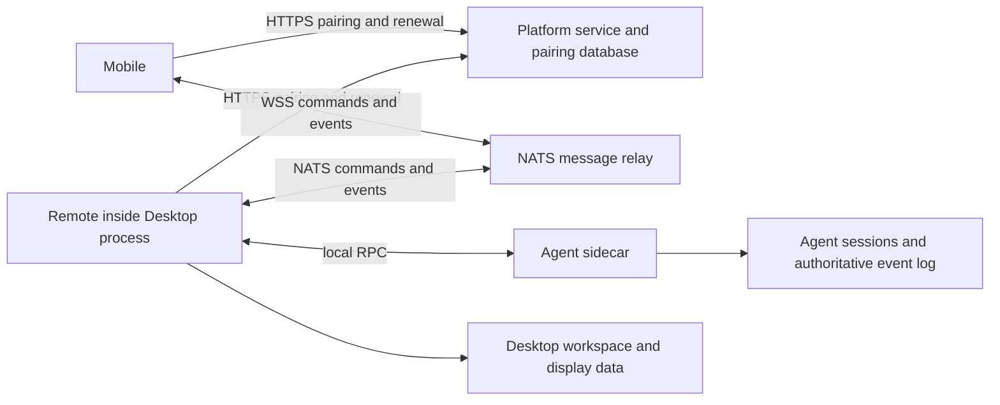
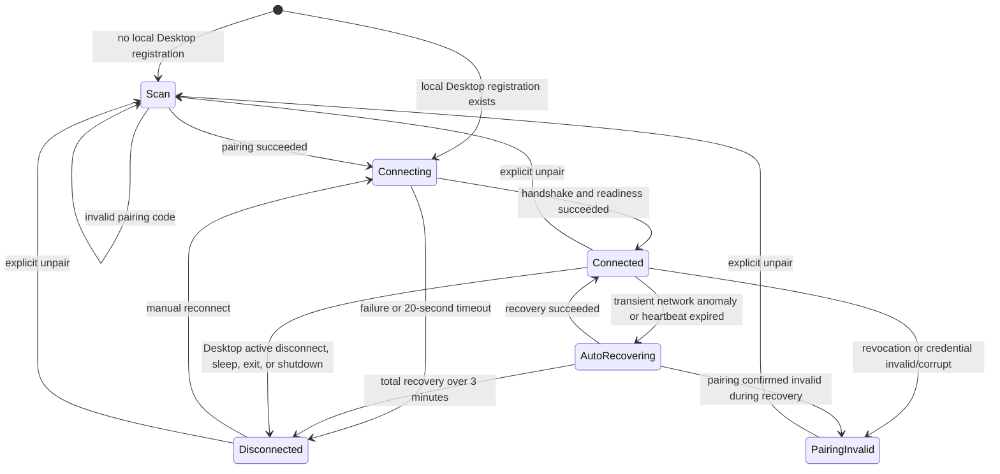

# Remote connection: product design, technical plan, and development plan

> ([中文](CONNECTION.zh-CN.md)) This file is the single maintained source for
> the Desktop—platform service/NATS gateway—mobile remote connection material,
> including product background, existing wiring, module boundaries, pairing and
> permissions, disconnect recovery, state sync, technical plans, and
> development acceptance. Remote v2's end-to-end encryption, pairing trust,
> migration, and wire protocol are in [REMOTE_E2EE.md](REMOTE_E2EE.md); its
> security contract supersedes this document's earlier "trust the relay
> content" boundary. The [product document](PRODUCT.md) keeps the feature
> entry; this file is the only maintenance location for this domain's design
> and contract.

Review date: 2026-09-14. Source baseline: FutureOS `2774e4a9` plus this
document's own change candidate, and the local future-server `bbd6c23`; the
server-side baseline does not represent the actual online deployment. The text
marks "current", "goal", and "to be verified" separately — plans must not be
written as implemented capabilities. This document does not cover model-provider
HTTP, IM channels, or other network subsystems.

**Implementation scope decision: future-server is not modified this round; the
existing business and pairing flows are kept.** This round's refactor only
changes FutureOS's Desktop and mobile clients, reusing the existing platform
API, pairing database, JWT permissions, and NATS deployment. When a pairing
creation or claim result is uncertain, regenerating the QR code and re-scanning
is accepted; the daily disconnect, renewal, and state sync after a completed
pairing still auto-recover per this document. Server-side changes are deferred
due to test and integration complexity; the related issues and future
directions stay in section 9's backlog — not permanently abandoned nor already
resolved.

**Compatibility constraint: keep the normal path unchanged, fix the anomaly
paths.** Keep the "Desktop generates QR/pairing code → phone scans or pastes →
existing identity handshake → view and control sessions" flow, add no user
confirmation steps, and never require already-paired devices in normal use to
re-pair. Account ownership, the one-phone pairing rule, authorization scope,
approval and tool-execution semantics, session data ownership, and existing
setting defaults are unchanged. Connection supervision, candidate handoff,
credential consistent-commit, and sync versions are internal implementation
optimizations; status display should be more accurate, and timeouts, cancels,
and late results should have deterministic handling — keeping old behavior is
not a reason to keep a defect.

## 1. Product background and interaction principles

Phone remote control lets a paired phone continue sessions on the same
computer; tools still execute on the computer locally. The pairing code and QR
code mean "the phone can now safely connect to this computer", not merely a
registration credential, so they must be shown only after the desktop-side
connection is actually ready.

**Product background and security boundary: remote must be visible and
controllable.** Phone remote AI can indirectly trigger local file access, tool
calls, and command execution; users need a remote entry they can see directly
and actively close. The Desktop is that entry: in GUI mode, when the user
closes the Desktop they should be able to confirm the machine no longer accepts
new remote operations through the phone; the standalone `futureos-headless` entrypoint uses the
occupied terminal and Ctrl+C as the visible, controllable run boundary. A
background Agent staying alive must not implicitly enable or maintain remote
capability. This is a product trust boundary, not an implementation detail that
may be relaxed for connection stability.

- **Remote capability belongs to the Desktop process.** Pairing, gateway
  connection, remote command entry, and its recovery tasks are managed by the
  Desktop; not migrated into the resident Agent, and not bypassing the Desktop
  lifecycle via tray keep-alive or mobile wake-up. The user can explicitly
  choose the headless foreground mode, but no service is auto-registered and
  nothing moves to the background. The Agent can still serve local clients, but
  its being alive does not mean the phone remote entry is still open.
- **Closing Desktop = remote connection disconnected.** When a GUI user closes
  the main window or exits the app, the window must not be silently hidden
  while remote operations keep being accepted; headless mode's Ctrl+C/exit also
  closes the entry. Minimizing or switching to another app is not closing.
  Remote on, connecting, and disconnected must have clear states in the
  corresponding UI or terminal. Ordinary GUI open is not authorization to
  enable remote; running `futureos-headless` means starting the phone remote entry.
- **Automatic recovery obeys user intent.** Network, credential, and sync
  recovery only happen while the Desktop is still running and remote access is
  still allowed. After an active disconnect, old requests, retry timers, and
  late callbacks must not re-enable remote. Reopening the Desktop can only
  recover per the user's explicitly saved auto-connect setting, shown visibly;
  being paired or the phone being online cannot alone trigger recovery.
- **Disconnect is measured by the local machine stopping to receive.** Closing
  the entry does not depend on the phone receiving an offline notice, cloud
  confirmation, or JWT expiry; the phone-side offline notice and heartbeat
  expiry are for display updates. Disconnect-keeps-pairing and unpair are two
  actions; keeping credentials does not mean remote control is still possible.
- **Sidecar mode exits together with the Desktop.** When the Desktop actually
  exits, the remote entry closes and the Agent sidecar it started is
  terminated, ending in-progress Agent conversations; this is an accepted
  product behavior — no background Agent is left for remote task continuity.
  Existing running tasks keep reusing the unified exit-confirmation and
  interruption flow. Clicking only Remote "Disconnect" is not exiting the
  Desktop and must not kill local conversations in passing. Agents started by
  dev scripts or externally managed still follow process-ownership rules, but
  regardless of whether the Agent is alive, the phone remote entry must
  disappear after the Desktop exits.
- **Architecture optimization happens within this boundary.** In the Desktop
  backend, separate pairing management, connection supervision, command
  routing, and state sync, unifying cancellation, generation isolation, and
  data authority; extending remote availability beyond Desktop close is not an
  optimization goal. Frontend hot-reload can keep the connection; Desktop
  process rebuild is allowed to disconnect, recovering per the connection
  policy after restart.

The above are product constraints and the acceptance basis for the follow-up
refactor; they do not claim every current exit, race, and task-termination path
is already verified compliant.

- After the user clicks "Pair and start", the UI immediately shows
  "Establishing a secure connection; the QR code will appear when the
  connection is ready."; this hint matches the button height, with no
  low-contrast disabled button shown meanwhile and no content below jumping.
- The desktop shows the QR code only after completing gateway authentication,
  key subscriptions, and the first online confirmation, indicating the entry is
  ready; after the phone claims it, both sides must still complete the identity
  handshake before pairing is confirmed and control allowed. "Waiting to scan"
  must not be stated as "phone connected", and the phone handshake must not be
  a precondition for showing the QR code. When the desktop cannot connect, no
  scannable-but-unusable QR code is shown.
- Remote status uses a green dot for connected, yellow for connecting or
  auto-recovering, and red for a disconnect needing user handling. Yellow
  appears only when a connection or recovery action is actually running; after
  failure with no retry task running it must be red — "recovering" must not
  mask a static state.
- Auto-recovery requires no user action; with the Desktop still running, remote
  access still allowed, the network recovered, and the pairing still valid, it
  should return to connected automatically.
- Only terminal states — auto-recovery stopped, service refused connection, or
  pairing revoked — show a handling page. The hint is fixed as the three layers
  "status, reason, remedy", e.g. "Pairing invalid / Pairing invalid (PA001) /
  Re-pair by scanning the QR code in desktop management". No internal
  terminology like NATS, JWT, connection generations, or retry counts is
  exposed to users; the mobile connection lifecycle no longer pops transient
  error banners.

Phone-side (Android / iOS) post-pairing experience:

- **Pairing and first screen**: scan the desktop QR code or paste the pairing
  code manually; the QR code is valid for 5 minutes and usable only once. On
  launch the local Desktop registration is read first: as long as a
  registration exists — regardless of connection, credential, or revocation
  state — the paired page with the Desktop Header is entered stably, with
  connection status updating in the background; only with no registration at
  all does the scan page appear. The paired management page can add a new scan;
  the scan page only offers back, no reverse-jump button.
- **Sessions**: view the desktop's online status and session list, create or
  continue desktop conversations, rename supported.
- **Conversations**: stream replies, thinking, and tool execution; handle
  approval and stop; switch model and thinking level.
- **History**: paged loading, dedup by (runId, idx); real-time content backfill
  via incremental events after reconnect.
- **Attachments**: pick from the gallery or shoot images, add file attachments;
  download session attachments and preview images / Markdown / text / JSON —
  other types go to the system app to open or save.
- **Credentials**: seed, JWT, and refresh token are stored separately in the
  system secure storage (Android Keystore / iOS); plaintext never enters local
  storage, logs, or QR codes.

### 1.1 Headless Desktop

`futureos-headless` reuses the same Rust backend, occupying the terminal in
the foreground, and does not start the Tauri Builder, window, WebView, or GUI
plugins. When not signed in, the device authorization flow prints the browser
login QR code, URL, and user code; no browser is opened on the server. The
authorization result is saved by the Agent through the original config-write
path. Phone pairing is the second phase: after the entry and the Agent are
ready, it prints the terminal QR code generated from the same invitation and
the full `futureos://remote/pair` link for the app to scan or paste — not a
short numeric code. The graphical `futureos` entrypoint no longer accepts
`--headless`; the standalone binary is built without GUI dependencies.

Valid login and pairing are reused; no proactive re-pairing on every launch or
disconnect. `--no-qr` keeps only the text link, with automatic fallback on
narrow terminals; `--re-pair` explicitly authorizes replacing the original
pairing. First login/pairing requires an interactive terminal; the invitation
is refused for redirected logs. GUI and headless modes are mutually exclusive
over the same data directory, preventing double takeover.

Ctrl+C cancels during login, startup, pairing, and running phases; Unix
additionally handles SIGTERM/SIGHUP. Exit first invalidates the remote entry,
then bounded-cleans the Agent it started; external Agents keep running; saved
login/pairing is not deleted. At runtime, detecting a local account/platform
change closes the entry; when the platform explicitly refuses renewal
authorization, stop — not treated as a network error to retry forever. SSH
disconnect does not promise continued running; long-term running is the user's
explicit choice via tmux or service hosting.

The macOS local integration script follows process ownership the same way:
stop the Desktop process group first, then the Agent started by the script.
Normal Ctrl+C does not print the expected SIGTERM/npm exit codes as errors;
build and Desktop full outputs go to
`.logs/future-agent-test.build.log`, `.logs/future-cli-test.build.log`, and
`.logs/futureos-desktop-test.log.console` respectively; only unexpected
failures print the log location in the terminal and tighten the tail shown.

The default build supports both GUI and headless entries;
`cargo build --release --no-default-features` provides a server build that does
not link Tauri/GTK/WebKit (still needs the matching `future` CLI to provide the
Agent). This is not another Remote SDK or a separate remote-protocol
implementation. Phone, platform environment, and versions must match. Run
instructions in the [desktop headless mode guide](../../guide/desktop-headless.md).

## 2. Existing wiring, protocol, and trust boundaries

### 2.1 Process and data ownership

The "gateway" here covers two different roles: the platform service handles
pairing and credential issuance; NATS handles runtime forwarding. Commands,
events, and file chunks do not pass through the platform HTTP service. The
Remote route currently combines the Desktop store and the Agent RPC; the Agent
log remains the authority for session and execution facts.

The current Desktop exit event calls Remote stop first, then cleans up and
terminates the Agent it owns; running conversations have a separate
exit-confirmation and interruption flow. This matches this file's sidecar
product convention. Code references: [exit entry](../../../desktop/src-tauri/src/lib.rs),
[Agent ownership and exit](../../../desktop/src-tauri/src/agent_supervisor.rs).
These entries existing does not equal real-machine verification that force
kills, crashes, or tool subprocess termination all complete.

### 2.2 Pairing and credential status quo

- The Desktop uses account authentication, generates a local NKey, and requests
  a five-minute one-time invitation from the platform; the QR code also carries
  the information the phone needs to verify the Desktop's identity — it does
  not contain the device private key.
- The phone generates another local NKey, and after claiming the invitation
  receives a pairId, a scoped JWT, and a refresh token; it then confirms the
  Desktop identity via a signature challenge and completes the two-way
  handshake.
- The platform issues short-lived NATS JWTs per pairing and role; the server
  stores only a hash of the refresh token. The Desktop renews with account
  credentials; the phone renews with device-bound refresh credentials.
- Currently each desktop allows only one pending/active pairing under one
  account; re-pairing revokes the old binding. This is not a protocol that
  natively supports multiple phones — extending the UI alone must not be
  claimed as multi-device support.
- The current database marks active the moment the phone claims, while the
  Desktop only persists the pairing when the handshake confirms; the two phases
  differ and must not share one "connected" description.

| Platform endpoint | Responsibility |
| --- | --- |
| `POST /client/v1/remote/pair/code` | authenticate the Desktop, create invitation and bridge credentials |
| `POST /client/v1/remote/pair/claim` | consume the invitation and bind the phone identity |
| `POST /client/v1/remote/auth/token` | issue new JWTs for Desktop and phone respectively |
| `POST /client/v1/remote/pair/revoke` | revoke the binding |
| `GET /client/v1/remote/devices` | list the account's pairings |
| `DELETE /client/v1/remote/devices/:pair_id` | revoke a specified pairing by account permission |

### 2.2.1 Mobile multi-Desktop pairing (2026-09-12)

Mobile can save pairings for multiple Desktops, entering the list from the
desktop selector atop the session page or in Settings, scanning to add another
Desktop, switching the current Desktop, or unpairing one individually. Only the
currently selected Desktop is connected and operated at a time, without
aggregating background Desktops' sessions. Switching sends no unbind command
and does not revoke other Desktops' credentials; re-pairing the same Desktop
replaces its own record.

This is "one phone to many Desktops", not "one Desktop to many phones". The
existing Desktop/platform-side single pending/active pairing, one-time
invitation, signature handshake, and per-pairId authorization rules are all
unchanged. future-server was not modified this round; real multi-device
platform/Android/iOS integration testing still needs separate verification.

The Desktop display name is set locally by the user (optional, saved with the
pairing index but not reported to the platform nor written into the Desktop);
unnamed, the list falls back to showing the Desktop id. Credential refresh
keeps the name; unpairing deletes it with the pairing.

Mobile SecureStore uses per-Desktop double-slot credentials with a single index
atomically committing the active selection and credential slots; the old single
pairing record is cleaned up after the index is persisted. The session
directory and timeline reset on switch; ordinary drafts are isolated per
Desktop; pending send/resume confirmations are isolated per pairId; only the
original pairing can migrate and recover legacy pending operations. An explicit
user unpair only cleans that Desktop's registration and data; on receiving a
revocation notice, invalid credentials, or corrupt credentials, the connection
stops and that Desktop's mirrored business state clears, but the local Desktop
registration is kept. The UI shows a red "Pairing invalid"; only the user's
explicit "Unpair" deletes the registration — historical operations must not be
made to look like the system lost information.

### 2.3 Messages, transport, and permissions

All message subjects in the table below are prefixed with `p.{pairId}.`; the
platform-issued role permissions also constrain the device identity in reply
subjects.

| Subject suffix | Direction and purpose |
| --- | --- |
| `cmd.{sessionId}` | phone sends commands to the Desktop; the Desktop subscribes via a pairing-level queue |
| `rep.{deviceId}.…` | device-scoped request replies |
| `evt.{sessionId}` | the Desktop publishes session events |
| `presence` | the Desktop publishes online status and bridge instance identity |
| `state.sessions` / `state.workspaces` | the Desktop publishes catalog snapshots |
| `state.events` | negotiated low-rate run/approval/configuration notices (`selective_events_v1`) |
| `xfer.up.>` | phone upload chunks and download-pull initiation |
| `xfer.down.>` | the Desktop sends file chunks down |

**Negotiated event interest (2026-09-16):** a Desktop advertising
`selective_events_v1` also publishes run start/end, approval request/decision,
rename/provider-config, run-snapshot and error events to `state.events`.
The original `evt.{sessionId}` feed remains unchanged for older clients. A
supporting phone subscribes to detailed events only for its selected session;
the session list/background keeps low-rate notices and catalog snapshots. It
restores the selected subscription before foreground reconciliation. A Desktop
without this feature keeps the original wildcard-subscription behavior.

This is a traffic optimization, **not** a new authorization boundary. Both
lanes retain AEAD topic binding, original event indices and the existing
pairing-level permission scope. Selected-session notice duplicates are deduped;
intentional unsubscribe on navigation is not a transport failure. Reopening
still fills missing details from the durable journal. The platform API, JWT
scope and Agent authority are unchanged; Desktop-to-broker legacy publication
is retained, while irrelevant detailed delivery to the phone is avoided.

NATS Core is at-most-once delivery. Existing real-time events must be
hole-filled by authoritative-log replay, and catalog notices calibrated by
snapshots; more reconnect attempts cannot substitute for these two.
[NATS official semantics](https://github.com/nats-io/nats.docs/blob/master/nats-concepts/what-is-nats/README.md)

Current pairing authorization covers that Desktop's sessions and must not be
misdescribed as per-session authorization. Remote v2 uses Noise authenticated
key agreement and per-message AEAD on top of NATS — business messages, files,
and status notices are all end-to-end encrypted; the relay no longer carries
content-authenticity trust. The phone requires WSS; Desktop production
connections enforce verified TLS. Scanning and pasting the full invitation
keep the same flow; the invitation carries a one-time secret usable only
end-side; original pairings must be re-established, with no silent fallback to
v1 plaintext. The relay can still observe subjects, traffic metadata, and deny
service. Implementation, test boundaries, and local key-storage limits are in
[REMOTE_E2EE.md](REMOTE_E2EE.md).

Current cloud revocation first invalidates the refresh credential and does not
actively kick NATS connections; old JWTs have a validity window (the default
issued configuration is fifteen minutes; the online value is to be confirmed).
This round keeps that server behavior and does not promise all existing
connections die immediately after cloud revocation. The Desktop's local active
entry-close must not wait for that window; the phone's local unbind should also
stop its own connection immediately, but cannot claim from that the Desktop has
received the revocation. The Desktop closes the corresponding entry after
receiving an explicit revocation result.

### 2.4 Boundaries when the server is not changed this round

- The server's invitation creation has multiple writes without a unified
  transaction, and a lost single claim response cannot be re-fetched — these
  review findings are this round's known limits and section 9's follow-up
  backlog. This round handles them with clear failure states, cancelling old
  attempts, and re-scanning — not marked as fixed, and no promise that the old
  binding still works after a failed re-pair.
- Command operation IDs, access generations, catalog versions, and Agent health
  are exchanged between Desktop and mobile within the existing NATS subjects
  and permissions; the platform only keeps its existing authentication and
  relay duties — no new server storage or subject-permission changes.
- New client message fields use optional extensions, and Desktop and mobile
  negotiate capabilities through existing message channels. Old clients
  without a capability use an explicit compatibility path; side-effect commands
  that cannot guarantee safe retry are not auto-replayed, and no new server
  version interface is depended on.
- The original architecture refactor did not list end-to-end content encryption
  as a development dependency; the follow-up Remote v2 added end-side
  encryption separately — the relay need not parse ciphertext. Instant cloud
  revocation is still not an existing server guarantee. If the current
  deployment does not meet secure-transport requirements, report the connection
  unavailable explicitly — no silent degradation and no self-modifying the
  server.

## 3. Review conclusions and anomaly scenarios

### 3.1 Found problems

| Problem | Evidence and impact | Corresponding plan |
| --- | --- | --- |
| Candidate connection startup invalidates old subscriptions | The phone's `open()` increments the shared generation early; old event iterators exit right away. Reproduced with source + simulated dependencies: on network switch, end events of the old connection are missed when credentials have not returned; does not mean authoritative logs are permanently lost | Section 5: independent access generations, active connection, and candidate identity; hand off only after readiness |
| Handshake changes the whole business entry | The Desktop handshake first sets the shared active to false and clears old challenges; the phone handshake Promise is also not connection-isolated. Visible in source; real concurrent timing not measured | Section 5: candidate authentication does not revoke the existing session authorization; challenges and Promises owned per connection |
| Pairing unrecoverable across steps | No protocol to recover the same claim result when the cloud consumed the nonce but the phone missed the return; invitation creation's multiple writes are also not in one transaction | Accept server limits; section 6: re-scan after failure, end-side credential consistent-commit, no cloud change |
| HTTP has no application-level cancel and deadline | The phone's claim/refresh/revoke use bare fetch; a pending revoke sits before startup loading, and revocation can also block local unbind teardown | Sections 5 and 6: bounded requests, local stop first, independent compensation task |
| Stop can be overwritten by a late startup | The Desktop checks START_REQUESTED after network recovery, but does not re-verify the startup identity after waiting for readiness and before writing STATE. Code-interleaving risk; not yet reproduced by running | Section 5: atomically verify the access generation before install; all startups share one install path |
| Catalog old/new has no common basis | Pulls and pushes directly overwrite the list; no unified revision and no complete write-back isolation after unbind/connection switch | Section 6: versioned snapshots, pairing generations, and a single data commit point |
| Connection health does not cover business health | Heartbeat online and connection ready do not prove the Agent is available or the current timeline is synced | Section 6: model transport, peer, Agent, and data sync separately |
| Recovery entries duplicated and inconsistent | First connection, onReconnected, foreground, and request-failure paths each trigger refresh; e.g. onReconnected does not refresh settings | Section 6: unified recovery coordination and per-data-domain recovery checklist |

Source entries: [mobile connection](../../../mobile/src/remote/client.ts),
[mobile lifecycle](../../../mobile/src/remote/useRemoteConnection.ts),
[mobile pairing HTTP](../../../mobile/src/remote/pairing.ts),
[catalog state](../../../mobile/src/remote/useSessionCatalog.ts),
[Desktop supervision](../../../desktop/src-tauri/src/remote/mod.rs),
[Desktop commands and handshake](../../../desktop/src-tauri/src/remote/commands.rs).
The cross-repo server entry is `future-server/platform/service/src/routes/remote.rs`.

**Risk judgment and this round's priority:** existing evidence does not require
overturning the scan flow or changing business authorization. Priority goes to
fixing the race where a late result can re-install the connection after an
active stop, because it directly affects whether the user can reliably close
the entry; that risk comes from source-interleaving analysis, has no running
reproduction yet, and must not be stated as a proven exploitable security
hole. Old-connection early invalidation is reproduced by simulation; handshake
mutual overwrite, requests without deadlines, and old-state write-back must be
fixed together per the client contract, mainly affecting connection continuity
and state accuracy. Server transactions and lost claim responses are mainly
failure-time consistency and experience issues — this round accepts re-scanning
and defers the change. The cloud-revocation window concerns authorization
invalidation timeliness and should be recorded and verified separately, not
conflated with the immediacy of the Desktop's local entry close.

### 3.2 Current recovery capability matrix

| Scenario | Status and boundaries |
| --- | --- |
| Desktop briefly loses NATS | SDK reconnect, bridge supervision, and credential refresh exist; no auto-recovery after entering a terminal state |
| Phone offline, network-type switch | network listeners, reconnect, and replay exist, but with the handoff window above; a same-kind network path change may not trigger immediate recovery |
| Phone background/foreground switch | proactively pauses the background connection and rebuilds/verifies in the foreground; native pickers have extra grace; real-device timing to be verified |
| Desktop sleep/wake | power events integrated on macOS/Windows/Linux; recovery depends on the startup, credential, and sync chains |
| NATS restart, long unreachable | retries exist; authorization-config faults and over-budget critical-task faults stop auto-recovery |
| Platform HTTP fault, NATS still normal | existing chains may keep serving while credentials are valid; startup/renewal affected, phone requests lack bounded cancellation |
| Desktop normal exit, process rebuild | remote disconnects; the owned sidecar exits, conversations end. Reopening can only recover the entry per the user's connection policy; old tasks are not auto-resumed |
| Agent unavailable, Desktop heartbeat normal | may show connected while business fails; needs separately published Agent availability |
| Claim succeeded but response lost | self-recovery not guaranteed; currently the invitation may have to be regenerated |
| User active disconnect/unbind | must stop, not self-recover; current cancel, late-result, and revocation compensation still need completion per the target contract |

### 3.3 Verification done and uncovered scope

2026-09-11 ran four existing test groups on the above FutureOS baseline:
`connectionState`, `useRemoteConnection`, `pairing`, `syncEngine` — 133 items
passed. Additionally, loading the real client and state machine in memory and
simulating an unreturned credential request plus old-connection events
confirmed the handoff window; no repo test script was added. These results only
prove the covered behaviors and cannot offset the problems found in 3.1.

Not run: real Android/iOS lifecycle fault tests, real Desktop/Agent exit fault
injection, real NATS/platform interruption and JWT-expiry integration, and
production deployment security configuration verification. Each future
implementation must record its commit and verification scope — this pass's
numbers must not be reused as a guarantee for new versions.

## 4. Module boundaries and target architecture

This section is based on the 2026-09-11 source review; the old coupling records
below are kept as investigation background, and this round's completion status
is in section 8.1. The refactor keeps Remote inside the Desktop process, does
not migrate the Agent's session-log authority, adds no background service, and
does not split into multiple independent processes ahead of a possible future
migration.

**Before the refactor: existing functional modules, not yet standalone
components that can directly replace the host.** `src-tauri/src/remote/` had
connection entry, pairing, commands, and file transfer split out;
`commands/remote.rs` mostly forwards start/stop/status/unpair. The original
couplings:

- `remote/commands.rs` directly calls the Desktop store, Agent bridge, Tauri
  commands layer, and UI notifications, mixing protocol routing with business
  execution.
- `remote/pairing.rs` directly reads Desktop login, environment, device
  identity, and config file paths.
- `remote/transfer.rs` directly uses Desktop file policy, thread attachment
  directories, and thumbnail features.
- The Agent event observer calls back into `remote::publish_event/
  publish_snapshot`; run supervision, credential rotation, and some transfer
  state are distributed across global variables and multiple tasks.

**This round's implementation: Remote owns protocol and lifecycle; the Desktop
host adapter carries host dependencies.** Dependency inversion is done within
the existing crate; protocol routing is verified with a substitute host,
needing no real login or database. Desktop integration and runtime remain
inside the Tauri crate; this round adds no standalone crate, and there is no
promise that copying one directory alone compiles independently. Being
extractable does not mean being allowed to run outside the Desktop lifecycle.

The source layout follows those boundaries: `remote/mod.rs` is only the public
facade; diagnostics, health, presence, publishing, transport, the test web
server, and supervisor state/start/shutdown/status live in dedicated modules.
`remote_host/business/` separates catalog, history, prompt execution, settings,
transfers, and wire limits. `agent_bridge/mod.rs` is likewise a facade over
queries, prompting, reconciliation, and delete-outbox handling. The large
regression suites are kept in each subsystem's `tests.rs` instead of being
interleaved with production routing.

| Component | Sole responsibility | Must not carry |
| --- | --- | --- |
| Desktop integration layer | create/destroy Remote instances, exit and power-event adaptation, bind user intent, render state | its own connection retries, duplicating protocol state machines |
| Remote supervisor | receive lifecycle events, own connection attempts, credential rotation, timers, cancellation, and task reclamation | direct read/write of thread/run tables, executing business commands |
| Pairing management | invitations, trust relations, credential commits, revocation compensation; supply valid credentials to the supervisor | controlling sockets or re-pairing for a single reconnect |
| Protocol and transport | NATS auth, handshake, subscriptions, message codec, file chunking | deciding to enable remote on its own, directly calling UI commands |
| Desktop business adapter | handle sessions/workspaces/approvals/execution and file access by type, keeping existing business validation | exposing SQL tables or `AppHandle` to the Remote core |
| Mobile sync layer | consume authoritative snapshots and replay, commit catalog/timeline state | directly creating connections or rotating credentials |

Host dependencies converge into four interface kinds by actual duty: business
commands and queries, authoritative state and event sources, pairing
credentials and platform access, controlled file access. Interfaces pass
explicit DTOs, structured errors, and cancellation contexts; no generic SQL
accessors or whole-Desktop global state. The UI subscribes to Remote state; the
Agent bridge outputs unified business events, wired into Remote by the Desktop
integration layer — the business layer no longer references the Remote module
in reverse. File handles/capabilities are validated by the host; existing path
and permission limits must not be bypassed for abstraction convenience.

## 5. Lifecycle and connection handoff

This section describes this round's client contract; implementation and
compatibility boundaries are in section 8.

**One supervisor owns the lifecycle; async tasks validate result commits
through access generations.** Desktop and mobile each own their instance,
following the same event/error/recovery contract, without forcing shared Rust
and TypeScript execution implementations. Startup, network changes,
foreground/background, power events, credential expiry, subscription
invalidation, and active stop all enter the same supervisor. Background results
carry identity and generation; state queries are read-only and trigger no
network or retries. The supervisor must still handle stop and cancel
immediately while waiting on network operations.

The following facts must be expressed separately, avoiding one `generation` or
`active` carrying multiple meanings:

- **User access intent and access generations**: invalidated immediately on
  active stop, unbind, and Desktop exit. Commands queued earlier but not yet
  accepted by business must not auto-execute after re-enabling.
- **Pairing trust relations**: the persisted device identity and authorization;
  ordinary disconnects and credential renewal do not revoke it.
- **Connection generations**: each socket with its handshake, subscriptions,
  and requests belongs to one concrete connection; replacing with a candidate
  does not pre-invalidate the connection still serving.
- **Business state versions**: session/catalog snapshots and event cursors
  decide old/new, independent of socket generations.

One instance has at most one serving connection and one replacement candidate.
Unify the build/verify/install path for startup, active recovery, and
credential rotation; remove the pattern of each building its own task set and
then replacing the global state. A candidate installs only after completing
identity verification, key subscriptions, and flush; before install, re-check
the access generation, pairing identity, and candidate identity. On failure
only the candidate is destroyed and the still-healthy old connection keeps
serving; when the old chain has already failed, show connecting externally
while keeping the recovery phase internally, recovering data via log replay.
Active stop invalidates both — no "keep the old connection" policy.

- The old connection's subscriptions keep consuming until the actual handoff;
  they must not exit just because the candidate starts requesting credentials.
  The candidate handshake Promise and challenges belong to the candidate; the
  handshake result of another connection cannot be reused.
- A new handshake must not set the whole pairing's business authorization to
  false; candidate authentication and the authenticated connection are isolated
  from each other. The candidate must not divert and drop normal commands
  before readiness; messages during subscription handoff are bounded-buffered
  and handed to the same command route, with overflow failing the candidate.
  Two independent command executors must never take over the business at once.
- During the brief overlap, events dedup by the authoritative cursor; commands
  dedup by stable operation IDs. Business receipts and pairing trust do not
  clear on credential rotation. Transfer caches belong to the
  instance/pairing; connection switches must not call a global cleanup that
  deletes the new connection's transfers by mistake.
- The SDK's reconnect process is under supervisor management; while the SDK is
  recovering the current connection, no multiple upper-layer timers concurrently
  create replacement connections. Only the supervisor can decide to upgrade to
  a full-generation replacement.
- All control-plane HTTP, handshakes, readiness, and connection probes have
  deadlines and cancellation. Initial budgets: HTTP 20 seconds,
  handshake/readiness phase 10 seconds, foreground probe 4 seconds; cancellation
  must release the underlying request, not just let the upper Promise return
  early. The stop entry does not wait for these network budgets to drain.
- Stop first closes the local command-receiving gate and invalidates the access
  generation, then cancels candidates, retries, refreshes, and subscriptions,
  reclaiming protocol tasks. The offline notice is bounded best-effort; failure
  does not block stopping. Tasks already accepted by business go through the
  unified business-exit strategy; Desktop exit finally terminates its owned
  Agent sidecar.
- When the Desktop recovers from system sleep, report yellow `reconnecting`
  only while the recovery task is actually running; when the recovery task
  finishes but is still unavailable, report red failure. The Desktop page must
  not show role-confused text like "waiting for the desktop", and must not
  repeat the connection hint under the status card.

Whether credentials are "newly issued and still valid" must be judged by that
attempt's credential version, expiry time, and errors — one refresh's leftover
boolean must not be interpreted forever as "all later auth failures are
configuration faults".

## 6. Pairing, command, and state sync plan

**Pairing allows re-scanning after failure; normal connection recovery must not
require re-pairing.** Reuse the existing one-time invitation, claim interface,
and device keys; clients express claiming, waiting for identity confirmation,
paired, and pairing-failed separately:

1. Desktop invitation creation and phone claiming both set deadlines, and a
   local attempt identity isolates cancels and late responses. Creation/claim
   have side effects; when the result is uncertain, neither ordinary
   network-request infinite retry applies nor automatic invitation
   regeneration loops.
2. When the claim response is lost, the pairing code consumed, or credentials
   not fully saved, the attempt ends with "Pairing incomplete; please
   regenerate the QR code on the computer and scan again". Stop the candidate
   connection, isolate and clean the incomplete credentials; add no cloud
   idempotency protocol for claim operation IDs, and do not assume re-sending
   the same QR code recovers the result.
3. Fully saved credentials can retry recovery through the existing auth
   interface and the Desktop handshake. Cloud "claimed" is not the same as
   two-side identity confirmation completing; when handshake confirmation is
   lost, first re-verify with existing credentials — if revoked, credentials
   incomplete, or the existing protocol cannot complete confirmation, return to
   re-scanning. Ordinary disconnects or renewal network failures do not clear a
   confirmed pairing.
4. Phone credentials use an identifiable commit version or marker; after a
   write failure or process interruption, old and new fields must not be
   assembled into one valid credential set. Desktop and phone report a phase
   success only after the persistent commit succeeds; client commit protection
   is not a cross-end transaction between cloud and local.
5. Unbind first disables locally, then completes cloud cleanup through the
   existing revoke interface. Retryable compensation is persisted per pairId;
   the required authorization material is kept in secure storage, isolated from
   connection-usable credentials, cleared on completion. Network failures use
   bounded backoff; explicit auth failures stop retrying; compensation must not
   overwrite another pending revoke or block the current pairing's startup.
   Local-only completion does not claim cloud revocation; disconnect keeps the
   pairing.

**Transport retries must not decide whether business re-executes.** Keep the
existing persistent prompt receipts; classify retries per operation: read-only
queries are retryable; prompt/continue_run use existing persistent receipts;
upload_complete reuses the same-transfer-handle repeat-completion semantics.
Other writes are not auto-replayed; no new generalized operation log is added.
In-memory single-flight rejects different requests with the same ID;
cross-restart send results are queried through the existing persistent
receipts. Commands of an unaccepted old access generation must not replay
across an active disconnect. Accepted operations can query the original result,
but a Desktop/Agent restart does not auto-re-execute interrupted conversations.
Read-only requests can retry; there is no need to add persistent operation
records to every interface for abstraction's sake.

**Mobile settings manage the selected Desktop, not a second preference store.**
The phone uses a full-screen, scrollable Settings page with separate Model
visibility, Provider, and Skill management subpages. The Current desktop
section exposes `autoUpgradeSkills`, `autoTitleFirstTurn`, and
`autoConnectRemote` (explicitly labelled **Connect to phone when desktop
starts**). Model visibility edits the same Desktop `hiddenModels` list, using
provider-qualified identifiers; the management catalogue includes hidden
entries so they can be enabled again. The phone's language, update check and
pairing management remain in a separate This phone section.

- Handshakes advertise `desktop_settings_v1`, `skill_management_v1` and
  `provider_management_v1`. Older hosts leave these controls disabled with an
  upgrade hint; existing approval mode controls keep their original protocol.
- Handshakes advertise `compaction_v1`, and the phone's `/` menu offers the
  same Compact context tool as the Desktop input box. `compact_context` is a
  session-scoped write: the host forwards the standalone `compact` RPC and
  relays its operation id, and the phone reports the outcome only after the
  matching terminal `compaction_*` event (a missing event is reported as a
  missing result, never as a failure). An older host leaves the tool hidden.
- `get_desktop_settings` / `update_desktop_settings` expose only the four fields
  above. Writes are partial, allowlisted, and committed by the existing Desktop
  settings store, never persisted or queued on the phone. `list_settings_models`
  reads the unfiltered Agent catalogue.
- `list_providers`, `update_builtin_provider`, `upsert_custom_provider` and
  `delete_custom_provider` are the Provider page: one Desktop write per
  submission, through the same `agent_providers` paths the Desktop Settings
  dialog uses, so identical validation and catalog-collision rules apply. A key
  travels one way only — the view reports `hasApiKey`, never key material — and
  the account provider (`future`) stays uneditable, built-in providers
  undeletable, and a custom provider's id immutable after creation. Custom
  providers carry their models (id, modalities, token limits, per-1M prices)
  in the same payload, so a phone and a Desktop can never hold half of one
  provider. `list_providers` participates in the oversized-read paging path.
- `list_skills`, `list_available_skills`, `install_skill`, and `uninstall_skill`
  operate on Desktop/Agent skills. Desktop and phone install/remove calls share
  a serialized management path and refresh Agent discovery before completion.
  All-upgrade runs sequentially, stops on error or leaving the page, and reports
  that earlier items may already have completed. Removal requires confirmation.
- Post-commit `app_settings_changed`, post-refresh `skills_changed`, and
  Agent-committed `provider_config_changed` invalidations reach the Desktop
  webview and the remote low-rate catalogue event lane. Both views reread
  authoritative data; the phone also reloads on opening/foreground/reconnect.
  Closed pages discard their temporary view state, and connection identity
  fencing prevents late responses crossing desktops. No offline writes or
  automatic mutation retries are introduced.

**Connection state and sync state are separate.** Internally at least
distinguish pairing validity, relay reachability, peer authentication/liveness,
Agent availability, and current data-sync progress. The Desktop can only
report entry-ready while waiting to scan; a completed phone handshake cannot
directly declare the current conversation history synced. Only the following
three connection states are shown to users; data-sync progress stays inside
the business without adding connection Badge states.

- Agent sessions and the event log remain the authority for execution facts;
  Desktop-owned workspaces, thread display attributes, and settings are
  handled by the corresponding business services. Remote adds no second set of
  business truth and does not copy those fields into the gateway again.
- Pull responses and pushes of the same catalog carry the same version system,
  e.g. `(state-source epoch, revision)`; version changes are produced only by
  the state source. The version must correspond to the data view the snapshot
  was built from, not the response send time. Old responses must not overwrite
  new state; after pairing switch or unbind, old requests must not backfill
  lists.
- The timeline keeps using the existing authoritative event identities and
  cursors: subscribe first with bounded buffering, then read the snapshot with
  a watermark, replay gaps, and dedup. Catalogs, settings, and capabilities
  also have recovery checklists — not only recovering the socket or the one
  timeline being opened.
- One recovery-coordination entry triggers each synchronizer, merging duplicate
  requests; foreground, network change, and connection success no longer each
  start an inconsistent refresh chain. Each data domain reports
  syncing/synced/failed separately; no one global loading screen blocks data
  that is already usable.
- The heartbeat mainly judges liveness; catalog reads and publishes must not
  block the heartbeat. Change notifications and low-frequency baseline
  calibration are kept; notifications may be lost, and snapshots/logs decide
  the final state. NATS does not carry business-log authority; publish/flush
  success must not be equated with the phone having applied the data.

## 7. Recovery contract and support codes

The following is the cross-end target contract, which must be bounded by the
Desktop lifecycle and user intent. The historical handoff and stop problems in
section 3 are fixed per section 8; real-device faults are still accepted via
integration results, with documentation not substituting for verification. The
common connection phase keeps `stopped`, `connecting`, `ready`, `reconnecting`,
`refreshing`, `failed`, `revoked`; the pairing phase and business sync states
are expressed separately. `ready` is entered only through the corresponding
connection-readiness threshold.

| Situation | Policy |
| --- | --- |
| Phone first connect or user manual reconnect | single attempt with a 20-second total budget; success enters connected, failure enters red disconnected — no three-minute auto-recovery |
| Network, DNS, timeout, or credential-endpoint network failures after a successful phone connection | auto-recover while remote is allowed; backoff bases 1, 2, 4, 8, 16, 30 seconds with ±20% jitter, single attempt at most 30 seconds, total recovery window at most 3 minutes |
| Invitation creation or pairing claim result uncertain | end the attempt and let the user regenerate the QR code and re-scan; no automatic re-consuming of the invitation |
| Credential expiry | only one refresh at a time; network failures follow the backoff policy |
| Newly issued and still-valid credentials rejected by NATS | terminal `service_authorization`; no automatic loop of issuing and connecting |
| Pairing revoked, credentials invalid or corrupt | terminal `revoked`/pairing invalid; stop all connections and retries, clear mirrored business state but keep the local Desktop registration; only explicit user unpair deletes the registration |
| Protocol errors or key subscription/task failures after readiness | at most three full-generation recoveries in ten minutes; beyond that enter `generation_unhealthy`; 60 continuous healthy seconds or a user manual reconnect resets the budget |
| Build failures before readiness | attributed to this connection attempt; cleaning candidate subscriptions must not re-consume the critical-task recovery budget |
| Receiving a Desktop active-disconnect, sleep, exit, or shutdown notice | the phone stops auto-recovery immediately, clears the list/timeline mirror, and enters a red standalone status page; after wake or reopen the user reconnects manually |
| User active disconnect or Desktop exit | local stop first, cancel all recovery work; no self-restart because of network recovery, saved credentials, or late results |

Mobile external states and user operations converge as follows:

In the diagram, "Connecting" and "AutoRecovering" map to yellow, "Connected" to
green, "Disconnected" and "PairingInvalid" to red. As long as a local Desktop
registration is kept, launch enters the paired page first and updates status in
the background; only no registration or an explicit user unpair enters the scan
page.

At most one ready connection is reported externally at a time; the candidate is
not a second operable entry. The `failed`, `revoked`, and actively-stopped
states must not create connections, refresh credentials, or start
connection-retry timers; the post-unbind cloud-revocation compensation runs
independently and must not re-enable remote. An explicit user re-enable creates
a new access generation; a pairing-invalid state still keeps the local
registration — the user can add a pairing from Desktop management or explicitly
remove the old registration. Auto-recovery must not clear business dedup
records, confirmed pairings, sync cursors, pending-query operation IDs, or
fault statistics; only entering a terminal state after over three minutes of
auto-recovery clears the current mirror list and timeline. Each fault class is
aggregated per fault cycle, at most 16 entries per rolling 24 hours, avoiding
offline spam and disk growth.

Support codes are used uniformly for logs and user-understandable error hints;
`LC999` only means an unknown local fault — known `local`-class faults use
`LC001`.

| Category | Support codes |
| --- | --- |
| Network or credential-request network anomaly (`network`, `credential_network`) | `NW001` |
| Request timeout | `NW002` |
| Remote service anomaly (`remote_server`) | `SV001` |
| Request rate-limited | `SV002` |
| Service authorization failure (`service_authorization`) | `AU001` |
| Credential expired or connection auth anomaly (`credential_expired`, `credential_connect`) | `AU002` |
| Pairing or credential revoked (`revoked`, `credential_revoked`) | `PA001` |
| Pairing code invalid or expired, or the handshake was refused (the bridge serves a different identity than the code it displays) | `PA002` |
| Pairing claim address untrusted (the phone picks the trusted production/test platform from the QR code; the environment is not limited by the APK version) | `PA003` |
| Pairing interface used an insecure transport | `PA004` |
| Desktop identity verification failed (the two builds cannot complete the handshake) | `PA005` |
| Unknown pairing fault | `PA999` |
| Protocol error (`protocol`) | `PT001` |
| Connection recovery budget exhausted (`generation_unhealthy`) | `RT001` |
| Insufficient consumption speed (`slow_consumer`) | `RT002` |
| Command subscription invalid (`command_subscription`) | `RT003` |
| File-transfer subscription invalid (`transfer_subscription`) | `RT004` |
| Event publish failure (`event_publish`) | `RT005` |
| Heartbeat or state publish failure (`heartbeat_publish`, `state_publish`) | `RT006` |
| System sleep (`system_sleep`) | `PW001` |
| Requested content does not exist | `DT001` |
| Local web service bind failure (`web_bind`) | `LC002` |
| Desktop's Agent offline | `LC003` |
| Credential persistence failure | `LC004` |
| Known local fault (`local`) | `LC001` |
| Unknown local fault | `LC999` |

### 7.1 Customer wording and colors

The connection page, sidebar, and phone Badge share one meaning; low-level
phases must not be displayed to customers directly:

| Customer state | Color | Meaning and recovery |
| --- | --- | --- |
| Connected | green success | the current connection is usable. On Desktop it means the remote entry is usable; the phone must also confirm the desktop is online and local services are usable; it does not mean all history is synced |
| Connecting | yellow warning | temporarily unusable with a connection or auto-recovery action actually running; merges first connection, waiting for desktop, reconnect, renewal, and local service recovery. Customers need not understand the differences |
| Disconnected | red danger | actively stopped, an explicit Desktop-disconnect notice received, pairing invalid, first-connection failure, or auto-recovery terminated. Ordinary disconnects offer reconnect; pairing-invalid offers only explicit unpair |

The display model is fixed as three layers; components must not assemble
wording from low-level phases themselves:

1. `level` is the most intuitive green/yellow/red availability — only
   `connected`, `connecting`, `disconnected`.
2. `customerState` is a customer-understandable class, e.g. connecting, waiting
   for desktop, desktop preparing, pairing invalid, network anomaly, service
   unavailable. Classes merge by recovery action and do not map to single
   protocol anomalies.
3. `supportCode` is a stable technical classification, e.g. `LC003`, `PA001`,
   `NW002`. The UI shows no raw exceptions; support staff locate further via
   the error code plus the console's phase, retry, and raw error.

The display result also carries `action`, limited to wait, check network, open
or restart Desktop, reconnect, unpair, retry later, or contact support. Color,
customer state, action, and support code must be produced once by the same pure
conversion layer; the Desktop connection page and sidebar, the phone Badge, the
empty state, and the input area only consume that result. Low-level phases like
`connecting`, `reconnecting`, `refreshing` remain underneath for executing
recovery policies and logging, but cannot directly decide customer wording.

An unpaired Desktop's sidebar shows no status dot; the pairing entry keeps the
original flow. The phone shows yellow waiting only when new heartbeats are
missing and an active disconnect is unconfirmed; "the gateway is still
connected" must not be treated as the desktop being usable, and an unknown
cause must not be arbitrarily interpreted as the Desktop having exited. After a
confirmed desktop active close, show red, with the recovery hint asking to open
the desktop and enable phone remote — never silently re-enabling the desktop's
remote permission.

The phone Header always keeps the Desktop selector, status dot, and settings
entry. The dot-tap popover and the yellow/red standalone status pages all order
as "status, description, remedy", with description and remedy on separate text
lines — never merged into one paragraph relying on auto-wrap. Everywhere uses
the same wording map; the description may append a support code, no trailing
period. Pairing-invalid shows "Pairing invalid" with an "Unpair" action — never
"Reconnect". Detailed errors and phases stay in console logs; a partial-feature
failure does not turn the still-usable main connection red, and the
connection-lifecycle red banner is not used.

During yellow, all remote communication (requests, sends, uploads, downloads,
model/thinking-level and approval changes) freezes; local browsing, scrolling,
and editing can continue. If yellow comes from a normal list or session, keep
the original page and data without flashing empty; if it comes from first
connection, manual reconnect on the red disconnect page, or no successful
content yet, reuse the same standalone status page, only swapping the fixed
positions' icon, text, and button into a loading animation. Entering a red
terminal state clears the mirror list/timeline and shows the reason, remedy,
and action buttons on a standalone status page that keeps the Header.

## 8. Development plan and acceptance

Deliver in the following order; this round's development tasks are limited to
FutureOS's Desktop and mobile, verifiable with the existing future-server and
NATS deployment. Each step keeps the current Desktop hosting form and the
existing business and pairing flows; client protocol fields and version
snapshots enable progressively per the section 2.4 compatibility strategy —
old and new lifecycles never hold control simultaneously. Server work is listed
separately in section 9's backlog and is not a release dependency this round.

1. **Module boundaries**: extract the Desktop host adapter, define input
   events, status output, business/file/credential interfaces, and error types;
   first remove Remote's bidirectional direct calls with the host, without
   migrating data ownership.
2. **Lifecycle**: let a single supervisor take over the existing startup,
   rotation, reconnect, and stop, removing the replaced global retry paths;
   simultaneously fix the phone's old-connection early invalidation, handshake
   mutual overwrite, and old-result install during stop.
3. **End-side pairing and business commits**: implement pairing request
   deadlines and cancellation, re-scan after failure, credential
   consistent-commit, and compensation through the existing revoke interface;
   define operation IDs, access generations, and safe-retry rules for Desktop
   and mobile without changing platform interfaces.
4. **State convergence**: unify recovery coordination, catalog revisions,
   timeline watermarks, and Agent availability; complete real cross-end fault
   verification. Only after interface isolation and host-substitution tests are
   met is extracting a separate crate discussed.

Acceptance is based on observable invariants, covering at least:

- Normal scan/paste pairing, re-pairing, unbind, creating and continuing
  sessions, approval, stop, and attachment operations keep the original
  business semantics; existing setting defaults and authorization scope are
  unchanged; upgrades do not force already-paired devices to re-scan.
- After normal close and confirmed force-quit, Remote accepts no more commands,
  the self-started Agent sidecar exits, and conversations end; cancelling the
  exit keeps the original state.
- When active stop coincides with connection success, HTTP return, credential
  write, or system wake, remote must not recover in the end; commands of an old
  access generation that were not accepted must not execute after re-enabling.
- Network switches, long offline, gateway restarts, both ends' JWT renewal,
  phone return to foreground, and Desktop sleep-wake; candidate failure does
  not break a still-healthy old connection, and data converges after the failed
  chain recovers.
- Claim succeeded but response lost, or a process exit during credential write:
  no fake success, no mixed credentials, no infinite claim retries; the user
  can regenerate the QR code to complete pairing. When handshake confirmation
  is lost, complete credentials retry per the existing protocol; when
  unconfirmable, re-scanning is allowed.
- When the unbind server is unreachable, disconnect locally in time, with the
  cloud-cleanup result shown truthfully; compensation does not block a new
  pairing, does not restore the old connection, and does not promise the cloud
  immediately kicks other existing connections.
- Complete old/new client compatibility verification in an environment with
  unchanged server code, database schema, API, JWT permissions, and NATS
  configuration; side-effect operations with uncertain results are not
  auto-replayed when the new capability is absent.
- Late catalog snapshots, lost terminal events, Agent offline with heartbeat
  present, duplicate operations, and Desktop restarts; must not misreport
  business usability, regress/overwrite state, or execute twice.
- Verify the Remote core with a substitute host and simulated transport —
  loading no Tauri, reading no real accounts, and starting no second same-user
  Agent; real-device fault injection and source/simulation test results are
  reported separately.

### 8.1 Client development progress (2026-09-14)

This round's client development is complete and has entered concentrated
simulator and real-device acceptance; future-server remains unchanged.
"Pending acceptance" in the table below is running verification, not an
unimplemented development phase.

| Domain | Implemented | Concentrated acceptance focus |
| --- | --- | --- |
| Host boundary | `remote/services.rs` defines the business/state/pairing/file four interfaces, `protocol.rs` carries DTOs; `remote_host/` implements the Desktop business/catalog/file/platform adapters; `agent_events.rs` outputs events, wired into Remote by the integration layer; protocol commands can inject a substitute host | original session, approval, workspace, attachment business semantics and permissions stay consistent |
| Desktop lifecycle | a single `Supervisor` owns user intent, access generations, the active runtime, retry budgets, and the background task group; stop/sleep cancel uniformly; initial connection and renewal share candidate build and readiness install; wake recovery reports yellow only while tasks run | stop vs readiness interleaving, sleep-wake, brief offline, gateway restart, both ends' renewal |
| Mobile connection | a single connection attempt; first/manual connect limited to 20 seconds; post-success auto-recovery uses ±20% jitter backoff limited to 3 minutes; explicit Desktop-disconnect notices stop retries; business requests uniformly pass the ready/desktop-available gate | foreground/background, system pickers, network switches, the 20-second and 3-minute boundaries, late recovery not crossing an active stop |
| Status display | Desktop and phone both produce `level`, `customerState`, `action`, `supportCode` once via a pure conversion layer; green/yellow/red consistent; the phone Header, status popover, frozen lists/sessions, and standalone status page reuse the same result | fixed slots without flicker; status, reason, remedy, and actions consistent; raw errors only in the console |
| Pairing and unbind | HTTP has deadlines; credential double-slot commit compatible with old versions; startup routing keys on the Desktop registration rather than credential validity; revocation/corruption keeps the registration and shows pairing invalid; only explicit unpair deletes; cloud revocation keeps persistent compensation | offline unbind, process interruption, re-pairing, no jump to the scan page on first screen after revocation, cross-environment compensation not misfiring |
| Commands and the pending-send queue | handshake challenges do not revoke each other, with expiry and count caps; commands keep single-flight and persistent prompt receipts; new phone commands and persistent pending-send records carry access identity, and unaccepted operations of an old identity do not auto-execute across stop/restart | lost receipts, Desktop reopen, legacy pending-send record upgrades; accepted ones only query receipts, unaccepted ones keep drafts for the user to resend |
| Catalog sync | the same source builds handshake/query/push snapshots, serially assigning `(epoch, revision)`; all visible fields participate in version judgment; the phone verifies by handshake source and commits uniformly; read failures do not publish an empty catalog | old pushes/late queries do not regress, re-pairing does not backfill, field updates and a truly empty catalog are both reachable |
| Timeline and recovery | fixed replay watermark and event-cursor paging; legacy offset replay compatible; a unified mobile recovery entry; the real-time wait queue over-limit converts to persistent replay; catalog domains offer idle/syncing/ready/failed, the timeline keeps existing sync phases | streaming interruption, missed end events, new events during paging, long offline and large event volumes |
| Agent availability | an independent, bounded, read-only RPC probe of the existing Agent; heartbeat/status publish availability; phone and Desktop merge into yellow connecting with the connect action and LC003; Agent recovery triggers re-sync | Desktop online but Agent unreachable must not misreport business normal; no re-pairing after recovery |

The Desktop's new `~/.future/remote_pending_revokes.json` records only the
pairing ID and original platform address — no account tokens or connection
private keys; the phone's compensation credentials stay in system secure
storage. Neither end adds platform interfaces, database structures, or JWT
permissions. Cloud revocation is an independent compensation task that cannot
re-open local remote access; it ends with the Desktop process.

### Implementation details and compatibility boundaries

- A catalog version represents one snapshot serially collected by the Desktop
  state source; versions are not produced at send/receive time. Sessions and
  workspaces are numbered separately; no claim that multiple data domains form
  a cross-database transaction. A new source can only be established by
  identity confirmation; ordinary pushes cannot switch epochs. Old Desktops
  without version fields keep using request order plus client-generation
  protection.
- New replay responses include `watermark` and `nextSinceIdx`; follow-up
  requests carry `replayUntilIdx`, collecting only immutable events within the
  first round's watermark. If the retained window has become a newer
  projection, return an error and let the synchronizer rebuild from persistent
  state; never commit a mixed half result. Old Desktops not returning these
  fields keep the phone's existing offset paging.
- Ordinary disconnects/renewals keep the access identity; active stop, Desktop
  reopen, or sleep-wake update it. When a pending-send record lacks identity or
  mismatches, auto-recovery can only query accepted receipts; without a
  receipt, clear the auto-delivery intent and keep the session draft. A user
  actively re-sending is a new authorization action.
- Agent probes take at most 3 seconds per round, 3 seconds apart; a successful
  result over 10 seconds old is no longer considered available; monotonic
  clocks are used. Only the existing Agent is connected — no second Agent
  started, no resident service created.
- The Desktop chunk protocol only handles NATS messages; file path permission,
  session attachment ownership, upload staging, thumbnails, and controlled
  reads all stay in the host adapter layer. The architecture separation does
  not change file-access authorization.

Historical local verification (2026-09-11): the Tauri backend's full 1140 tests
passed, plus 1 new supervisor-cancellation test passed separately; Desktop
frontend 92 groups, 846 items passed; Mobile full 48 groups, 678 items passed.
Those results only match that baseline and do not mean the 2026-09-14 candidate
completed equivalent running verification. The current candidate runs
Desktop/Mobile TypeScript and ESLint, Tauri `cargo fmt --check`/Clippy, and
`git diff --check` per the submission flow; the local test suites are not run —
GitHub Actions runs them. Simulator/real-device lifecycle, real gateway faults,
and Desktop sidecar exit still need concentrated acceptance; static checks and
automated tests do not substitute for those results.

### 8.2 Mobile unified recovery coordination

- The transport layer only reports connection recovery and orchestrates no
  business data; `useRemoteConnection` owns the single recovery checklist, and
  `RemoteContext` no longer maintains a second set of recovery functions.
- An independent `RecoveryCoordinator` executes recovery serially per client
  instance: same-round sync notifications merge; a reconnect during an
  in-progress pull schedules one follow-up recovery, avoiding treating the pull
  on the old chain as the new chain's recovery completion.
- Foreground/network recovery records the coordinator version before calling
  transport recovery. When the transport has already reported a reconnect, wait
  for that round's recovery; a healthy connection completing only its probe
  gets a supplemental status recovery from the lifecycle entry. No duplicate
  pull even if the refresh inside the reconnect callback already completed.
- Each round starts by checking the access generation, current client, and
  ready state; after unbind or client replacement, old tasks cannot start a
  later round and the new client need not wait for old requests to finish.
  Issued catalog requests are still blocked from late write-back by each data
  domain's client/generation/request-order validation.
- The timeline immediately abandons tasks waiting on the old transport via
  `SyncEngine.restartAll` and recovers from persistent state, without waiting
  for catalog requests; catalogs and settings pull in parallel, a single
  failure not blocking the others. This does not promise multiple data domains
  share one transactional snapshot; catalog versions and timeline watermarks
  follow the independent-source contracts of section 8.1.
- `RemoteClient` owns the first-connect/recovery deadlines, backoff timers, and
  the 15-second presence freshness itself; NATS SDK auto-reconnect is off,
  avoiding the SDK and the local state machine retrying separately. Entering
  non-ready or Desktop-unavailable states makes the unified business gate
  reject all remote communication.
- App launch first publishes the Desktop registrations from SecureStore, then
  asynchronously reads active credentials and connects. Revocation notices and
  invalid/corrupt credentials enter the red pairing-invalid state without
  auto-calling `clearCredentials`; a registration is removed only when the user
  confirms unpair or deletes that Desktop.
- New regressions verify notification merging, follow-up recovery during an
  in-progress reconnect, old-client exit, the new client not blocked, recovery
  possible again after failure, and no duplicate refresh after foreground
  rebuild completes. Real-device fault injection is not yet executed.

### 8.3 Concentrated test order

Rebuild Desktop and mobile on the current branch, keeping the existing
future-server. Old-client compatibility paths can be tested separately, but old
builds must not substitute for this round's new-protocol acceptance.

| Operation | Expected result |
| --- | --- |
| Scan/paste pairing, send, continue, approve, stop, upload, download | original business flow and permissions consistent, no duplicate messages or duplicate execution |
| Phone foreground/background switch, network on/off, network-type switch | catalogs, settings, and timeline converge after recovery, cache does not flash empty; native pickers do not falsely trigger long backgrounding |
| Desktop offline/recovery, sleep/wake, both ends' renewals interleaved | pairing kept; candidate failure does not break the still-usable old connection; repeated failures have a clear recovery state |
| Desktop normal exit, confirmed force-quit, reopen | no remote commands accepted after exit; the owned sidecar exits; reopening does not auto-execute old unaccepted operations, existing receipts restore display |
| Desktop online but Agent temporarily unavailable, then recovers | show chain-online and Agent-unavailable separately; re-sync after Agent recovery, no re-scan needed |
| Offline unbind, immediate re-pair, network then recovers | local disconnect in time; old results do not backfill the new pairing; cloud compensation neither blocks the new connection nor re-enables the old one |
| Disconnect while streaming output, then paging or rename during recovery | no catalog regression; replay neither duplicates nor misses persisted events; still converges after long backlogs |

After the simulator concentrated regression completes, real devices supplement
wireless-network-switch and system-lifecycle verification. No second same-user
Agent is started during testing.

## 9. Server-side follow-up backlog (deferred this round)

Deferral reason: future-server involves the database, authentication, NATS, and
cross-end integration with high test complexity; this round completes the
client architecture and reliability improvements first. The items below keep
the problem evidence, solution direction, and acceptance requirements for a
later separate schedule; the server is neither modified nor deployed this
round.

| Backlog | Problem and follow-up direction | Later acceptance focus |
| --- | --- | --- |
| Pairing creation transaction | put the revocation of the old pairing, invitation creation, nonce, and related writes into a transaction, making concurrent re-pair commit order explicit, avoiding half-finished states from mid-failure | fault injection per write point, concurrent invitation creation, old-binding state after rollback; keep the existing one-phone rule |
| Recovery after claim-result loss | when there is a real experience gain, design idempotent recovery for the same device's same claim; recover or re-issue credentials by proof-of-possession of the binding key — never re-claiming with an already-consumed QR code alone | lost responses, duplicate requests, other-device replay, invitation expiry, and refresh-token safety; re-scanning stays accepted this round |
| Cloud revocation timeliness | verify the online JWT validity period and existing-connection revocation behavior; if immediate invalidation is needed, design a NATS revocation or equivalent mechanism with an explicit effective deadline | established connections, old-JWT reconnects, renewals, offline Desktops, and multi-instance propagation; verified separately from local stops |
| Server protocol evolution compatibility | only when the recovery interfaces above really need extension, decide interface versioning or capability expression; no server-side negotiation system added just for client internal refactoring | old/new Desktop/phone mixes, staged upgrades, rollbacks, and old-interface behavior kept |

When resuming these backlog items, re-verify the future-server source and
deployment baseline first, then decide the concrete implementation and test
environment. This table is a follow-up work record, not authorization to
execute this round and not a claim the capabilities are implemented.
