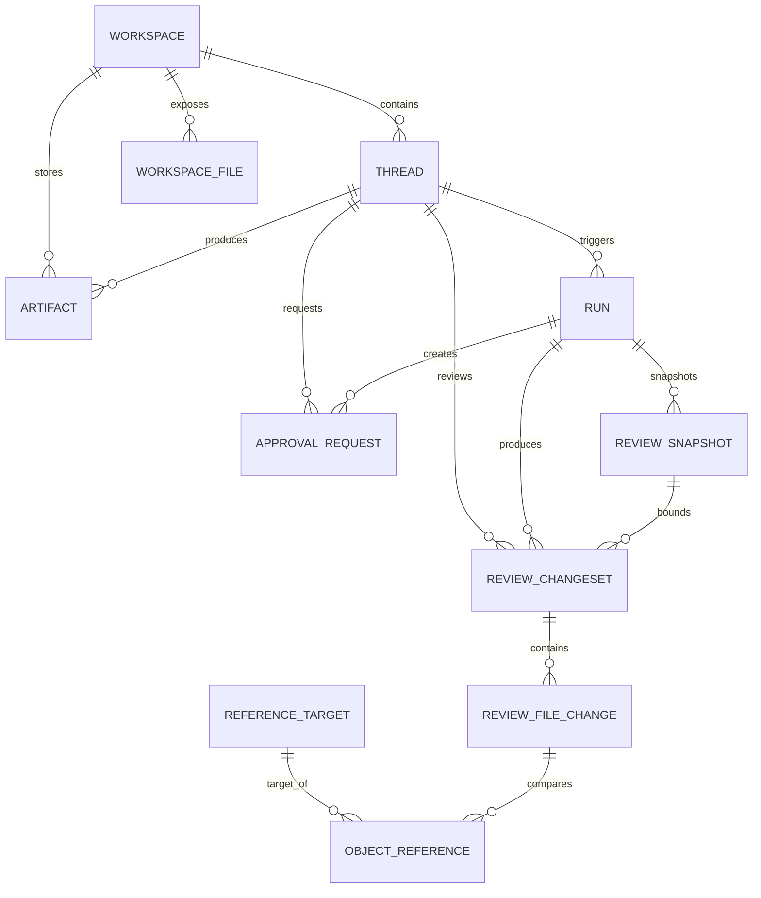
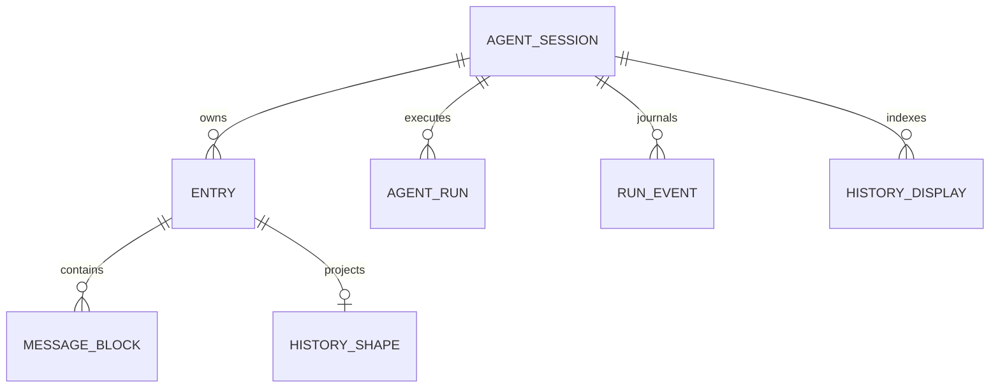

# FutureOS objects and storage relations

> ([中文](ER.zh-CN.md))

## 1. Design goals

This document describes the core objects FutureOS phase one needs to persist
and manage, and the relations between them.

It is not a database migration file but a design draft between the product
model and the data model. Field types, indexes, constraints, and compatibility
plans must be synced here; implementation-layer migration rules follow
`desktop/CLAUDE.md`'s "Released database migrations".

> **Post-release migration boundary.** The GUI SQLite has been officially
> released. Every database structure or persisted-data-shape change first
> diffs against the nearest reachable official tag as the baseline; migrations
> already present in that tag cannot be modified, and only unreleased
> migrations may keep being adjusted. Related changes for one target release
> tag are in principle merged into one new migration, verifying both
> "upgrading the previous tag's old database" and "a fresh database with the
> current schema".

Phase-one design focus:

- Support two work entries, Workspace and ordinary Chat; Workspace supports
  open (deduplicated by path), rename, and soft delete (cascading soft delete
  of child conversations).
- Support Thread create, resume, rename, pin, archive, and delete.
- Support persisting Message, Run, and Run Events (messages and events are now
  persisted by the Agent; the GUI only stores additional data like Run state —
  see §4.3, §4.5).
- Support artifacts, Data sources, and Skills. (Research removed — see §4.12.)
- Support unified reference objects for `@`-referencing Artifacts, files, and
  Data Sources.
- Support approval objects for approving or rejecting high-risk operations.
- Support Review objects for change comparison of files, code, and text-like
  artifacts.

## 2. Core relation overview

> Message / Run Event / Tool Call / Tool Output are no longer GUI SQLite
> objects: they are persisted by Agent SQLite (`~/.future/agent/agent.db`, the
> only source of truth), and the GUI reads and projects them via gRPC. See
> §4.3, §4.5–4.7. Data Source / Skill related objects are deprecated — see
> §4.14–4.17.

## 3. Naming conventions

- `Workspace`: a project or work context, including user-chosen directories and
  system auto-created temporary workspaces.
- `Thread`: a user-visible conversation. Product-wise split into ordinary Chat
  and Workspace conversations.
- `Message`: a message in a conversation.
- `Run`: one Agent execution.
- `Run Event`: structured events produced during a Run.
- `Tool Call`: a record of the Agent calling a tool.
- `Approval Request`: a high-risk operation needing user approval or
  rejection.
- `Review Changeset`: a change set available for user review.
- `Review File Change`: a specific change of one file or artifact within a
  Review Changeset.
- `Artifact`: a reusable product produced during work.
- `Data Source`: an accessible data entry in the Data module.
- `Reference Target`: the index layer of unified reference objects, for `@`
  references and cross-object references.

## 4. Object design

### 4.1 Workspace

A Workspace represents a project or work context.

Field draft:

| Field | Description |
| --- | --- |
| `id` | Workspace unique identifier |
| `name` | display name |
| `kind` | `user` or `temporary` |
| `path` | local directory path |
| `description` | optional description |
| `pinned` | pinned or not (leads the workspace list; toggled from the group menu) |
| `cleanup_status` | `active`, `pending_cleanup`, `cleaned` |
| `cleanup_requested_at` | when cleanup was requested |
| `cleaned_at` | when cleanup actually completed |
| `last_opened_at` | most recent open time |
| `created_at` | creation time |
| `updated_at` | update time |
| `deleted_at` | soft-delete time |

Relations:

- One Workspace can contain multiple Threads.
- One Workspace can contain multiple Artifacts.
- One Workspace can expose multiple Workspace Files.

Notes:

- When the user explicitly picks a project directory, a `kind = user`
  Workspace is created. Deduplicated by `path`: opening an already-registered
  (not soft-deleted) directory reuses the existing `kind = user` record — no
  new one.
- An ordinary Chat auto-creates a `kind = temporary` Workspace behind the
  scenes, not prominently shown in the UI.
- Deleting a Workspace conversation does not delete the Workspace directory.
- Cleaning an ordinary Chat can mark its temporary Workspace as
  `pending_cleanup`, then `cleaned` after cleanup completes.
- Workspace rename (change `name`) and delete are supported. Delete is a **soft
  delete**: in one transaction set the Workspace's `deleted_at` and
  cascade-soft-delete its non-deleted Threads (`status = 'deleted'` +
  `deleted_at`); the on-disk directory and files are untouched. If the deleted
  one is a `temporary` Workspace, additionally mark
  `cleanup_status = 'pending_cleanup'`. Backend:
  `store::workspaces::{rename_workspace, delete_workspace}`.
- Pinning (change `pinned`) is supported. It is an ordering flag, not activity:
  `last_opened_at` / `updated_at` stay put, so unpinning returns the group to
  its recency position. `list_workspaces` still returns recency order (the new
  conversation picker reads its first entry as the most recently used
  workspace); the workspace list surfaces — the desktop rail and the phone's
  workspace tab — order their groups by the flag themselves. Backend:
  `store::workspaces::pin_workspace`.

### 4.2 Thread

A Thread represents a recoverable, continuable, manageable conversation.

Field draft:

| Field | Description |
| --- | --- |
| `id` | Thread unique identifier |
| `workspace_id` | owning Workspace |
| `mode` | `chat` or `workspace` |
| `title` | conversation title |
| `status` | `active`, `archived`, `deleted` |
| `pinned` | pinned or not |
| `readonly` | read-only or not |
| `agent_session_id` | GUI Thread ↔ Agent SQLite session mapping; non-null values globally unique, one Agent session binds at most one Desktop Thread; queried via RPC, no cross-database foreign key (`store/schema.rs`) |
| `parent_session_id` | local projection of the parent Agent session ID; null means a root conversation. Written by startup sync, runtime discovery, and forks; no foreign key — a parent session may be imported later than its child or already deleted. The Agent remains the relation source of truth. |
| `last_message_at` | most recent message time |
| `last_opened_at` | most recent open time |
| `created_at` | creation time |
| `updated_at` | update time |
| `archived_at` | archive time |
| `deleted_at` | delete time |

Relations:

- One Thread belongs to one Workspace.
- One Thread contains multiple Messages.
- One Thread can trigger multiple Runs.
- One Thread can produce multiple Artifacts.
- One Thread can produce multiple Approval Requests.
- One Thread can produce multiple Review Changesets.
- One Thread can be produced by forking another Thread or by loop-derived
  execution. `parent_session_id` resolves to the parent Thread via
  `agent_session_id`; the GUI displays at most three levels; a nonexistent
  parent promotes the child to root. The `v1.1.6-thread-parent-session`
  migration is a released database column addition; relation sync does not
  change activity times, and rebinding another Agent session clears the old
  relation.
- One Agent session maps to at most one Thread; the database unique index is
  the final constraint under concurrent imports, and notifications, event
  stream reconnects, and low-frequency full reconciliation reuse the same
  get-or-create semantics.
- The Desktop's install-level `device_id` is the source of
  `session_created.creatorId`; it is independent of remote pairing and
  survives Debug Reset. `createdBy` only expresses the client category; a
  future `clientId` should express a process or connection instance.

Notes:

- Ordinary Chats use `mode = chat`.
- Workspace conversations use `mode = workspace`.
- Titles are generated by default; the user can modify them.
- Archived conversations are hidden and read-only by default, but searchable.
- When the user clicks the input box in an archived conversation, the product
  auto-guides recovery before continuing.
- Fork: copy out a new Thread and an independent Agent session from the chosen
  user round (`fork_thread` → `fork_agent_session`); inherits the parent
  Thread's `mode` and, in workspace mode, its workspace; the title defaults to
  "Parent title (fork)". The Agent remaps run identities and saves independent
  SQLite history; the Desktop syncs its run projections and does not fabricate
  Runs from assistant message counts; tool details are read from the new
  session's message blocks.
- Model and thinking level are **no longer Thread columns**
  (`model_provider` / `model_id` / `thinking_level` were removed from old
  databases via `DROPPED_COLUMNS`): the authoritative state lives in the Agent
  session; the GUI reads it via `get_thread_agent_state` and switches via
  `set_model` / `set_thinking_level`, affecting only later runs of that
  session and never interrupting in-progress runs.

### 4.3 Message

A Message is one message in a conversation.

**GUI storage: the `messages` table is deleted (`DROPPED_TABLES` clears it in
old databases).** Messages are persisted by Agent SQLite's `entries` and
`message_blocks`, the only source of truth; the GUI reads them via the
`get_session_entries` gRPC command and projects them into UI messages — no GUI
SQLite and no second copy needing merge arbitration.

Relations:

- One Message logically belongs to one Thread (mapped to the Agent session via
  the Thread's `agent_session_id`).
- One Message can relate to one Run (Agent table `entries.run_id`, RPC field
  `runId`).
- One Message can contain multiple Object References.

Notes:

- Streaming output is driven by the Agent event stream (see §4.5) and projected
  by the GUI in real time; after the run ends, SQLite history calibrates it.
  The RPC uses ordered `blocks` and no longer returns the old
  `content/thinking/tool_calls` fields in parallel.
- Attachment metadata (`path` / `kind` / `name` / `thumbnail`) is returned via
  `metadata.attachments`, stored in entry extended metadata; attachment bodies
  remain files — no standalone attachment table.

### 4.4 Run

A Run is one Agent execution, usually triggered by a user message.

Field draft:

| Field | Description |
| --- | --- |
| `id` | Run unique identifier |
| `thread_id` | owning Thread |
| `trigger_message_id` | the user message that triggered the Run |
| `status` | `queued`, `running`, `waiting_approval`, `completed`, `failed`, `cancelled` |
| `model_provider` | model provider |
| `model_id` | model id |
| `started_at` | start time |
| `ended_at` | end time |
| `error_message` | error info |
| `error_type` | structured error classification (`stream_interrupted`, `command_failed`, `model_failed`, `abort_requested`, `timeout`, `interrupted`, `unknown`, etc.; paired with `run_error.rs`, NULL when not failed) |
| `archived_at` | archive time; when non-null the run is not shown in the right "Runs" list, but the record and Agent events are kept for command-detail jumps from the intermediate information flow |
| `created_at` | creation time |
| `updated_at` | update time |

Relations:

- One Run belongs to one Thread.
- One Run can contain multiple Run Events.
- One Run can contain multiple Tool Calls.
- One Run can produce multiple Approval Requests.
- One Run can produce multiple Review Changesets.

Notes:

- Run is the GUI's core object for showing plans, tool calls, status, and
  failure recovery.
- Runs present as the "background program" list in the current GUI: running,
  queued, and waiting-for-approval show as active programs; completed, failed,
  and cancelled as ended programs.
- The daily Runs panel only shows program summaries and result status — no
  complete event timelines, long stdout/stderr, tool payloads, or approval
  history. Those belong to future dedicated Debug / Inspect / Review views.
- A running Run can be terminated by the user; after termination its status
  becomes `cancelled`, and that Run's still-pending Approval Requests cancel in
  sync.
- Failed / cancelled Runs support recovery: **Retry** re-launches with the
  user message (`trigger_message_id`, including attachments); **Continue**
  launches with "continue the previous task" + a failure-message summary
  (triggered from the Runs panel, additionally attaching a summary of what was
  already executed). Both apply only to the latest round's uninterrupted Run;
  earlier rounds or interrupted recovery go through Thread fork (see §4.2).
- On long-task recovery, the Thread can restore context display via the most
  recent Run.
- "Archive ended programs" only hides ended Runs from the Runs panel; it does
  not delete the SQLite Run records, Review data, or Agent events; the
  intermediate information flow can still open command details via `run_id`.

### 4.5 Run Event

Run Events are structured events produced during a Run.

**GUI storage: the `run_events` table is deleted (`DROPPED_TABLES` clears it in
old databases).** Agent SQLite still has its own `run_events` table, the event
recovery source of truth; the GUI reads it by cursor via `get_events_since`.
High-frequency deltas use 100 ms / 128 entries / 64 KiB micro-batches; semantic
events, reads, and closes flush first. There is no GUI JSONL compatibility
read or runtime fallback; the abnormal-exit boundary for uncommitted deltas is
in §7.

Event identity and ordering: every event carries a run-monotonic `idx`, a
session-level `session_idx`, a cross-run `run_sequence`, and an `event_id`; GUI
observers verify by cursor before fanning out (replay dedup, gaps trigger
reconnect replay), guaranteeing no disorder and no duplicates.

Event types (consistent with the proto vocabulary):

- `agent_start` / `agent_end` — Run lifecycle (`agent_end` carries the
  authoritative error / usage / duration totals)
- `user_message` — user prompt
- `text_chunk` — assistant text increment
- `thinking_start` / `thinking_delta` / `thinking_end` — reasoning stream
- `tool_start` / `tool_delta` / `tool_end` — tool execution
- `approval_request` / `approval_decision` — approvals
- `usage` — token metering
- `error` — Run error
- `tool_sandboxed` / `persistence_error` / `compaction_end` — sideband signals

Notes:

- The GUI renders streaming preview and tool activity from Run Events;
  persistent tool lists and details query message blocks directly instead of
  rebuilding by replaying the whole round's events (see §4.6, §4.7).
- The right Runs panel does not show raw complete Run Events directly; long
  outputs and debug details are carried by the Run inspector.

### 4.6 Tool Call

A Tool Call records the Agent calling a tool.

**Storage: the GUI `tool_calls` table is deleted.** Agent `message_blocks`
`tool_call` blocks keep the call identity, name, and raw JSON arguments.
Desktop's `list_tool_calls` / `list_tool_calls_bulk` read through the Agent's
paged tool query, isolated by `sessionId + runId + toolCallId`, with no JSONL
fallback. Real-time events still serve the streaming UI; `tool_start`'s
in-memory input index still serves artifact extraction and is not the
historical source of truth.

Fields (projection struct `ToolCallRecord`):

| Field | Description |
| --- | --- |
| `id` | Tool Call unique identifier (agent-stable tool id) |
| `run_id` | owning Run |
| `name` | tool name |
| `kind` | tool category (same source as name: shell, read, write, edit, etc.) |
| `input` | tool input (`tool_args`) |
| `status` | `running`, `completed`, `failed` |
| `started_at` | start time |
| `ended_at` | end time |
| `created_at` | creation time |

Relations:

- One Tool Call belongs to one Run.
- One Tool Call can trigger an Approval Request
  (`approval_requests.tool_call_id`, nullable).
- One Tool Call's output can produce a file Artifact (registered by
  `persist.rs` after a successful write / edit).

### 4.7 Tool Output

A Tool Output is the output a tool call produced.

**Storage: the GUI `tool_outputs` table is deleted.** Agent `message_blocks`
`tool_result` blocks keep `text` and `is_error`; `get_tool_output` queries by
session, run, and call identity. Desktop's `list_tool_outputs` maps results
into inspector records instead of replaying events. The following is the
Desktop-internal `ToolOutputRecord`, not the Agent RPC field definition.

Fields (projection struct `ToolOutputRecord`):

| Field | Description |
| --- | --- |
| `id` | Tool Output unique identifier |
| `tool_call_id` | owning Tool Call |
| `kind` | `text` or `error` |
| `content` | output content (JSON string) |
| `created_at` | creation time |

Notes:

- Shell non-zero exits are judged failed by the `[exit: N]` tail marker (with
  the exemption that bare grep/diff/test exiting 1 is a normal signal).
- Large outputs do not go into the GUI database — details read Agent SQLite
  message blocks on demand.

### 4.8 Approval Request

An Approval Request is a high-risk operation needing user approval or
rejection.

It answers "may this execute" and does not show file diffs. File diffs and
change comparison belong to Review Changeset.

Field draft:

| Field | Description |
| --- | --- |
| `id` | Approval Request unique identifier |
| `thread_id` | owning Thread |
| `run_id` | source Run |
| `tool_call_id` | source Tool Call, nullable |
| `kind` | `shell_command`, `file_read`, `file_write`, `file_delete`, `network_access`, `data_access`, `batch_operation`, `outside_workspace_write` |
| `status` | `pending`, `approved`, `rejected`, `cancelled` |
| `title` | title |
| `summary` | summary |
| `risk_level` | `low`, `medium`, `high` |
| `requested_action` | the operation about to execute (raw JSON, backward compatible) |
| `action_category` | P2 structured field: action category |
| `action_payload` | P2 structured field: complete action JSON |
| `sandbox_boundary` | P2 structured field: sandbox boundary info JSON |
| `reviewer` | reviewer, `user` or `auto_review` (reserved) |
| `decision_scope` | decision scope, `once`, `session`, `always` (reserved); currently only `once` |
| `decision_source` | decision source, `user`, `rule` (reserved), `sandbox` (reserved) |
| `decision_note` | user decision note, nullable |
| `decided_at` | user decision time |
| `created_at` | creation time |
| `updated_at` | update time |

Relations:

- One Approval Request belongs to one Thread.
- One Approval Request can come from a Run or a Tool Call.

Notes:

- The approval UI belongs to the middle conversation area's immediate
  interaction layer, shown above the composer; the right context panel carries
  no approval actions and offers no approval history tab.
- The UI shows at most one `pending` Approval Request at a time. With the
  current approval undecided, the Agent should stop at the corresponding
  dangerous operation and wait for an explicit allow or deny — no approval
  timeout.
- The first-version approval UI must show the operation type, impact scope,
  change summary, deny, allow-once, and view details.
- Approval supports keyboard shortcuts: `Esc` deny, `Cmd/Ctrl + Enter`
  allow-once.
- The `requested_action` preview needs readable rendering; over-long content
  scrolls inside the UI, at most one third of the window height.
- Batch operations use `batch_operation` for a set of file writes, batch
  deletes, batch commands, or high-risk actions across multiple resources.
- **Product design:** ordinary reads outside the workspace are not intercepted
  and produce no `outside_workspace_read` approval; sensitive paths are still
  handled as `file_read` by the non-overridable sensitive-file guards. Writes /
  edits / deletes outside the workspace keep going through
  `outside_workspace_write` etc.
- Leftover `pending` approvals after a GUI or Agent restart are **not**
  unconditionally cancelled: startup convergence keeps them, and
  `reconcile_pending_approvals` (once at startup + periodic watchdog) decides
  against the Agent `get_state.pendingApprovals` authoritative set — cards the
  Agent is still waiting on are kept (the run revives and returns to
  `waiting_approval`), and only those the Agent no longer holds (decided
  elsewhere, aborted, or lost in the Agent's own restart) become `cancelled`;
  locally missing ones can be rebuilt from the Agent payload. Non-terminal Runs
  are likewise not cancelled at startup but converge via
  `reconcile_interrupted_runs` + `reanimate_run` + the active-run watchdog per
  the Agent's actual state (the Agent may still be running during a GUI crash;
  a run settles only when the Agent confirms it is gone).
- If an approval later produces file changes, Review Changeset shows the actual
  modification comparison.
- P2 introduces structured `action_payload` and `sandbox_boundary` fields
  (design details in git history, the original `P2_APPROVAL_MODEL.md`).
- **v2 (approval rule refactor, 2026-07-04)**: ordinary approval objects
  converge to **file-path access**, rules become **file-based**
  (`${WS}/.future/approval_rule.json`, `~/.future/approval_rule.json`, read
  directly by the agent); manual shell and macOS/Linux escalation remain
  whole-command approvals — full semantics in [SANDBOX/COMMON.md](SANDBOX/COMMON.md).
  Accordingly:
  - `approval_requests` gains `save_suggestion` (TEXT, JSON) — the suggested
    rule `{path, access, action}` for the approval card's "allow in this
    workspace/conversation"; empty for sensitive files (allow-once only).
  - **The three reserved config tables `sandbox_config` /
    `approval_policy_config` / `approval_rules` are deleted** (2026-07-05) —
    they became dead structures once rules moved to files; the
    `store/approval_config.rs` module and the three record types were removed
    together. Empty tables left in old databases are harmless (no code
    references them); new databases no longer create them. Phase 2 briefly used
    `approval_rules` to store rules delivered over gRPC; v2 dismantled that
    chain.
  - `kind` gains `sandbox_escalation` (escalation approval for out-of-boundary
    bash failures); `outside_workspace_read` is a deprecated old enum variant
    no longer produced by the current implementation.

### 4.9 Review Changeset

A Review Changeset is a change set available for user review.

It answers "what changed", focusing on comparing changes of files, code, or
text-like artifacts.

Field draft:

| Field | Description |
| --- | --- |
| `id` | Review Changeset unique identifier |
| `thread_id` | owning Thread |
| `run_id` | source Run, nullable |
| `tool_call_id` | source Tool Call, nullable |
| `title` | title |
| `summary` | change summary |
| `status` | `draft`, `ready`, `viewed`, `applied`, `discarded` |
| `files_changed` | number of changed files |
| `additions` | total added lines |
| `deletions` | total deleted lines |
| `created_at` | creation time |
| `updated_at` | update time |

Relations:

- One Review Changeset belongs to one Thread.
- One Review Changeset can come from a Run or a Tool Call.
- One Review Changeset contains multiple Review File Changes.

Notes:

- A Review Changeset is not an approval request.
- Review covers all Workspace conversations (`mode = workspace`) with two data
  sources (see 4.10's `source_kind`):
  - **Git changes** (Git workspaces only): real-time `git diff`, not persisted
    as a Review Changeset.
  - **Last-round changes** (both workspace types): shadow-snapshot diffs
    solidified into Review Changesets with `source_kind = 'run_snapshot'`.
- Ordinary Chats show no Review; file products enter Artifact management.
  Workspace conversations show no Artifacts, avoiding one file entering both
  the Review and Artifact semantics at once.
- Users can view code diffs and file changes in Review, plus change summaries
  of later text-like artifacts.
- `files_changed`, `additions`, `deletions` display a Git/Codex-style
  per-round change summary, e.g. `2 files +204 -90`.
- The `status` column (`draft`/`ready`/`viewed`/`applied`/`discarded`) belongs
  to the early apply/discard decision flow; that flow's frontend is removed,
  and `run_snapshot` changesets **do not use** the column — their state is
  expressed by `completeness` / `confidence` (see 4.10). The
  `StoredReviewChangeset` type is kept, only still used by markdown
  `futureos://` references.

### 4.10 Review File Change

A Review File Change is a specific change of one file or artifact.

Field draft:

| Field | Description |
| --- | --- |
| `id` | Review File Change unique identifier |
| `changeset_id` | owning Review Changeset |
| `target_type` | `workspace_file` or `artifact` |
| `target_id` | target object id, nullable |
| `path` | file path or artifact path |
| `change_type` | `create`, `modify`, `delete`, `rename` |
| `before_ref` | pre-change content reference, nullable |
| `after_ref` | post-change content reference, nullable |
| `diff` | small text diff, nullable |
| `summary` | change summary |
| `additions` | added lines |
| `deletions` | deleted lines |
| `created_at` | creation time |
| `updated_at` | update time |

Relations:

- One Review File Change belongs to one Review Changeset.
- One Review File Change can reference a Workspace File or an Artifact.

Notes:

- The first version can save text diffs for code and text files.
- Git workspace Review File Changes prefer Git work-tree files.
- Non-Git workspaces / ordinary Chats later do text-diff and summary review
  only for text-like artifacts such as markdown, documents, and tables.
- `additions` and `deletions` only record Git-diff-style simple line-level
  statistics — no complex line-level entity modeling.
- Large diffs can later be stored as files with references kept in the
  database.

#### Shadow Review extension ("last-round changes")

"Last-round changes" is generated by diffing before/after snapshots in
FutureOS's shadow repository (a per-workspace bare git repo at
`~/.future/app/review/<workspace-id>/`, **never creating `.git` inside the
workspace directory**), with `source_kind = 'run_snapshot'`. The shadow repo
only uses git as a content-addressed snapshot and diff engine: read-only, never
checkout / reset / clean, and never modifying the user's real repository's
index / refs / objects / work tree. Design trade-offs in 6.8.

**New `review_snapshots`**: records each Run's before/after snapshots.

| Field | Description |
| --- | --- |
| `id` | snapshot unique identifier |
| `workspace_id` / `thread_id` / `run_id` | ownership |
| `phase` | `before` / `after` |
| `commit_id` / `tree_id` | shadow-repo commit / tree (discardable cache, not the source of truth) |
| `status` | `complete` / `partial` / `failed` |
| `file_count` / `total_bytes` / `ignored_count` / `omitted_count` | snapshot statistics |
| `error_message` | failure reason |
| `created_at` | creation time |

Constraint `UNIQUE(run_id, phase)`.

**Extended `review_changesets`**: `source_kind` (`run_snapshot` /
`native_git`), `workspace_id`, `before_snapshot_id`, `after_snapshot_id`,
`binary_files`, `omitted_files`, `completeness` (`complete` / `partial`),
`confidence` (`normal` / `recovered`), `overlapped` (0/1), `error_message`.
`run_snapshot` changesets do not participate in apply/discard; the old
`status` column is not used for them.

**Extended `review_file_changes`**: `previous_path`, `binary`, `before_size`,
`after_size`, `mime`, `diff_truncated`, `omission_reason`. When the after
snapshot solidifies, each text file's unified diff is written into the
existing `diff` column — the **source of truth** for "last-round changes";
the frontend reads SQLite directly and never re-computes from the shadow repo;
binary files record only size / mime, no diff.

**Derived state**: the API layer derives `RunReview.snapshotStatus`
(`complete` / `partial` / `incomplete` / `unavailable`) from the snapshot
`status` + changeset `completeness` — not persisted. Non-Git workspaces use the
simplified tier, producing only `complete` or `unavailable` (any
before/after/diff failure collapses to `unavailable`); `partial` /
`incomplete` / `recovered` appear only in Git workspaces. `overlapped`
(concurrent-window overlap) is orthogonal to those states and passed through
separately.

### 4.11 Artifact

> **Artifact is removed from the product roadmap and the panel no longer
> displays it, but the table is still written normally** — `persist_file_artifact`
> keeps registering after every successful write / edit, and historical data
> keeps accumulating. The identity and dedup rules below therefore remain
> valid.

An Artifact is a reusable product produced during work.

Field draft:

| Field | Description |
| --- | --- |
| `id` | Artifact unique identifier |
| `workspace_id` | owning Workspace |
| `thread_id` | source Thread, nullable |
| `run_id` | source Run, nullable |
| `title` | display title |
| `artifact_type` | `document`, `table`, `chart`, `diff`, `summary`, `report`, `data_result`, etc. |
| `path` | local file path, nullable |
| `content` | small-artifact content, nullable |
| `content_storage` | `inline` or `file` |
| `summary` | summary |
| `created_at` | creation time |
| `updated_at` | update time |
| `deleted_at` | delete time |

Relations:

- One Artifact belongs to one Workspace.
- One Artifact can come from a Thread or a Run.
- One Artifact can become a referenced object.

Identity and dedup (`idx_artifacts_thread_path`):

- **A file Artifact's identity is (`thread_id`, `path`), not Run.** The same
  file written and then edited in later Runs is one work product — the panel
  must show exactly one row in its latest state, not one row per change.
  Enforced by the partial unique index
  `idx_artifacts_thread_path ON artifacts(thread_id, path) WHERE deleted_at IS
  NULL AND path IS NOT NULL`.
- `store::ensure_artifact` upserts accordingly: on hit, update `run_id` /
  `summary` / `content` / `updated_at` (pointing at the latest change) and keep
  the first-generation `created_at`; on miss, insert.
- Inline artifacts without `path` have no file identity; they dedup by
  (`run_id`, `title`) and are excluded by the partial index above.
- Rows soft-deleted by the user (`deleted_at`) do not participate in dedup:
  the Agent later rewriting the same file starts a new row — intuitive.
- The index is not in `SCHEMA` for now, only in `ADDED_INDEXES` — databases
  written by early versions may contain duplicate rows, which must first be
  folded by `db::dedupe_file_artifacts` (keep the most recently changed row in
  each group, inheriting the group's earliest `created_at`) before the index
  can be created, and `SCHEMA` runs before the compatibility steps.
- `dedupe_file_artifacts` is a **historical compatibility cleanup before the
  release baseline**, not a model for future schema changes. No more
  delete/repair logic appended to the startup path; its removal, replacement,
  or any new data repair must be a separate versioned migration verified per
  `desktop/CLAUDE.md`'s tag boundary rules.
- Panel sorting is `updated_at DESC`: one row has folded all the file's
  changes; using `created_at` would pin a file the Agent just rewrote to its
  first-appearance position.

Notes:

- An Artifact's `content` only stores small content.
- Large content always goes through file paths: `content_storage = file` with
  `path` filled.
- Artifacts produced by ordinary Chats live under the temporary Workspace.
- When cleaning an ordinary Chat, the user can download Artifacts.
- Input-box attachments are not auto-registered as Artifacts and are not copied
  into the ordinary Chat / Workspace working directory. The Artifacts panel's
  active upload is a separate flow.
- **Attachment persistence directory** (not part of Artifact/SQLite, a pure
  file tree): under `~/.future/app/images/<threadId>/`, `thumb/` keeps
  thumbnails of all image attachments, `origin/` keeps pasted images and
  phone-uploaded attachments without a stable desktop original path.
  Attachment metadata (`path` / `kind` / `name` / `thumbnail`) lives in Agent
  SQLite entry metadata, returned via RPC `metadata.attachments`; the GUI has
  no message copy — **no standalone attachment table**.
- **Reclamation**: `images/<tid>` has no per-delete executor; it relies on the
  startup `reconcile_orphan_images` orphan sweep — directories whose tid has
  `status='deleted'` or no row in `threads` are deleted (no soft-delete undo);
  a whole-database reset additionally clears the entire `images/` tree. Covers
  GUI deletion, TUI/CLI external session deletion, and reset.

### 4.12–4.13 Research Collection / Research Resource (removed, no tables created)

> **Not shipped before the first release; removed from the schema.** The
> Research module (material collections + settled research material) had no
> decided data model, storage form, or product shape; to avoid future migration
> burden the first version **creates no tables**: the `research_collections`
> and `research_resources` tables with their CRUD, commands, and frontend views
> were removed wholesale, and `apply_schema` clears them from old databases via
> `DROPPED_TABLES` (`store/schema.rs`) with `DROP TABLE IF EXISTS`.
>
> The product record was removed from PRODUCT.md. Restarting Research later
> requires redesigning the data model and rewriting this section.

### 4.14–4.17 Data Source / Data Credential / Skill / Skill Enablement (deprecated)

> **Deprecated and deleted from the schema (2026-07-07).** These four tables
> (`data_sources`, `data_credentials`, `skills`, `skill_enablements`) were
> created by early schemas but never wired to any CRUD code:
> - The **Data module** (CSV/TSV/MySQL data sources) was not in the first
>   version and is now deprecated.
> - **Skill** moved to the **official platform catalog + filesystem** route
>   (`GET {platform}/client/v1/skills` → download and install into
>   `~/.future/agent/skills`), not stored in the database; semantics in
>   PRODUCT.md §4.8, implementation in `src-tauri/src/skills.rs`.
>
> `apply_schema` clears them from old databases via `DROPPED_TABLES`
> (`store/schema.rs`) with `DROP TABLE IF EXISTS`. Restarting the Data feature
> later requires a redesign and rewriting this section.

### 4.18 Workspace File

A Workspace File is a file in the workspace that can be indexed, referenced, or
displayed.

Field draft:

| Field | Description |
| --- | --- |
| `id` | Workspace File unique identifier |
| `workspace_id` | owning Workspace |
| `path` | relative or absolute path |
| `name` | file name |
| `mime_type` | file type |
| `size` | file size |
| `last_seen_at` | most recent scan time |
| `created_at` | creation time |
| `updated_at` | update time |

Relations:

- One Workspace File belongs to one Workspace.
- One Workspace File can become a referenced object.

Notes:

- The first version may record referenced or Agent-read files on demand; it
  need not fully index the whole directory.

### 4.19 Reference Target

Reference Target is the index layer of unified reference objects.

Field draft:

| Field | Description |
| --- | --- |
| `id` | Reference Target unique identifier |
| `target_type` | the implemented resolver uses **short names** (see `store/markdown_refs/resolve.rs`): `artifact`, `file`, `run`, `tool`, `approval`, `review`. Data/Skill references for `data_source`, `skill` are unimplemented (fall into the "not supported yet" branch); `research` was removed wholesale with the Research module (see §4.12); the rest are design drafts |
| `target_id` | target object id |
| `scope` | `global` or `workspace` |
| `workspace_id` | owning Workspace, nullable |
| `title` | display title |
| `subtitle` | display subtitle |
| `search_text` | search text |
| `created_at` | creation time |
| `updated_at` | update time |

Relations:

- Artifact, Run, Tool Call, Approval Request, Review Changeset, Workspace
  File, Data Source, and Skill can all register as Reference Targets.
- Objects like Message and Review File Change can point to Reference Targets
  through Object References.

Notes:

- `@` search and referencing mainly query Reference Targets.
- Reference Target unifies display and search; it does not replace the
  original objects.
- Reference Target supports global objects, e.g. global Data Sources and
  global Skills.

### 4.20 Object Reference

An Object Reference means one object references another object.

Field draft:

| Field | Description |
| --- | --- |
| `id` | Object Reference unique identifier |
| `source_type` | `message`, `review_file_change`, `artifact`, etc. |
| `source_id` | source object id |
| `reference_target_id` | the referenced object |
| `created_at` | creation time |

Notes:

- Objects `@`-referenced in Messages can be recorded as Object References.
- Files or artifacts compared by Review File Changes can also be recorded as
  Object References.

## 5. First-version suggested table list

First-version priority:

- `workspaces`
- `threads`
- `runs`
- `approval_requests`
- `review_changesets`
- `review_file_changes`
- `review_snapshots`
- `artifacts`
- `workspace_files`
- `reference_targets`
- `object_references`
- `app_settings` (app-level settings key-value table: `approval_tier`
  (`manual`/`sandbox`/`off`), `hidden_models`, `remote_pair_id`,
  `show_thinking`, `auto_compact_first_turn` (boolean, absent means false;
  opt-in standalone compaction after the first answer only; uses the existing
  key-value table without a schema migration) — see `store/app_settings.rs`;
  the old `remote_enabled` /
  `remote_nats_url` keys are no longer read, runtime state lives in memory and
  addresses are derived from the platform environment)
- `agent_delete_outbox` (the Agent session deletion delivery queue registered
  when deleting a Thread, retried in the background until the Agent confirms —
  see `store/deletions.rs`)

> `messages`, `run_events`, `tool_calls`, `tool_outputs` were deleted from the
> GUI schema (`DROPPED_TABLES` clears them in old databases); their data is
> persisted by the independent Agent SQLite — see §4.3, §4.5–4.7, §7.
>
> `research_collections`, `research_resources` were once in this list and were
> deleted from the schema because Research was removed before the first release
> (see §4.12–4.13).
>
> `data_sources`, `data_credentials`, `skills`, `skill_enablements` were once in
> this list and were deleted from the schema on 2026-07-07 (never wired — see
> §4.14–4.17).
>
> The P2 approval scaffolding's three reserved tables (`sandbox_config`,
> `approval_policy_config`, `approval_rules`) were deleted on 2026-07-05 — dead
> structures once rules moved to files — see §4.8.

## 6. Key design decisions

### 6.1 Chat and Workspace conversations unified as Thread

Product-wise there are two entries, Chat and Workspace conversations, but
data-wise they are unified as Thread.

This lets message, Run, Artifact, Approval, Review, recovery, archive, and pin
capabilities reuse one structure.

### 6.2 Ordinary Chats use temporary Workspaces

Ordinary Chats do not require the user to pick a project directory, but tool
execution and artifact generation still need a workspace.

So ordinary Chats auto-create a temporary Workspace behind the scenes. The UI
does not highlight this Workspace, but the data relations stay consistent.

Temporary Workspaces need explicitly recorded cleanup state, to support
cleanup-confirmation, cleaning, and cleaned states.

### 6.3 Approval and Review separated

Approval answers "may this execute".

Review answers "what changed".

Therefore:

- High-risk operations — shell commands, file writes, deletes, network access,
  data access, batch operations, reads beyond the workspace scope, etc. —
  enter Approval Request.
- Change comparisons of files, code, markdown, documents, tables, etc. enter
  Review Changeset / Review File Change.
- A Review Changeset can be `viewed`, meaning the user has looked but not yet
  applied or discarded.

The first version needs no `reverted` state for Review Changesets; discarding
from the never-applied state and undo after apply are both handled by existing
states and operation records for now.

The first version does not split a sub-operation table for
`batch_operation`; the batch operation's summary and structured content are
first recorded in `requested_action`.

### 6.4 Reference objects modeled independently

Artifact, Run, Tool Call, Approval Request, Review Changeset, Workspace File,
Data Source, and Skill can all be `@`-referenced or referenced by markdown
`futureos://` links.

To avoid implementing search and reference per object type, unified indexing
goes through Reference Target, with Object Reference recording the reference
relations.

Reference Target must support global objects, e.g. global Data Sources and
global Skills.

### 6.5 Research moved out (removed)

The Research module was removed wholesale from the product design (PRODUCT.md
no longer keeps Research entries); the data model is in §4.12–4.13. (The
number is kept to avoid misaligning later sections with §6.8/§6.9 and
desktop/CLAUDE.md references.)

### 6.6 Data credentials separated from model credentials

Data Credential only serves Data Sources.

Model provider keys belong to model or app settings and do not enter Data
Source / Data Credential.

### 6.7 Large content goes through file paths

An Artifact's `content` only holds small content.

Large content uniformly goes through file paths; the database only keeps path,
summary, and meta info.

### 6.8 "Last-round changes" uses the shadow repo for Run-level diffs

Review has two data sources: "Git changes" reads the user's real Git
repository's work-tree diff; "Last-round changes" reads the diff FutureOS's
shadow repository computes from each Run's before/after snapshots (schema in
4.10).

Key trade-offs:

- **Write isolation**: the shadow repo is physically separate from the real
  repo (`~/.future/app/review/<workspace-id>/`), reads real-repo objects only
  for acceleration, never writes the real repo, and never creates `.git` in
  user directories. This gives non-Git workspaces accurate Run-level diffs
  without polluting user directories.
- **The diff solidifies immediately as the source of truth**: right after the
  after snapshot lands, the patch is computed and written into SQLite
  (`review_file_changes.diff`); shadow commits / trees degrade into
  discardable caches. Even if the real repo later gets `git gc`'d, moved, or
  the shadow repo cleaned, stored diffs still display.
- **Honest attribution**: snapshots can only compute "what changed in the
  workspace during the run window", not absolutely distinguish Agent / user /
  formatter — the underlying semantic is workspace_delta; concurrent Run
  overlaps mark `overlapped`, failures mark `unavailable`; restart recovery
  tiers by whether the after snapshot needs re-capture — if after was captured
  while running and only post-hoc materialization was incomplete, recover as
  `normal` (delta fully attributable); only when after must be re-captured
  after restart is it marked `recovered`; never lie about attribution or fake
  "no changes".
- **Two reliability tiers**: Git workspaces borrow the real repo's object store
  for acceleration plus the full reliability machinery (`partial` /
  `incomplete` / `recovered` / restart recovery); non-Git workspaces use the
  simplified tier (failure = `unavailable`, and over-size directories get the
  red line `changePreview = unsupported_too_large` turning preview off),
  trading for implementation simplicity.
- **Scope and retention**: only `thread.mode = workspace` wires into Shadow
  Review; ordinary Chats keep using Artifacts and create no shadow data. Each
  Thread keeps the latest 10 changesets by default; beyond that old refs and DB
  projections are cleaned. Deleting a Workspace record cleans its shadow repo
  and review data in sync.

### 6.9 Provider / model / login config lives in agent config files, not GUI SQLite

Providers, models, and login credentials do not enter the GUI's SQLite but are
read from and written to the agent's config files (shared with the CLI):

- `~/.future/agent/auth.json`: API keys by provider id (including the built-in
  `future`).
- `~/.future/agent/models.json`: `providers.<id>` custom provider config
  (`name` / `api` / `baseUrl` / `models` / `compat` …), merged over the
  built-in catalog. Custom `models[].reasoning` resolves as `true` when
  unfilled; the GUI explicitly writes the boolean via Agent RPC when saving,
  and catalog completion does not overwrite it. `ProviderModel.reasoning`
  keeps presence in protobuf so old clients that never sent it still default
  on; `ModelEntry.reasoning` carries the effective capability into the session
  picker. This change needs no JSON file or GUI SQLite migration.

The "community edition" is only a GUI SQLite `app_settings.community_edition`
display preference: it hides the balance/recharge entries in the footer and
account page and converges the Providers page's Future actions into ordinary
built-in provider manual-key configuration; it never migrates, clears, or
rewrites the agent login, key, and model config above.
- `~/.future/agent/settings.json`: `defaultModel`, `enabledModels` (the model
  visibility whitelist), etc. Title generation has no persisted preference.
  The user-triggered `generate_session_title` RPC returns `{title, model}` without
  mutating the conversation. Its `mode` field carries the requesting UI locale
  (`zh` / `en`). Desktop maps `generate_thread_title` to that session RPC; mobile
  uses the remote bridge. Existing rename operations save the user-confirmed
  result. No database migration is required.

Key trade-offs:

- **Config write ownership**: the production write path for Provider/API Key
  is submitted by the Desktop through Agent RPC; the Agent persists and
  refreshes runtime config; with the Agent unreachable it fails explicitly —
  the GUI never writes a second config copy. Desktop's `config_io` still
  handles Desktop-own config, approval rules, Remote credentials, and a few
  platform environment settings; the helpers in `agent_providers/write.rs`
  that directly write `models.json` / `auth.json` are only for isolated
  storage tests. All local JSON writes keep following strict parsing (bad JSON
  / non-object → **error**), atomic replacement, and per-path serial locks,
  with owner-only permissions for sensitive files.
- **FutureGene login is independently implemented in the Tauri backend**
  (`future_login.rs` + `commands/login.rs`): device-code OAuth goes through the
  **platform root** (`POST {platform}/client/v1/oauth/device/code` → poll
  `/client/v1/oauth/device/token`), replicating the CLI's protocol without
  calling the CLI; the frontend `FutureLoginDialog` drives polling with
  `usePolling` (start 2s, `slow_down` backoff, `attemptId` guard); only after
  authorization succeeds are `auth.json.future`'s `key` and `base_url`
  (`= {platform}/api`, consistent with the CLI `saveAuth`, so GUI/CLI logins
  land identical `auth.json` files) written. The platform URL is resolved by
  `future_platform::resolve_future_platform_url` (`future.platform_base_url`
  ?? `future.base_url` with trailing `/api` stripped ?? default
  `https://future-os.cn`), aligned with the CLI `getPlatformUrl()`; the model
  API base is `{platform}/api/v1` (`resolve_future_base_url`, shown on the
  Providers page). The resolver was extracted from `agent_providers` into the
  standalone `future_platform.rs` (shared by login/skills/debug, so those
  modules no longer depend on the Providers page). Before opening the
  authorization page only the scheme (http/https) is validated — no host
  binding (the authorization page is on a different domain).
- **Headless login**: `--headless` reuses the `future_login` device
  authorization protocol but opens no browser; the terminal shows the
  authorization URL, user code, and QR code, and the authorization poll is
  Rust-driven, handling expiry, rejection, `slow_down`, and Ctrl+C
  cancellation. The Agent must be reachable first; successful credentials are
  still submitted via Agent RPC — no second account store and no direct-write
  fallback. The platform login QR and the phone pairing QR later scanned in
  the app are two phases.
- **Effect timing**: the agent reloads auth per session / command
  (`AuthStore::load()`); a new session round after login takes effect
  immediately — usually no agent restart needed.
- **Compatibility credential priority**: the Agent reads
  `~/.future/agent/auth.json` first; only when that file is missing,
  unreadable, or unparseable does it try the old
  `~/.future/agent-app/auth.json`. The two are not merged. The production
  write path writes the former, so the old file never overrides current
  config.
- **Model visibility**: the GUI controls display with the app settings'
  `hiddenModels` (opt-out); the agent's `enabledModels` (opt-in whitelist)
  restricts the `list_models` return set when non-empty — combined, a newly
  logged-in provider's models can be blocked by an old whitelist (see the
  PLAN.md backlog).
- **Field validation**: custom provider id (lowercase `[a-z0-9_-]`) / name
  (ASCII; no Chinese / emoji / fullwidth) / Base URL (http(s)) / models etc.
  rules are in PLAN.md's "Custom provider field validation" — frontend
  immediate + backend authoritative.

## 7. Agent SQLite storage

### 7.1 Ownership and transaction boundaries

`~/.future/agent/agent.db` is the authoritative database for sessions, history
bodies, run results, and recovery events; `~/.future/app/app.db` independently
stores Desktop workspaces, Threads, Run UI states, approvals, Reviews, etc. —
no database merging and no cross-database foreign keys. A Desktop Run is a
projection of interaction state and execution results, not a second copy of
conversation bodies. There is exactly one Agent per OS user, and clients can
only reach it over RPC.

The diagram shows physical ownership. Entry/event run associations are logical
relations: old imports may lack run markers and session-level events have no
Run — a mandatory Run foreign key must not discard such legitimate data.
Parent sessions may likewise be missing. `legacy_imports` deliberately has no
session foreign key, to preserve deletion tombstones.

### 7.2 Tables, fields, and indexes

Implementation source of truth: `agent/src/session/database.rs`; storage
reconstruction view: `records.rs`. Business IDs are TEXT, sequence/UTC
milliseconds/counts are INTEGER, unknown optional values use SQL NULL.
Internal event epoch/idx still follow the existing recovery coordinates and
are not the same as the public history RPC's optional fields.

| Table | PK and main fields | Duty and constraints |
| --- | --- | --- |
| `sessions` | PK `id`; `revision`, `created_at_ms`, `updated_at_ms`, `current_metadata_json` | exactly one copy of current session settings; JSON validity checks. `title/cwd/model/thinking_level/parent_session_id` are virtual generated columns — no duplicate truth maintained. A non-negative revision means a recoverable session; -1 is the internal placeholder when the event stream is bound first and never appears in ordinary session lists |
| `entries` | PK `(session_id,position)`; `entry_id/entry_type/role/run_id/timestamp_ms/metadata_json/content_json` | `session_id` foreign key cascades; `(session_id,entry_id)` unique. `entries_kind` serves kind/order queries, `entries_run` serves run-range queries; position is separate from business IDs |
| `message_blocks` | PK `(session_id,entry_position,ordinal)`; `kind/text/tool_call_id/tool_name/arguments_json/is_error/metadata_json` | composite foreign key cascades to the entry; ordinal non-negative, is_error NULL/0/1. `message_blocks_tool(session_id,tool_call_id,kind)` serves tool-result retrieval; run isolation via entries joins |
| `runs` | PK `(session_id,run_id)`; `status/run_sequence/epoch/started_at_ms/completed_at_ms/error` | foreign key cascades to session; `runs_status(session_id,status,run_sequence)` serves status queries. Input/output/cache tokens, duration, and input/cache baselines are independent columns; baselines only convert cumulative usage into per-round usage |
| `run_events` | INTEGER PK `sequence`; `session_id/run_id/epoch/idx/event_id/payload` | foreign key cascades to session; unique `(session_id,run_id,idx,epoch)` prevents coordinate conflicts; non-empty custom event_ids use the `(session_id,event_id)` partial unique index. sequence is the physical write order, not a client cursor |
| `history_shapes` | PK `(session_id,position)`; `payload` | foreign key cascades to the entry; body-free derived structures for pairing, dedup, placeholders, and run annotations |
| `history_display` | PK `(session_id,ordinal)`; `source_position/is_user/payload` | foreign key cascades to session; `history_users(session_id,is_user,ordinal)` serves reverse-order whole-round paging. source_position nullable, meaning a synthetic placeholder; not a second body copy |
| `legacy_imports` | PK `session_id`; `status/fingerprint/error_file/error_line/error_kind/warnings` | status limited to imported/skipped/deleted; per-session import result and anti-resurrection tombstone, no bodies |
| `storage_meta` | PK `key`; `value` | database-level control flags, e.g. the one-time import completion state |

JSON preservation boundaries:

- Message bodies, reasoning, tool calls, and results are stored as ordered
  blocks; already-columnized data is not re-written into block metadata. Tool
  arguments are arbitrary JSON by nature; JSON values including explicit null
  are preserved.
- An Entry's non-block content (like checkpoints and run markers) keeps
  `content_json`; block arrays use the `[]` marker and rebuild from the block
  table — bodies are not stored twice. `session_info` content rebuilds only
  from the session's current settings.
- Entry metadata keeps extensions, attachment references, and the exact source
  timestamp literal — the latter for duplicate-identity verification; queries
  and public message times use milliseconds. Provider signatures and unknown
  blocks must not be dropped as "useless fields".
- `entry_records` / `block_records` are ordinary SQL VIEWs and take no second
  body storage. They reconstruct Agent-internal records and are not an
  outward-facing JSONL compatibility interface.
- Event payloads are normalized events, not raw provider network bytes;
  session/run identities are recovered from columns; deterministic event_ids
  are not stored twice. Events and completed bodies have an intentional
  content overlap for disconnect recovery; this cycle does not purge events or
  change the expired-cursor protocol.

### 7.3 Write, paging, and performance boundaries

One bounded dedicated database worker thread orders all database operations;
the connection uses WAL, FULL sync, foreign keys, and a 5-second busy timeout.
Short transaction commits are the critical write-success boundary. Entries,
blocks, run results, and history indexes are maintained in one transaction,
rolling back wholesale on failure; same-identity different-content reports a
conflict — never silently ignored.

Deltas write in 100 ms / 128 entries / 64 KiB micro-batches; non-delta
semantic events, reads, switches, and closes form commit barriers. An abnormal
exit can lose deltas still in the queue; 100 ms is not a hard loss ceiling;
committed completed bodies do not depend on UI memory. The prompt queue is
memory-only with no restart recovery promise.

The first history query selects only the latest user rounds' bodies; older
pages fetch on demand; no complete model context is initialized. Index
maintenance still traverses lightweight structures but reads no full bodies;
this is linear write cost and must not be claimed as constant complexity.
Indexing can be independently incrementalized later without changing the
message-block or RPC data model. Reverse-order pages keep complete rounds; a
single exceptionally large round can still produce a large page; forward pages
additionally have an 8 MiB target budget, with a single over-budget entry still
allowed to return to advance the cursor.

Tool lists page through the block table, and output details read on demand; a
whole round's events are not replayed to display the right panel. Body and
event read ranges push down to SQLite; no full-text, temporal, or large-JSON
indexes are created without an actual query need, avoiding increased event
write amplification.

### 7.4 External contract and release

Agent and Desktop/Mobile/TUI/CLI release in sync; no old/new RPC mixing. The
existing history/message/fork interfaces uniformly use
`id/kind/role/runId/createdAtMs/blocks/metadata/usage/run`; the state interface
returns `usage` and `requestedRun` together, and lists use `updatedAtMs`;
missing parent sessions use null. The raw real-time event recovery protocol is
kept independently — no new legacy-field aliases or dual-format responses. The
Desktop-internal Tauri UI records still map per their duties and do not pass
for the Agent's public RPC.

The Agent's current `application_id` is `0x46555452`; `user_version=2` is only
this database's schema identifier — not an RPC version, and it does not mean a
published v1 exists that must be supported. Development layouts keep no
upgrade chain; unknown databases/unsupported layouts are explicitly refused,
never auto-rebuilt. After official release, schema migrations must be
maintained; Desktop's released migrations keep following §1's non-modifiable
boundary.

Old JSONL is read only by the one-time importer with originals kept; corrupt
sessions are skipped in isolation, and global storage errors block startup.
Operations, privacy, and backup boundaries are in
[SQLite migration](../../architecture/sqlite-migration.md).
