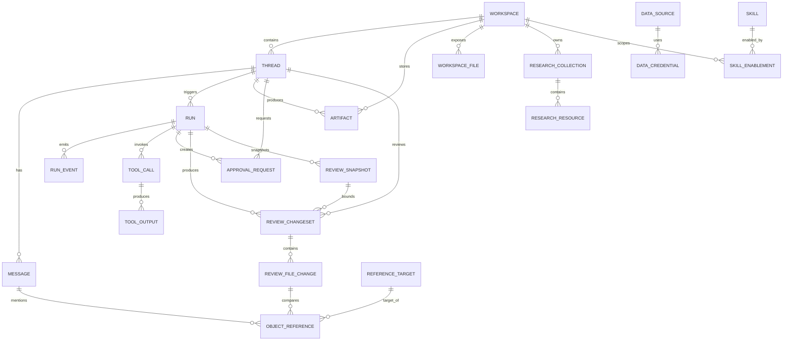

# FutureOS 对象与关联设计草案

## 1. 设计目标

这份文档用于描述 FutureOS 第一阶段需要持久化和管理的核心对象，以及对象之间的关联关系。

它不是最终数据库迁移文件，而是产品模型到数据模型之间的设计草案。后续实现数据库时，可以在此基础上继续细化字段类型、索引、约束、迁移策略和兼容方案。

第一阶段设计重点：

- 支持 Workspace 与普通 Chat 两种工作入口。
- 支持 Thread 创建、恢复、重命名、置顶、归档、删除。
- 支持消息、Run、Run Event 的持久化。
- 支持 artifacts、Research resources、Data sources、Skills。
- 支持统一引用对象，用于 `@` 引用 Research Resource、Artifact、文件和 Data Source。
- 支持审批对象，用于高风险操作的批准或拒绝。
- 支持 Review 对象，用于文件、代码和文本类 artifact 的变更对比。

## 2. 核心关系总览

## 3. 命名约定

- `Workspace`：项目或工作上下文，包括用户选择的目录和系统自动创建的临时工作空间。
- `Thread`：用户可见的一段对话。产品上分为普通 Chat 和 Workspace 对话。
- `Message`：对话中的消息。
- `Run`：一次 Agent 执行。
- `Run Event`：Run 过程中产生的结构化事件。
- `Tool Call`：Agent 调用工具的记录。
- `Approval Request`：需要用户批准或拒绝的高风险操作。
- `Review Changeset`：一组可供用户 review 的变更集合。
- `Review File Change`：Review Changeset 中某个文件或 artifact 的具体变更。
- `Artifact`：工作过程中产生的可复用产物。
- `Research Resource`：Research 中沉淀的研究材料。
- `Data Source`：Data 模块中可访问的数据入口。
- `Reference Target`：统一引用对象的索引层，供 `@` 引用和跨对象引用使用。

## 4. 对象设计

### 4.1 Workspace

Workspace 表示一个项目或工作上下文。

字段草案：

| 字段 | 说明 |
| --- | --- |
| `id` | Workspace 唯一标识 |
| `name` | 展示名称 |
| `kind` | `user` 或 `temporary` |
| `path` | 本地目录路径 |
| `description` | 可选描述 |
| `cleanup_status` | `active`、`pending_cleanup`、`cleaned` |
| `cleanup_requested_at` | 请求清理时间 |
| `cleaned_at` | 实际清理完成时间 |
| `last_opened_at` | 最近打开时间 |
| `created_at` | 创建时间 |
| `updated_at` | 更新时间 |
| `deleted_at` | 软删除时间 |

关系：

- 一个 Workspace 可以包含多个 Thread。
- 一个 Workspace 可以包含多个 Artifact。
- 一个 Workspace 可以包含多个 Research Collection。
- 一个 Workspace 可以暴露多个 Workspace File。

说明：

- 用户明确选择项目目录时，创建 `kind = user` 的 Workspace。
- 普通 Chat 背后自动创建 `kind = temporary` 的 Workspace，但 UI 不突出展示。
- 删除 Workspace 对话不删除 Workspace 目录。
- 清理普通 Chat 时，可以把对应临时 Workspace 标记为 `pending_cleanup`，清理完成后标记为 `cleaned`。

### 4.2 Thread

Thread 表示用户可恢复、可继续、可管理的一段对话。

字段草案：

| 字段 | 说明 |
| --- | --- |
| `id` | Thread 唯一标识 |
| `workspace_id` | 所属 Workspace |
| `mode` | `chat` 或 `workspace` |
| `title` | 对话标题 |
| `status` | `active`、`archived`、`deleted` |
| `pinned` | 是否置顶 |
| `readonly` | 是否只读 |
| `model_provider` | 最近或默认模型 provider |
| `model_id` | 最近或默认模型 |
| `last_message_at` | 最近消息时间 |
| `last_opened_at` | 最近打开时间 |
| `created_at` | 创建时间 |
| `updated_at` | 更新时间 |
| `archived_at` | 归档时间 |
| `deleted_at` | 删除时间 |

关系：

- 一个 Thread 属于一个 Workspace。
- 一个 Thread 包含多个 Message。
- 一个 Thread 可以触发多个 Run。
- 一个 Thread 可以产生多个 Artifact。
- 一个 Thread 可以产生多个 Approval Request。
- 一个 Thread 可以产生多个 Review Changeset。

说明：

- 普通 Chat 使用 `mode = chat`。
- Workspace 对话使用 `mode = workspace`。
- 标题默认生成，用户可以修改。
- 归档对话默认隐藏、只读，但允许搜索命中。
- 用户在归档对话中点击输入框时，产品自动引导恢复后继续。

### 4.3 Message

Message 表示对话中的一条消息。

字段草案：

| 字段 | 说明 |
| --- | --- |
| `id` | Message 唯一标识 |
| `thread_id` | 所属 Thread |
| `run_id` | 关联 Run，可为空 |
| `role` | `user`、`assistant`、`system`、`tool` |
| `content_type` | `text`、`markdown`、`mixed` |
| `content` | 消息正文 |
| `status` | `complete`、`streaming`、`failed` |
| `created_at` | 创建时间 |
| `updated_at` | 更新时间 |

关系：

- 一个 Message 属于一个 Thread。
- 一个 Message 可以关联一个 Run。
- 一个 Message 可以包含多个 Object Reference。

说明：

- Assistant 流式输出时，可以先创建 `status = streaming` 的 Message，再逐步更新内容。
- 工具结果可以作为 Message，也可以由 Tool Output 单独记录；第一版可保留两者兼容空间。

### 4.4 Run

Run 表示一次 Agent 执行，通常由用户消息触发。

字段草案：

| 字段 | 说明 |
| --- | --- |
| `id` | Run 唯一标识 |
| `thread_id` | 所属 Thread |
| `trigger_message_id` | 触发 Run 的用户消息 |
| `status` | `queued`、`running`、`waiting_approval`、`completed`、`failed`、`cancelled` |
| `model_provider` | 模型 provider |
| `model_id` | 模型 id |
| `started_at` | 开始时间 |
| `ended_at` | 结束时间 |
| `error_message` | 错误信息 |
| `created_at` | 创建时间 |
| `updated_at` | 更新时间 |

关系：

- 一个 Run 属于一个 Thread。
- 一个 Run 可以包含多个 Run Event。
- 一个 Run 可以包含多个 Tool Call。
- 一个 Run 可以产生多个 Approval Request。
- 一个 Run 可以产生多个 Review Changeset。

说明：

- Run 是 GUI 展示计划、工具调用、状态和失败恢复的核心对象。
- Run 在当前 GUI 中以“后台程序”列表呈现：运行中、排队中、等待审批显示为活动程序；完成、失败、取消显示为已结束程序。
- 日常 Runs 面板只展示程序摘要和结果状态，不承载完整 event timeline、长 stdout/stderr、tool payload 或审批历史。这些内容应进入后续专门 Debug / Inspect / Review 视图。
- 运行中 Run 可以被用户终止；终止后状态进入 `cancelled`，并同步取消该 Run 下仍然 pending 的 Approval Request。
- 长任务恢复时，Thread 可以通过最近 Run 恢复上下文展示。

### 4.5 Run Event

Run Event 表示 Run 过程中的结构化事件。

字段草案：

| 字段 | 说明 |
| --- | --- |
| `id` | Run Event 唯一标识 |
| `run_id` | 所属 Run |
| `type` | 事件类型 |
| `payload` | 事件数据 |
| `sequence` | Run 内顺序 |
| `created_at` | 创建时间 |

常见事件类型：

- `run.started`
- `message.delta`
- `plan.updated`
- `tool.started`
- `tool.output`
- `tool.completed`
- `approval.requested`
- `approval.decided`
- `approval.cancelled`
- `file.changed`
- `artifact.created`
- `review.created`
- `run.cancelled`
- `run.completed`
- `run.failed`

说明：

- GUI 可根据 Run Event 渲染过程卡片、时间线、工具调用和状态变化。
- 当前右侧 Runs 面板不直接展示完整 Run Event；Run Event 主要服务对话投影、调试视图和后续 timeline / review 能力。
- CLI 后续可以复用 Run Event 输出 JSON 或 NDJSON。

### 4.6 Tool Call

Tool Call 表示 Agent 调用某个工具的记录。

字段草案：

| 字段 | 说明 |
| --- | --- |
| `id` | Tool Call 唯一标识 |
| `run_id` | 所属 Run |
| `name` | 工具名称 |
| `kind` | `shell`、`read_file`、`write_file`、`edit_file`、`data_query`、`research` 等 |
| `input` | 工具输入 |
| `status` | `running`、`completed`、`failed`、`cancelled` |
| `started_at` | 开始时间 |
| `ended_at` | 结束时间 |
| `created_at` | 创建时间 |

关系：

- 一个 Tool Call 属于一个 Run。
- 一个 Tool Call 可以产生多个 Tool Output。
- 一个 Tool Call 可以触发 Approval Request。
- 一个 Tool Call 可以产生 Review Changeset。

### 4.7 Tool Output

Tool Output 表示工具调用产生的输出。

字段草案：

| 字段 | 说明 |
| --- | --- |
| `id` | Tool Output 唯一标识 |
| `tool_call_id` | 所属 Tool Call |
| `kind` | `stdout`、`stderr`、`result`、`error` |
| `content` | 输出内容 |
| `created_at` | 创建时间 |

说明：

- Shell 输出可以按块写入 Tool Output。
- 大输出后续可以考虑落文件，只在数据库保存摘要和引用。

### 4.8 Approval Request

Approval Request 表示需要用户批准或拒绝的高风险操作。

它解决的是“是否允许执行”的问题，不负责展示文件 diff。文件 diff 和变更对比属于 Review Changeset。

字段草案：

| 字段 | 说明 |
| --- | --- |
| `id` | Approval Request 唯一标识 |
| `thread_id` | 所属 Thread |
| `run_id` | 来源 Run |
| `tool_call_id` | 来源 Tool Call，可为空 |
| `kind` | `shell_command`、`file_write`、`file_delete`、`network_access`、`data_access`、`batch_operation`、`outside_workspace_write`、`outside_workspace_read` |
| `status` | `pending`、`approved`、`rejected`、`cancelled` |
| `title` | 标题 |
| `summary` | 摘要 |
| `risk_level` | `low`、`medium`、`high` |
| `requested_action` | 准备执行的操作（原始 JSON，向后兼容） |
| `action_category` | P2 结构化字段：操作类别 |
| `action_payload` | P2 结构化字段：完整 action JSON |
| `sandbox_boundary` | P2 结构化字段：沙盒边界信息 JSON |
| `reviewer` | 审查者，`user` 或 `auto_review`（预留） |
| `decision_scope` | 决策范围，`once`、`session`、`always`（预留），当前仅 `once` |
| `decision_source` | 决策来源，`user`、`rule`（预留）、`sandbox`（预留） |
| `decision_note` | 用户决策备注，可为空 |
| `decided_at` | 用户决策时间 |
| `created_at` | 创建时间 |
| `updated_at` | 更新时间 |

关系：

- 一个 Approval Request 属于一个 Thread。
- 一个 Approval Request 可以来源于 Run 或 Tool Call。

说明：

- 审批界面属于中间对话区的即时交互层，显示在 composer 上方；右侧上下文面板不承载审批操作，也不提供审批历史 tab。
- UI 同时只展示一个 `pending` Approval Request。Agent 当前审批未决时应停在对应危险操作处等待用户明确允许或拒绝，不设置审批超时。
- 第一版审批界面需要展示操作类型、影响范围、修改摘要、拒绝、允许一次、查看详情。
- 审批支持键盘快捷操作：`Esc` 拒绝，`Cmd/Ctrl + Enter` 允许一次。
- `requested_action` 预览需要可读化展示；内容过长时 UI 内部滚动，最大高度不超过窗口高度的三分之一。
- 批量操作使用 `batch_operation`，用于一组文件写入、批量删除、批量命令或跨多个资源的高风险动作。
- 超出当前 workspace 范围的读取对应枚举值 `outside_workspace_read`（与上表 `kind` 一致）。注意：该读取审批**当前尚未实现**，Agent 侧仅对 workspace 外的写入 / 编辑 / 删除（`outside_workspace_write` 等）触发审批。
- GUI 或 Agent 重启后遗留的 `pending` 审批应标记为 `cancelled`，防止旧审批继续显示为可操作状态。
- 如果审批通过后产生文件变更，再由 Review Changeset 展示实际修改对比。
- P2 引入结构化 `action_payload` 和 `sandbox_boundary` 字段（设计细节见 git history，原 `P2_APPROVAL_MODEL.md`）。
- P2 预留了 `sandbox_config`、`approval_policy_config`、`approval_rules` 三张配置表，当前未启用。

### 4.9 Review Changeset

Review Changeset 表示一组可供用户 review 的变更集合。

它解决的是“改了什么”的问题，重点是对比文件、代码或文本类 artifact 的修改。

字段草案：

| 字段 | 说明 |
| --- | --- |
| `id` | Review Changeset 唯一标识 |
| `thread_id` | 所属 Thread |
| `run_id` | 来源 Run，可为空 |
| `tool_call_id` | 来源 Tool Call，可为空 |
| `title` | 标题 |
| `summary` | 变更摘要 |
| `status` | `draft`、`ready`、`viewed`、`applied`、`discarded` |
| `files_changed` | 变更文件数 |
| `additions` | 总新增行数 |
| `deletions` | 总删除行数 |
| `created_at` | 创建时间 |
| `updated_at` | 更新时间 |

关系：

- 一个 Review Changeset 属于一个 Thread。
- 一个 Review Changeset 可以来源于 Run 或 Tool Call。
- 一个 Review Changeset 包含多个 Review File Change。

说明：

- Review Changeset 不表示审批请求。
- Review 覆盖所有 Workspace 对话（`mode = workspace`），有两类数据来源（见 4.10 的 `source_kind`）：
  - **Git changes**（仅 Git workspace）：实时 `git diff`，不落库为 Review Changeset。
  - **上一轮变更**（两类 workspace 都有）：影子快照 diff 固化为 `source_kind = 'run_snapshot'` 的 Review Changeset。
- 普通 Chat 不展示 Review，文件产物进入 Artifact 管理；Workspace 对话不展示 Artifacts，避免同一文件同时进入 Review 和 Artifact 两套语义。
- 用户可以在 Review 中查看代码 diff、文件变更，以及后续文本类 artifact 的变更摘要。
- `files_changed`、`additions`、`deletions` 用于展示类似 Git / Codex 的本轮变更汇总，例如 `2 个文件 +204 -90`。
- `status` 列（`draft`/`ready`/`viewed`/`applied`/`discarded`）属于早期的 apply/discard 决策流；该流程前端已移除，`run_snapshot` changeset **不使用**该列，其状态改由 `completeness` / `confidence` 表达（见 4.10）。`StoredReviewChangeset` 类型保留，仅 markdown `futureos://` 引用仍在用。

### 4.10 Review File Change

Review File Change 表示某个文件或 artifact 的具体变更。

字段草案：

| 字段 | 说明 |
| --- | --- |
| `id` | Review File Change 唯一标识 |
| `changeset_id` | 所属 Review Changeset |
| `target_type` | `workspace_file` 或 `artifact` |
| `target_id` | 目标对象 id，可为空 |
| `path` | 文件路径或 artifact 路径 |
| `change_type` | `create`、`modify`、`delete`、`rename` |
| `before_ref` | 变更前内容引用，可为空 |
| `after_ref` | 变更后内容引用，可为空 |
| `diff` | 小型文本 diff，可为空 |
| `summary` | 变更摘要 |
| `additions` | 新增行数 |
| `deletions` | 删除行数 |
| `created_at` | 创建时间 |
| `updated_at` | 更新时间 |

关系：

- 一个 Review File Change 属于一个 Review Changeset。
- 一个 Review File Change 可以引用 Workspace File 或 Artifact。

说明：

- 第一版针对代码和文本文件可以保存文本 diff。
- Git workspace 的 Review File Change 优先对应 Git 工作树文件。
- 非 Git workspace / 普通 Chat 后续针对 markdown、文档、表格等文本类 artifact，只做文本 diff 和摘要审查。
- `additions` 和 `deletions` 只记录 Git diff 风格的简单行级统计，不做复杂行级实体建模。
- 大型 diff 后续可以落文件，数据库保存引用。

#### Shadow Review 扩展（「上一轮变更」）

「上一轮变更」由 FutureOS 影子仓库（per-workspace 的 bare git repo，位于 `~/.future/app/review/<workspace-id>/`，**不在 workspace 目录建 `.git`**）的 before/after 快照 diff 生成，`source_kind = 'run_snapshot'`。影子仓只把 git 当内容寻址快照与 diff 引擎：只读，从不 checkout / reset / clean，也从不修改用户真实仓的 index / refs / objects / 工作树。设计取舍见 6.8。

**新增 `review_snapshots`**：记录每个 Run 的 before/after 快照。

| 字段 | 说明 |
| --- | --- |
| `id` | 快照唯一标识 |
| `workspace_id` / `thread_id` / `run_id` | 归属 |
| `phase` | `before` / `after` |
| `commit_id` / `tree_id` | 影子仓 commit / tree（可丢弃缓存，非真源） |
| `status` | `complete` / `partial` / `failed` |
| `file_count` / `total_bytes` / `ignored_count` / `omitted_count` | 快照统计 |
| `error_message` | 失败原因 |
| `created_at` | 创建时间 |

约束 `UNIQUE(run_id, phase)`。

**扩展 `review_changesets`**：`source_kind`（`run_snapshot` / `native_git`）、`workspace_id`、`before_snapshot_id`、`after_snapshot_id`、`binary_files`、`omitted_files`、`completeness`（`complete` / `partial`）、`confidence`（`normal` / `recovered`）、`overlapped`（0/1）、`error_message`。`run_snapshot` changeset 不参与 apply/discard，旧 `status` 列对它不使用。

**扩展 `review_file_changes`**：`previous_path`、`binary`、`before_size`、`after_size`、`mime`、`diff_truncated`、`omission_reason`。在 after 快照固化时，每个文本文件的统一 diff 写入既有 `diff` 列，这是「上一轮变更」的**真源**——前端直接读 SQLite，不再回影子仓重算；二进制文件只记 size / mime，不存 diff。

**派生状态**：API 层把 `RunReview.snapshotStatus`（`complete` / `partial` / `incomplete` / `unavailable`）从快照 `status` + changeset `completeness` 派生，不落库。非 Git workspace 走简化档，只产生 `complete` 或 `unavailable`（任何 before/after/diff 失败一律塌缩为 `unavailable`）；`partial` / `incomplete` / `recovered` 只出现在 Git workspace。`overlapped`（并发窗口重叠）与上述状态正交，单独透传。

### 4.11 Artifact

Artifact 表示工作过程中产生的可复用产物。

字段草案：

| 字段 | 说明 |
| --- | --- |
| `id` | Artifact 唯一标识 |
| `workspace_id` | 所属 Workspace |
| `thread_id` | 来源 Thread，可为空 |
| `run_id` | 来源 Run，可为空 |
| `title` | 展示标题 |
| `type` | `document`、`table`、`chart`、`diff`、`summary`、`report`、`data_result` 等 |
| `path` | 本地文件路径，可为空 |
| `content` | 小型 artifact 内容，可为空 |
| `content_storage` | `inline` 或 `file` |
| `summary` | 摘要 |
| `created_at` | 创建时间 |
| `updated_at` | 更新时间 |
| `deleted_at` | 删除时间 |

关系：

- 一个 Artifact 属于一个 Workspace。
- 一个 Artifact 可以来源于一个 Thread 或 Run。
- 一个 Artifact 可以被加入 Research。
- 一个 Artifact 可以成为引用对象。

说明：

- Artifact 的 `content` 只存小内容。
- 大内容全部走文件路径，即 `content_storage = file` 并填写 `path`。
- 普通 Chat 产生的 Artifact 存在临时 Workspace 下。
- 清理普通 Chat 时，用户可以下载 Artifact，或将 Artifact 转入 Research。
- 转入 Research 后不保留原始对话引用。
- 用户在普通 Chat 上传的图片附件会保存到临时工作目录并登记为 Artifact（`type = image`，`content_storage = file`），同时作为多模态输入传给模型。Workspace 对话上传的图片附件不落盘、不创建 Artifact，只传给模型，避免污染用户项目目录。

### 4.12 Research Collection

Research Collection 表示 Research 模块中的资料集合。

字段草案：

| 字段 | 说明 |
| --- | --- |
| `id` | Research Collection 唯一标识 |
| `workspace_id` | 所属 Workspace |
| `name` | 名称 |
| `description` | 描述 |
| `created_at` | 创建时间 |
| `updated_at` | 更新时间 |

关系：

- 一个 Workspace 可以有多个 Research Collection。
- 一个 Research Collection 包含多个 Research Resource。

说明：

- 第一版可以先为每个科研 workspace 创建一个默认 Research Collection。

### 4.13 Research Resource

Research Resource 表示 Research 中沉淀的研究材料。

字段草案：

| 字段 | 说明 |
| --- | --- |
| `id` | Research Resource 唯一标识 |
| `collection_id` | 所属 Research Collection |
| `source_artifact_id` | 来源 Artifact，可为空 |
| `title` | 标题 |
| `type` | `paper`、`webpage`、`note`、`table`、`dataset_note`、`summary`、`artifact` 等 |
| `source_uri` | 来源链接或文件路径 |
| `content` | 小型内容，可为空 |
| `content_storage` | `inline` 或 `file` |
| `summary` | 摘要 |
| `metadata` | 作者、年份、DOI、标签等 |
| `created_at` | 创建时间 |
| `updated_at` | 更新时间 |

关系：

- 一个 Research Resource 属于一个 Research Collection。
- 一个 Research Resource 可以来自 Artifact。
- 一个 Research Resource 可以成为引用对象。

说明：

- 对话产物转入 Research 时，可以生成 Research Resource。
- 按产品决策，转入 Research 后不保留原始对话引用。
- 大内容同样走文件路径。

### 4.14 Data Source

Data Source 表示 Data 模块中可访问的数据入口。

字段草案：

| 字段 | 说明 |
| --- | --- |
| `id` | Data Source 唯一标识 |
| `name` | 展示名称 |
| `kind` | `csv`、`tsv`、`mysql` |
| `scope` | `global` 或 `workspace` |
| `workspace_id` | 绑定 Workspace，可为空 |
| `config` | 非敏感配置 |
| `readonly` | 是否只读 |
| `created_at` | 创建时间 |
| `updated_at` | 更新时间 |
| `deleted_at` | 删除时间 |

关系：

- 一个 Data Source 可以绑定 Workspace，也可以全局可用。
- 一个 Data Source 可以关联 Data Credential。
- 一个 Data Source 可以成为引用对象。

说明：

- 第一版支持 CSV / TSV 文件。
- 第一版支持一个 MySQL 数据库数据源，且只做只读查询。
- 模型 provider key 不存放在 Data Source 中。

### 4.15 Data Credential

Data Credential 表示 Data Source 需要的访问凭证。

字段草案：

| 字段 | 说明 |
| --- | --- |
| `id` | Data Credential 唯一标识 |
| `data_source_id` | 所属 Data Source |
| `credential_ref` | 凭证引用 |
| `created_at` | 创建时间 |
| `updated_at` | 更新时间 |

说明：

- ER 设计只记录凭证引用，不建议直接保存明文 secret。
- Data Credential 与模型 provider key 彻底分开。

### 4.16 Skill

Skill 表示 Agent 可使用的能力。

字段草案：

| 字段 | 说明 |
| --- | --- |
| `id` | Skill 唯一标识 |
| `name` | 名称 |
| `description` | 描述 |
| `kind` | `builtin`、`user`、`marketplace` |
| `version` | 版本 |
| `created_at` | 创建时间 |
| `updated_at` | 更新时间 |

说明：

- 第一版只做本地内置 Skill。
- 用户自定义 Skill 和 marketplace 放入长期任务。

### 4.17 Skill Enablement

Skill Enablement 表示 Skill 在某个范围内是否启用。

字段草案：

| 字段 | 说明 |
| --- | --- |
| `id` | Skill Enablement 唯一标识 |
| `skill_id` | Skill |
| `scope` | `global` 或 `workspace` |
| `workspace_id` | Workspace，可为空 |
| `enabled` | 是否启用 |
| `created_at` | 创建时间 |
| `updated_at` | 更新时间 |

说明：

- 支持全局启用和 workspace 级启用。

### 4.18 Workspace File

Workspace File 表示 workspace 中可被索引、引用或展示的文件。

字段草案：

| 字段 | 说明 |
| --- | --- |
| `id` | Workspace File 唯一标识 |
| `workspace_id` | 所属 Workspace |
| `path` | 相对路径或绝对路径 |
| `name` | 文件名 |
| `mime_type` | 文件类型 |
| `size` | 文件大小 |
| `last_seen_at` | 最近扫描时间 |
| `created_at` | 创建时间 |
| `updated_at` | 更新时间 |

关系：

- 一个 Workspace File 属于一个 Workspace。
- 一个 Workspace File 可以成为引用对象。

说明：

- 第一版可以按需记录被引用或被 Agent 读取过的文件，不必完整索引整个目录。

### 4.19 Reference Target

Reference Target 是统一引用对象的索引层。

字段草案：

| 字段 | 说明 |
| --- | --- |
| `id` | Reference Target 唯一标识 |
| `target_type` | `artifact`、`run`、`tool_call`、`approval_request`、`review_changeset`、`research_resource`、`workspace_file`、`data_source`、`skill` |
| `target_id` | 目标对象 id |
| `scope` | `global` 或 `workspace` |
| `workspace_id` | 所属 Workspace，可为空 |
| `title` | 展示标题 |
| `subtitle` | 展示副标题 |
| `search_text` | 搜索文本 |
| `created_at` | 创建时间 |
| `updated_at` | 更新时间 |

关系：

- Artifact、Run、Tool Call、Approval Request、Review Changeset、Research Resource、Workspace File、Data Source、Skill 都可以注册为 Reference Target。
- Message、Review File Change 等对象可以通过 Object Reference 指向 Reference Target。

说明：

- 用户通过 `@` 搜索和引用时，主要查询 Reference Target。
- Reference Target 负责统一展示和搜索，不替代原始对象。
- Reference Target 支持全局对象，例如全局 Data Source 和全局 Skill。

### 4.20 Object Reference

Object Reference 表示某个对象引用了另一个对象。

字段草案：

| 字段 | 说明 |
| --- | --- |
| `id` | Object Reference 唯一标识 |
| `source_type` | `message`、`review_file_change`、`artifact` 等 |
| `source_id` | 来源对象 id |
| `reference_target_id` | 被引用对象 |
| `created_at` | 创建时间 |

说明：

- Message 中 `@` 引用的对象可以记录为 Object Reference。
- Review File Change 对比的文件或 artifact 也可以记录为 Object Reference。

## 5. 第一版建议表清单

第一版建议优先落地：

- `workspaces`
- `threads`
- `messages`
- `runs`
- `run_events`
- `tool_calls`
- `tool_outputs`
- `approval_requests`
- `review_changesets`
- `review_file_changes`
- `review_snapshots`
- `artifacts`
- `research_collections`
- `research_resources`
- `data_sources`
- `data_credentials`
- `skills`
- `skill_enablements`
- `workspace_files`
- `reference_targets`
- `object_references`
- `app_settings`（应用级设置：`auto_approve` / `hidden_models`，见 `store/app_settings.rs`）

> 另有 P2 审批脚手架的预留表（schema 已建、未接线，详见 §4.8）：`sandbox_config`、`approval_policy_config`、`approval_rules`。

## 6. 关键设计决策

### 6.1 Chat 与 Workspace 对话统一为 Thread

产品上有 Chat 和 Workspace 对话两种入口，但数据上统一为 Thread。

这样可以让消息、Run、Artifact、Approval、Review、恢复、归档、置顶等能力复用同一套结构。

### 6.2 普通 Chat 使用临时 Workspace

普通 Chat 不要求用户选择项目目录，但工具运行和 artifact 生成仍需要工作空间。

因此普通 Chat 背后应自动创建临时 Workspace。UI 不突出展示这个 Workspace，但数据关系保持一致。

临时 Workspace 需要显式记录清理状态，用于支持清理确认、清理中、已清理等状态。

### 6.3 Approval 与 Review 分离

Approval 解决“是否允许执行”的问题。

Review 解决“改了什么”的问题。

因此：

- Shell 命令、文件写入、删除、网络访问、数据访问、批量操作、超出 workspace 范围的读取等高风险操作进入 Approval Request。
- 文件、代码、markdown、文档、表格等变更对比进入 Review Changeset / Review File Change。
- Review Changeset 可以处于 `viewed`，表示用户看过但暂未应用或丢弃。

第一版不需要为 Review Changeset 增加 `reverted` 状态；从未应用状态丢弃和已应用后的撤销暂时都归入现有状态和操作记录处理。

第一版不为 `batch_operation` 单独拆子操作表，批量操作的摘要和结构化内容先记录在 `requested_action` 中。

### 6.4 引用对象独立建模

Research Resource、Artifact、Run、Tool Call、Approval Request、Review Changeset、Workspace File、Data Source、Skill 都可以被 `@` 引用或被 markdown 中的 `futureos://` 链接引用。

为了避免每种对象分别实现搜索和引用，建议通过 Reference Target 做统一索引，再通过 Object Reference 记录引用关系。

Reference Target 需要支持全局对象，例如全局 Data Source 和全局 Skill。

### 6.5 Research 转入不保留原始对话引用

普通 Chat 清理前，用户可以把产物转入 Research。

按产品决策，转入 Research 后不保留原始对话引用。Research Resource 可以保留来源类型和基础元信息，但不依赖原 Thread 继续存在。

### 6.6 Data 凭证与模型凭证分离

Data Credential 只服务 Data Source。

模型 provider key 属于模型或应用设置，不进入 Data Source / Data Credential。

### 6.7 大内容走文件路径

Artifact 和 Research Resource 的 `content` 只用于存放小内容。

大内容统一走文件路径，数据库只保存路径、摘要和元信息。

### 6.8 「上一轮变更」用影子仓求 Run 级 diff

Review 有两个数据源：「Git changes」读用户真实 Git 仓库的工作树 diff；「上一轮变更」读 FutureOS 影子仓库对每轮 Run before/after 快照求出的 diff（schema 见 4.10）。

关键取舍：

- **写隔离**：影子仓与真实仓物理分离（`~/.future/app/review/<workspace-id>/`），只读真实仓对象做加速，从不写真实仓，也不在用户目录建 `.git`。这样非 Git workspace 也能拿到准确的 Run 级 diff，且不污染用户目录。
- **diff 立即固化为真源**：after 快照落盘后立即算出 patch 写入 SQLite（`review_file_changes.diff`），影子 commit / tree 降级为可丢弃缓存。即使日后真实仓 `git gc`、移动或影子仓被清理，已存 diff 仍可展示。
- **归属诚实**：快照只能算出“运行窗口内 workspace 发生了什么变化”，无法绝对区分 Agent / 用户 / formatter，底层语义是 workspace_delta；并发 Run 重叠标 `overlapped`，重启恢复标 `recovered`，失败标 `unavailable`，绝不谎称归属或伪装“无变化”。
- **两档可靠性**：Git workspace 借用真实仓对象库加速 + 完整可靠性机制（`partial` / `incomplete` / `recovered` / 重启恢复）；非 Git workspace 走简化档（失败即 `unavailable`，并对超体积目录用红线 `changePreview = unsupported_too_large` 关闭预览），换取实现简单。
- **适用范围与保留**：仅 `thread.mode = workspace` 接入影子 Review；普通 Chat 继续用 Artifacts，不创建影子数据。每个 Thread 默认保留最近 10 个 changeset，超出后清理旧 refs 与 DB 投影。删除 Workspace 记录时同步清理其影子仓与 review 数据。

### 6.9 Provider / 模型 / 登录配置存于 agent 配置文件，不落 GUI SQLite

Provider、模型与登录凭证不进 GUI 的 SQLite，而是读写 agent 的配置文件（与 CLI 共用）：

- `~/.future/agent/auth.json`：按 provider id 存 API key（含内置 `future`）。
- `~/.future/agent/models.json`：`providers.<id>` 自定义 provider 配置（`name` / `api` / `baseUrl` / `models` / `compat` …），合并在内置 catalog 之上。
- `~/.future/agent/settings.json`：`defaultModel`、`enabledModels`（模型可见白名单）等。

关键取舍：

- **auth.json 统一收口到 `auth_store`**（`src-tauri/src/auth_store.rs`）：唯一写入口——严格解析（坏 JSON / 非对象 → 报错，不静默覆盖；缺文件 → 空对象）、原子写（同目录 temp + `rename`）、`0600` 权限（unix）。登录、退出、自定义 provider 的 key 写入都走它，避免某条路径把权限改回默认或吞掉损坏文件。
- **FutureGene 登录在 Tauri 后端独立实现**（`future_login.rs` + `commands/login.rs`）：设备码 OAuth（`POST {base}/v1/oauth/device/code` → 轮询 `/v1/oauth/device/token`），协议复刻 CLI 但不调用 CLI；前端 `FutureLoginDialog` 用 `usePolling` 驱动轮询（起始 2s、`slow_down` 退避、`attemptId` 守卫），授权成功后才写 `auth.json.future.key`。base URL 取 `auth.json.future.base_url` ?? 默认 Future API。打开授权页前只校验 scheme（http/https），不绑定 host（授权页在不同域）。
- **生效时机**：agent 按会话 / 命令重载 auth（`AuthStore::load()`），登录后新开一轮会话即生效，通常无需重启 agent。
- **agent-app 优先级（已知限制）**：agent 读 auth 时 `~/.future/agent-app/auth.json` 优先于 `~/.future/agent/auth.json`（取第一个存在的，不合并）；GUI 只写后者，若存在前者会被忽略——与 CLI 同款行为，本期不处理。
- **模型可见性**：GUI 用应用设置里的 `hiddenModels`（opt-out）控制展示；agent 的 `enabledModels`（opt-in 白名单）非空时会限制 `list_models` 返回集——两者叠加时新登录 provider 的模型可能被旧白名单挡住（见 PLAN.md 待办）。
- **字段校验**：自定义 provider 的 id（小写 `[a-z0-9_-]`）/ 名称（ASCII，禁中文 / emoji / 全角）/ Base URL（http(s)）/ 模型 等规则见 PLAN.md「自定义 Provider 字段校验」，前端即时 + 后端权威。
