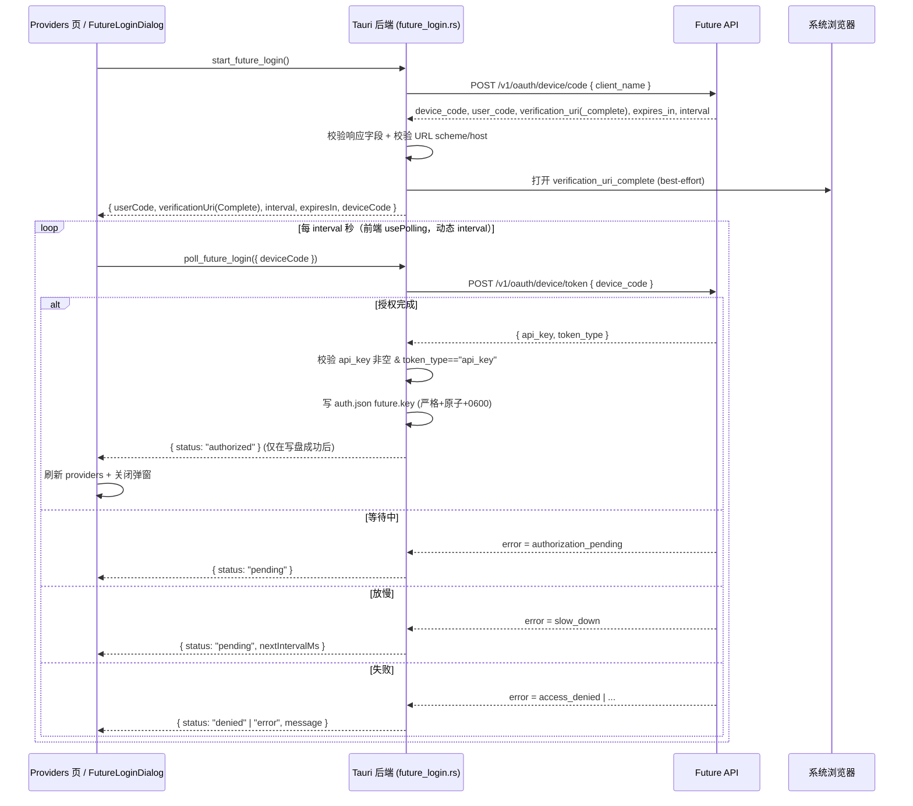

# FutureGene 登录设计（GUI 内置 Provider）

更新时间：2026-06-24

GUI 在 **Settings ▸ Providers** 的内置 **FutureGene** 行提供「连接」按钮，点击后在 GUI 内**独立**走设备码 OAuth（device authorization grant），成功后把 API key 写入 `~/.future/agent/auth.json` 的 `future` 条目。协议复刻 CLI（`cli/src/commands/auth.ts`），但不调用 CLI、不共享代码，GUI 自带实现。

自定义 Provider 的增删改保持现状（`agent_providers.rs` + `CustomProviderDialog`）；本设计只新增 FutureGene 登录，并顺带把**写 `auth.json` 的路径统一收口到一个严格、安全、原子的 helper**（自定义 Provider 的 auth 写入也改走它，见 §4.3）。

## 1. 范围与原则

- 仅针对内置 FutureGene provider（id = `future`）。它在 Providers 页一直是只读展示，本设计为它补上「连接 / 重新登录 / 退出登录」。
- 独立实现：所有网络请求在 Tauri 后端（Rust）完成，前端不直接 `fetch` 跨域 http API。
- 与 CLI 一致：endpoint、请求体、写盘位置（`~/.future/agent/auth.json`）、`future` 条目结构都与 CLI 对齐。
- 不动 agent、不动 CLI。自定义 Provider 行为不变，仅把其 auth 写入改走统一 helper。

## 2. 已确认的产品决策

1. **写盘位置**：只写 `~/.future/agent/auth.json`，与 CLI 一致。**不写、不检测 `agent-app/auth.json`**（按既定决策保持 CLI 同款行为）。
2. **退出登录**：提供「退出登录」，删除 `auth.json.future.key`（保留 `base_url` 等其余字段），支持断开 / 重新登录。
3. **登录交互**：自动在系统浏览器打开授权页；弹窗内同时给出可复制的链接作为降级处理。

> **已知前提（按决策 1 不处理）**：agent 加载 auth 时 `~/.future/agent-app/auth.json` **优先于** `~/.future/agent/auth.json`（取第一个存在的文件，不合并，见 `agent/src/auth/mod.rs:24-41`）。若用户存在 `agent-app/auth.json`，GUI 写入 `agent/auth.json` 的 key 会被 agent 忽略——这是 CLI 与现有自定义 Provider 已有的同款行为，本期保持一致、不额外检测或提示。
>
> **生效时机**：agent 的 `AuthStore::load()` 在会话/命令路径会重新加载（`rpc/session.rs:272`、`rpc/commands.rs:510/582/837`），不只在启动时（`main.rs:63`）。因此登录后**新开一轮会话即可让 agent 读到新 key**，通常不必重启整个 agent 进程；仅"默认模型解析"等启动期状态需要 `future-cli agent restart` 才刷新。

## 3. 协议流程（设备码 OAuth）

base URL = `auth.json.future.base_url` ?? `http://api.westlakefuturegene.com`（复用 `agent_providers::resolve_future_base_url`）。



超过 `expires_in` 未完成 → `expired`，弹窗允许「重试」（重新 `start`）。

## 4. 后端设计（Rust / Tauri）

### 4.1 新模块与依赖

- 新增 `gui/src-tauri/src/future_login.rs` 负责设备码网络流程；新增 `gui/src-tauri/src/auth_store.rs`（或并入 `agent_providers.rs`）负责 `auth.json` 的严格读 / 合并 / 原子写。
- 新增依赖：`reqwest = { version = "0.12", default-features = false, features = ["json", "rustls-tls"] }`（后端当前无 HTTP 客户端；含 rustls 兼容未来 https）。
- 命令为 `async #[tauri::command]`；共用一个 `reqwest::Client`，设 **10–15s timeout**；所有网络错误转成可读 `message` 返回，不让命令长时间挂住。

### 4.2 命令（前端驱动轮询，每个命令短时返回）

| 命令 | 入参 | 返回 |
| --- | --- | --- |
| `start_future_login` | 无 | `FutureLoginStart { userCode, verificationUri, verificationUriComplete, interval, expiresIn, deviceCode }` |
| `poll_future_login` | `{ deviceCode }` | `FutureLoginPoll { status, message?, nextIntervalMs? }` |
| `logout_future_provider` | 无 | `ProvidersView`（复用 `agent_providers::list_agent_providers`） |

`status ∈ { "pending", "authorized", "denied", "expired", "error" }`。

- `start_future_login`：
  - 调 `device/code`，**校验响应字段**（`device_code` / `user_code` / `expires_in` / `interval` 存在且合理；`verification_uri(_complete)` 存在）。
  - **打开浏览器前校验 URL**（§4.4），仅在通过时 `std::process::Command` 跨平台打开（macOS `open` / Windows `cmd /c start` / Linux `xdg-open`，复刻 CLI `openBrowser`，best-effort，失败不报错——弹窗有复制链接兜底）。
  - 返回展示所需字段（含 `deviceCode` 供后续 poll）。
- `poll_future_login`：调一次 `device/token`。
  - 成功：**校验 `api_key` 非空、`token_type == "api_key"`** → 写 `auth.json`（§4.3）→ **仅写盘成功才返回 `authorized`**；写盘失败返回 `error` + message。
  - `authorization_pending` → `pending`。
  - `slow_down` → `pending` + `nextIntervalMs`（在当前 interval 基础上 +5s，符合 OAuth 设备流约定）。
  - 其他 error → `denied`（如 `access_denied` / `expired_token`）或 `error`。
- `logout_future_provider`：删除 `auth.json.future.key`（保留 `future` 其余字段如 `base_url`），返回最新 `ProvidersView`。

三个命令注册到 `lib.rs` 的 `invoke_handler`。

### 4.3 统一 auth.json helper（修 ②③，并防自定义 provider 改回权限）

现状问题：`agent_providers::write_json` 是裸 `std::fs::write`（无 0600、非原子，`agent_providers.rs:307`）；`read_json` 对坏 JSON 静默返回 `{}`（`agent_providers.rs:300`），登录/写入时可能把用户手改坏的 auth 内容覆盖丢失。

新增 `auth_store`（专用于 `~/.future/agent/auth.json`）：

- `read_auth() -> Result<Map, AppError>`：
  - 文件不存在（ENOENT）→ 返回空 `{}`（可接受）。
  - 读失败 / JSON 损坏 / 根节点非对象 → **报错**（提示用户修复），不静默吞掉。
- `write_auth(map) -> Result<(), AppError>`：**原子写**——写同目录临时文件 → 设 `0o600`（unix；Windows 无此概念，跳过）→ `rename` 覆盖目标。父目录 `create_dir_all`。
- 便捷封装：`set_future_key(key)`、`clear_future_key()`，内部 `read_auth` → 合并（`future.type ??= "api_key"`、保留 `base_url`、更新/删除 `key`）→ `write_auth`。

**收口**：登录、退出、以及**自定义 Provider 的 auth 写入**（`upsert_custom_provider` / `delete_custom_provider` 里写 `auth.json` 的分支）都改走 `auth_store`，确保严格解析 + 0600 + 原子写一致，不会被某条路径把权限改回默认。`models.json` 的写入不在本次强制改造范围（非机密），如顺手可同样原子化。

### 4.4 打开 URL 前的安全校验

打开浏览器前校验 `verification_uri_complete`：

- 解析 URL；**scheme 必须 ∈ {http, https}**，拒绝 `file:` / `javascript:` / `data:` / 自定义协议。
- **不做 host 同源校验**：授权页合法地位于与 API **不同的 host**（Web 控制台 / 登录页），强制同源会误拒真实链接（实测会出现「域名与 API 不一致」而打不开）。与 CLI 一致——CLI 直接打开返回的 URL，不校验 host。
- 校验通过才 best-effort 打开浏览器；弹窗始终展示可复制链接做手动兜底。
- 备注：API 当前是 http，无法对返回 URL 做强同源保证；切 HTTPS 是更彻底的修法，但属 API 侧、不在 GUI 范围。

### 4.5 为什么前端驱动轮询，而非后端 spawn 任务

每次 poll 是一次独立短请求；取消 = 前端停 `usePolling`，后端无状态、无需任务生命周期 / 超时 / 取消管理，契合现有 `usePolling` 模式。备选（后端 spawn + `APP_HANDLE.emit` 事件，类似现有 `review-updated` 桥）更省前端定时器，但要处理任务取消，本期不采用。

## 5. 前端设计

### 5.1 invoke 封装

`integrations/agent/providers.ts` 增加（走 `invokeCommand`，遵循 `{ input }` / 具名键约定）：

```ts
startFutureLogin(): Promise<FutureLoginStart>
pollFutureLogin(deviceCode: string): Promise<FutureLoginPoll>   // 具名键 { deviceCode }
logoutFutureProvider(): Promise<ProvidersView>
```

并补 `FutureLoginStart` / `FutureLoginPoll`（含可选 `nextIntervalMs`）类型。

### 5.2 FutureLoginDialog（新组件）

`features/settings/FutureLoginDialog.tsx`，复用 `components/ui/Dialog`：

- 打开即调 `startFutureLogin` → 展示大字 `userCode`（可复制）、可点授权链接（已自动开浏览器）+「复制链接」按钮（降级处理）、状态行。
- 用 `lib/usePolling` 轮询 `pollFutureLogin`：
  - **动态间隔**：`pollIntervalMs` 用 state 保存，作为 `usePolling` 的 `intervalMs`（变化时 `usePolling` 会按 deps 重启计时器）。为了授权后更快出「已配置」，**起始用更短的 `FAST_POLL_MS`（2s），不直接采用服务端 `interval`（常为 5s）**；若服务端回 `slow_down` 则 +5s 退避，仍合规。
  - **attemptId 守卫**（修 ④）：每次「开始 / 重试」自增 `attemptId`，poll 回调里带当前 `attemptId`；返回时若 `attemptId` 已过期则丢弃，避免重试后旧 in-flight 请求覆盖新状态（`usePolling` 不取消 in-flight async，需自己守卫）。
  - `authorized` → 调用方刷新 providers + 关闭弹窗。
  - `pending` → 继续（可能已调整 interval）。
  - `expired` / `denied` / `error` → 显示原因 + 「重试」（重新 `start`，重置 `attemptId` 与 interval）。
  - 关闭即停轮询（`usePolling` 取消安全）；不手写 `setInterval`。
  - 「立即首 poll 延后到 interval 后」为可选低优先项（设备流首 poll 立即触发对服务端无害，仅返回 pending）。

### 5.3 ProvidersPage 接线

`features/settings/ProvidersPage.tsx` 的内置 FutureGene 行：

- 未配置 key（`hasApiKey = false`）→「连接」按钮，打开 `FutureLoginDialog`。
- 已配置（`hasApiKey = true`）→ `已配置密钥` badge +「重新登录」（开 dialog）+「退出登录」（调 `logoutFutureProvider` 后刷新，带二次确认，复用现有 confirming 模式）。
- 登录成功提示：**「新会话即可生效；如未生效可 `future-cli agent restart`」**（依据 §2 生效时机），不笼统说"必须重启"。

## 6. 安全 / 数据

- key 写 `~/.future/agent/auth.json`（与 CLI / 现有 GUI 一致），经 `auth_store` 保证 `0600` + 原子写。
- `device_code` 为短期机密，经 IPC 往返可接受（用户自身会话）；**不写日志**（key、device_code、user_code 均不打 log）。
- 浏览器只打开经 §4.4 校验、与 base URL 同源的授权页。
- 写 key 前校验 `api_key` / `token_type`；写盘失败不报 `authorized`。

## 7. 验证

- Rust 单测：
  - `auth_store`：合并写（保留 `base_url`、置 / 删 `key`、`future.type` 缺省）；坏 JSON / 非对象 → 报错且**不覆盖**原文件；ENOENT → `{}`；写后权限 `0600`（unix）；并发/重复写不丢字段。
  - base URL 解析（有 / 无 `future.base_url`）。
  - token 响应分支解析（authorized / authorization_pending / slow_down / 其他 error）；`api_key` 空 / `token_type` 非法 → 不算 authorized。
  - URL 校验：http/https 同源通过；`file:`/`javascript:`/异域 host 拒绝。
- 前端：`tsc` + `eslint` + `vitest`（attemptId 守卫：重试后旧 poll 不覆盖；slow_down 调 interval）。
- 后端：`cargo fmt --check` + `clippy` + `test`。
- 手测（`make run-gui`）：未登录 → 连接 → 浏览器授权 → GUI 转「已配置」；浏览器没自动开 → 复制链接可用；退出登录 → 回「未配置」；过期 / 拒绝 → 文案正确并可重试；登录后新会话即可用该 key。

## 8. 任务拆分

| 任务 | 文件 | 依赖 |
| --- | --- | --- |
| L-01 `auth_store`：严格读 / 合并 / 原子写 + 0600 | `src-tauri/src/auth_store.rs`（或 `agent_providers.rs`） | — |
| L-02 自定义 Provider 的 auth 写入改走 `auth_store` | `agent_providers.rs` | L-01 |
| L-03 reqwest 依赖 + `future_login.rs`：start/poll 网络 + 响应校验 + URL 校验 + 打开浏览器 | `src-tauri/Cargo.toml`、`src-tauri/src/future_login.rs` | L-01 |
| L-04 三个 Tauri 命令（async + timeout）+ 注册 | `commands/login.rs`（或 `commands/providers.rs`）、`lib.rs` | L-03 |
| L-05 invoke 封装 + 类型 | `integrations/agent/providers.ts` | L-04 |
| L-06 FutureLoginDialog（动态 interval + attemptId 守卫 + 复制链接兜底） | `features/settings/FutureLoginDialog.tsx` | L-05 |
| L-07 ProvidersPage 接线（连接 / 重新登录 / 退出登录 + 生效提示） | `features/settings/ProvidersPage.tsx` | L-06 |
| L-08 测试（Rust 单测 + 前端 + 手测） | — | L-04、L-07 |

## 9. 影响面 / 风险

- **不动** agent、CLI。自定义 Provider 行为不变，仅 auth 写入改走统一 helper（需回归其增删改）。
- 新增 `reqwest` 依赖（编译体积 / 时间）。API 当前为 http，含 rustls-tls 兼容未来 https。
- `agent-app/auth.json` 优先级按决策 1 不处理；登录后 agent 通过新会话重载 auth 生效（§2）。
