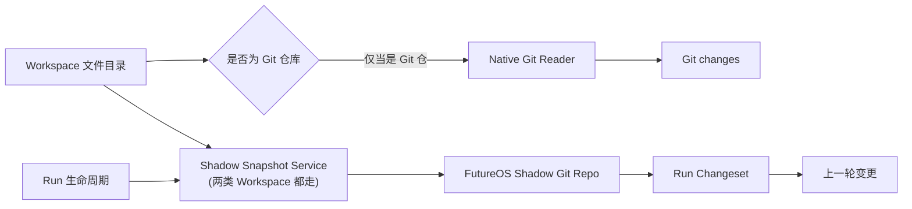
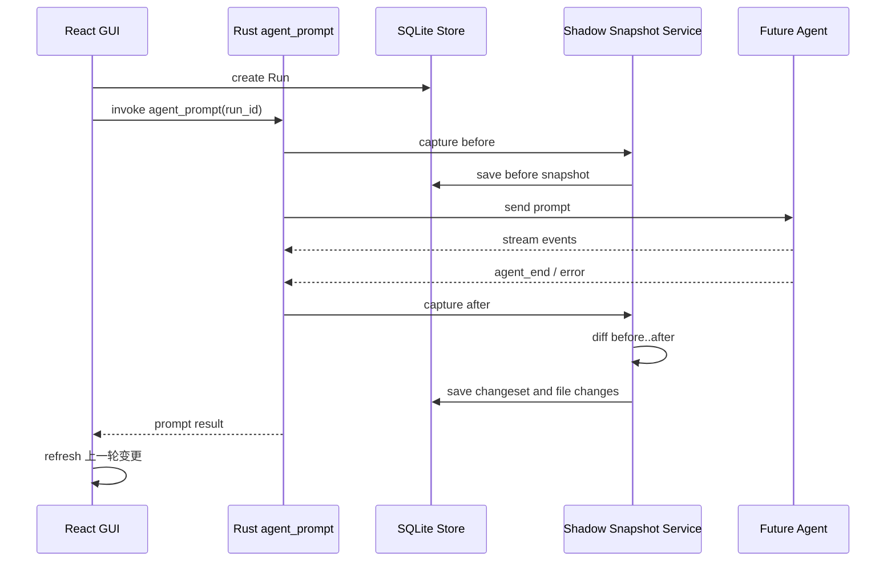

# FutureOS Workspace Review 与影子仓库设计

更新时间：2026-06-23

## 1. 目标

本文设计 Workspace 下的 Review 功能，覆盖两类目录：

- Git Workspace：
  - `Git changes`：展示当前分支相对 `HEAD` 的未提交变化。
  - `上一轮变更`：展示当前 Thread 上一轮 Agent Run 执行期间产生的文件变化。
- 非 Git Workspace：
  - 只展示 `上一轮变更`。

设计目标：

1. 复用 Git 成熟的 diff、rename detection、numstat 和二进制文件识别能力。
2. 非 Git Workspace 不需要在用户目录中创建 `.git`。
3. “上一轮变更”与用户真实 Git 工作树相互独立。
4. 不向用户真实 Git 仓库写 commit、index、object 或 ref。
5. Run 失败、取消或部分完成时，仍尽可能展示该轮已经产生的变化。
6. 与现有 `ReviewPanel`、`review_changesets`、`review_file_changes` 数据模型兼容演进。

## 2. 产品语义

### 2.1 Git changes

`Git changes` 是 Workspace 级视图。

它表示：

> 当前 Workspace 工作树相对所选 Git base 的全部变化。

默认 base 为 `HEAD`，包含：

- staged 修改；
- unstaged 修改；
- 新增文件；
- 删除文件；
- rename；
- 未跟踪且未被 Git ignore 的文件。

该视图不尝试判断变化来自用户还是 Agent，也不限定 Thread 或 Run。

### 2.2 上一轮变更

`上一轮变更` 是 Thread 级视图。

它表示：

> 当前 Thread 最近一轮已经结束的 Run，从 Run 开始前快照到 Run 结束后快照之间的 Workspace 文件差异。

“上一轮”严格指当前 Thread 最新一个已经结束的 Run，包括：

- `completed`
- `failed`
- `cancelled`

如果最新 Run 没有文件变化，界面显示“上一轮没有文件变化”，不能自动回退到更早但有变化的 Run，否则“上一轮”的语义会失真。

正在执行的 Run 不进入“上一轮变更”。运行期间继续显示前一个已完成 Run 的 changeset；Run 结束并完成后快照后再切换到新 changeset。

### 2.3 变化归属的准确表述

快照能够准确计算“Run 执行窗口内 Workspace 发生了什么变化”，但无法绝对区分：

- Agent 修改；
- 用户在 Run 执行期间手动修改；
- IDE formatter 或 watcher 自动修改；
- 其他后台进程修改。

因此底层模型建议使用 `workspace_delta`，UI 可以继续显示“上一轮变更”。详情提示中应说明：

> 包含该轮运行期间工作区内发生的文件变化。

不能在没有文件系统审计能力的情况下把所有变化都声明为“Agent 修改”。

## 3. UI 设计

### 3.1 Git Workspace

Review 面板顶部提供下拉选择：

```text
┌ Git changes        ▼ ┐
│ ✓ Git changes        │
│   上一轮变更          │
└──────────────────────┘
```

默认选择 `Git changes`。

> **实现决策（已落地，覆盖本节早期草案）**：diff 只做 **unified**（不做 split 双栏）；去掉文件搜索框与 viewed 状态（按钮 / 计数 / 持久化全部移除）；文件默认收起，顶部一个「全部展开 / 全部收起」切换按钮。保留 additions / deletions 汇总、二进制文件专用行、Diff base 选择。

顶部控制（最终）：

- 全部展开 / 全部收起（单按钮切换）；
- additions / deletions 汇总；
- Diff base 选择（仅 `Git changes`）。

`Git changes` 继续展示：

- 当前 branch；
- upstream；
- diff base；
- 工作树文件列表。

`上一轮变更` 展示：

- Run 状态；
- Run 完成时间；
- Run 的短摘要；
- 文件数和 `+additions -deletions`；
- 文件级 diff。

### 3.2 非 Git Workspace

顶部只显示静态标题 `上一轮变更`，不显示没有意义的下拉箭头。

```text
┌ 上一轮变更 ┐
```

非 Git Workspace 不显示：

- Git branch；
- upstream；
- Git base selector；
- `Git changes` 入口。

### 3.3 文件行

文件行沿用参考图中的结构：

```text
[类型图标] path/to/file.ts       已添加   +95  -0   >
```

状态映射：

| Git 状态 | UI |
| --- | --- |
| `A` | 已添加 |
| `M` | 已修改 |
| `D` | 已删除 |
| `R` | 已重命名 |
| binary | 二进制 |

点击文件行展开 diff。文本文件支持统一和拆分模式（拆分模式为本方案新增，见 §3.1）；二进制文件只展示：

- 文件路径；
- 状态；
- before / after 大小；
- MIME 或扩展名；
- “不支持文本 diff”提示。

### 3.4 空状态

Git Workspace：

- `Git changes`：`工作树没有未提交变化`
- `上一轮变更`：`上一轮没有文件变化`
- 没有结束过 Run：`还没有可供审查的上一轮运行`

非 Git Workspace：

- 没有结束过 Run：`完成一轮 Agent 运行后，文件变化会显示在这里`
- Run 无变化：`上一轮没有文件变化`

### 3.5 数据作用域

| 视图 | 作用域 | 数据来源 |
| --- | --- | --- |
| Git changes | Workspace | 用户真实 Git 仓库 |
| 上一轮变更 | 当前 Thread 的最新结束 Run | FutureOS 影子仓库 |

切换 Thread 时，“上一轮变更”必须切换到该 Thread 自己的最新 changeset。

### 3.6 上一轮变更的状态横幅

除空状态（§3.4）外，「上一轮变更」顶部按情况显示状态横幅（可叠加），对应 §8.5 / §10.3 的字段：

| 触发 | 横幅文案 | 行为 |
| --- | --- | --- |
| `overlapped`（§12.5） | 本轮运行期间该 Workspace 有其他运行，部分变更可能来自并发运行 | 仍展示 diff |
| `confidence = recovered`（§6.6） | 应用重启后恢复的快照，变更归属可能不精确 | 仍展示 diff |
| `snapshotStatus = partial`（§5.5） | 部分文件因大小限制未生成 diff | 展示已生成的部分 |
| `snapshotStatus = incomplete`（§6.3） | 本轮快照不完整，可点击重试 | 提供重试入口（§10.4） |
| `snapshotStatus = unavailable`（§6.3） | 本轮变更快照不可用 | 不展示 diff，区别于“无变化” |

### 3.7 非 Git Workspace「目录过大」状态

当 `changePreview = "unsupported_too_large"`（§6.7）时，`上一轮变更` 区不显示空状态也不显示 `unavailable`，而是静态提示：

```text
目录过大，已关闭改动预览
```

触发该状态的那一个 Run 自身也归入此态（它的 before 枚举在红线处中止、没有可用快照），不单独显示 `unavailable`。

## 4. 总体架构



> `Git changes`（上半路径）只在 Workspace 是 Git 仓时出现；`上一轮变更`（下半路径）两类 Workspace 都经影子仓产出。非 Git Workspace 只是没有上半路径，并非绕过影子仓。

核心原则：

- `Git changes` 只读取用户真实 Git 仓库。
- `上一轮变更` 始终由 FutureOS 影子仓库生成。
- 影子仓库对两类 Workspace 用**同一套快照管线**；是否为 Git 仓只影响优化深度与可靠性档位（§5.0），不影响最终 diff 的语义。
- 真实 Git 仓库与影子仓库**写隔离**：影子仓只读真实仓的 object DB / index 做加速（§5.2），从不修改真实仓的 index、refs、objects、工作树。

## 5. 影子仓库

### 5.0 两类 Workspace 的快照策略

影子仓库对两类 Workspace 走**同一套 before/after 快照管线**，但优化深度和可靠性要求不同：

| | Git Workspace | 非 Git Workspace |
| --- | --- | --- |
| 目标 | 完整、可留存的 Run 级 diff | 简单可看的改动 |
| 对象库 | 借鉴 opencode：`alternates` 共享真实仓 object DB | 影子仓自有 object DB |
| index 复用 | copy 真实仓 index 做 stat 缓存种子 | 影子仓自持久化 index |
| 暂存范围 | 只 stage 变更候选集 | 只 stage 变更候选集 |
| diff 固化 | after 时立即算出 patch 存 SQLite（真源） | 同左 |
| 可靠性机制 | 全套（terminal 信号、partial、recovered、重启恢复） | **砍掉**：失败就标 `unavailable`，不做恢复 |
| 体积红线 | 用 §5.5 逐文件限制 + `partial` | **workspace 级闸门**：超阈值关闭改动预览（§6.7） |

核心取舍（Git Workspace）：opencode 的 `alternates` + index-seed 能让超大仓（chromium 级）首个快照不必全量重哈希，但会让影子快照对象**耦合真实仓**——用户 `git gc` / 移动 / 删除真实仓后，未变文件指向的 blob 会悬空。为此 FutureOS **在 after 快照时立即把 before..after 的 patch 文本固化进 SQLite**（§7.1、§8.3），作为“上一轮变更”的**真源**；影子 commit / tree 对象降级为可丢弃缓存，即使日后真实仓 gc 也不影响已存的 diff。

非 Git Workspace 没有真实仓可借，object DB 与 index 都由影子仓自有；这类 Workspace 通常较小，全量哈希成本可接受，因此不引入 alternates，也不做重启恢复等可靠性机制——快照失败直接标 `unavailable`，让用户重发一轮即可。

### 5.1 存储位置

每个 Workspace 对应一个 bare shadow repository：

```text
~/.future/app/review/
  <workspace-id>/
    repo.git/
    indexes/
    locks/
```

不在 Workspace 目录下创建 `.git`。

建议目录权限：

- review 根目录：`0700`
- repository 和临时 index：仅当前用户可读写

### 5.2 Git 调用方式

所有命令显式指定：

```text
GIT_DIR=~/.future/app/review/<workspace-id>/repo.git
GIT_WORK_TREE=<workspace-path>
GIT_INDEX_FILE=<temporary-index-path>
```

影子仓库只把 Git 当作内容寻址快照和 diff 引擎，不 checkout，不修改用户文件。

禁止在 shadow 操作中执行：

- `git checkout`
- `git reset --hard`
- `git clean`
- 任何会修改 work tree 的 Git 命令

> 与 opencode 不同：opencode 用 `read-tree` + `checkout-index` 把工作树**还原**到某个快照（它的核心是 undo）。FutureOS 只做只读 review，永远不写工作树，因此明确禁用上述命令。

#### 影子仓初始化 config（借鉴 opencode，跨平台正确性必需）

影子仓 `git init` 后必须显式写入以下 config，**不能依赖系统默认或继承真实仓配置**：

```text
core.autocrlf   = false   # 关键：否则 Windows 上 git 规范化换行，产生整文件假 diff
core.symlinks   = true    # symlink（§5.5 要纳入）按链接存，而非解引用
core.fsmonitor  = false   # 借用真实仓对象时避免误触 fsmonitor
core.untrackedCache = true # 每轮 ls-files --others 走缓存，大仓不全目录重扫
feature.manyFiles = true   # 大仓 index 操作
index.version   = 4
index.threads   = true
```

前两条（`autocrlf` / `symlinks`）是**正确性**问题，必须设；后几条是大仓性能。`core.untrackedCache` 对我们尤其重要——候选集每轮都靠 `ls-files --others` 列未跟踪文件，无缓存时会全目录重扫。

#### 只 stage 变更候选集（借鉴 opencode）

不要每轮对整树 `git add -A`。先用 stat 级命令算出本轮真正变化的候选集，再只 stage 这批：

```text
# 已跟踪的改动（走 stat 缓存，不哈希未改文件）
git diff-files --name-only -z
# 未跟踪的新文件（尊重 .gitignore）
git ls-files --others --exclude-standard -z
# 仅对候选集执行 add
git add --all --sparse --pathspec-from-file=- --pathspec-file-nul
```

`diff-files` 依赖 index 的 stat 缓存判断哪些文件可能变了，配合下面的 index 复用，未改文件完全不被打开/哈希。

#### Git Workspace：共享真实仓 object DB 与 index 种子（借鉴 opencode）

仅当 Workspace 本身是 Git 仓时启用，用于消除超大仓首个快照的全量重哈希：

1. 解析真实仓 `git rev-parse --git-common-dir`，把它的 `objects` 目录（含其自身 alternates）写入影子仓 `objects/info/alternates`，让 seed 进来的 blob 能被解析。
2. 把真实仓的 `index` 文件 copy 进影子仓作为种子，已哈希条目直接复用。

注意 `alternates` 与 index-seed 是**成对**的：seed 的 index 里未改文件指向真实仓 blob OID，必须靠 alternates 解析。这带来对真实仓的耦合，FutureOS 通过 §7.1 的 diff 立即固化把它降级为纯性能优化——对象悬空不影响已存 diff。

非 Git Workspace 不做这两步，object DB 与 index 全部自有。

### 5.3 Snapshot

每个 Run 最多产生两个 snapshot：

- `before`：发送 prompt 给 Agent 前。
- `after`：承载该 prompt 的 Rust future 确认 Agent 已停止本轮执行后。

Snapshot 保存为 Git commit 并用 ref 钉住，避免 gc 误删，方便重试时重新 diff：

```text
refs/futureos/threads/<thread-id>/runs/<run-id>/before
refs/futureos/threads/<thread-id>/runs/<run-id>/after
```

commit 只存在于 shadow repo，不进入用户仓库。

Commit metadata：

- author / committer：`FutureOS Snapshot`
- message：`run <run-id> before|after`
- timestamp：snapshot 创建时间

> commit / tree / ref 是**可丢弃缓存**，不是真源。“上一轮变更”的真源是 §7.1 在 after 时立即固化到 SQLite 的 patch。因此即使日后真实仓 gc 让共享对象悬空、或影子仓被清理，已存的 diff 仍可展示；ref 只为 §10.4 的“重新 diff”重试服务，且只需在 retention 窗口内存活。

### 5.4 Snapshot 创建算法

伪代码：

```text
capture_snapshot(workspace, thread, run, phase):
    acquire workspace shadow lock
    ensure bare shadow repo exists
    if first init:
        if git workspace:
            seed objects/info/alternates from real repo      # opencode 快路径
            copy real repo index -> shadow index             # stat 种子
        # 非 git workspace 不 seed，使用影子仓自有 index
    copy persisted shadow index -> isolated temporary index  # 保留 stat 缓存
    candidates = diff-files(--name-only) ∪ ls-files(--others --exclude-standard)
    filter candidates by ignore / size / sensitive policy
    git add (only candidates) into temporary index           # 未改文件不哈希
    tree_id = git write-tree
    if an existing snapshot has the same tree_id:
        commit_id = existing commit
    else:
        commit_id = git commit-tree tree_id
    update FutureOS shadow ref
    persist snapshot metadata
    atomically replace persisted shadow index with temporary index
    if phase == after:
        materialize_diff(before_commit, after_commit)        # §7.1 立即固化
    release lock
```

使用独立 `GIT_INDEX_FILE`，避免不同 Run 或刷新操作共享同一个正在写的 index 文件。

Snapshot 不使用用户真实 Git index（只在首次 init 时 copy 一份做种子），因此不会改变用户的 staged 状态。

#### 增量刷新复用 index 文件本身 + 只 stage 候选集

每个 Workspace 在 `indexes/` 下持久化一份 shadow index，作为下一次 snapshot 的增量起点。关键的 Git 实现细节：

> `git read-tree <tree>` 建出的 index 条目**不带 stat 信息**（mtime / size / inode 均为 0），紧接着的 `git add` 会把每个文件都当“可能脏”，仍要 `open + hash` 全树。所以**绝不能用 read-tree 重建 index**——必须复用上一次留下的、带真实 stat 缓存的 index 文件。

每轮 snapshot：

1. 把持久化 shadow index 拷贝到本轮临时 `GIT_INDEX_FILE`。
2. 用 `diff-files` + `ls-files`（走 stat 缓存）算出变更候选集，按 §5.5 / §13 过滤。
3. 只对候选集 `git add`；未改文件凭 stat 命中直接跳过。
4. `git write-tree`；tree 与已有 snapshot 完全一致时复用 commit（§12.2）。
5. 成功后在锁内把刷新过的临时 index 原子替换回持久化位置。

首个 snapshot 仍需全量（Git Workspace 靠 alternates + index 种子大幅降低成本，非 Git Workspace 直接全量哈希）；之后每轮只触碰真正变化的文件。若持久化 index 缺失或损坏（§8.4 判废），回退到全量重建。

不能无条件把“上一个 Run 的 after commit”当作“本轮 before commit”，因为两轮之间用户、IDE 或后台进程可能修改 Workspace；候选集刷新天然会把这些外部修改纳入本轮 before，而不是错误归入本轮 Run。

### 5.5 文件纳入策略

默认纳入：

- Workspace 内普通文件；
- 新增、修改和删除的文本文件；
- symlink 本身；
- 在大小限制内的二进制文件。

默认排除：

- `.git/`
- `.future/`
- shadow repo 自身；
- socket、device 等特殊文件；
- 无法读取的文件；
- 超过单文件大小限制的文件；
- 超过 Workspace 快照总量限制后的剩余文件。

建议默认尊重：

- `.gitignore`
- `.ignore`
- shadow repo 的 `info/exclude`

建议不继承用户全局 Git excludes，避免不同机器产生不可解释的结果：

```text
-c core.excludesFile=<platform-null-device>
```

其中：

- Unix / macOS：`/dev/null`
- Windows：`NUL`

实现中应由统一的 `null_device_path()` 封装，不能在业务命令中硬编码 `/dev/null`。

对于缺少 `.gitignore` 的非 Git Workspace，FutureOS 需要提供内置默认排除，至少包括：

```text
node_modules/
.venv/
venv/
target/
dist/
build/
.cache/
coverage/
```

真实 Git Workspace 优先遵循仓库自己的 ignore 规则；FutureOS 内置排除只用于 shadow snapshot，不影响用户真实 Git 状态。

#### 影子 ignore 的三个边界（借鉴 opencode）

opencode 已经踩过这三个坑，候选集模型必须一并处理：

1. **同步真实仓 `info/exclude`**：`--exclude-standard` 读的是影子仓 `GIT_DIR/info/exclude`，**读不到真实仓的 `.git/info/exclude`**。需要在 init / 刷新时把真实仓 `info/exclude` 内容合并进影子仓 `info/exclude`（opencode 的 `sync()`），否则用户的 repo-local 排除被忽略。
2. **drop 新被 ignore 的文件**：文件一旦进了 index，之后被加进 `.gitignore` 也不会自动移除。候选集刷新时要对“已在 index 但现命中 ignore”的路径显式 `git rm --cached`（opencode 的 `drop()`），否则它会一直留在快照里。
3. **超大 untracked 不反复尝试**：命中单文件大小上限的 untracked 文件，应临时加入影子 `info/exclude`，避免每轮候选集都把它枚举进来再被过滤，浪费 stat / readdir。

建议初始限制：

| 限制 | 默认值 | 作用对象 |
| --- | --- | --- |
| 单文件最大快照大小 | 20 MiB | 单个文件 |
| 本轮候选集最大文件数 | 50,000 | **本轮变更候选集**，非整棵树 |
| 本轮候选集最大总读取量 | 1 GiB | **本轮实际读取/哈希的字节** |
| 文本 diff 最大展示大小 | 2 MiB | 单文件 diff |
| 单文件 diff 最大展示行数 | 10,000 | 单文件 diff |

**这些限制约束的是「本轮快照实际要读取/哈希的变更候选集」，不是整个 Workspace 的文件总数。** 因为持久化 index + 候选集 staging（§5.2 / §5.4）下，未改文件靠 stat 缓存完全不被打开，所以一个 20 万文件的正常大仓只要每轮改动有限，就**不会**因总文件数触发 `partial`——树有多大无所谓，只看本轮 diff-files/ls-files 列出的候选集大小。

超过限制的文件仍可记录 metadata，但不写入完整 blob 时，changeset 标记为 `partial`，UI 显示“部分文件因大小限制未生成 diff”。

> 非 Git Workspace 另有 workspace 级**总体积红线**（§6.7，默认 20k 文件 / 512 MiB），针对的是首个快照的全量枚举成本，与上表的逐轮候选集限制是两回事；非 Git 首轮通常先撞红线（更严），上表的 50k 候选集限制对它基本不触发。

### 5.6 Ignore 的取舍

尊重 `.gitignore` 可以显著控制 `node_modules`、构建产物和缓存目录的规模，但意味着被 ignore 的文件不会出现在“上一轮变更”中。

第一版建议接受该语义，并在 changeset metadata 中记录：

- ignored file count；
- oversized file count；
- unreadable file count；
- snapshot 是否完整。

后续如果需要覆盖 Agent 明确修改的 ignored 文件，可以结合 Agent 的结构化 `file.changed` 事件，对指定路径执行受限的 force include。第一版不依赖 tool event 推测完整 changeset，因为 `bash` 可以绕过 `write/edit` 工具修改任意数量的文件。

敏感文件规则只对“未被 ignore、原本会进入 snapshot”的文件生效：

- 如果敏感文件已被 `.gitignore` 或内置规则排除，它计入 ignored，不额外显示“敏感文件发生变化”。
- 如果敏感文件未被 ignore，FutureOS 记录 path、状态和 metadata，但不保存 blob 或 diff。

第一版不扫描被 ignore 的敏感文件来判断其是否变化，避免为了提示而重新引入被排除目录的扫描成本。

## 6. Run 生命周期集成

### 6.1 正常流程



`before` snapshot 的可靠 hook 位于 Rust `agent_prompt_inner` 内：

1. Agent session 和 permission 初始化完成；
2. model / thinking level 设置完成；
3. `prompt_command` 真正发送给 Agent 之前；
4. 在同一个 `agent_prompt` IPC 调用内部完成。

不能由 React GUI 在 `sendPromptToFutureAgent` 前额外调用 `captureBefore`，因为额外 IPC 无法提供与真正 prompt 发送相同的顺序边界。

`after` snapshot 不绑定数据库 `update_run_status`，而绑定承载该 Run 的 Rust prompt future 完成。正常情况下，收到 Agent 的 terminal event 后，本轮工具执行、abort 收尾和 session 保存已经结束，此时创建 after snapshot。

实现位置建议：

- before：`agent_prompt_inner` 内，`prompt_command` 发送前。
- after：外层 `agent_prompt` 在 `agent_prompt_inner(...).await` 返回后统一执行，保证 success 和 error 路径都经过同一个 finalization。
- after finalization 完成后，再执行失败状态投影和向 React GUI 返回结果。

覆盖的最终结果包括：

- completed；
- failed；
- cancelled。

数据库 Run 状态是 UI / 持久化投影，不是 after snapshot 的执行完成信号。

#### Session guard 必须覆盖 after snapshot

当前 `PromptSessionGuard` 在 `agent_prompt_inner` 内获取，inner 返回即释放。如果 after snapshot 放在外层 `agent_prompt`，inner 返回之后、after 落盘之前会出现一个 guard 空窗：同一 session 的下一个 prompt 可以立刻送进 Agent 并开始写盘，污染上一轮的 after。`workspace_id` 锁（§12.1）只串行化快照写操作，挡不住下一轮 Agent 进程本身写文件。

因此 guard（或一个 session 级 finalization gate）必须**上移到外层 `agent_prompt`，覆盖 `inner` + after snapshot 整段**。下一轮 prompt 必须等本轮 after snapshot 落完才能开始。

#### 延迟取舍

after snapshot + diff + 落库都在 `prompt result` 返回 React GUI 之前，意味着每轮的 IPC 返回（以及前端随后的 `completed` 状态投影和 assistant message 落库）会被快照阻塞。这是为正确性付出的代价，必须靠 §5.4 / §12.2 的持久化 index 增量把快照做快来抵消——大 Workspace 下全量哈希会让 Run 长时间停在 `running`。

如果未来需要彻底解耦，可改为：after snapshot 异步执行但**仍在 guard 保护下**，落库后发 `review:changeset_ready` 事件让前端刷新“上一轮变更”。第一版采用阻塞式 finalization，依赖快照足够快，不引入额外事件通道。

### 6.2 Terminal 信号与异常连接

正常 after snapshot 要求 Rust bridge 收到 Agent 明确的 terminal event：

- `agent_end`
- terminal `error`，且 Agent 随后结束本轮执行

以下情况中，Rust prompt future 返回不等价于 Agent 已停止写文件：

- gRPC event stream 断开；
- GUI bridge 的 stream timeout；
- Agent 进程崩溃或失联；
- abort RPC 返回成功，但原 prompt stream 尚未结束。

处理规则：

1. 用户 abort 后，数据库可以立即显示 `cancelled`，但不能立即创建正常 after snapshot。
2. 原 prompt future 继续等待 Agent terminal event。
3. 收到 terminal event 后创建 after snapshot，`confidence = normal`。
4. transport error / timeout 时，bridge 尝试发送 abort，并查询 session `isStreaming`。
5. 能确认 `isStreaming = false` 后再创建 after snapshot。
6. 无法确认停止时，不生成正常 after；标记 snapshot / changeset 为 `incomplete` 或等待重启恢复。

> Agent 的 `get_state` 响应已经包含 `isStreaming` 字段，无需改 Agent 后端；当前 bridge 解析 `get_state` 时只取了 `sessionId` / `cwd`，接入时需要补读 `isStreaming`。

### 6.3 Snapshot 失败

Snapshot 失败不能阻止 Agent Run。

状态建议：

- before 失败：Run 正常执行，changeset 标记 `unavailable`。
- after 失败：保留 before，changeset 标记 `incomplete`。
- diff 失败：保留两个 snapshot，允许用户点击重试生成。

错误不能伪装成“上一轮没有变化”；必须区分：

- 真正无变化；
- 快照不可用；
- 快照不完整。

### 6.4 Approval 等待

Run 处于 `waiting_approval` 时不创建 after snapshot。

用户批准后继续同一个 Run，最终只创建一次 after snapshot。用户拒绝导致 Run 继续或终止时，以最终 Run 状态为准。

### 6.5 Abort

Abort 请求完成后：

1. Agent 中止底层操作。
2. Run 标记 `cancelled`。
3. 原 `agent_prompt_inner` 继续等待 terminal event。
4. terminal event 到达，确认本轮工具执行已经退出。
5. 创建 after snapshot。
6. 生成已实际落盘的部分变化。

文件稳定窗口只能作为 terminal event 后的额外防抖，不能替代 Agent 停止确认。建议 terminal event 后等待 200–500ms，并设置最大等待时间，减少 formatter 或 watcher 的尾部写入抖动。

### 6.6 应用重启

如果应用重启时发现：

- Run 有 before snapshot；
- Run 已被恢复逻辑标记为 cancelled；
- 没有 after snapshot；

可以创建恢复型 after snapshot，但 changeset 必须标记：

```text
confidence = "recovered"
```

因为应用关闭期间可能发生用户修改，恢复后的 diff 不能完全归属于该 Run。

`update_run_status` 只负责状态投影和该恢复兜底，不作为正常 after snapshot hook。

### 6.7 非 Git Workspace 的简化

§6.1 的 before / after hook 位置和 guard 规则对两类 Workspace 一致（仍需保证 before 在 prompt 前、after 在 Agent 停笔后）。但非 Git Workspace **砍掉以下可靠性机制**，换取实现简单：

- 不做重启恢复（§6.6）：重启时缺 after 的 Run 直接标 `unavailable`，不生成 `recovered` 快照。
- 不细分 `partial` / `incomplete`：任何 before/after/diff 失败统一标 `unavailable`。
- 不做 §6.2 的 `isStreaming` 二次确认：正常等 prompt future 完成即拍 after；拿不到 terminal event（崩溃 / 断流）就标 `unavailable`。
- 超大小限制的文件（§5.5）：非 Git Workspace 通常较小，命中即整体标 `unavailable` 并提示用户，不做逐文件 partial 投影。

语义底线不变：失败永远不伪装成“上一轮没有变化”，而是明确 `unavailable`，引导用户重发一轮。

#### 体积红线（workspace 级闸门）

非 Git Workspace 没有 alternates 提速，首个快照要全量哈希；为防止用户把超大目录设成 Workspace 后**每条 prompt 都被 before 快照阻塞**，加一道 workspace 级闸门：

- 阈值（可配置，默认低于 Git 档）：**> 20,000 文件 或 > 512 MiB**。
- 不做单独预检通道：把红线**折进首次快照的文件枚举**，带早退计数器，一旦超阈值立即中止枚举。
- 超限即把 workspace capability 翻为 `changePreview = "unsupported_too_large"` 并缓存；之后的 prompt **直接跳过快照**，不再阻塞 IPC。
- 触发翻转的**那一个 Run** 自身：before 枚举在红线处中止、无可用 before snapshot，因此该轮不产出 changeset，统一归入「目录过大」态（§3.7），不单独标 `unavailable`。Run 本身正常执行，不受影响。
- Review 区显示静态提示「目录过大，已关闭改动预览」，而不是空状态或 `unavailable`（区别于“拍了但失败”）。
- 缓存默认不重扫；仅在 Workspace 重开或用户手动刷新时重评（目录可能已缩小）。

Git Workspace 不走该闸门：它靠 alternates + index 种子把首个快照成本压住，继续用 §5.5 的逐文件限制 + `partial`。

## 7. Diff 生成

### 7.1 上一轮变更（after 时立即固化）

与 opencode 的懒计算不同，FutureOS 在 **after snapshot 落盘后、仍持有 workspace 锁时立即计算并固化 diff**。此刻共享对象一定可解析，固化后的 patch 文本成为“上一轮变更”的真源，不再依赖影子对象存活。

固化用**一次** `git diff` 拿到全量 patch + numstat，再在内存里按文件切分落库，**不要每文件 fork 一次 git**：

```text
# 一次拿到所有文件的统一 diff（含 rename/copy 检测），按 diff --git 头切分到每个文件
git diff --no-color --find-renames --find-copies --unified=<context-lines> \
  <before-commit> <after-commit>

# 一次拿到逐文件 additions/deletions 和 rename 的 previous_path
git diff --no-color --find-renames --find-copies --numstat <before-commit> <after-commit>
```

切分后写入：

1. 每个文本文件一行 `review_file_changes`：`diff`（超 §5.5 展示上限则截断并置 `diff_truncated`）、`additions` / `deletions`（来自 numstat）、`change_type`、`previous_path`。
2. 二进制文件只记 metadata（`before_size` / `after_size` / `mime`），不存 `diff` 与 blob。
3. changeset 汇总（files changed、additions、deletions、binary、completeness）。

固化完成后，前端 `getLastRunReview` 直接读 SQLite，不再触发 shadow `git diff`。§10.4 的重试只在固化失败、且两端 commit 仍在时，从 commit 重跑上面两条命令。

> 取舍：每轮都全量算 diff 并落库，SQLite 会按 retention 增长；2 MiB/文件、10000 行展示上限做截断兜底，二进制不存正文。代价是大 Run（如改几百文件的重构）的 after 固化在锁内 + 阻塞 IPC，会让 Run 多停一会儿——所以 diff 必须**一次 git 调用 + 批量 insert**，不能 per-file fork。换来的是 diff 与影子对象解耦、前端零 shadow 调用。

### 7.2 Git changes

继续读取真实 Git 仓库：

- tracked：`git diff <base> --`
- untracked：`git ls-files --others --exclude-standard`
- status：`git status --short --untracked-files=all`

默认 base 为 `HEAD`。现有 upstream、merge-base、custom base 能力可以继续保留。

### 7.3 文件统计

每个文件保存：

- path；
- previous path（rename 时）；
- change type；
- additions；
- deletions；
- binary；
- before size；
- after size；
- diff；
- diff truncated；
- omission reason。

changeset 保存总计：

- files changed；
- additions；
- deletions；
- binary files；
- omitted files；
- completeness。

零变化 Run 也必须持久化一条 changeset：

```text
files_changed = 0
additions = 0
deletions = 0
completeness = complete
confidence = normal
```

> `source_kind = run_snapshot` 的 changeset 是**信息性视图**，不参与 apply / discard 决策流；其状态由 `completeness` / `confidence`（§8.2、§10.3）表达，旧的 `status` 列（`pending`/`applied`/`discarded`）对它不适用，留空即可。详见 §8.5 的状态字段定义。

这样 `getLastRunReview` 才能区分：

- 当前 Thread 没有结束过 Run；
- 上一轮 Run 存在但没有文件变化；
- 上一轮 snapshot 不可用；
- 上一轮 snapshot 不完整。

## 8. 数据模型

### 8.1 新增 review_snapshots

```sql
CREATE TABLE review_snapshots (
    id TEXT PRIMARY KEY,
    workspace_id TEXT NOT NULL REFERENCES workspaces(id),
    thread_id TEXT NOT NULL REFERENCES threads(id),
    run_id TEXT NOT NULL REFERENCES runs(id),
    phase TEXT NOT NULL CHECK (phase IN ('before', 'after')),
    commit_id TEXT,
    tree_id TEXT,
    status TEXT NOT NULL,
    file_count INTEGER NOT NULL DEFAULT 0,
    total_bytes INTEGER NOT NULL DEFAULT 0,
    ignored_count INTEGER NOT NULL DEFAULT 0,
    omitted_count INTEGER NOT NULL DEFAULT 0,
    error_message TEXT,
    created_at INTEGER NOT NULL,
    UNIQUE(run_id, phase)
);
```

### 8.2 扩展 review_changesets

建议增加：

```sql
source_kind TEXT NOT NULL DEFAULT 'run_snapshot',
workspace_id TEXT REFERENCES workspaces(id),
before_snapshot_id TEXT REFERENCES review_snapshots(id),
after_snapshot_id TEXT REFERENCES review_snapshots(id),
binary_files INTEGER NOT NULL DEFAULT 0,
omitted_files INTEGER NOT NULL DEFAULT 0,
completeness TEXT NOT NULL DEFAULT 'complete',
confidence TEXT NOT NULL DEFAULT 'normal',
overlapped INTEGER NOT NULL DEFAULT 0,
error_message TEXT
```

`binary_files` / `omitted_files` 对应 §7.3 的 changeset 汇总（在固化时从 `review_file_changes` 聚合写入），避免前端展示时再扫一遍文件行。

`source_kind` 预留：

- `run_snapshot`
- `native_git`

既有 `status` 列（`pending`/`applied`/`discarded`）属于旧决策流，`run_snapshot` changeset 不写该列（留空），其状态完全由 `completeness` / `confidence` 表达，定义见 §8.5。

当前数据库中的 `review_changesets` 只持久化“上一轮变更”。`Git changes` 保持实时查询，不需要每次落库。

### 8.3 扩展 review_file_changes

建议增加：

```sql
previous_path TEXT,
binary INTEGER NOT NULL DEFAULT 0,
before_size INTEGER,
after_size INTEGER,
mime TEXT,
diff_truncated INTEGER NOT NULL DEFAULT 0,
omission_reason TEXT
```

既有 `diff` 列在新模型里是**真源**：§7.1 在 after 时把每个文本文件的统一 diff 固化于此，前端直接读，不再回到 shadow 仓重算。`binary` 文件不存 `diff`，只填 `before_size` / `after_size` / `mime`。`additions` / `deletions` 来自固化时的 numstat。

### 8.4 Ref 与数据库一致性

SQLite 是产品状态真源，shadow Git refs 是内容存储索引。

启动时可以执行轻量校验：

- 数据库 snapshot 指向的 commit 是否存在；
- 不再被数据库引用的 refs 是否可删除；
- 无效 changeset 标记为 unavailable。

### 8.5 状态字段定义

`run_snapshot` 模型涉及多个状态维度，统一定义如下，避免语义交叉：

| 字段 | 所在对象 | 取值 | 含义 |
| --- | --- | --- | --- |
| `phase` | review_snapshots | `before` / `after` | 快照属于 Run 的哪一端 |
| `status`（snapshot） | review_snapshots | `complete` / `partial` / `failed` | 单个快照自身是否完整生成 |
| `completeness` | review_changesets | `complete` / `partial` | diff 是否覆盖全部变化（受大小限制/oversized 影响则 `partial`） |
| `confidence` | review_changesets | `normal` / `recovered` | after 是否由正常 terminal 信号生成，还是重启恢复型（§6.6） |
| `status`（changeset） | review_changesets | （仅 `native_git` 旧决策流使用）| `run_snapshot` changeset **不使用**该列 |
| `overlapped` | review_changesets | `0` / `1` | 本轮窗口是否与同 Workspace 其他 Run 重叠（§12.5），与下面三项正交 |
| `snapshotStatus` | RunReview（API 派生） | `complete` / `partial` / `incomplete` / `unavailable` | 前端展示用的聚合状态，由上面几项派生（见 §10.3） |

派生规则（`snapshotStatus`，**Git Workspace 全档**）：

- 缺 before 或 before `unavailable` → `unavailable`；
- before 在、after 缺失或 `incomplete` → `incomplete`；
- 两端都在但 `completeness = partial` → `partial`；
- 两端完整且 `completeness = complete` → `complete`。

**非 Git Workspace 走简化档（§6.7）**：只产生 `complete` 或 `unavailable` 两态——任何 before/after/diff 失败（含上面会被判为 `incomplete` / `partial` 的情形）一律塌缩为 `unavailable`，不细分。因此 `incomplete` / `partial` / `recovered` 只出现在 Git Workspace。

`confidence = recovered` 与上述 `snapshotStatus` 正交，单独透传给前端。

## 9. 后端模块建议

建议新增：

```text
gui/src-tauri/src/
  shadow_review.rs
  shadow_review/
    repository.rs
    snapshot.rs
    diff.rs
    policy.rs
```

职责：

- `repository.rs`：shadow repo 初始化（含 §5.2 的 config：`autocrlf=false` / `symlinks` / `untrackedCache` 等）、路径、锁、ref 管理；Git Workspace 的 `alternates` 共享与真实仓 index 种子；持久化 shadow index 的读写。
- `snapshot.rs`：before / after snapshot；候选集计算（`diff-files` + `ls-files`）与只 stage 候选集；commit 复用。
- `diff.rs`：after 时**一次 git diff** 固化 changeset、file stats、patch（§7.1）；§10.4 的从 commit 重 diff。
- `policy.rs`：ignore（含 §5.5 三个边界：同步真实仓 `info/exclude`、drop 新 ignore、超大 untracked 排除）、大小限制、敏感路径、completeness；Git / 非 Git 两档可靠性策略（§6.7）；非 Git 体积红线（§6.7）。

现有 `git_review.rs` 只负责真实 Git Workspace 的 `Git changes`，不再负责自动 `git init`。

## 10. Tauri API

### 10.1 Workspace 能力

```typescript
interface WorkspaceReviewCapabilities {
  isGitWorkspace: boolean;
  views: Array<"git_changes" | "last_run">;
  defaultView: "git_changes" | "last_run";
  // 非 Git Workspace 体积闸门（§6.7）；Git Workspace 恒为 "ready"
  changePreview: "ready" | "unsupported_too_large";
}
```

获取入口（新增 Tauri 命令）：

```typescript
getWorkspaceReviewCapabilities({
  workspaceId,
}): Promise<WorkspaceReviewCapabilities>
```

`changePreview = "unsupported_too_large"` 时，前端 `last_run` 视图渲染静态提示「目录过大，已关闭改动预览」，不再调用 `getLastRunReview`。

注意 `changePreview` 会**中途翻转**：它在首个 Run 的快照枚举里才可能从 `ready` 翻为 `unsupported_too_large`（§6.7）。因此前端不能只在进入 Workspace 时取一次 capabilities，**必须在每个 Run terminal event 后重新拉取**（与 `last_run` 同一刷新时机，见 §11）。

### 10.2 Git changes

现有 `get_git_review` 可以改名或保留兼容：

```typescript
getGitWorkingTreeReview({
  workspaceId,
  base,
  customBase,
}): Promise<GitReview>
```

### 10.3 上一轮变更

```typescript
getLastRunReview({
  threadId,
}): Promise<RunReview | null>
```

```typescript
interface RunReview {
  changeset: StoredReviewChangeset;
  files: StoredReviewFileChange[];
  run: StoredRun;
  snapshotStatus: "complete" | "partial" | "incomplete" | "unavailable";
  confidence: "normal" | "recovered";
  overlapped: boolean;
}
```

`snapshotStatus` 和 `confidence` 的取值与派生规则见 §8.5。返回值语义：

- `null`：当前 Thread 从未有过可判定的结束 Run。
- 非空且 `changeset.filesChanged === 0`：上一轮确实没有变化。
- `snapshotStatus = unavailable`：存在上一轮 Run，但无法生成可靠快照。
- `confidence = recovered`：diff 来自重启恢复型 after snapshot，不能完全归属于该 Run（§6.6）。
- `overlapped = true`：本轮窗口与同 Workspace 的其他 Run 重叠，部分变更可能来自并发运行（§12.5）；UI 顶部显示提示，但仍展示 diff。

### 10.4 手动重试

```typescript
retryRunReview({
  runId,
}): Promise<RunReview>
```

因为 §7.1 在 after 时已立即固化 diff，正常情况下不需要重试。重试仅用于固化失败、但两端 commit 仍在 retention 窗口内时，从 commit 重跑 §7.1 的命令。一旦缺 before snapshot，则不重试、不伪造 changeset，保持 `unavailable` / `incomplete`。

重试可靠性分档：非 Git Workspace 的影子 commit **自包含**（blob 都在影子 ODB），retry 在 retention 窗口内可靠；Git Workspace 的 commit 引用的 before 侧 blob 可能只存在于真实仓（经 alternates），真实仓事后 gc 会让其悬空，此时 retry 失败、保持已固化结果即可——这也是 §7.1 必须 eager 固化的原因。

## 11. 前端状态设计

建议把当前 `ReviewPanel` 的数据源显式拆分：

```typescript
type ReviewView = "git_changes" | "last_run";

interface ReviewPanelState {
  capabilities: WorkspaceReviewCapabilities;
  activeView: ReviewView;
  gitChanges: GitReview | null;
  lastRunReview: RunReview | null;
}
```

行为规则：

1. 进入 Workspace 时先拉 `capabilities`（`getWorkspaceReviewCapabilities`），据此决定视图与入口。
2. 进入 Git Workspace，默认 `git_changes`。
3. 进入非 Git Workspace，强制 `last_run`；若 `changePreview = unsupported_too_large`，`last_run` 渲染「目录过大」静态提示，不调用 `getLastRunReview`。
4. 从非 Git Workspace 切换到 Git Workspace，恢复默认 `git_changes`。
5. 切换 Thread 时重新加载 `last_run`。
6. `git_changes` 可按现有节奏刷新。
7. `last_run` 只在 Run 终态、changeset 更新或用户重试时刷新，不需要每 1.5 秒重新计算 shadow diff。
8. 每个 Run terminal event 后，**连同 `capabilities` 一起重取**（`changePreview` 可能此时翻转，§6.7）；`overlapped`、`snapshotStatus`、`confidence` 随 `last_run` 一并刷新并在 UI 上反映（§3）。

`git_changes` 也不应无条件每 1.5 秒执行整树 `git status + git diff`。建议：

- 仅在右侧面板展开且当前视图为 `git_changes` 时刷新；
- Workspace 文件事件触发防抖刷新；
- Run terminal event 触发一次刷新；
- 无文件事件能力时使用较低频率轮询兜底；
- 同一 refresh 在执行期间不并发启动下一次 Git diff。

## 12. 并发与性能

### 12.1 Workspace 锁

同一个 Workspace 的 snapshot 写操作必须串行：

```text
workspace_id -> async mutex / filesystem lock
```

不同 Workspace 可以并行。

> 该锁只保证**快照存储不损坏**（两个 `write-tree` / index 写不互踩），等价于 opencode 的 per-gitdir 信号量。它**不保证语义归属**——若同一 Workspace 的两个 Thread 并发跑 Run，各自 before..after 窗口会互相混入对方改动。语义层的处理见 §12.5。

### 12.2 Snapshot 去重

Git object database 会按内容自动去重。连续 Run 中未变化文件不会重复占用完整空间。

如果刷新后的 before tree 与最近一次 snapshot tree 完全一致，可以复用 commit：

```text
refreshed before tree == previous snapshot tree
```

该优化属于 Phase 1，并依赖 §5.4 的持久化 index 复用：首版必须把上一 snapshot 的 **index 文件**（而非 tree）作为增量扫描起点，靠 stat 缓存跳过未改文件的哈希，再在 tree hash 相同后复用 commit。不能用 `read-tree` 重建 index（会丢掉 stat 缓存，退化为全量哈希），也不能直接假设两轮之间 Workspace 没有变化。

### 12.3 Retention

当前产品只展示“上一轮变更”，建议：

- 每个 Thread 保留最近 10 个 Run changeset（SQLite 里的固化 diff）；
- UI 默认只读取最新一个；
- 超过保留数量后删除旧 refs 和数据库投影；
- 提供按 Workspace 清理 review cache 的内部能力。

因为 §7.1 已把 diff 固化进 SQLite，**影子对象是纯缓存**，gc 不会影响“上一轮变更”的可见性，retention 可以比 opencode 更激进：

- 可借鉴 opencode，空闲时低频 `git gc --prune=<window>`（如几天），不必为留住 diff 而保对象；
- 唯一约束是 §10.4 重试需要两端 commit，所以 gc 窗口不应短于 retention 想支持的重试时长；
- 不要每轮立即 `git gc`。

### 12.4 大 Workspace

Snapshot 前可以维护 Workspace 文件 fingerprint cache：

- path；
- size；
- mtime；
- inode/file id（平台可用时）；
- content hash。

第一版可以直接交给 Git index 判断变化；当大型 Workspace 性能成为问题后，再增加持久化 fingerprint 和增量扫描。

### 12.5 并发 Run 与重叠标记

同一 Workspace 可挂多个 Thread，各自的 prompt 受 session 级 `PromptSessionGuard` 保护，但**跨 Thread 不互斥**——两个 Thread 可同时跑 Run、并发改同一目录。此时 §12.1 的锁只保证存储不坏，无法把改动干净归属到某一轮。

第一版**不强行串行整轮 Run**（那会让一个 Thread 干等另一个 Thread 整轮跑完，代价过大，且救不了两个 Agent 本身的文件互相覆盖），而是**检测重叠并诚实标记**，延续 §2.3 不谎称归属的原则。

检测无需额外内存状态，直接从 `review_snapshots` 的时间戳派生。Run R 的窗口是 `[before.created_at, after.created_at]`；若同一 `workspace_id` 下存在另一个 Run，其窗口与 R 相交（对端 `before <= R.after` 且 `after >= R.before`，对端 after 缺失视为仍在运行 = 相交），则：

- 在 R 的 after finalization 时把 `review_changesets.overlapped = 1`；
- 同时把所有与 R 相交的对端 changeset 也回标 `overlapped = 1`（它们的窗口同样被污染）。

UI 在「上一轮变更」顶部显示提示：

```text
本轮运行期间该 Workspace 有其他运行，部分变更可能来自并发运行
```

`overlapped` 与 §8.5 的 `snapshotStatus` / `confidence` 正交：一轮可以既 `complete` 又 `overlapped`。它不阻止展示 diff，只降低归属可信度。

## 13. 安全与隐私

Shadow repo 会保存 Workspace 文件内容的历史 blob，因此它不是普通缓存，必须按本地敏感数据处理。

要求：

- 仅本机当前用户可访问；
- 不上传；
- 不写日志正文；
- 删除 Workspace 记录时同步清理其 shadow repo 与 review 数据；
- （普通 Chat 不创建 shadow review，§14.6，因此无需单独清理；仅 `thread.mode = workspace` 才有 shadow 数据）；
- 对 `.env`、credential、private key 等是否纳入快照需要明确策略。

建议第一版默认排除高风险凭证文件：

```text
.env
.env.*
*.pem
*.key
id_rsa
id_ed25519
```

如果这些文件发生变化，changeset 可显示：

```text
敏感文件发生变化，内容未保存
```

只记录 path、状态和 metadata，不保存 blob 或 diff。

该提示仅适用于未被 ignore 的敏感文件。已被 `.gitignore` 或 FutureOS 内置规则排除的敏感文件不进入变化检测。

## 14. 对现有实现的调整

### 14.1 保留

- 现有 Git working tree diff 解析；
- additions / deletions；
- untracked 文本文件 diff；
- diff base；
- file search；
- unified diff；
- changeset 和 file change 基础表；
- Review embed 跳转。

### 14.2 新增前端能力

- `Git changes` / `上一轮变更` 下拉；
- 非 Git Workspace 的 Review 入口；
- split diff；
- 二进制文件专用展示；
- 全部展开 / 全部收起；
- last-run 的完整、partial、unavailable、recovered 状态；
- viewed 状态至少跨面板重挂保留；是否落 SQLite 由产品决定。

### 14.3 调整

- 移除创建 Workspace、创建 Workspace Thread、打开 Review 时自动 `git init`。
- `git_review.rs` 改为只检测和读取真实 Git 仓库。
- Run changeset 不再只根据 `write/edit` tool start 推测。
- 在 Rust `agent_prompt_inner` 发送 prompt 前创建 shadow before snapshot。
- 在原 prompt future 收到 terminal event 并完成后创建 shadow after snapshot。
- 由两个 snapshot 的真实 diff 生成 `review_changesets`。
- 零变化 Run 同样生成空 changeset。
- 非 Git Workspace 也显示 Review，但只显示“上一轮变更”。
- 非 Git Workspace 的 Agent 文件产物是否继续进入 Artifacts，需要单独确定；本设计只解决 Review diff，不自动取消 Artifacts。

### 14.4 旧 changeset 数据处理

当前 `review_changesets` 来源于 `write/edit` tool start 推测，存在以下限制：

- `bash` 修改无法覆盖；
- 每个 tool call 形成独立 changeset，而不是每个 Run 一条；
- additions / deletions 始终为 0；
- before_ref / after_ref / diff 基本未写入。

切换 shadow snapshot 模型时：

1. 停止调用现有 `ensure_review_change`。
2. 新的每 Run changeset 使用 `source_kind = run_snapshot`。
3. 前端“上一轮变更”切换为 `getLastRunReview`，不再把旧 `listReviewChangesets` 结果当作新模型数据。
4. 当前仍处于封闭开发阶段，可以直接清空旧 `review_changesets` 和 `review_file_changes`，无需尝试转换不完整历史数据。
5. 如果开发数据库需要保留其他数据，只删除非 `run_snapshot` changeset。
6. 移除 auto-`git init`（§14.3）只对新建 Workspace 生效。此前 `create_workspace` 已经在老的 user workspace 目录里创建过 `.git`，这些目录会继续被判为 Git Workspace；FutureOS 不自动清理它们，需要用户自行处理。

### 14.5 Git Workspace 判定与子目录

真实 Git Workspace 不应只接受“Workspace path 等于 Git top-level”。

如果用户选择 monorepo 中的子目录：

- 仍判定为 Git-backed Workspace；
- 记录 Git top-level；
- `Git changes` 使用 Workspace 相对 Git root 的 pathspec；
- 只展示当前 Workspace 子目录下的变化；
- shadow snapshot 的 work tree scope 仍是用户选择的 Workspace path。

因此能力检测应区分：

```text
git_root: <top-level path>
workspace_path: <selected path>
workspace_pathspec: <relative path>
```

注意 shadow snapshot 的 ignore 边界：当 `GIT_WORK_TREE` 设在子目录时，shadow `git add` 只读取工作树**内部**的 `.gitignore` 加 repo exclude，**不会向上读 git root 的 `.gitignore`**。monorepo 常把 `node_modules`、`dist` 等忽略规则写在 root，子目录 Workspace 的 shadow snapshot 会漏掉这些规则。§5.5 的内置默认排除能兜住大部分常见目录；如需精确遵循 root 规则，后续可显式收集 `workspace_path` 到 `git_root` 之间各级 `.gitignore` 再合并进 shadow 的 exclude。

### 14.6 适用范围

本方案第一阶段只用于 `thread.mode = workspace`。

普通 Chat 虽然底层拥有 temporary Workspace，但继续使用 Artifacts，不创建 shadow review，也不显示 Review 入口。

## 15. 分阶段实现

### Phase 1：核心闭环

1. 新增 shadow repo、snapshot 表和 review_changesets / review_file_changes 扩展列。
2. 在 Rust prompt 生命周期内创建 before / after snapshot（guard 覆盖 finalization）。
3. **持久化 shadow index + 只 stage 变更候选集**（`diff-files` + `ls-files`），tree 相同时复用 commit。
4. **Git Workspace 启用 opencode 快路径**：`alternates` 共享真实仓 object DB + copy 真实仓 index 做种子。
5. **after 时立即固化 diff 进 SQLite**（§7.1），作为“上一轮变更”真源。
6. 生成 changeset 和 file changes，包括零变化 changeset。
7. **非 Git Workspace 走简化路径**（§6.7）：同套快照，失败标 `unavailable`，不做恢复 / partial。
8. 停止旧 `write/edit` changeset 投影并清理旧开发数据。
9. Git Workspace 增加视图下拉；非 Git Workspace 只展示上一轮变更。
10. 新增 split diff、二进制行、展开控制和 viewed 状态处理。
11. 移除自动 `git init`。
12. 支持 Git monorepo 子目录 pathspec。
13. 并发 Run 重叠检测与 `overlapped` 标记（§12.5）。

完成标准：

- 新增、修改、删除文件均能显示（含 `bash` 改的文件）。
- Run failed / cancelled 仍能显示已落盘变化。
- 用户真实 Git index、`.git`、refs、objects 不发生变化。
- 真实仓事后 gc / 移动不影响已固化的 diff。

### Phase 2：Git Workspace 可靠性

1. rename / copy detection 调优；
2. snapshot limits 和 partial 状态；
3. §6.2 的 `isStreaming` 二次确认与 terminal 信号兜底；
4. restart recovery（`recovered`）；
5. retention 和 GC；
6. 敏感文件策略；
7. shadow repo 一致性检查。

（以上可靠性机制按 §6.7 仅适用于 Git Workspace；非 Git Workspace 保持简化。）

### Phase 3：性能

1. fingerprint cache；
2. monorepo 父级 `.gitignore` 合并；
3. 后台低优先级 snapshot；
4. 大文件 diff 按需加载（突破固化时的展示截断）；
5. 真实 Git changes 的文件事件刷新和结果缓存。

## 16. 测试清单

### Git Workspace

- 已有 unstaged 修改时，`Git changes` 正确显示。
- 已有 staged 修改时，`Git changes` 正确显示。
- Run 前已有用户修改，`上一轮变更` 只显示 before/after 的增量。
- 切换 `Git changes` / `上一轮变更` 不串数据。
- Shadow snapshot 不改变真实 Git status、index、refs 和 objects。
- `bash` 改的文件（绕过 write/edit）能进入“上一轮变更”。
- after 后对真实仓执行 `git gc` / 移动仓库，已固化的 diff 仍可展示（对象悬空不影响）。
- 大仓首个快照走 alternates + index 种子，不全量重哈希。
- 20 万文件的大 monorepo 只改少量文件：changeset 为 `complete`，**不因总文件数被标 `partial`**（限制只看本轮候选集）。

### 非 Git Workspace

- 不创建 `.git`。
- 只显示“上一轮变更”。
- 新增、修改、删除均可生成 diff（含 `bash` 改动）。
- 没有变化时显示正确空状态。
- 快照 / diff 失败标 `unavailable`，不伪装“没有变化”，不做恢复。
- 超体积红线（> 20k 文件 / > 512 MiB）的目录：`changePreview = unsupported_too_large`，显示「目录过大」提示而非空状态。
- 命中红线后续 prompt 直接跳过快照、不阻塞；目录缩小并刷新后能恢复改动预览。

### Run

- completed 生成 changeset。
- failed 生成 changeset。
- cancelled 生成 changeset。
- waiting approval 不提前生成 after snapshot。
- 最新 Run 无变化时不回退到更早 Run。
- 不同 Thread 的上一轮 changeset 相互隔离。
- 同 Workspace 两个 Thread 并发跑 Run：双方 changeset 都标 `overlapped`，UI 显示提示，diff 仍展示。
- 串行（无重叠）的两轮：均不标 `overlapped`。

### 文件

- 文本文件；
- 空文件；
- UTF-8 和非 UTF-8；
- 二进制文件；
- symlink；
- rename；
- 大文件；
- ignored 文件；
- 敏感文件；
- 删除后无法读取的文件。

### 恢复

- before 完成后应用崩溃；
- after 完成但数据库投影失败；
- shadow commit 丢失；
- Workspace 路径被移动或删除。

## 17. 需要确认的产品决策

以下决策建议在实现前确认：

1. “上一轮变更”是否严格指最新结束 Run。本文建议严格指最新 Run，不跳过无变化 Run。
2. 非 Git Workspace 是否同时保留 Artifacts 入口。本文建议保留，Review 表示变化，Artifacts 表示可复用产物，两者不完全等价。
3. ignored 文件是否进入 snapshot。本文建议第一版尊重 `.gitignore`。
4. 敏感文件是否保存内容。本文建议只记录变化，不保存内容。
5. retention 数量。本文建议每个 Thread 保留最近 10 个 changeset，界面默认只展示最新一个。
6. Git Workspace 默认视图。本文建议默认 `Git changes`。
7. 非 Git Workspace 体积红线阈值。本文建议 > 20,000 文件 或 > 512 MiB 即关闭改动预览（§6.7），可调。
8. 同 Workspace 多 Thread 并发 Run。已定：允许并发，不强行串行整轮 Run，重叠则标 `overlapped` 并提示（§12.5），不静默污染。

## 18. 推荐结论

推荐采用统一的双数据源模型：

```text
真实 Git 仓库
  └─ Git changes（Workspace 当前未提交变化）

FutureOS 影子仓库
  └─ 上一轮变更（当前 Thread 最新结束 Run 的 before/after delta）
```

该方案既保留 Git 原生工作树审查能力，又让非 Git Workspace 获得准确、可恢复的 Run 级 diff，同时不会污染用户目录或真实 Git 仓库。
