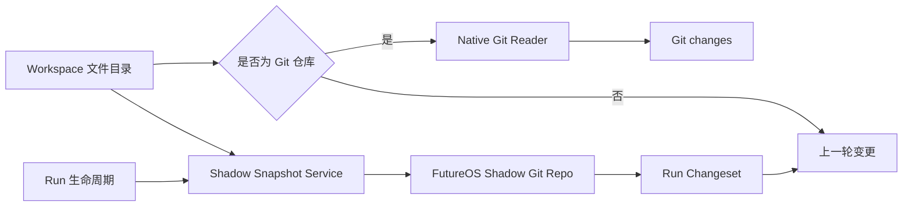
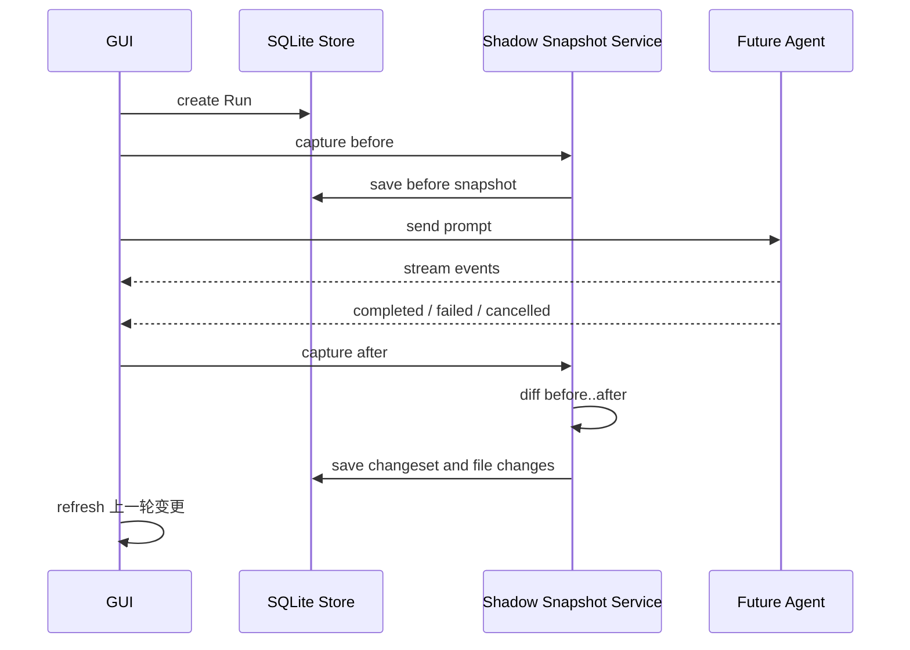

# FutureOS Workspace Review 与影子仓库设计

更新时间：2026-06-22

## 1. 目标

本文设计 Workspace 下的 Review 功能，覆盖两类目录：

- Git Workspace：
  - `Git changes`：展示当前分支相对 `HEAD` 的未提交变化。
  - `上一轮变更`：展示当前 Thread 上一轮 Agent Run 执行期间产生的文件变化。
- 非 Git Workspace：
  - 只展示 `上一轮变更`。

设计目标：

1. 复用 Git 成熟的 diff、rename detection、numstat 和二进制文件识别能力。
2. 非 Git Workspace 不需要在用户目录中创建 `.git`。
3. “上一轮变更”与用户真实 Git 工作树相互独立。
4. 不向用户真实 Git 仓库写 commit、index、object 或 ref。
5. Run 失败、取消或部分完成时，仍尽可能展示该轮已经产生的变化。
6. 与现有 `ReviewPanel`、`review_changesets`、`review_file_changes` 数据模型兼容演进。

## 2. 产品语义

### 2.1 Git changes

`Git changes` 是 Workspace 级视图。

它表示：

> 当前 Workspace 工作树相对所选 Git base 的全部变化。

默认 base 为 `HEAD`，包含：

- staged 修改；
- unstaged 修改；
- 新增文件；
- 删除文件；
- rename；
- 未跟踪且未被 Git ignore 的文件。

该视图不尝试判断变化来自用户还是 Agent，也不限定 Thread 或 Run。

### 2.2 上一轮变更

`上一轮变更` 是 Thread 级视图。

它表示：

> 当前 Thread 最近一轮已经结束的 Run，从 Run 开始前快照到 Run 结束后快照之间的 Workspace 文件差异。

“上一轮”严格指当前 Thread 最新一个已经结束的 Run，包括：

- `completed`
- `failed`
- `cancelled`

如果最新 Run 没有文件变化，界面显示“上一轮没有文件变化”，不能自动回退到更早但有变化的 Run，否则“上一轮”的语义会失真。

正在执行的 Run 不进入“上一轮变更”。运行期间继续显示前一个已完成 Run 的 changeset；Run 结束并完成后快照后再切换到新 changeset。

### 2.3 变化归属的准确表述

快照能够准确计算“Run 执行窗口内 Workspace 发生了什么变化”，但无法绝对区分：

- Agent 修改；
- 用户在 Run 执行期间手动修改；
- IDE formatter 或 watcher 自动修改；
- 其他后台进程修改。

因此底层模型建议使用 `workspace_delta`，UI 可以继续显示“上一轮变更”。详情提示中应说明：

> 包含该轮运行期间工作区内发生的文件变化。

不能在没有文件系统审计能力的情况下把所有变化都声明为“Agent 修改”。

## 3. UI 设计

### 3.1 Git Workspace

Review 面板顶部提供下拉选择：

```text
┌ Git changes        ▼ ┐
│ ✓ Git changes        │
│   上一轮变更          │
└──────────────────────┘
```

默认选择 `Git changes`。

顶部右侧的以下控制在两个视图中复用：

- 统一 / 拆分 diff；
- 全部展开 / 全部收起；
- 文件搜索；
- viewed 状态；
- additions / deletions 汇总。

`Git changes` 继续展示：

- 当前 branch；
- upstream；
- diff base；
- 工作树文件列表。

`上一轮变更` 展示：

- Run 状态；
- Run 完成时间；
- Run 的短摘要；
- 文件数和 `+additions -deletions`；
- 文件级 diff。

### 3.2 非 Git Workspace

顶部只显示静态标题 `上一轮变更`，不显示没有意义的下拉箭头。

```text
┌ 上一轮变更 ┐
```

非 Git Workspace 不显示：

- Git branch；
- upstream；
- Git base selector；
- `Git changes` 入口。

### 3.3 文件行

文件行沿用参考图中的结构：

```text
[类型图标] path/to/file.ts       已添加   +95  -0   >
```

状态映射：

| Git 状态 | UI |
| --- | --- |
| `A` | 已添加 |
| `M` | 已修改 |
| `D` | 已删除 |
| `R` | 已重命名 |
| binary | 二进制 |

点击文件行展开 diff。文本文件支持统一和拆分模式；二进制文件只展示：

- 文件路径；
- 状态；
- before / after 大小；
- MIME 或扩展名；
- “不支持文本 diff”提示。

### 3.4 空状态

Git Workspace：

- `Git changes`：`工作树没有未提交变化`
- `上一轮变更`：`上一轮没有文件变化`
- 没有结束过 Run：`还没有可供审查的上一轮运行`

非 Git Workspace：

- 没有结束过 Run：`完成一轮 Agent 运行后，文件变化会显示在这里`
- Run 无变化：`上一轮没有文件变化`

### 3.5 数据作用域

| 视图 | 作用域 | 数据来源 |
| --- | --- | --- |
| Git changes | Workspace | 用户真实 Git 仓库 |
| 上一轮变更 | 当前 Thread 的最新结束 Run | FutureOS 影子仓库 |

切换 Thread 时，“上一轮变更”必须切换到该 Thread 自己的最新 changeset。

## 4. 总体架构



核心原则：

- `Git changes` 只读取用户真实 Git 仓库。
- `上一轮变更` 始终由 FutureOS 影子仓库生成。
- 影子仓库不区分 Workspace 是否已经是 Git 仓库。
- 真实 Git 仓库与影子仓库完全隔离。

## 5. 影子仓库

### 5.1 存储位置

每个 Workspace 对应一个 bare shadow repository：

```text
~/.future/app/review/
  <workspace-id>/
    repo.git/
    indexes/
    locks/
```

不在 Workspace 目录下创建 `.git`。

建议目录权限：

- review 根目录：`0700`
- repository 和临时 index：仅当前用户可读写

### 5.2 Git 调用方式

所有命令显式指定：

```text
GIT_DIR=~/.future/app/review/<workspace-id>/repo.git
GIT_WORK_TREE=<workspace-path>
GIT_INDEX_FILE=<temporary-index-path>
```

影子仓库只把 Git 当作内容寻址快照和 diff 引擎，不 checkout，不修改用户文件。

禁止在 shadow 操作中执行：

- `git checkout`
- `git reset --hard`
- `git clean`
- 任何会修改 work tree 的 Git 命令

### 5.3 Snapshot

每个 Run 最多产生两个 snapshot：

- `before`：发送 prompt 给 Agent 前。
- `after`：Run 进入终态后。

Snapshot 推荐保存为 Git commit，而不是只保存 tree：

```text
refs/futureos/threads/<thread-id>/runs/<run-id>/before
refs/futureos/threads/<thread-id>/runs/<run-id>/after
```

commit 只存在于 shadow repo，不进入用户仓库。

Commit metadata：

- author / committer：`FutureOS Snapshot`
- message：`run <run-id> before|after`
- timestamp：snapshot 创建时间

### 5.4 Snapshot 创建算法

伪代码：

```text
capture_snapshot(workspace, thread, run, phase):
    acquire workspace shadow lock
    ensure bare shadow repo exists
    create isolated temporary index
    read empty tree into temporary index
    add eligible workspace files into temporary index
    tree_id = git write-tree
    commit_id = git commit-tree tree_id
    update FutureOS shadow ref
    persist snapshot metadata
    delete temporary index
    release lock
```

使用独立 `GIT_INDEX_FILE`，避免不同 Run 或刷新操作共享 index。

Snapshot 不使用用户真实 Git index，因此不会改变 staged 状态。

### 5.5 文件纳入策略

默认纳入：

- Workspace 内普通文件；
- 新增、修改和删除的文本文件；
- symlink 本身；
- 在大小限制内的二进制文件。

默认排除：

- `.git/`
- `.future/`
- shadow repo 自身；
- socket、device 等特殊文件；
- 无法读取的文件；
- 超过单文件大小限制的文件；
- 超过 Workspace 快照总量限制后的剩余文件。

建议默认尊重：

- `.gitignore`
- `.ignore`
- shadow repo 的 `info/exclude`

建议不继承用户全局 Git excludes，避免不同机器产生不可解释的结果：

```text
-c core.excludesFile=/dev/null
```

建议初始限制：

| 限制 | 默认值 |
| --- | --- |
| 单文件最大快照大小 | 20 MiB |
| 单次 snapshot 最大文件数 | 50,000 |
| 单次 snapshot 最大总读取量 | 1 GiB |
| 文本 diff 最大展示大小 | 2 MiB |
| 单文件 diff 最大展示行数 | 10,000 |

超过限制的文件仍可记录 metadata，但不写入完整 blob 时，changeset 必须标记为 `partial`，UI 显示“部分文件因大小限制未生成 diff”。

### 5.6 Ignore 的取舍

尊重 `.gitignore` 可以显著控制 `node_modules`、构建产物和缓存目录的规模，但意味着被 ignore 的文件不会出现在“上一轮变更”中。

第一版建议接受该语义，并在 changeset metadata 中记录：

- ignored file count；
- oversized file count；
- unreadable file count；
- snapshot 是否完整。

后续如果需要覆盖 Agent 明确修改的 ignored 文件，可以结合 Agent 的结构化 `file.changed` 事件，对指定路径执行受限的 force include。第一版不依赖 tool event 推测完整 changeset，因为 `bash` 可以绕过 `write/edit` 工具修改任意数量的文件。

## 6. Run 生命周期集成

### 6.1 正常流程



`before` snapshot 必须在 Agent 收到 prompt 前完成，否则无法可靠记录被覆盖或删除文件的旧内容。

`after` snapshot 在以下终态统一执行：

- completed；
- failed；
- cancelled。

### 6.2 Snapshot 失败

Snapshot 失败不能阻止 Agent Run。

状态建议：

- before 失败：Run 正常执行，changeset 标记 `unavailable`。
- after 失败：保留 before，changeset 标记 `incomplete`。
- diff 失败：保留两个 snapshot，允许用户点击重试生成。

错误不能伪装成“上一轮没有变化”；必须区分：

- 真正无变化；
- 快照不可用；
- 快照不完整。

### 6.3 Approval 等待

Run 处于 `waiting_approval` 时不创建 after snapshot。

用户批准后继续同一个 Run，最终只创建一次 after snapshot。用户拒绝导致 Run 继续或终止时，以最终 Run 状态为准。

### 6.4 Abort

Abort 请求完成后：

1. Agent 中止底层操作。
2. Run 标记 `cancelled`。
3. 等待短暂文件稳定窗口。
4. 创建 after snapshot。
5. 生成已实际落盘的部分变化。

建议文件稳定窗口为 200–500ms，并设置最大等待时间，防止 watcher 或构建进程持续写入。

### 6.5 应用重启

如果应用重启时发现：

- Run 有 before snapshot；
- Run 已被恢复逻辑标记为 cancelled；
- 没有 after snapshot；

可以创建恢复型 after snapshot，但 changeset 必须标记：

```text
confidence = "recovered"
```

因为应用关闭期间可能发生用户修改，恢复后的 diff 不能完全归属于该 Run。

## 7. Diff 生成

### 7.1 上一轮变更

通过 shadow repo 计算：

```text
git diff \
  --no-color \
  --find-renames \
  --find-copies \
  --numstat \
  <before-commit> \
  <after-commit>
```

详情 diff：

```text
git diff \
  --no-color \
  --find-renames \
  --find-copies \
  --unified=<context-lines> \
  <before-commit> \
  <after-commit> \
  -- <path>
```

### 7.2 Git changes

继续读取真实 Git 仓库：

- tracked：`git diff <base> --`
- untracked：`git ls-files --others --exclude-standard`
- status：`git status --short --untracked-files=all`

默认 base 为 `HEAD`。现有 upstream、merge-base、custom base 能力可以继续保留。

### 7.3 文件统计

每个文件保存：

- path；
- previous path（rename 时）；
- change type；
- additions；
- deletions；
- binary；
- before size；
- after size；
- diff；
- diff truncated；
- omission reason。

changeset 保存总计：

- files changed；
- additions；
- deletions；
- binary files；
- omitted files；
- completeness。

## 8. 数据模型

### 8.1 新增 review_snapshots

```sql
CREATE TABLE review_snapshots (
    id TEXT PRIMARY KEY,
    workspace_id TEXT NOT NULL REFERENCES workspaces(id),
    thread_id TEXT NOT NULL REFERENCES threads(id),
    run_id TEXT NOT NULL REFERENCES runs(id),
    phase TEXT NOT NULL CHECK (phase IN ('before', 'after')),
    commit_id TEXT,
    tree_id TEXT,
    status TEXT NOT NULL,
    file_count INTEGER NOT NULL DEFAULT 0,
    total_bytes INTEGER NOT NULL DEFAULT 0,
    ignored_count INTEGER NOT NULL DEFAULT 0,
    omitted_count INTEGER NOT NULL DEFAULT 0,
    error_message TEXT,
    created_at INTEGER NOT NULL,
    UNIQUE(run_id, phase)
);
```

### 8.2 扩展 review_changesets

建议增加：

```sql
source_kind TEXT NOT NULL DEFAULT 'run_snapshot',
workspace_id TEXT REFERENCES workspaces(id),
before_snapshot_id TEXT REFERENCES review_snapshots(id),
after_snapshot_id TEXT REFERENCES review_snapshots(id),
completeness TEXT NOT NULL DEFAULT 'complete',
confidence TEXT NOT NULL DEFAULT 'normal',
error_message TEXT
```

`source_kind` 预留：

- `run_snapshot`
- `native_git`

当前数据库中的 `review_changesets` 只持久化“上一轮变更”。`Git changes` 保持实时查询，不需要每次落库。

### 8.3 扩展 review_file_changes

建议增加：

```sql
previous_path TEXT,
binary INTEGER NOT NULL DEFAULT 0,
before_size INTEGER,
after_size INTEGER,
diff_truncated INTEGER NOT NULL DEFAULT 0,
omission_reason TEXT
```

### 8.4 Ref 与数据库一致性

SQLite 是产品状态真源，shadow Git refs 是内容存储索引。

启动时可以执行轻量校验：

- 数据库 snapshot 指向的 commit 是否存在；
- 不再被数据库引用的 refs 是否可删除；
- 无效 changeset 标记为 unavailable。

## 9. 后端模块建议

建议新增：

```text
gui/src-tauri/src/
  shadow_review.rs
  shadow_review/
    repository.rs
    snapshot.rs
    diff.rs
    policy.rs
```

职责：

- `repository.rs`：shadow repo 初始化、路径、锁和 ref 管理。
- `snapshot.rs`：before / after snapshot。
- `diff.rs`：changeset、file stats 和 patch 生成。
- `policy.rs`：ignore、大小限制、敏感路径和 completeness。

现有 `git_review.rs` 只负责真实 Git Workspace 的 `Git changes`，不再负责自动 `git init`。

## 10. Tauri API

### 10.1 Workspace 能力

```typescript
interface WorkspaceReviewCapabilities {
  isGitWorkspace: boolean;
  views: Array<"git_changes" | "last_run">;
  defaultView: "git_changes" | "last_run";
}
```

### 10.2 Git changes

现有 `get_git_review` 可以改名或保留兼容：

```typescript
getGitWorkingTreeReview({
  workspaceId,
  base,
  customBase,
}): Promise<GitReview>
```

### 10.3 上一轮变更

```typescript
getLastRunReview({
  threadId,
}): Promise<RunReview | null>
```

```typescript
interface RunReview {
  changeset: StoredReviewChangeset;
  files: StoredReviewFileChange[];
  run: StoredRun;
  snapshotStatus: "complete" | "partial" | "unavailable";
}
```

### 10.4 手动重试

```typescript
retryRunReview({
  runId,
}): Promise<RunReview>
```

仅当 before 和 after commit 都存在、但 diff 投影失败时允许重试。不能在缺少 before snapshot 时伪造完整 changeset。

## 11. 前端状态设计

建议把当前 `ReviewPanel` 的数据源显式拆分：

```typescript
type ReviewView = "git_changes" | "last_run";

interface ReviewPanelState {
  capabilities: WorkspaceReviewCapabilities;
  activeView: ReviewView;
  gitChanges: GitReview | null;
  lastRunReview: RunReview | null;
}
```

行为规则：

1. 进入 Git Workspace，默认 `git_changes`。
2. 进入非 Git Workspace，强制 `last_run`。
3. 从非 Git Workspace 切换到 Git Workspace，恢复默认 `git_changes`。
4. 切换 Thread 时重新加载 `last_run`。
5. `git_changes` 可按现有节奏刷新。
6. `last_run` 只在 Run 终态、changeset 更新或用户重试时刷新，不需要每 1.5 秒重新计算 shadow diff。

## 12. 并发与性能

### 12.1 Workspace 锁

同一个 Workspace 的 snapshot 写操作必须串行：

```text
workspace_id -> async mutex / filesystem lock
```

不同 Workspace 可以并行。

### 12.2 Snapshot 去重

Git object database 会按内容自动去重。连续 Run 中未变化文件不会重复占用完整空间。

如果 before snapshot 与最近一次 after snapshot 对应同一 Workspace 状态，可以复用 commit：

```text
current before == previous after
```

第一版可以先不做该优化，但数据模型应允许多个 snapshot 指向同一 commit。

### 12.3 Retention

当前产品只展示“上一轮变更”，建议：

- 每个 Thread 保留最近 10 个 Run changeset；
- UI 默认只读取最新一个；
- 超过保留数量后删除旧 refs 和数据库投影；
- 空闲时执行 shadow repo `git gc`；
- 提供按 Workspace 清理 review cache 的内部能力。

不要每轮立即执行 `git gc`。

### 12.4 大 Workspace

Snapshot 前可以维护 Workspace 文件 fingerprint cache：

- path；
- size；
- mtime；
- inode/file id（平台可用时）；
- content hash。

第一版可以直接交给 Git index 判断变化；当大型 Workspace 性能成为问题后，再增加持久化 fingerprint 和增量扫描。

## 13. 安全与隐私

Shadow repo 会保存 Workspace 文件内容的历史 blob，因此它不是普通缓存，必须按本地敏感数据处理。

要求：

- 仅本机当前用户可访问；
- 不上传；
- 不写日志正文；
- 删除 Workspace 记录时提供清理 shadow repo 的能力；
- 清理临时 Chat 时同步清理 shadow review 数据；
- 对 `.env`、credential、private key 等是否纳入快照需要明确策略。

建议第一版默认排除高风险凭证文件：

```text
.env
.env.*
*.pem
*.key
id_rsa
id_ed25519
```

如果这些文件发生变化，changeset 可显示：

```text
敏感文件发生变化，内容未保存
```

只记录 path、状态和 metadata，不保存 blob 或 diff。

## 14. 对现有实现的调整

### 14.1 保留

- 现有 Git working tree diff 解析；
- additions / deletions；
- untracked 文本文件 diff；
- diff base；
- file search；
- viewed 状态；
- unified / split；
- changeset 和 file change 基础表；
- Review embed 跳转。

### 14.2 调整

- 移除创建 Workspace、创建 Workspace Thread、打开 Review 时自动 `git init`。
- `git_review.rs` 改为只检测和读取真实 Git 仓库。
- Run changeset 不再只根据 `write/edit` tool start 推测。
- Run 开始前创建 shadow before snapshot。
- Run 结束后创建 shadow after snapshot。
- 由两个 snapshot 的真实 diff 生成 `review_changesets`。
- 非 Git Workspace 也显示 Review，但只显示“上一轮变更”。
- 非 Git Workspace 的 Agent 文件产物是否继续进入 Artifacts，需要单独确定；本设计只解决 Review diff，不自动取消 Artifacts。

## 15. 分阶段实现

### Phase 1：核心闭环

1. 新增 shadow repo 和 snapshot 表。
2. Run 前后创建 snapshot。
3. 生成 changeset 和 file changes。
4. Git Workspace 增加视图下拉。
5. 非 Git Workspace 只展示上一轮变更。
6. 移除自动 `git init`。

完成标准：

- 新增、修改、删除文件均能显示。
- Run failed / cancelled 仍能显示已落盘变化。
- 用户真实 Git index 和 `.git` 不发生变化。

### Phase 2：可靠性

1. rename detection；
2. binary metadata；
3. snapshot limits 和 partial 状态；
4. restart recovery；
5. retention 和 GC；
6. 敏感文件策略；
7. shadow repo 一致性检查。

### Phase 3：性能

1. fingerprint cache；
2. snapshot commit 复用；
3. 大 Workspace 增量扫描；
4. 后台低优先级 snapshot；
5. 文件级 diff 按需加载。

## 16. 测试清单

### Git Workspace

- 已有 unstaged 修改时，`Git changes` 正确显示。
- 已有 staged 修改时，`Git changes` 正确显示。
- Run 前已有用户修改，`上一轮变更` 只显示 before/after 的增量。
- 切换 `Git changes` / `上一轮变更` 不串数据。
- Shadow snapshot 不改变真实 Git status、index、refs 和 objects。

### 非 Git Workspace

- 不创建 `.git`。
- 只显示“上一轮变更”。
- 新增、修改、删除均可生成 diff。
- 没有变化时显示正确空状态。

### Run

- completed 生成 changeset。
- failed 生成 changeset。
- cancelled 生成 changeset。
- waiting approval 不提前生成 after snapshot。
- 最新 Run 无变化时不回退到更早 Run。
- 不同 Thread 的上一轮 changeset 相互隔离。

### 文件

- 文本文件；
- 空文件；
- UTF-8 和非 UTF-8；
- 二进制文件；
- symlink；
- rename；
- 大文件；
- ignored 文件；
- 敏感文件；
- 删除后无法读取的文件。

### 恢复

- before 完成后应用崩溃；
- after 完成但数据库投影失败；
- shadow commit 丢失；
- Workspace 路径被移动或删除。

## 17. 需要确认的产品决策

以下决策建议在实现前确认：

1. “上一轮变更”是否严格指最新结束 Run。本文建议严格指最新 Run，不跳过无变化 Run。
2. 非 Git Workspace 是否同时保留 Artifacts 入口。本文建议保留，Review 表示变化，Artifacts 表示可复用产物，两者不完全等价。
3. ignored 文件是否进入 snapshot。本文建议第一版尊重 `.gitignore`。
4. 敏感文件是否保存内容。本文建议只记录变化，不保存内容。
5. retention 数量。本文建议每个 Thread 保留最近 10 个 changeset，界面默认只展示最新一个。
6. Git Workspace 默认视图。本文建议默认 `Git changes`。

## 18. 推荐结论

推荐采用统一的双数据源模型：

```text
真实 Git 仓库
  └─ Git changes（Workspace 当前未提交变化）

FutureOS 影子仓库
  └─ 上一轮变更（当前 Thread 最新结束 Run 的 before/after delta）
```

该方案既保留 Git 原生工作树审查能力，又让非 Git Workspace 获得准确、可恢复的 Run 级 diff，同时不会污染用户目录或真实 Git 仓库。
